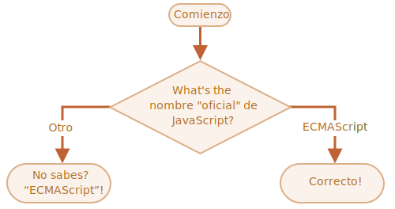

importance: 2

---

# El nombre de JavaScript

Usando el constructor `if..else`, escribe el codigo que pregunta: '¿Cual es el nombre "oficial" de JavaScript?'

Si el visitador escribe "ECMAScript", Entonces muestras "¡Correcto!", de lo contrario -- muestra: "¿No lo sabes? ¡ECMAScript!"

[demo src="ifelse_task2"]

