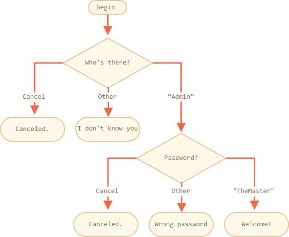

importance: 3

---

# Comprueba el inicio de sesión

Escribe un código que pregunte por el inicio de sesión con `propmt`.

Si el visitante ingresa `"Admin"`, entonces `prompt`(pregunta) por una contraseña, si la entrada es una linea vacía o `key:Esc` -- muestra "Cancelado.", si es otra cadena de texto -- entonces muestra "No te conozco".

La contraseña se comprueba así:

-  Si es igual a "TheMaster", entonces muestra "Bienvenido!",
-  Si es otra cadena de texto -- muetra "Contraseña incorrecta",
-  Para una cadena de texto vacía o una entrada cancelada, muestra "Cancelado."

El esquema:

Por favor usa bloques anidados de `if`. Piensa en la legibilidad general del código.

Pista: si se le pasa una entrada vacía a un prompt, retorna una cadena de texto vacía `''`. Presionando `key:ESC` durante un prompt retorna `null`.

[demo]
