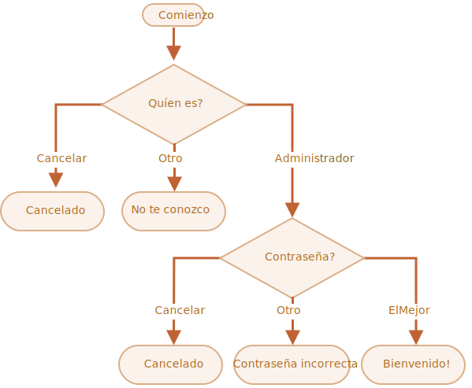

importance: 3

---

# Comprueba el inicio de sesión

Escribe un código que pregunte por el inicio de sesión con `propmt`.

<<<<<<< HEAD
Si el visitante ingresa `"Admin"`, entonces `prompt`(pregunta) por una contraseña, si la entrada es una linea vacía o `key:Esc` -- muestra "Cancelado.", si es otra cadena de texto -- entonces muestra "No te conozco".
=======
If the visitor enters `"Admin"`, then `prompt` for a password, if the input is an empty line or `key:Esc` -- show "Canceled", if it's another string -- then show "I don't know you".
>>>>>>> a4a84083a7656f2b25de8b766b2457d3aae17874

La contraseña se comprueba de la siguiente manera:

<<<<<<< HEAD
-  Si es igual a "TheMaster", entonces muestra "Bienvenido!",
-  Si es otra cadena de texto -- muetra "Contraseña incorrecta",
-  Para una cadena de texto vacía o una entrada cancelada, muestra "Cancelado."
=======
- If it equals "TheMaster", then show "Welcome!",
- Another string -- show "Wrong password",
- For an empty string or cancelled input, show "Canceled"
>>>>>>> a4a84083a7656f2b25de8b766b2457d3aae17874

El esquema:

Por favor usa bloques anidados de `if`. Piensa en la legibilidad general del código.

Pista: si se le pasa una entrada vacía a un prompt, retorna una cadena de texto vacía `''`. Presionando `key:ESC` durante un prompt retorna `null`.

[demo]
