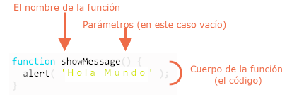

# Funciones

Muy a menudo necesitamos realizar una acción similar en muchos lugares del script.

Por ejemplo, debemos mostrar un mensaje atractivo cuando un visitante inicia sesión, cierra sesión y tal vez en otros momentos.

Las funciones son los principales "bloques de construcción" del programa. Permiten que el código se llame muchas veces sin repetición.

Ya hemos visto ejemplos de funciones integradas, como `alert(message)`, `prompt(message, default)` y `confirm(question)`. Pero también podemos crear funciones propias.

## Declaración de funcicones

Para crear una función podemos usar una *declaración de function*.

Se Parece a esto:

```js
function showMessage() {
  alert( '¡Hola a todos!' );
}
```

La palabra clave `function` va primero, luego una lista de *parámetros* entre paréntesis (vacía en el ejemplo anterior) y finalmente el código de la función, también llamado "el cuerpo de la función" , entre llaves.



Nuestra nueva función puede ser llamada por su nombre: `showMessage()`.

Por ejemplo:

```js run
function showMessage() {
  alert( '¡Hola a todos!' );
}

*!*
showMessage();
showMessage();
*/!*
```

La llamada `showMessage()` ejecuta el código de la función. Aquí veremos el mensaje dos veces.

Este ejemplo demuestra claramente uno de los propósitos principales de las funciones: evitar la duplicación de código..

Si alguna vez necesitamos cambiar el mensaje o la forma en que se muestra, es suficiente modificar el código en un lugar: la función que lo genera.

## Variables Locales

Una variable declarada dentro de una función solo es visible dentro de esa función.

Por ejemplo:

```js run
function showMessage() {
*!*
  let message = "Hola, ¡Soy JavaScript!"; // local variable
*/!*

  alert( message );
}

showMessage(); // Hola, ¡Soy JavaScript!!

alert( message ); // <-- Error! La variable es local para esta función
```

## Variables Externas

Una función también puede acceder a una variable externa, por ejemplo:

```js run no-beautify
let *!*userName*/!* = 'Juan';

function showMessage() {
  let message = 'Hola, ' + *!*userName*/!*;
  alert(message);
}

showMessage(); // Hola, Juan
```

La función tiene acceso completo a la variable externa. Puede modificarlo también.

Por ejemplo:

```js run
let *!*userName*/!* = 'Juan';

function showMessage() {
  *!*userName*/!* = "Bob"; // (1) Cambió la variable externa

  let message = 'Hola, ' + *!*userName*/!*;
  alert(message);
}

alert( userName ); // *!*Juan*/!* antes de llamar la función

showMessage();

alert( userName ); // *!*Bob*/!*, el valor fué modificado por la función
```

La variable externa solo se usa si no hay una local. Por lo tanto, puede ocurrir una modificación ocasional si olvidamos colocar el `let`.

Si una variable con el mismo nombre se declara dentro de la función, entonces *hace shadowing a* la externa. Por ejemplo, en el siguiente código, la función usa el `userName` local. El exterior se ignora:

```js run
let userName = 'Juan';

function showMessage() {
*!*
  let userName = "Bob"; // declara variable local
*/!*

  let message = 'Hello, ' + userName; // *!*Bob*/!*
  alert(message);
}

// la función crea y utiliza su propia variable local userName
showMessage();

alert( userName ); // *!*John*/!*, se mantiene, la función no accedió a la variable externa
```

```smart header="Variables globales"
Variables declaradas fuera de cualquier función, como el la variable externa `userName` en el código anterior, se llaman *global*.

Las variables globales son visibles desde cualquier función (a menos que estén se haga shadowing en el contexto local).

Por lo general, una función declara todas las variables específicas de su tarea. Las variables globales solo almacenan datos a nivel de proyecto, y es importante que estas variables sean accesibles desde cualquier lugar. El código moderno tiene pocos o ninguna variable global. La mayoría de las variables residen en sus funciones.
```

## Parámetros

Podemos pasar datos arbitrarios a funciones usando parámetros (también llamados *argumentos de función*).

En el siguiente ejemplo, la función tiene dos parámetros: `from` y `text`.

```js run
function showMessage(*!*from, text*/!*) { // argumentos: from, text
  alert(from + ': ' + text);
}

*!*
showMessage('Ann', 'Hola!'); // Ann: Hola! (*)
showMessage('Ann', "¿Como estás?"); // Ann: ¿Como estás? (**)
*/!*
```

Cuando la función se llama `(*)` y `(**)`, los valores dados se copian en variables locales `from` y `text`. Y la función las utiliza.

Aquí hay un ejemplo más: tenemos una variable `from` y la pasamos a la función. Tenga en cuenta: la función cambia `from`, pero el cambio no se ve afuera, porque una función siempre obtiene una copia del valor:


```js run
function showMessage(from, text) {

*!*
  from = '*' + from + '*'; // hace que "from" se vea mejor
*/!*

  alert( from + ': ' + text );
}

let from = "Ann";

showMessage(from, "Hola"); // *Ann*: Hola

// el valor de "from" es el mismo, la función modificó una copia local
alert( from ); // Ann
```

## Valores predeterminado

Si no se proporciona un parámetro, su valor se convierte en `undefined`.

Por ejemplo, la función mencionada anteriormente `showMessage(from, text)` se puede llamar con un solo argumento:

```js
showMessage("Ann");
```

Eso no es un error. la llamada saldría `"Ann: undefined"`. No existe el parámetro `text`, entonces asumimos que `text === undefined`.

Si quisieramos usar un `text` "predeterminado" en este caso, lo podemos identificar despues del `=`:

```js run
function showMessage(from, *!*text = "sin texto"*/!*) {
  alert( from + ": " + text );
}

showMessage("Ann"); // Ann: sin texto
```

Ahora si no existe el parámetro `text`, obtendrá el valor `"sin texto"`

Aquí `"sin texto"` es un string, pero puede ser una expresión mas compleja, la cual solo es evaluada y asignada si el parámetro falta. Entonces, esto es posible:

```js run
function showMessage(from, text = anotherFunction()) {
  // anotherFunction() solo se ejecuta si el parámetro texto no fué asignado
  // y su resultado se convierte en el valor de texto
}
```

```smart header="Evaluación de parámetros predeterminado"

En JavaScript, se evalúa un parámetro predeterminado cada vez que se llama a la función sin el parámetro respectivo. En el ejemplo anterior, se llama a `anotherFunction ()` cada vez que se llama a `showMessage ()` sin el parámetro `text`. Esto contrasta con otros lenguajes como Python, donde los parámetros predeterminados se evalúan solo una vez durante la interpretación inicial.

```


````smart header="Parámetros predeterminados de estilo antiguo"
Las ediciones anteriores de JavaScript no admitían parámetros predeterminados. Por lo tanto, hay formas alternativas de apoyarlos, que se pueden encontrar principalmente en los scripts antiguos.

Por ejemplo, una comprobación explícita de ser `undefined`:

```js
function showMessage(from, text) {
*!*
  if (text === undefined) {
    text = 'sin texto';
  }
*/!*

  alert( from + ": " + text );
}
```

...O el operador `||`

```js
function showMessage(from, text) {
  // si text es falso entonces text se convierte en el valor "predeterminado"
  text = text || 'sin texto';
  ...
}
```


````


## Devolviendo un valor

Una función puede devolver un valor al código de llamada como resultado.

El ejemplo más simple sería una función que suma dos valores:

```js run no-beautify
function sum(a, b) {
  *!*return*/!* a + b;
}

let result = sum(1, 2);
alert( result ); // 3
```

La directiva `return` puede estar en cualquier lugar de la función. Cuando la ejecución lo alcanza, la función se detiene y el valor se devuelve al código de llamada (asignado al `result` anterior).

Puede haber muchos casos de `return ` en una sola función. Por ejemplo:

```js run
function checkAge(age) {
  if (age > 18) {
*!*
    return true;
*/!*
  } else {
*!*
    return confirm('¿Tienes permiso de tus padres?');
*/!*
  }
}

let age = prompt('¿Que edad tienes?', 18);

if ( checkAge(age) ) {
  alert( 'Acceso otorgado' );
} else {
  alert( 'Acceso denegado' );
}
```

Es posible utilizar `return` sin ningun valor. Eso hace que la función salga o termine inmediatamente.


Por ejemplo:

```js
function showMovie(age) {
  if ( !checkAge(age) ) {
*!*
    return;
*/!*
  }

  alert( "Mostrandote la película" ); // (*)
  // ...
}
```

Enel codigo de arriba, si `checkAge(age)` devuelve `false`, entonces `showMovie` no mostrará la `alert`.

````smart header="Una función con un `return` vacio o sin el devuelve `undefined`"
Si una función no devuelve un valor, es lo mismo que si devuelve `undefined`:

```js run
function doNothing() { /* empty */ }

alert( doNothing() === undefined ); // true
```

Un `return` vacío también es lo mismo que `return undefined`:

```js run
function doNothing() {
  return;
}

alert( doNothing() === undefined ); // true
```
````

````warn header="Nunca agregue una nueva línea entre `return` y el valor"
Para una expresion larga de `return`, puede ser tentador ponerlo en una línea separada, como esta:

```js
return
 (una + expresion  + o + cualquier + cosa * f(a) + f(b))
```
Eso no funciona, porque JavaScript asume un punto y coma después del `return`. Eso funcionará igual que:

```js
return*!*;*/!*
 (una + expresion  + o + cualquier + cosa * f(a) + f(b))
```
Entonces, efectivamente se convierte en un return vacío. Deberíamos poner el valor en la misma línea.
````

## Nomenclatura de funciones [#function-naming]

Las funciones son acciones. Entonces su nombre suele ser un verbo. Debe ser breve, lo más preciso posible y describir lo que hace la función, para que alguien que lea el código obtenga una indicación de lo que hace la función.

Es una práctica generalizada comenzar una función con un prefijo verbal que describe vagamente la acción. Debe haber un acuerdo dentro del equipo sobre el significado de los prefijos.

Por ejemplo, funciones que comienzan con `"show"` usualmente muestran algo.

Funciónes que comienza con...

- `"get…"` -- devuelven un valor,
- `"calc…"` -- calcúlan algo,
- `"create…"` -- crean algo,
- `"check…"` -- revisan algo y devuelven un boolean, etc.

Ejemplos de este tipo de nombres:

```js no-beautify
showMessage(..)     // muestra un mensaje
getAge(..)          // devuelve la edad (la obtiene de alguna manera)
calcSum(..)         // calcula una suma y devuelve el resultado
createForm(..)      // crea un formulario (y usualmente lo devuelve)
checkPermission(..) // revisa permisos, y devuelve true/false
```

Con los prefijos en su lugar, un vistazo al nombre de una función permite comprender qué tipo de trabajo realiza y qué tipo de valor devuelve.

```smart header="Una función -- una acción"
Una función debe hacer exactamente lo que sugiere su nombre, no más.

Dos acciones independientes por lo general merecen dos funciones, incluso si generalmente se convocan juntas (en ese caso, podemos hacer una tercera función que llame a esas dos).

Algunos ejemplos de como se rompen estas reglas:

- `getAge` -- sería malo si muestra una `alert` con la edad (solo debería obtener).
- `createForm` -- sería malo si modifica el documento y lo agrega (solo debe crearlo y devolverlo).
- `checkPermission` -- sería malo si muestra el mensaje `acceso otorgsado/denegado`(solo debe realizar la verificación y devolver el resultado).

Estos ejemplos asumen significados comunes de prefijos. Lo que significan para ti está determinado por ti y tu equipo. Tal vez es bastante normal que su código se comporte de manera diferente. Pero debe tener una comprensión firme de lo que significa un prefijo, lo que una función con prefijo puede y no puede hacer. Todas las funciones con el mismo prefijo deben obedecer las reglas. Y el equipo debe compartir el conocimiento.
```

```smart header="Nombres de funciones ultracortos"
Las funciones que se utilizan *muy a menudo* algunas veces tienen nombres ultracortos.

Por ejemplo, el framework [jQuery](http://jquery.com) define una función con `$`. La librería [LoDash](http://lodash.com/) tiene como nombre de funccion principal `_`.

Estas son excepciones. En general, los nombres de las funciones deben ser concisos y descriptivos.
```

## Funciones == Comentarios

Las funciones deben ser cortas y hacer exactamente una cosa. Si esa cosa es grande, tal vez valga la pena dividir la función en algunas funciones más pequeñas. A veces, seguir esta regla puede no ser tan fácil, pero definitivamente es algo bueno.

Una función separada no solo es más fácil de probar y depurar, -- ¡su existencia es un gran comentario!

Por ejemplo, comparemos las dos funciones `showPrimes(n)` siguientes. Cada una devuelve [números primos](https://en.wikipedia.org/wiki/Prime_number) hasta `n`.

La primera variante usa una etiqueta:

```js
function showPrimes(n) {
  nextPrime: for (let i = 2; i < n; i++) {

    for (let j = 2; j < i; j++) {
      if (i % j == 0) continue nextPrime;
    }

    alert( i ); // un número primo
  }
}
```

La segunda variante usa una función adicional `isPrime(n)` para probar la primalidad:

```js
function showPrimes(n) {

  for (let i = 2; i < n; i++) {
    *!*if (!isPrime(i)) continue;*/!*

    alert(i);  // a prime
  }
}

function isPrime(n) {
  for (let i = 2; i < n; i++) {
    if ( n % i == 0) return false;
  }
  return true;
}
```

La segunda variante es más fácil de entender, ¿no? En lugar del código, vemos un nombre de la acción. (`isPrime`). A veces las personas se refieren a dicho código como *autodescriptivo*.

Por lo tanto, las funciones se pueden crear incluso si no tenemos la intención de reutilizarlas. Estructuran el código y lo hacen legible.

## Resumen

Una declaración de función se ve así:

```js
function name(parametros, delimitados, por, coma) {
  /* code */
}
```

- Los valores pasados a una función como parámetros se copian a sus variables locales.
- Una función puede acceder a variables externas. Pero funciona solo de adentro hacia afuera. El código fuera de la función no ve sus variables locales.
- Una función puede devolver un valor. Si no lo hace, entonces su resultado es `undefined`.

Para que el código sea limpio y fácil de entender, se recomienda utilizar principalmente variables y parámetros locales en la función, no variables externas.

Siempre es más fácil entender una función que obtiene parámetros, trabaja con ellos y devuelve un resultado que una función que no obtiene parámetros, pero modifica las variables externas como un efecto secundario.

Nomenclatura de funciones:

- Un nombre debe describir claramente lo que hace la función. Cuando vemos una llamada a la función en el código, un buen nombre nos da al instante una comprensión de lo que hace y devuelve.
- Una función es una acción, por lo que los nombres de las funciones suelen ser verbales.
- Existen muchos prefijos de funciones bien conocidos como `create…`, `show…`, `get…`, `check…` y así. Úsalos para insinuar lo que hace una función.

Las funciones son los principales bloques de construcción de los guiones. Ahora hemos cubierto los conceptos básicos, por lo que en realidad podemos comenzar a crearlos y usarlos. Pero ese es solo el comienzo del camino. Volveremos a ellos muchas veces, profundizando en sus funciones avanzadas.