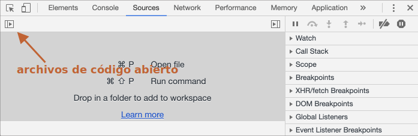

# Debugging en Chrome

Antes de escribir código más complejo, hablemos de debugging.

<<<<<<< HEAD
Todos lo exploradores modernos y la mayoría de los otros ambientes soportan el "debugging" -- una herramienta especial de UI para desarrolladores que nos permite encontrar y reparar errores más fácilmente.

Aquí utilizaremos Chrome porque es uno de los que mejores herramientas tienen en este aspecto.

## El panel "sources/recursos"
=======
[Debugging](https://en.wikipedia.org/wiki/Debugging) is the process of finding and fixing errors within a script. All modern browsers and most other environments support debugging tools -- a special UI in developer tools that makes debugging much easier. It also allows to trace the code step by step to see what exactly is going on.

We'll be using Chrome here, because it has enough features, most other browsers have a similar process.

## The "Sources" panel
>>>>>>> 340ce4342100f36bb3c4e42dbe9ffa647d8716c8

Tu version de Chrome posiblemente se vea distinta, pero sigue siendo obvio lo que hablamos aquí.

<<<<<<< HEAD
- Abre la [pagina de ejemplo](debugging/index.html) en Chrome.
- Activa las herramientas de desarrollo con `key:F12` (Mac: `key:Cmd+Opt+I`).
- Selecciona el panel `sources/recursos`.
=======
- Open the [example page](debugging/index.html) in Chrome.
- Turn on developer tools with `key:F12` (Mac: `key:Cmd+Opt+I`).
- Select the `Sources` panel.
>>>>>>> 340ce4342100f36bb3c4e42dbe9ffa647d8716c8

Esto es lo que debería ver si lo está haciendo por primera vez:



<<<<<<< HEAD
El botón botón de activación (toggle button) <span class="devtools" style="background-position:-168px -76px"></span> abre la pestaña con los archivos.

Hagamos click allí y seleccionemos `index.html` y luego `hello.js` en el árbol de archivos. Esto es lo que se debería ver:


Podemos ver tres zonas:

1. La **Zona de recursos** lista los archivos HTML, JavaScript, CSS y otros, incluyendo imágenes que están incluidas en la página. Las extensiones de Chrome quizás también aparezcan aquí.
2. La **Zona de Recursos** muestra el código fuente de los archivos.
3. La  **Zona de información y control** es para "debugging", la exploraremos pronto.

Ahora puedes hacer click en el mismo botón de activación <span class="devtools" style="background-position:-200px -76px"></span> otra vez para esconder la lista de recursos y darnos más espacio.
=======
The toggler button <span class="devtools" style="background-position:-172px -98px"></span> opens the tab with files.

Let's click it and select `hello.js` in the tree view. Here's what should show up:


The Sources panel has 3 parts:

1. The **File Navigator** pane lists HTML, JavaScript, CSS and other files, including images that are attached to the page. Chrome extensions may appear here too.
2. The **Code Editor** pane shows the source code.
3. The **JavaScript Debugging** pane is for debugging, we'll explore it soon.

Now you could click the same toggler <span class="devtools" style="background-position:-172px -122px"></span> again to hide the resources list and give the code some space.
>>>>>>> 340ce4342100f36bb3c4e42dbe9ffa647d8716c8

## Consola

<<<<<<< HEAD
Si presionamos `Esc`, la consola se abrirá debajo. Podemos escribir los comandos y presionar `key:Enter` para ejecutar.
=======
If we press `key:Esc`, then a console opens below. We can type commands there and press `key:Enter` to execute.
>>>>>>> 340ce4342100f36bb3c4e42dbe9ffa647d8716c8

Después de que se ejecuta una sentencia, el resultado se muestra debajo.

Por ejemplo, si colocamos `1+2` el resultado es `3`, y `hello("debugger")` no devuelve nada, entonces el resultado es `undefined`:


## Breakpoints (puntos de interrupción)

Examinemos qué pasa con el código de la [página de ejemplo](debugging/index.html). En `hello.js`, haz click en el número de línea `4`. Si, en el número `4`, no en el código.

¡Felicidades! Ya configuraste un breakpoint. Por favor haz click también en el número de la linea `8`.

Debería verse así (en donde está azul es donde deberías hacer click):


Un *breakpoint* es un punto de código donde el debugger pausará automáticamente la ejecución de JavaScript.

Mientras se pausa el código, podemos examinar las variables actuales, ejecutar comandos en la consola, etc. En otras palabras, podemos depurar.

<<<<<<< HEAD
Siempre podemos encontrar una lista de los breakpoints en el panel derecho. Esto es muy útil cuando tenemos muchos breakpoints en varios archivos. Ya que nos permite:
- Saltar rápidamente al breakpoint en el código (haciendo click en él dentro del panel).
- Desactivar temporalmente el breakpoint desmarcándolo.
- Eliminar el breakpoint haciendo click derecho y seleccionando quitar/eliminar/remove.
- ...y mucho más.
=======
We can always find a list of breakpoints in the right panel. That's useful when we have many breakpoints in various files. It allows us to:
- Quickly jump to the breakpoint in the code (by clicking on it in the right panel).
- Temporarily disable the breakpoint by unchecking it.
- Remove the breakpoint by right-clicking and selecting Remove.
- ...And so on.
>>>>>>> 340ce4342100f36bb3c4e42dbe9ffa647d8716c8

```smart header="Breakpoints Condicionales"
*Click derecho* en el número de línea nos permite crear un breakpoint *concional*. Solo se ejecutará cuando la expresión sea verdadera.

Esto es útil cuando necesitamos detener la ejecución para cierto valor de variable o para ciertos párametros de función.
```

## Comando debugger 

<<<<<<< HEAD
También podemos pausar el código utilizando el comando `debugger`, así:
=======
We can also pause the code by using the `debugger` command in it, like this:
>>>>>>> 340ce4342100f36bb3c4e42dbe9ffa647d8716c8

```js
function hello(name) {
  let phrase = `Hello, ${name}!`;

*!*
  debugger;  // <-- the debugger stops here
*/!*

  say(phrase);
}
```

Esto es muy conveniente cuando estamos en un editor de código.  No necesitamos cambiar al explorador y revisar el script en la consola de desarrolladores para setear el breakpoint.


## Pausar y mirar alrededor

<<<<<<< HEAD
En nuestro ejemplo, `hello()` se llama durante la carga de la página, entonces la forma mas fácil de activar el debugger es recargando la página. Entonces presionemos `key:F5` (en Windows ó Linux) ó `key:Cmd+R` (en Mac).
=======
In our example, `hello()` is called during the page load, so the easiest way to activate the debugger (after we've set the breakpoints) is to reload the page. So let's press `key:F5` (Windows, Linux) or `key:Cmd+R` (Mac).
>>>>>>> 340ce4342100f36bb3c4e42dbe9ffa647d8716c8

Como el breakpoint está definido, la ejecución se detiene en la línea 4:


Por favor abre el desplegable de informacion de la derecha (etiquetado con flechas). Este nos permite examinar el estado del código actual:

1. **`Watch` -- muestra el valor actual de cualquier expresión.**

    Puedes hacer click en el màs `+` y agregar una expresión. El debugger mostrará su valor en cualquier momento, y se recalcurará automáticamente en el proceso de ejecución.

2. **`Call Stack` -- muestra las llamadas anidadas en la cadena.**

    En el momento actual el debugger está dentro de la función `hello()`, llamada por un script en `index.html` (no dentro de ninguna función, por lo que se llama "anonymous").

<<<<<<< HEAD
    Si haces click en un elemento de la pila, el debugger saltará al código correspondiente, y todas sus variables también serán examinadas.
3. **`Scope` -- variables activas.**
=======
    If you click on a stack item (e.g. "anonymous"), the debugger jumps to the corresponding code, and all its variables can be examined as well.
3. **`Scope` -- current variables.**
>>>>>>> 340ce4342100f36bb3c4e42dbe9ffa647d8716c8

    `Local` muestra las variables de la función local. También puedes ver sus valores resaltados sobre el código fuente.

    `Global` contiene las variables globales (fuera de cualquier función).

    Tambien tenemos la palabra `this` la cual no estudiaremos ahora, pero pronto lo haremos.

## Tazado de la ejecución

Ahora es tiempo de *trazar* el script.

<<<<<<< HEAD
Hay botones para esto en le panel superior derecho. Revisémoslos.

<span class="devtools" style="background-position:-7px -76px"></span> -- continuar la ejecución, hotkey `key:F8`.
: Reanudar la ejecución. Si no hay breakpoints adicionales, entonces la ejecución continúa y el debugger pierde el control.
=======
There are buttons for it at the top of the right panel. Let's engage them.
<!-- https://github.com/ChromeDevTools/devtools-frontend/blob/master/front_end/Images/src/largeIcons.svg -->
<span class="devtools" style="background-position:-146px -168px"></span> -- "Resume": continue the execution, hotkey `key:F8`.
: Resumes the execution. If there are no additional breakpoints, then the execution just continues and the debugger loses control.
>>>>>>> 340ce4342100f36bb3c4e42dbe9ffa647d8716c8

    Esto es lo que podemos ver al hacer click:

    
<<<<<<< HEAD

    La ejecución continuó, alcanzando el siguiente breakpoint dentro de `say()` y pausándose allí. Revisa el "Call stack" a la derecha. Ha incrementado su valor una llamada. Ahora estamos dentro de `say()`.

<span class="devtools" style="background-position:-137px -76px"></span> -- siguiente paso (corre el comando siguiente), pero *no te metas en la función*, hotkey `key:F10`.
: Si hacemos click , se mostrará el `alert`. Lo importante es que ese `alert` puede ser cualquier función, la ejecución "se para sobre ella", saltándose los pasos internos.

<span class="devtools" style="background-position:-72px -76px"></span> -- siguiente paso, hotkey `key:F11`.
: Es lo mismo que la anterior, pero "Entras" en las funciones anidadas. Haciendo click en este caminarás por todos los pasos uno por uno.

<span class="devtools" style="background-position:-104px -76px"></span> -- continuar la ejecución hasta el final de la función actual, hotkey `key:Shift+F11`.
: La ejecucion se detendrá en la última línea de la función actual. Esto es útil cuando accidentalmente entramos en una llamada anidada usando <span class="devtools" style="background-position:-72px -76px"></span>, pero esto no nos interesa, y queremos continuar hasta el final tan rápido como se pueda.

<span class="devtools" style="background-position:-7px -28px"></span> -- activar/desactivar todos los breakpoints.
: Este botón no mueve la ejecución. Solo prende y apaga los breakpoints.

<span class="devtools" style="background-position:-264px -4px"></span> -- activar/desactivar pausa automática en caso de error.
: Cuando está activo y la consola de developers tools esta abierta, un error de script automáticamente pausa la ejecución. Entonces podemos analizar las variables para ver qué está mal. Y si nuestro script muere por un error, podemos abrir el debugger, activar esta opción y recargar la página para ver dónde muere y cuál es el contexto en ese momento.
=======

    The execution has resumed, reached another breakpoint inside `say()` and paused there. Take a look at the "Call Stack" at the right. It has increased by one more call. We're inside `say()` now.

<span class="devtools" style="background-position:-200px -190px"></span> -- "Step": run the next command, hotkey `key:F9`.
: Run the next statement. If we click it now, `alert` will be shown.

    Clicking this again and again will step through all script statements one by one.

<span class="devtools" style="background-position:-62px -192px"></span> -- "Step over": run the next command, but *don't go into a function*, hotkey `key:F10`.
: Similar to the previous the "Step" command, but behaves differently if the next statement is a function call. That is: not a built-in, like `alert`, but a function of our own.

    The "Step" command goes into it and pauses the execution at its first line, while "Step over" executes the nested function call invisibly, skipping the function internals.

    The execution is then paused immediately after that function.

    That's good if we're not interested to see what happens inside the function call.

<span class="devtools" style="background-position:-4px -194px"></span> -- "Step into", hotkey `key:F11`.
: That's similar to "Step", but behaves differently in case of asynchronous function calls. If you're only starting to learn JavaScript, then you can ignore the difference, as we don't have asynchronous calls yet.

    For the future, just note that "Step" command ignores async actions, such as `setTimeout` (scheduled function call), that execute later. The "Step into" goes into their code, waiting for them if necessary. See [DevTools manual](https://developers.google.com/web/updates/2018/01/devtools#async) for more details.

<span class="devtools" style="background-position:-32px -194px"></span> -- "Step out": continue the execution till the end of the current function, hotkey `key:Shift+F11`.
: Continue the execution and stop it at the very last line of the current function. That's handy when we accidentally entered a nested call using <span class="devtools" style="background-position:-200px -190px"></span>, but it does not interest us, and we want to continue to its end as soon as possible.

<span class="devtools" style="background-position:-61px -74px"></span> -- enable/disable all breakpoints.
: That button does not move the execution. Just a mass on/off for breakpoints.

<span class="devtools" style="background-position:-90px -146px"></span> -- enable/disable automatic pause in case of an error.
: When enabled, and the developer tools is open, a script error automatically pauses the execution. Then we can analyze variables to see what went wrong. So if our script dies with an error, we can open debugger, enable this option and reload the page to see where it dies and what's the context at that moment.
>>>>>>> 340ce4342100f36bb3c4e42dbe9ffa647d8716c8

```smart header="Continuar hasta aquí"
Click derecho en un una línea de código abre el menú contextual con una gran opción que dice "Continua hasta aquí".

<<<<<<< HEAD
Esto es útil cuando queremos movernos múltiples pasos adelante, pero somos muy flojos como para definir un breakpoint.
=======
That's handy when we want to move multiple steps forward to the line, but we're too lazy to set a breakpoint.
>>>>>>> 340ce4342100f36bb3c4e42dbe9ffa647d8716c8
```

## Logging

<<<<<<< HEAD
Para escribir algo en la consola, existe la función `console.log`.
=======
To output something to console from our code, there's `console.log` function.
>>>>>>> 340ce4342100f36bb3c4e42dbe9ffa647d8716c8

Por ejemplo, esto muestra los valores desde el `0` hasta el `4` en la consola:

```js run
// open console to see
for (let i = 0; i < 5; i++) {
  console.log("value,", i);
}
```
Los usuarios regulares no ven este output, ya que está en la consola. Para verlo, debemos abrir la consola de desarrolladores y presionar la tecla `key:Esc` y en otro tab: se abrirá la consola debajo.

<<<<<<< HEAD
=======
Regular users don't see that output, it is in the console. To see it, either open the Console panel of developer tools or press `key:Esc` while in another panel: that opens the console at the bottom.
>>>>>>> 340ce4342100f36bb3c4e42dbe9ffa647d8716c8

Si tenemos suficiente log en nuestro código, podemos entonces ver lo que va pasando en nuestro registro, sin el debugger.

## Resumen

<<<<<<< HEAD
Como podemos ver, hay tres formas principales para pausar un script:
1. Un breakpoint.
2. La declaración `debugger`.
3. Un error (Si la consola esta abierta y el botón <span class="devtools" style="background-position:-264px -4px"></span> esta "activo").

Entonces podemos examinar las variables y paso a paso ver qué falla en el proceso de ejecución.
=======
As we can see, there are three main ways to pause a script:
1. A breakpoint.
2. The `debugger` statements.
3. An error (if dev tools are open and the button <span class="devtools" style="background-position:-90px -146px"></span> is "on").

When paused, we can debug - examine variables and trace the code to see where the execution goes wrong.
>>>>>>> 340ce4342100f36bb3c4e42dbe9ffa647d8716c8

Hay muchas más opciones en la consola de desarrollo que las que se cubren aquí. El manual completo lo conseguimos en <https://developers.google.com/web/tools/chrome-devtools>.

La información de este capítulo es suficiente para debuggear, pero luego, especialmente si hacemos muchas cosas con el explorador, por favor revisa las capacidades avanzadas de la consola de desarrolladores.

<<<<<<< HEAD
Ah, y también puedes hacer click en todos lados en la consola a ver qué pasa. Esta es probablemente la ruta más rapida para aprender a usar la consola de desarrolladores. ¡Tampoco olvides el click derecho!
=======
Oh, and also you can click at various places of dev tools and just see what's showing up. That's probably the fastest route to learn dev tools. Don't forget about the right click and context menus!
>>>>>>> 340ce4342100f36bb3c4e42dbe9ffa647d8716c8
