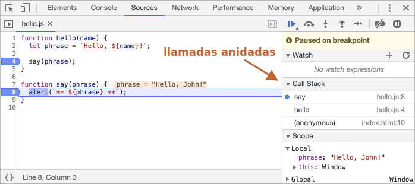

# Debugging en Chrome

Antes de escribir código mas complejo, hablemos de debugging.

Todos lo exploradores modernos y la mayoría de los otros ambientes soportan el "debugging" -- una herramienta especial de UI para desarrolladores que nos permite encontrar y reparar errores mas fácilmente.

Aca utilizaremos Chrome, porque es uno de los que les podemos sacar mas jugo en este aspecto.

## El panel "sources/recursos"

Tu version de Chrome posiblemente se vea distinta, pero sigue siendo obvio lo que hablamos aquí.

- Abre la [pagina de ejemplo](debugging/index.html) en Chrome.
- Enciende las herramientas de desarrollo con `key:F12` (Mac: `key:Cmd+Opt+I`).
- Selecciona el panel `sources/recursos`.


Esto es lo que debería ver si lo está haciendo por primera vez:


El botón toggler <span class="devtools" style="background-position:-168px -76px"></span> abre el tab con los archivos.

Hagamos click allí y seleccionemos `index.html` y luego `hello.js` en el árbol de archivos. Aca esta lo que se debería ver:


Aca veremos las tres zonas:

1. La **Zona de recursos** lista HTML, JavaScript, CSS y otros archivos, incluyendo imágenes que están incluidas en la página. Las extensiones de Chrome quizás también aparezcan aca.
2. La **Zona de Recursos** muestra el codigo fuente de los archivos.
3. La  **Zona de información y control** es para "debugging", la exploraremos pronto.

Ahora puedes hacer click en el mismo botón toggler <span class="devtools" style="background-position:-200px -76px"></span> otra vez para esconder la lista de recursos y darnos mas espacio.

## Consola

Si presionamos `Esc`, la consola se abrirá debajo. Podemos escribir los comandos y presionar `key:Enter` para ejecutar.

Despues de que se ejecuta una sentencia, el resultado se muestra debajo.

Por ejemplo, si colocamos `1+2` el resultado es `3`, y `hello("debugger")` no devuelve nada, entonces el resultado es `undefined`:


## Breakpoints

Examinemos que pasa con el codigo de la [pagina de ejemplo](debugging/index.html). En `hello.js`, haz click en el numero de linea `4`. Si, en el número `4`, no en el código.

Felicidades! Ya configuraste un breakpoint. Por favor haz click también en el numero de la linea `8`.

Deberia verse así (en donde esta azul es donde deberías hacer click):


Un *breakpoint* es un punto de código donde el debugger se detendrá automáticamente y detendrá la ejecución del código JavaScript.

Mientras se pausa el código, podemos examinar las variables actuales, ejecutar comandos en la consola etc. En otras palabras, podemos debuggear.

Siempre podemos encontrar una lista de los breakpoints en el panel derecho. Esto es muy útil cuando tenemos muchos breakpoints en varios archivos. Ya que nos permite:
- Saltar rápidamente al breakpoint en el código (clickeando en el dentro del panel).
- Desactivar temporalmente el breakpoint deschequeandolo.
- Eliminar el breakpoint haciendo click derecho y seleccionando quitar/eliminar/remove.
- ...y mucho más.

```smart header="Breakpoints Condicionales"
*Click derecho* en el numero de linea nos permite crear un breakpoint *concional*. Solo se ejecutará cuando la expresión sea verdadera.

Esto es útil cuando necesitamos detener la ejecución para cierto valor de variable o para ciertos párametros de función.
```

## Comando debugger 

Tambien podemos pausar el código utilizando el comando `debugger`, así:

```js
function hello(name) {
  let phrase = `Hello, ${name}!`;

*!*
  debugger;  // <-- the debugger stops here
*/!*

  say(phrase);
}
```

Esto es muy conveniente cuando estamos en un editor de código y no queremos cambiar al explorador y ver el script en la consola de desarrolladores para setear el breakpoint.


## Pausar y mirar alrededor

En nuestro ejemplo, `hello()` este se llama durante la carga de la página, entonces la forma mas facil de activar el debugger es recargando la pagina. Entonces presionemos `key:F5` (en Windows ó Linux) ó `key:Cmd+R` (en Mac).

Como el breakpoint esta definido, la ejecución se detiene en la linea 4:


Por favor abre el desplegable de informacion de la derecha (etiquetado con flechas). Este nos permite examinar el estado del código actual:

1. **`Watch` -- muestra el valor actual de cualquier expresión.**

    Puedes hacer click en el màs `+` y agregar una expresión. El debugger mostrará su valor en cualquier momento, y se recalcurará automáticamente en el proceso de ejecución.

2. **`Call Stack` -- muestra las llamadas anidadas en la cadena.**

    En el momento actual el debugger esta dentro de la funccion `hello()`, llamada por un script en `index.html` (no dentro de ninguna función, por lo que se llama "anonymous").

    Si haces click en un elemento de la pila, el debugger saltará al código correspondiente, y todas sus variables también serán examinadas.
3. **`Scope` -- variables activas.**

    `Local` muestra las variables de la función local. Tambien puedes ver sus valores resaltados sobre el código fuente.

    `Global` contiene las variables globales (fuera de cualquier función).

    Tambien tenemos la palabra `this` la cual no estudiaremos ahora, pero pronto lo haremos.

## Tazado de la ejecución

Ahora es tiempo de *trazar* el script.

Hay botones para esto en le panel superior derecho. Revisemoslos.

<span class="devtools" style="background-position:-7px -76px"></span> -- continuar la ejecución, hotkey `key:F8`.
: Resumir la ejecución. Si no hay breakpoints adicionales, entonces la ejecución continua y el debugger pierde el control.

    Aqui está lo que podemos ver al hacer click:

    

    La ejecucion continuó, alcanzando el siguiente breakpoint dentro de `say()` y pausandose allí. Revisa el "Call stack" a la derecha. Ha incrementado su valor una llamada. Ahora estamos dentro de `say()`.

<span class="devtools" style="background-position:-137px -76px"></span> -- siguiente paso (corre el comando siguiente), pero *no te metas en la función*, hotkey `key:F10`.
: Si hacemos click , se mostrara el `alert`. Lo importante es que ese `alert` puede ser cualquier función, la ejecución "se para sobre ella", saltándose los pasos internos.

<span class="devtools" style="background-position:-72px -76px"></span> -- siguiente paso, hotkey `key:F11`.
: Es lo mismo que la anterior, pero but "Entras" en las funciones anidadas. Haciendo click en este caminarás por todos los pasos uno por uno.

<span class="devtools" style="background-position:-104px -76px"></span> -- continuar la ejecución hasta el final de la función actual, hotkey `key:Shift+F11`.
: La ejecucion se detendrá en la última linea de la función actual. Esto es útil cuando accidentalmente entramos en una llamada anidada usando <span class="devtools" style="background-position:-72px -76px"></span>, pero estono nos interesa, y queremos continuar hasta el final tan rápido como se pueda.

<span class="devtools" style="background-position:-7px -28px"></span> -- activar/desactivar todos los breakpoints.
: Este boton no mueve la ejecución. Solo prende y apaga los breakpoints.

<span class="devtools" style="background-position:-264px -4px"></span> -- activar/desactivar pausa automática en caso de error.
: Cuando esta activo, y la consola de developers tools esta abierta, un error de script automáticamente pausa la ejecución. Entonces podemos analizar las variables para ver que está mal. Y si nuestro script muere por un error, podemos abrir el debugger, activar esta opcióny recargar la página para ver donde muere y cual es el contexto en ese momento.

```smart header="Continuar hasta aquí"
Click derecho en un una linea de código abre el menu contextual con una gran opción que dice "Continua hasta aquí".

Esto es útil cuando queremos movernos multiples pasos adelante, pero somos muy flojos como para definir un breakpoint.
```

## Logging

Para escribir algo en la consola, existe la función `console.log`.

Por ejemplo, esto muestra los valores desde el `0` hasta el `4` en la consola:

```js run
// open console to see
for (let i = 0; i < 5; i++) {
  console.log("value", i);
}
```

Los usuarios regulares no ven este output, ya que está en la consola. Para verlo, debemos abrir la consola de desarrolladores y presionar la tecla `key:Esc` y en otro tab: se abrirá la consola debajo.

Si tenemos suficiente log en nuestro código, podemos entonces ver lo que va pasando en nuestro registro, sin el debugger.

## Resúmen

Como podemos ver, hay tres fromas principales para pausar un script:
1. Un breakpoint.
2. La declaración `debugger`.
3. Un error (Si la consola esta abierta y el botón <span class="devtools" style="background-position:-264px -4px"></span> esta "activo").

Entonces podemos examinar las variables y paso a paso ver que falla en el proceso de ejecución.

Hay muchas mas opciones en la consola de desarrollo que las que se cubren aca. El manual completo lo conseguimos en <https://developers.google.com/web/tools/chrome-devtools>.

La informacion de este capitulo es suficiente para debuggear, pero luego, especialemnte si hcemos muchas cosas con el explorador, por favor revisa las capacidades avanzadas de la consola de desarrolladores.

Ah, y tambien puedes hacer click en todos lados en la consola a ver que pasa. Esta es probablemente la ruta mas rapida de aprender a usar la consola de desarrolladores. No te olvides del click derecho también!!!
