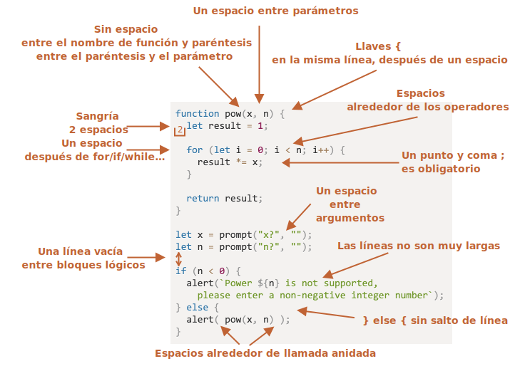

# Estilo de codificacion

Nuestro codigo debe ser lo mas limpio y facil de leer como sea posible

Eso es actualmente el arte de programar -- tomar una tarea compleja y codificarla de una manera que sea correcta y legible por otros.

## Sintaxis

Aqui hay un cheatsheet con algunas reglas sugeridas(ver abajo para mas detalles):


<!--
```js
function pow(x, n) {
  let result = 1;

  for (let i = 0; i < n; i++) {
    result *= x;
  }

  return result;
}

let x = prompt("x?", "");
let n = prompt("n?", "");

if (n < 0) {
  alert(`Power ${n} is not supported,
    please enter an integer number, greater than 0`);
} else {
  alert( pow(x, n) );
}
```

-->

Ahora vamos a discutir las reglas y razones de ellos en detalle.
```warn header="Irony Detected"
Nada está escrito en piedra aqui. Estos son preferencias de estilos, no dogmas religiosos.
```

### Llaves

En la mayoria de proyectos de Javascript las llaves estan escritas en estilo "Egipcio" con la llave de apertura en la misma linea como la correspondiente palabra clave -- no en una nueva linea. Debe haber tambien un espacio despues de la llave de apertura, como esto: 
```js
if (condition) {
  // hacer esto
  // ...y eso
  // ...y eso
}
```

En una construccion de una sola linea es un caso extremo importante. ¿Debemos usar llaves? Si si, entonces ¿donde? 

Aqui estan las variantes anotadas para que puedas juzgar la legibilidad por ti mismo. 
<!--
```js no-beautify
if (n < 0) {alert(`Power ${n} is not supported`);}

if (n < 0) alert(`Power ${n} is not supported`);

if (n < 0)
  alert(`Power ${n} is not supported`);

if (n < 0) {
  alert(`Power ${n} is not supported`);
}
```
-->


En resumen:
- Para codigo muy corto, una linea es aceptable. Por ejemplo: `if (cond) return null`
- Pero en una linea separada por cada sentencia en llaves es usualmente mas facil de leer.

### Tamaño de linea

Nadie le gusta leer una linea horizontal larga de codigo. Es una mejor practica dividirlas y limitar el tamaño de tus lineas.

El maximo tamaño de linea deberia ser acordado en el livel de equipo. Es usualmente 80 o 120 caracteres.
### Identaciones

Hay dos tipo de identaciones:

- **Identacion horizontal: 2 o 4 espacios.**

    Una identacion horizontal es hecha usando 2 o 4 espacios o el simbolo "Tab". ¿Cual elegir? es una vieja guerra santa. Espacios son mas comunes en estos dias.

    Una ventaja de los espacios sobre las tabulaciones es que los espacios permiten mas configuraciones flexibles de identaciones en lugar del simbolo "Tab".

    Por instancia, nosotros podemos alinear los argumentos con la llave de apertura, como esto:

    ```js no-beautify
    show(parameters,
         aligned, // 5 espacios de relleno a la izquierda 
         one,
         after,
         another
      ) {
      // ...
    }
    ```

- **Identacion vertical: lineas vacias para dividir codigo en bloques logicos.**

    Aun una simple funcion puede a menudo ser dividida en bloques logicos. En el ejemplo abajo, la inicializacion de variables, el bucle principal y el retorno del resultado son divididos verticalmente:

    ```js
    function pow(x, n) {
      let result = 1;
      //              <--
      for (let i = 0; i < n; i++) {
        result *= x;
      }
      //              <--
      return result;
    }
    ```

    Insertar una nueva linea extra donde ayude a hacer el codigo mas legible. No debe de haber mas de nueve lineas de codigo sin una identacion vertical.

### Punto y coma

Un punto y coma debe estar presente despues de cada sentencia, aun si podria posiblemente ser omitido.

Hay lenguajes donde un punto y coma es verdaderamente opcional y es raramente usado. En Javascript, hay casos donde un salto de linea no es interpretado como un punto y coma, dejando el codigo vulnerable a errores.

A medida tu te conviertas en un programador mas maduro, podrias escoger un estilo no-semicolon como [StandardJS](https://standardjs.com/). Hasta entonces, es mejor usar puntos y comas para evitar posibles dificultades.

### Niveles anidados

Intenta evitar anidar el codigo en demasiados niveles de profuncidad.

Algunas veces es buena idea usar la directiva ["continue"](info:while-for#continue) en un bucle para evitar anidamiento extra.

Por ejemplo, en lugar de añadir un `if` anidado como este:

```js
for (let i = 0; i < 10; i++) {
  if (cond) {
    ... // <- un nivel mas de anidamiento
  }
}
```

Podemos escribir:

```js
for (let i = 0; i < 10; i++) {
  if (!cond) continue;
  ...  // <- sin nivel extra de anidamiento
}
```

Una similar cosa puede ser hecho con `if/else` y `return`.

Por ejemplo, dos construcciones abajo son identicas.

Opcion 1:

```js
function pow(x, n) {
  if (n < 0) {
    alert("Negative 'n' not supported");
  } else {
    let result = 1;

    for (let i = 0; i < n; i++) {
      result *= x;
    }

    return result;
  }  
}
```

Opcion 2:

```js
function pow(x, n) {
  if (n < 0) {
    alert("Negative 'n' not supported");
    return;
  }

  let result = 1;

  for (let i = 0; i < n; i++) {
    result *= x;
  }

  return result;
}
```

El segundo es mas legible porque el "caso extremo" de `n < 0` se maneja desde el principio. Una vez el chequeo es terminado nosotros nos podemos mover a el codigo "main" el codigo fluye sin necesidad de anidamientos adicionales.

## Colocacion de funciones

Si estas escribiendo varias funciones "auxiliares" y el codigo que las usan, hay tres maneras de organizar funciones.

1. Funciones declaradas sobre el codigo que las usan:

    ```js
    // *!*declaracion de funciones*/!*
    function createElement() {
      ...
    }

    function setHandler(elem) {
      ...
    }

    function walkAround() {
      ...
    }

    // *!*el codigo que las usan*/!*
    let elem = createElement();
    setHandler(elem);
    walkAround();
    ```
2. Codigo primero, despues funciones

    ```js
    // *!*El codigo que usa a las funciones*/!*
    let elem = createElement();
    setHandler(elem);
    walkAround();

    // --- *!*Funciones auxiliares*/!* ---
    function createElement() {
      ...
    }

    function setHandler(elem) {
      ...
    }

    function walkAround() {
      ...
    }
    ```
3. Mixto: una funcion es declarada donde se usa por primera vez.

La mayoria del tiempo, la segunda variante es preferida.

Eso es por que cuando leemos codigo, nosotros primero queremos saber *Que hace*. Si el codigo va primero, entonces provee esa informacion. entonces, quizas nosotros no necesitaremos leer las funciones, especialmente si sus nombres son descriptivos de lo que realmente hacen.

## Guias de estilo

Una guia de estilo contine reglas generales acerca de "Como escribir codigo", por ejemplo. Que comillas usar, cuantos espacios de identacion, donde poner los saltos de linea, etc. Muchas cosas pequeñas.

Cuando todos los mienbros de un equipo usan la misma guia de estilos, el codigo se ve uniforme, sin importar de cual mienbro del equipo lo escriba.

Por supuesto, un equipo puede siempre escribir su propia guia de estilos. Aunque la mayoria del tiempo, no es necesario. Hay varios otros existentes probados y verdaderas opciones para escoger, asi adoptando una de estas es usualmente tu mejor opcion.

Algunas opciones populares:

- [Google JavaScript Style Guide](https://google.github.io/styleguide/javascriptguide.xml)
- [Airbnb JavaScript Style Guide](https://github.com/airbnb/javascript)
- [Idiomatic.JS](https://github.com/rwaldron/idiomatic.js)
- [StandardJS](https://standardjs.com/)
- (y mucho mas)

Si tu eres un desarrollador novato, empieza con la cheatsheet al inicio de este capitulo. Una vez tu hayas dominado eso, puedes explorar otras guias de estilos para coger principios comunes y decidir cual te gusta mas.

## Linters automatizados

Linters son herramientas que pueden automaticamente verificar el estilo de tu codigo y hacer sugerencias y refactorizacion.

Lo grandioso de ellos es que la comprobacion de estilo tambien puede encontrar algunos bugs, como errores gramaticales en variables o nombres de funciones. Debido a estas caracteristicas, Instalar un linter es comendado aun si tu no quieres apegarte a un "estilo de codigo" en particular.

Estas son las herramientas de linting mas conocidas:

- [JSLint](http://www.jslint.com/) -- uno de los primeros linters.
- [JSHint](http://www.jshint.com/) -- mas ajustes que JSLint.
- [ESLint](http://eslint.org/) -- probablemente el mas reciente.

Todos ellos pueden hacer el trabajo. El author usa [ESLint](http://eslint.org/).

Muchos linters son integrados con varios editores populares: solo habilite el plugin en el editor y configure el estilo.

Por ejemplo, para ESLint tu puedes hacer lo siguiente:

1. Instala [Node.JS](https://nodejs.org/).
2. Instala ESLint con el comando `npm install -g eslint` (npm es un instalador de paquetes de Javascript).
3. Crea un archivo de configuracion llamado `.eslintrc` en la raiz de tu proyecto de javascript (en el folder que contiene todos tus archivos).
4. Instala/Habilita el plugin para que tu editor se integre con ESLint. La mayoria de editores tienen uno.

Aqui un ejemplo de un archivo `.eslintrc`:

```js
{
  "extends": "eslint:recommended",
  "env": {
    "browser": true,
    "node": true,
    "es6": true
  },
  "rules": {
    "no-console": 0,
  },
  "indent": 2
}
```

Aqui la directiva `"extends"` denota que la confifuracion es basada en el conjunto de ajustes "eslint:recommended". Despues de eso, especificamos el nuestro.

Es tambien posible descargar el conjunto de reglas de la web y extenderlos en su lugar. Ver <http://eslint.org/docs/user-guide/getting-started> para mas detalles de su instalacion.

Tambien ciertos IDEs tiene linting incorporado, lo cual es conveniente pero no como un ESLint personalizable.

## Resumen

Todas las reglas de sintaxis descritas en este capitulo (y en las guias de estilos referenciados) tienen como objetivo incrementar la legibilidad de tu codigo, pero todos ellos son debatibles.

Cuando nosotros pensamos acerca de escribir "mejor" codigo, las sugerencias que nosotros debemos preguntar son, "¿Que hace que el codigo sea mas legible y facil de entender?" y "¿Que puede ayudarnos a evitar errores?" Estos son las principales cosas a tener en cuenta cuando escogemos y debatimos estilos de codigo.

Leer guias de estilos populares te permitiran mantenerte al dia con las ultimas ideas acerca de tendencias estilos de codigo y mejores practicas.
