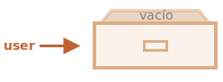

# Objetos

Como aprendimos en el capítulo <info:types>, hay ocho tipos de datos en JavaScript. Siete de ellos se denominan "primitivos", porque sus valores contienen solo un dato (sea un `string`, un número o lo que sea).

En contraste, los objetos son usados para almacenar colecciones de varios datos y entidades más complejas asociados con un nombre clave. En JavaScript, los objetos penetran casi todos los aspectos del lenguaje. Por lo tanto, debemos comprenderlos primero antes de profundizar en cualquier otro lugar. 

Podemos crear un objeto usando las llaves `{…}` con una lista opcional de *propiedades*. Una propiedad es un par "key:value", donde `key` es un string (también llamado "nombre clave"), y `value` puede ser cualquier cosa. P.D. Para fines prácticos de la lección, nos referiremos a este par de conceptos como "clave:valor".

Podemos imaginar un objeto como un gabinete con archivos firmados. Cada pieza de datos es almacenada en su archivo por la clave. Es fácil encontrar un archivo por su nombre o agregar/eliminar un archivo.


Se puede crear un objeto vacío ("gabinete vacío") utilizando una de estas dos sintaxis:

```js
let user = new Object(); // sintaxis de "constructor de objetos"
let user = {};  // sintaxis de "objeto literal"
```



Normalmente se utilizan las llaves `{...}`. Esa declaración se llama *objeto literal*.

## Literales y propiedades

Podemos poner inmediatamente algunas propiedades dentro de `{...}` como pares "clave:valor":

```js
let user = {     // un objeto
  name: "John",  // En la clave "name" se almacena el valor "John"
  age: 30        // En la clave "age" se almacena el valor 30
};
```

Una propiedad tiene una clave (también conocida como "nombre" o "identificador") antes de los dos puntos `":"` y un valor a la derecha.

En el objeto `user` hay dos propiedades:

1. La primera propiedad tiene la clave `"name"` y el valor `"John"`.
2. La segunda tienen la clave `"age"` y el valor `30`.

Podemos imaginar al objeto `user` resultante como un gabinete con dos archivos firmados con las etiquetas "name" y "age".


Podemos agregar, eliminar y leer archivos de él en cualquier momento.

Se puede acceder a los valores de las propiedades utilizando la notación de punto:

```js
// Obteniendo los valores de las propiedades del objeto:
alert( user.name ); // John
alert( user.age ); // 30
```

El valor puede ser de cualquier tipo. Agreguemos uno booleano:

```js
user.isAdmin = true;
```


Para eliminar una propiedad podemos usar el operador `delete`:

```js
delete user.age;
```


También podemos nombrar propiedades con más de una palabra. Pero, de ser así, debemos colocar la clave entre comillas `"..."`:

```js
let user = {
  name: "John",
  age: 30,
  "likes birds": true  // Las claves con más de una palabra deben ir entre comillas
};
```


La última propiedad en la lista puede terminar con una coma:
```js
let user = {
  name: "John",
  age: 30*!*,*/!*
}
```
Eso se llama una coma "final" o "colgante".  Facilita agregar, eliminar y mover propiedades, porque todas las líneas se vuelven similares.

## Corchetes

La notación de punto no funciona para acceder a propiedades con claves de más de una palabra:

```js run
// Esto nos daría un error de sintaxis
user.likes birds = true
```

JavaScript no entiende eso. Piensa que hemos accedido a `user.likes` y entonces nos da un error de sintaxis cuando aparece el inesperado `birds`.

El punto requiere que la clave sea un identificador de variable válido. Eso implica que: no contenga espacios, no comience con un dígito y no incluya caracteres especiales (`$` y `_` sí se permiten).

Existe una "notación de corchetes" alternativa que funciona con cualquier string:

```js run
let user = {};

// asignando
user["likes birds"] = true;

// obteniendo
alert(user["likes birds"]); // true

// eliminando
delete user["likes birds"];
```

Ahora todo está bien. Nota que el string dentro de los corchetes está adecuadamente entre comillas (cualquier tipo de comillas servirían).

Las llaves también nos proveen de una forma para obtener la clave de la propiedad como resultado de cualquier expresión como una variable -- en lugar de una cadena literal -- de la siguiente manera:

```js
let key = "likes birds";

// Tal cual: user["likes birds"] = true;
user[key] = true;
```

Aquí la variable `key` puede calcularse en tiempo de ejecución o depender de la entrada del usuario y luego lo usamos para acceder a la propiedad. Eso nos da mucha flexibilidad.

Por ejemplo:

```js run
let user = {
  name: "John",
  age: 30
};

let key = prompt("¿Qué te gustaría saber acerca del usuario?", "name");

// acceso por medio de una variable
alert( user[key] ); // John (si se ingresara "name")
```

La notación de punto no puede ser usada de manera similar:

```js run
let user = {
  name: "John",
  age: 30
};

let key = "name";
alert( user.key ) // undefined
```

### Propiedades calculadas

Podemos usar corchetes en un objeto literal al crear un objeto. A esto se le llama  *propiedades calculadas*.

Por ejemplo:

```js run
let fruit = prompt("¿Qué fruta comprar?", "Manzana");

let bag = {
*!*
  [fruit]: 5, // El nombre de la propiedad se obtiene de la variable fruit
*/!*
};

alert( bag.apple ); // 5 si fruit es="apple"
```

El significado de una propiedad calculada es simple: `[fruit]` significa que se debe tomar la clave de la propiedad `fruit`.

Entonces, si un visitante ingresa `"apple"`, `bag` se convertirá en `{apple: 5}`.

Esencialmente esto funciona igual que:
```js run
let fruit = prompt("¿Qué fruta comprar?", "Manzana");
let bag = {};

// Toma el nombre de la propiedad de la variable fruit
bag[fruit] = 5;
```

...Pero luce mejor.

Podemos usar expresiones más complejas dentro de los corchetes:

```js
let fruit = 'apple';
let bag = {
  [fruit + 'Computers']: 5 // bag.appleComputers = 5
};
```

Los corchetes son mucho más potentes que la notación de punto. Permiten cualquier nombre de propiedad, incluso variables. Pero también es más engorroso escribirlos.

Entonces, la mayoría de las veces, cuando los nombres de propiedad son conocidos y simples, se utiliza el punto. Y si necesitamos algo más complejo, entonces cambiamos a corchetes.

## Atajo para valores de propiedad

En el código real, a menudo usamos variables existentes como valores de los nombres de propiedades.

Por ejemplo:

```js run
function makeUser(name, age) {
  return {
    name: name,
    age: age,
    // ...otras propiedades
  };
}

let user = makeUser("John", 30);
alert(user.name); // John
```

En el ejemplo anterior las propiedades tienen los mismos nombres que las variables. El uso de variables para la creación de propiedades es tán común que existe un *atajo para valores de propiedad* especial para hacerla más corta.

En lugar de `name:name`, simplemente podemos escribir `name`, tal cual:

```js
function makeUser(name, age) {
*!*
  return {
    name, // igual que name:name
    age,  // igual que age:age
    // ...
  };
*/!*
}
```

Podemos usar ambos tipos de notación en un mismo objeto, la normal y el atajo:

```js
let user = {
  name,  // igual que name:name
  age: 30
};
```


## Limitaciones de nombres de propiedad

Como sabemos, una variable no puede tener un nombre igual a una de las palabras reservadas del lenguaje, como "for", "let", "return", etc.

Pero para una propiedad de objeto no existe tal restricción:

```js run
// Estas propiedades están bien
let obj = {
  for: 1,
  let: 2,
  return: 3
};

alert( obj.for + obj.let + obj.return );  // 6
```

En resumen, no hay limitaciones en los nombres de propiedades. Pueden ser cadenas o símbolos (un tipo especial para identificadores que se cubrirán más adelante).

Otros tipos se convierten automáticamente en cadenas.

Por ejemplo, un número `0` se convierte en cadena `"0"` cuando se usa como clave de propiedad:

```js run
let obj = {
  0: "test" // igual que "0": "test"
};

// ambos alerts acceden a la misma propiedad (el número 0 se convierte a una cadena "0")
alert( obj["0"] ); // test
alert( obj[0] ); // test (la misma propiedad)
```

Hay una pequeña sorpresa por una propiedad especial llamada `__proto__`. No podemos establecerlo dentro de un valor que no sea de objeto:

```js run
let obj = {};
obj.__proto__ = 5; // asignando un número
alert(obj.__proto__); // [objeto Object] - el valor es un objeto, no funciona como se "debería"
```

Como podemos ver en el código, se ignora la asignación de un valor primitivo `5`.

Veremos la naturaleza especial de `__proto__` en los [capítulos siguientes](info:prototype-inheritance), y sugeriremos las [formas de arreglar](info:prototype-methods) tal comportamiento.

## La prueba de propiedad existente, el operador "in"

Una notable característica de los objetos en JavaScript, en comparación con muchos otros lenguajes, es que es posible acceder a cualquier propiedad. ¡No habrá error si la propiedad no existe!

La lectura de una propiedad no existente solo devuelve `undefined`. Así que podemos probar fácilmente si la propiedad existe:

```js run
let user = {};

alert( user.noSuchProperty === undefined ); // true significa que "no existe tal propiedad"
```

También existe un operador especial para ello: `"in"`.

La sintaxis es:
```js
"key" in object
```

Por ejemplo:

```js run
let user = { name: "John", age: 30 };

alert( "age" in user );    // mostrará "true", porque user.age sí existe
alert( "blabla" in user ); // mostrará false, porque user.blabla no existe
```

Nota que a la izquierda de `in` debe estar el *nombre de la propiedad* que suele ser un string entre comillas.

Si omitimos las comillas, significa que es una variable. Esta variable debe almacenar la clave real que será probada. Por ejemplo:

```js run
let user = { age: 30 };

let key = "age";
alert( *!*key*/!* in user ); // true, porque su propiedad "age" sí existe dentro del objeto
```

Pero... ¿Por qué existe el operador `in`? ¿No es suficiente comparar con `undefined`?

La mayoría de las veces las comparaciones con `undefined` funcionan bien. Pero hay un caso especial donde esto falla y aún así `"in"` funciona correctamente.

Es cuando existe una propiedad de objeto, pero almacena  `undefined`:

```js run
let obj = {
  test: undefined
};

alert( obj.test ); // es undefined, entonces... ¿Quiere decir realmente existe tal propiedad?

alert( "test" in obj ); //es true, ¡La propiedad sí existe!
```

En el código anterior, la propiedad  `obj.test` técnicamente existe. Entonces el operador `in` funciona correctamente.

Situaciones como esta suceden raramente ya que `undefined` no debe ser explícitamente asignado. Comúnmente usamos `null` para valores "desconocidos" o "vacíos". Por lo que el operador `in` es un invitado exótico en nuestro código.


## El bucle "for..in" 

Para recorrer todas las claves de un objeto existe una forma especial de bucle: `for..in`. Esto es algo completamente diferente a la construcción `for(;;)` que estudiaremos más adelante.

La sintaxis:

```js
for (key in object) {
  // se ejecuta el cuerpo para cada clave entre las propiedades del objeto
}
```

Por ejemplo, mostremos todas las propiedades de `user`:

```js run
let user = {
  name: "John",
  age: 30,
  isAdmin: true
};

for (let key in user) {
  // claves
  alert( key );  // name, age, isAdmin
  // valores de las claves
  alert( user[key] ); // John, 30, true
}
```

Nota que todas las construcciones "for" nos permiten declarar variables para bucle dentro del bucle, como `let key` aquí.

Además podríamos usar otros nombres de variables en lugar de `key`. Por ejemplo, `"for (let prop in obj)"` también se usa bastante.

### Ordenado como un objeto

¿Los objetos están ordenados? Es decir, si creamos un bucle sobre un objeto, ¿obtenemos todas las propiedades en el mismo orden en el que se agregaron? ¿Podemos confiar en ello?

La respuesta corta es: "ordenados de una forma especial": las propiedades de números enteros se ordenan, los demás aparecen en el orden de la creación. Entremos en detalle.

Como ejemplo, consideremos un objeto con códigos telefónicos:

```js run
let codes = {
  "49": "Germany",
  "41": "Switzerland",
  "44": "Great Britain",
  // ..,
  "1": "USA"
};

*!*
for (let code in codes) {
  alert(code); // 1, 41, 44, 49
}
*/!*
```

El objeto puede usarse para sugerir al usuario una lista de opciones. Si estamos haciendo un sitio principalmente para el público alemán, probablemente queremos que `49` sea el primero.

Pero si ejecutamos el código, veremos una imagen totalmente diferente:

- USA (1) va primero
- Luego Switzerland (41) y así sucesivamente.

Los códigos telefónicos van en orden ascendente porque son números enteros. Entonces vemos  `1, 41, 44, 49`.

````smart header="¿Propiedades de números enteros? ¿Qué es eso?"
El término "propiedad de números enteros" aquí significa que una cadena se puede convertir a y desde desde un entero sin ningún cambio.

Entonces, "49" es un nombre de propiedad entero, porque cuando este se transforma a un entero y viceversa continúa siendo el mismo. Pero "+49" y "1.2" no lo son:

```js run
// Number(...) convierte explícitamente a number
// Math.trunc es una función nativa que elimina la parte decimal
alert( String(Math.trunc(Number("49"))) ); // "49", es igual, una propiedad entera
alert( String(Math.trunc(Number("+49"))) ); // "49", no es igual "+49" ⇒ no es una propiedad entera
alert( String(Math.trunc(Number("1.2"))) ); // "1", no es igual "1.2" ⇒ no es una propiedad entera
```
````

...Por otro lado, si las claves no son enteras, se enumeran en el orden de creación, por ejemplo:

```js run
let user = {
  name: "John",
  surname: "Smith"
};
user.age = 25; // Se agrega una propiedad más

*!*
// Las propiedades que no son enteras se enumeran en el orden de creación
*/!*
for (let prop in user) {
  alert( prop ); // name, surname, age
}
```

Entonces, para solucionar el problema con los códigos telefónicos, podemos "hacer trampa" haciendo que los códigos no sean enteros. Agregar un signo más `"+"` antes de cada código será más que suficiente.

Justo así:

```js run
let codes = {
  "+49": "Germany",
  "+41": "Switzerland",
  "+44": "Great Britain",
  // ..,
  "+1": "USA"
};

for (let code in codes) {
  alert( +code ); // 49, 41, 44, 1
}
```

Ahora sí funciona como debería.

## Resumen

Los objetos son arreglos asociativos con varias características especiales.

Almacenan propiedades (pares de clave-valor), donde:
- Las claves de propiedad deben ser cadenas o símbolos (generalmente strings).
- Los valores pueden ser de cualquier tipo.

Para acceder a una propiedad, podemos usar:
- La notación de punto: `obj.property`.
- La notación de corchetes `obj["property"]`. Los corchetes permiten tomar la clave de una variable, como `obj[varWithKey]`.

Operadores adicionales:
- Para eliminar una propiedad: `delete obj.prop`.
- Para comprobar si existe una propiedad con la clave proporcionada: `"key" in obj`.
- Para crear bucles sobre un objeto: bucle `for (let key in obj)`.

Lo que hemos estudiado en este capítulo se llama "objeto simple", o solamente `Object`.

Hay muchos otros tipos de objetos en JavaScript:

- `Array` para almacenar colecciones de datos ordenados,
- `Date` para almacenar la información sobre fecha y hora,
- `Error` para almacenar información sobre un error.
- ...Y así.

Tienen sus características especiales que estudiaremos más adelante. A veces las personas dicen algo como "Tipo `array`" o "Tipo `date`", pero formalmente no son tipos en sí, sino que pertenecen a un tipo de datos de "objeto" simple y lo amplían a varias maneras.

Los objetos en JavaScript son muy poderosos. Aquí acabamos de arañar la superficie de un tema que es realmente enorme. Trabajaremos estrechamente con los objetos y aprenderemos más sobre ellos en otras partes del tutorial.
