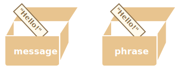

# Referencias de objetos y copia

Una de las diferencias fundamentales entre objetos y primitivos es que los objetos son almacenados y copiados "por referencia", en cambio los primitivos: strings, number, boolean, etc.; son asignados y copiados "como un valor completo".

Esto es fácil de entender si miramos un poco "bajo cubierta" de lo que pasa cuando copiamos por valor.

Empecemos por un primitivo como string.

Aquí ponemos una copia de `message` en `phrase`:

```js
let message = "Hello!";
let phrase = message;
```

Como resultado tenemos dos variables independientes, cada una almacenando la cadena `"Hello!"`.



Bastante obvio, ¿verdad? 

Los objetos no son así.

**Una variable no almacena el objeto mismo sino su "dirección en memoria", en otras palabras "una referencia" a él.**

Veamos un ejemplo de tal variable:

```js
let user = {
  name: "John"
};
```

Y así es como se almacena en la memoria:


El objeto es almacenado en algún lugar de la memoria (a la derecha de la imagen), mientras que la variable `user` (a la izquierda) tiene una "referencia" a él.

Podemos pensar de una variable objeto, como `user`, como una hoja de papel con la  dirección del objeto en él.

Cuando ejecutamos acciones con el objeto, por ejemplo tomar una propiedad `user.name`, el motor JavaScript busca aquella dirección y ejecuta la operación en el objeto mismo.

Ahora, por qué esto es importante.

**Cuando una variable de objeto es copiada, se copia solo la referencia. El objeto no es duplicado.**

Por ejemplo:

```js no-beautify
let user = { name: "John" };

let admin = user; // copia la referencia
```

Ahora tenemos dos variables, cada una con una referencia al mismo objeto:


Como puedes ver, aún hay un objeto, ahora con dos variables haciendo referencia a él.

Podemos usar cualquiera de las variables para acceder al objeto y modificar su contenido:

```js run
let user = { name: 'John' };

let admin = user;

*!*
admin.name = 'Pete'; // cambiado por la referencia "admin"
*/!*

alert(*!*user.name*/!*); // 'Pete', los cambios se ven desde la referencia "user"
```

Es como si tuviéramos un gabinete con dos llaves y usáramos una de ellas (`admin`) para acceder a él y hacer cambios. Si más tarde usamos la llave (`user`), estaríamos abriendo el mismo gabinete y accediendo al contenido cambiado.

## Comparación por referencia

Dos objetos son iguales solamente si ellos son el mismo objeto.

Por ejemplo, aquí `a` y `b` tienen referencias al mismo objeto, por lo tanto son iguales:

```js run
let a = {};
let b = a; // copia la referencia

alert( a == b ); // true, verdadero. Ambas variables hacen referencia al mismo objeto
alert( a === b ); // true
```

Y aquí dos objetos independientes no son iguales, aunque se vean iguales (ambos están vacíos):

```js run
let a = {};
let b = {}; // dos objetos independientes

alert( a == b ); // false
```

Para comparaciones como `obj1 > obj2`, o comparaciones contra un primitivo `obj == 5`, los objetos son convertidos a primitivos. Estudiaremos cómo funciona la conversión de objetos pronto, pero a decir verdad tales comparaciones ocurren raramente, suelen ser errores de código.

## Clonación y mezcla, Object.assign [#cloning-and-merging-object-assign]

Entonces copiar una variable de objeto crea una referencia adicional al mismo objeto.

Pero ¿si necesitamos duplicar un objeto? ¿Crear una copia independiente, un clon?

Eso también es factible, pero un poco más difícil porque no hay un método incorporado para eso en JavaScript. En realidad, eso es raramente necesario. Copiar por referencia está bien la mayoría de las veces.

Pero si realmente queremos eso, necesitamos crear un nuevo objeto y replicar la estructura del existente iterando a través de sus propiedades y copiándolas en el nivel primitivo.

Como esto:

```js run
let user = {
  name: "John",
  age: 30
};

*!*
let clone = {}; // el nuevo objeto vacío

// copiemos todas las propiedades de user en él
for (let key in user) {
  clone[key] = user[key];
}
*/!*

// ahora clone es un objeto totalmente independiente con el mismo contenido
clone.name = "Pete"; // cambiamos datos en él

alert( user.name ); // John aún está en el objeto original
```

También podemos usar el método [Object.assign](https://developer.mozilla.org/es/docs/Web/JavaScript/Referencia/Objetos_globales/Object/assign) para ello.

La sintaxis es:

```js
Object.assign(dest, [src1, src2, src3...])
```

- El primer argumento `dest` es el objeto destinatario.
- Los siguientes argumentos `src1, ..., srcN` (tantos como sea necesario) son objetos fuentes.
- Esto copia todas las propiedades de todos los objetos fuentes `src1, ..., srcN` dentro del destino `dest`. En otras palabras, las propiedades de todos los argumentos, comenzando desde el segundo, son copiadas en el primer objeto.
- El llamado devuelve `dest`.

Por ejemplo, podemos usarlo para combinar distintos objetos en uno:
```js
let user = { name: "John" };

let permissions1 = { canView: true };
let permissions2 = { canEdit: true };

*!*
// copia todas las propiedades desde permissions1 y permissions2 en user
Object.assign(user, permissions1, permissions2);
*/!*

// ahora user = { name: "John", canView: true, canEdit: true }
```

Si la propiedad por copiar ya existe, se sobrescribe:

```js run
let user = { name: "John" };

Object.assign(user, { name: "Pete" });

alert(user.name); // ahora user = { name: "Pete" }
```

También podemos usar `Object.assign` reemplazando el bucle `for..in` para hacer una clonación simple:

```js
let user = {
  name: "John",
  age: 30
};

*!*
let clone = Object.assign({}, user);
*/!*
```

Copia todas las propiedades de `user` en un objeto vacío y lo devuelve.

También hay otras formas de clonar un objeto, por ejemplo usando la [sintaxis spread](info:rest-parameters-spread) `clone = {...user}`, cubierto más adelante en el tutorial.

## Clonación anidada

Hasta ahora asumimos que todas las propiedades de `user` son primitivas. Pero las propiedades pueden ser referencias a otros objetos. ¿Qué hacer con ellas?

Como esto:
```js run
let user = {
  name: "John",
  sizes: {
    height: 182,
    width: 50
  }
};

alert( user.sizes.height ); // 182
```

Ahora no es suficiente copiar `clone.sizes = user.sizes`, porque `user.sizes` es un objeto y será copiado por referencia. Entonces `clone` y `user` compartirán las mismas tallas (.sizes):

Como esto:

```js run
let user = {
  name: "John",
  sizes: {
    height: 182,
    width: 50
  }
};

let clone = Object.assign({}, user);

alert( user.sizes === clone.sizes ); // true, el mimo objeto

// user y clone comparten sizes
user.sizes.width++;       // cambia la propiedad en un lugar
alert(clone.sizes.width); // 51, ve el resultado desde el otro
```

Para corregir esto, debemos usar un bucle de clonación que examine cada valor de `user[key]` y, si es un objeto, replicar su estructura también. Esto es llamado "clonación profunda".

Podemos usar recursividad para implementarlo. O, para no inventar la rueda, tomar una implementación existente, por ejemplo [_.cloneDeep(obj)](https://lodash.com/docs#cloneDeep) de la librería JavaScript [lodash](https://lodash.com).

````smart header="Los objetos con const pueden cambiarse"
Un efecto secundario importante de almacenar objetos como referencias es que un objeto declarado con `const` *puede* ser modificado.

Por ejemplo:

```js run
const user = {
  name: "John"
};

*!*
user.name = "Pete"; // (*)
*/!*

alert(user.name); // Pete
```

Puede parecer que la linea `(*)` ocasionaría un error, pero no.  El valor de `user` es constante, debe siempre hacer referencia al mismo objeto. Pero sus propiedades pueden cambiar libremente.

En otras palabras, `const user` solamente da error cuando intentamos asignar `user=...` como un todo.

Si realmente queremos hacer constantes las propiedades del objeto, es también posible pero usando métodos totalmente diferentes, las veremos después en el capítulo <info:property-descriptors>.
````

## Resumen

Los objetos son asignados y copiados por referencia. En otras palabras, una variable almacena no el valor del objeto sino una referencia (dirección de memoria) del valor. Entonces copiar tal variable o pasarla como argumento de función copia la referencia, no el objeto.

Todas la operaciones a través de referencias copiadas (como agregar y borrar propiedades) son efectuadas en el mismo y único objeto .

Si queremos conseguir una "copia real" (un clon), podemos usar: Una "clonación superficial" por medio de la función `Object.assign` (con los objetos anidados copiados por referencia), o una "clonación profunda" con una función como [_.cloneDeep(obj)](https://lodash.com/docs#cloneDeep).
