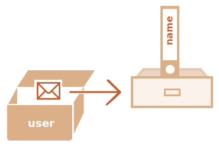

# Referencias de objetos y copia

<<<<<<< HEAD
Una de las diferencias fundamentales entre objetos y primitivos es que los objetos son almacenados y copiados "por referencia", en cambio los primitivos: strings, number, boolean; son asignados y copiados "como un valor completo".

Esto es fácil de entender si miramos un poco "bajo cubierta" de lo que pasa cuando copiamos por valor.
=======
One of the fundamental differences of objects versus primitives is that objects are stored and copied "by reference", whereas primitive values: strings, numbers, booleans, etc -- are always copied "as a whole value".

That's easy to understand if we look a bit under the hood of what happens when we copy a value.
>>>>>>> 23e85b3c33762347e26276ed869e491e959dd557

Empecemos por un primitivo como string.

Aquí ponemos una copia de `message` en `phrase`:

```js
let message = "Hello!";
let phrase = message;
```

<<<<<<< HEAD
Como resultado tenemos dos variables independientes, cada una almacenando la cadena `"Hello!"`.
=======
As a result we have two independent variables, each one storing the string `"Hello!"`.
>>>>>>> 23e85b3c33762347e26276ed869e491e959dd557


Bastante obvio, ¿verdad? 

Los objetos no son así.

<<<<<<< HEAD
**Una variable no almacena el objeto mismo sino su "dirección en memoria", en otras palabras "una referencia" a él.**

Veamos un ejemplo de tal variable:
=======
**A variable assigned to an object stores not the object itself, but its "address in memory" -- in other words "a reference" to it.**

Let's look at an example of such a variable:
>>>>>>> 23e85b3c33762347e26276ed869e491e959dd557

```js
let user = {
  name: "John"
};
```

Y así es como se almacena en la memoria:



El objeto es almacenado en algún lugar de la memoria (a la derecha de la imagen), mientras que la variable `user` (a la izquierda) tiene una "referencia" a él.

<<<<<<< HEAD
Podemos pensar de una variable objeto, como `user`, como una hoja de papel con su dirección.

Cuando ejecutamos acciones con el objeto, por ejemplo tomar una propiedad `user.name`, el motor JavaScript busca aquella dirección y ejecuta la operación en el objeto mismo.
=======
We may think of an object variable, such as `user`, as like a sheet of paper with the address of the object on it.

When we perform actions with the object, e.g. take a property `user.name`, the JavaScript engine looks at what's at that address and performs the operation on the actual object.
>>>>>>> 23e85b3c33762347e26276ed869e491e959dd557

Ahora, por qué esto es importante.

<<<<<<< HEAD
**Cuando una variable de objeto es copiada -- la referencia es copiada, el objeto no es duplicado.**
=======
**When an object variable is copied, the reference is copied, but the object itself is not duplicated.**
>>>>>>> 23e85b3c33762347e26276ed869e491e959dd557

Por ejemplo:

```js no-beautify
let user = { name: "John" };

let admin = user; // copia la referencia
```

<<<<<<< HEAD
Ahora tenemos dos variables, cada una con una referencia al mismo objeto:


Como puedes ver, aún hay un objeto, ahora con dos variables haciendo referencia a él.

Podemos usar cualquiera de las variables para acceder al objeto y modificar su contenido:
=======
Now we have two variables, each storing a reference to the same object:


As you can see, there's still one object, but now with two variables that reference it.

We can use either variable to access the object and modify its contents:
>>>>>>> 23e85b3c33762347e26276ed869e491e959dd557

```js run
let user = { name: 'John' };

let admin = user;

*!*
admin.name = 'Pete'; // cambiado por la referencia "admin"
*/!*

alert(*!*user.name*/!*); // 'Pete', los cambios se ven desde la referencia "user"
```

<<<<<<< HEAD

Es como si tuviéramos un gabinete con dos llaves y usáramos una de ellas (`admin`) para acceder a él. Si más tarde usamos la llave (`user`), podemos ver los cambios.
=======
It's as if we had a cabinet with two keys and used one of them (`admin`) to get into it and make changes. Then, if we later use another key (`user`), we are still opening the same cabinet and can access the changed contents.
>>>>>>> 23e85b3c33762347e26276ed869e491e959dd557

## Comparación por referencia

Dos objetos son iguales solamente si ellos son el mismo objeto.

Por ejemplo, aquí `a` y `b` tienen referencias al mismo objeto, por lo tanto son iguales:

```js run
let a = {};
let b = a; // copia la referencia

alert( a == b ); // true, verdadero. Ambas variables hacen referencia al mismo objeto
alert( a === b ); // true
```

Y aquí dos objetos independientes no son iguales, aunque se vean iguales (ambos están vacíos):

```js run
let a = {};
let b = {}; // dos objetos independientes

alert( a == b ); // false
```

<<<<<<< HEAD
Para comparaciones como `obj1 > obj2`, o comparaciones contra un primitivo `obj == 5`, los objetos son convertidos a primitivos. Estudiaremos cómo funciona la conversión de objetos pronto, pero a decir verdad tales comparaciones ocurren raramente, suelen ser errores de código.
=======
For comparisons like `obj1 > obj2` or for a comparison against a primitive `obj == 5`, objects are converted to primitives. We'll study how object conversions work very soon, but to tell the truth, such comparisons are needed very rarely -- usually they appear as a result of a programming mistake.
>>>>>>> 23e85b3c33762347e26276ed869e491e959dd557

## Clonación y mezcla, Object.assign

Entonces copiar una variable de objeto crea una referencia adicional al mismo objeto.

Pero ¿si necesitamos duplicar un objeto? ¿Crear una copia independiente, un clon?

<<<<<<< HEAD
Eso también es factible, pero un poco más difícil porque no hay un método incorporado para eso en JavaScript. En realidad, eso es raramente necesario. Copiar por referencia está bien la mayoría de las veces.
=======
That's also doable, but a little bit more difficult, because there's no built-in method for that in JavaScript. But there is rarely a need -- copying by reference is good most of the time.
>>>>>>> 23e85b3c33762347e26276ed869e491e959dd557

Pero si realmente queremos eso, necesitamos crear un nuevo objeto y replicar la estructura del existente iterando a través de sus propiedades y copiándolas en el nivel primitivo.

Como esto:

```js run
let user = {
  name: "John",
  age: 30
};

*!*
let clone = {}; // el nuevo objeto vacío

// copiemos todas las propiedades de user en él
for (let key in user) {
  clone[key] = user[key];
}
*/!*

// ahora clone es un objeto totalmente independiente con el mismo contenido
clone.name = "Pete"; // cambiamos datos en él

alert( user.name ); // John aún está en el objeto original
```

También podemos usar el método [Object.assign](mdn:js/Object/assign) para ello.

La sintaxis es:

```js
Object.assign(dest, [src1, src2, src3...])
```

- El primer argumento `dest` es el objeto destinatario.
- Los siguientes argumentos `src1, ..., srcN` (tantos como sea necesario) son objetos fuentes.
- Esto copia todas las propiedades de todos los objetos fuentes `src1, ..., srcN` dentro del destino `dest`. En otras palabras, las propiedades de todos los argumentos, comenzando desde el segundo, son copiadas en el primer objeto.
- El llamado devuelve `dest`.

Por ejemplo, podemos usarlo para combinar distintos objetos en uno:
```js
let user = { name: "John" };

let permissions1 = { canView: true };
let permissions2 = { canEdit: true };

*!*
// copia todas las propiedades desde permissions1 y permissions2 en user
Object.assign(user, permissions1, permissions2);
*/!*

// ahora user = { name: "John", canView: true, canEdit: true }
```

Si la propiedad por copiar ya existe, se sobrescribe:

```js run
let user = { name: "John" };

Object.assign(user, { name: "Pete" });

alert(user.name); // ahora user = { name: "Pete" }
```

También podemos usar `Object.assign` reemplazando el bucle `for..in` para hacer una clonación simple:

```js
let user = {
  name: "John",
  age: 30
};

*!*
let clone = Object.assign({}, user);
*/!*
```

Copia todas las propiedades de `user` en un objeto vacío y lo devuelve.

## Clonación anidada

Hasta ahora asumimos que todas las propiedades de `user` son primitivas. Pero las propiedades pueden ser referencias a otros objetos. ¿Qué hacer con ellas?

Como esto:
```js run
let user = {
  name: "John",
  sizes: {
    height: 182,
    width: 50
  }
};

alert( user.sizes.height ); // 182
```

Ahora no es suficiente copiar `clone.sizes = user.sizes`, porque `user.sizes` es un objeto y será copiado por referencia. Entonces `clone` y `user` compartirán las mismas tallas (.sizes):

Como esto:

```js run
let user = {
  name: "John",
  sizes: {
    height: 182,
    width: 50
  }
};

let clone = Object.assign({}, user);

alert( user.sizes === clone.sizes ); // true, el mimo objeto

// user y clone comparten sizes
user.sizes.width++;       // cambia la propiedad en un lugar
alert(clone.sizes.width); // 51, ve el resultado desde el otro
```

<<<<<<< HEAD
Para corregir esto, debemos usar un bucle de clonación que examine cada valor de `user[key]` y, si es un objeto, replicar su estructura también. Esto es llamado "clonación profunda".

Podemos usar recursividad para implementarlo. O, para no inventar la rueda, tomar una implementación existente, por ejemplo [_.cloneDeep(obj)](https://lodash.com/docs#cloneDeep) de la librería JavaScript [lodash](https://lodash.com).
=======
To fix that, we should use a cloning loop that examines each value of `user[key]` and, if it's an object, then replicate its structure as well. That is called a "deep cloning".

We can use recursion to implement it. Or, to not reinvent the wheel, take an existing implementation, for instance [_.cloneDeep(obj)](https://lodash.com/docs#cloneDeep) from the JavaScript library [lodash](https://lodash.com).

````smart header="Const objects can be modified"
An important side effect of storing objects as references is that an object declared as `const` *can* be modified.

For instance:

```js run
const user = {
  name: "John"
};

*!*
user.name = "Pete"; // (*)
*/!*

alert(user.name); // Pete
```

It might seem that the line `(*)` would cause an error, but it does not. The value of `user` is constant, it must always reference the same object, but properties of that object are free to change.

In other words, the `const user` gives an error only if we try to set `user=...` as a whole.

That said, if we really need to make constant object properties, it's also possible, but using totally different methods. We'll mention that in the chapter <info:property-descriptors>.
````
>>>>>>> 23e85b3c33762347e26276ed869e491e959dd557

## Resumen

<<<<<<< HEAD
Los objetos son asignados y copiados por referencia. En otras palabras, una variable almacena no el valor del objeto sino una referencia (dirección de memoria) del valor. Entoncess copiar tal variable o pasarla como argumento de función copia la referencia, no el objeto.
=======
Objects are assigned and copied by reference. In other words, a variable stores not the "object value", but a "reference" (address in memory) for the value. So copying such a variable or passing it as a function argument copies that reference, not the object itself.
>>>>>>> 23e85b3c33762347e26276ed869e491e959dd557

Todas la operaciones a través de referencias copiadas (como agregar y borrar propiedades) son efectuadas en el mismo y único objeto .

Si queremos conseguir una "copia real" (un clon), podemos usar: Una "clonación superficial" por medio de la función `Object.assign` (con los objetos anidados copiados por referencia), o una "clonación profunda" con una función como [_.cloneDeep(obj)](https://lodash.com/docs#cloneDeep).
