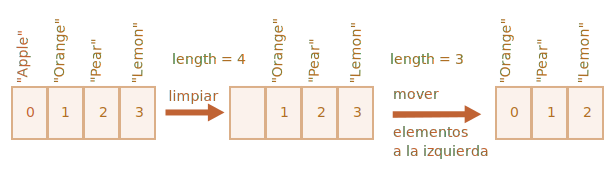
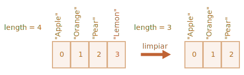

# Arrays

Los objetos te permiten almacenar colecciones de datos a través de nombres. Eso está bien.

Pero a menudo necesitamos una *colección ordenada*, donde tenemos un 1ro, un 2do, un 3er elemento y así sucesivamente. Por ejemplo, necesitamos almacenar una lista de algo: usuarios, bienes, elementos HTML, etc.

No es conveniente usar objetos aquí, porque no proveen métodos para manejar el orden de los elementos. No podemos insertar una nueva propiedad “entre” los existentes. Los objetos no están hechos para eso.

Existe una estructura llamada `Array` (llamada en español arreglo o matriz/vector) para almacenar colecciones ordenadas.

## Declaración

Hay dos sintaxis para crear un array vacío:

```js
let arr = new Array();
let arr = [];
```

Casi siempre se usa la segunda. Podemos suministrar elementos iniciales entre los corchetes:

```js
let fruits = ["Apple", "Orange", "Plum"];
```

Los elementos del array están numerados comenzando desde cero.

Podemos obtener un elemento por su número entre corchetes:

```js run
let fruits = ["Apple", "Orange", "Plum"];

alert( fruits[0] ); // Apple
alert( fruits[1] ); // Orange
alert( fruits[2] ); // Plum
```

Podemos reemplazar un elemento:

```js
fruits[2] = 'Pear'; // ahora ["Apple", "Orange", "Pear"]
```

...o agregar uno nuevo al array:

```js
fruits[3] = 'Lemon'; // ahora ["Apple", "Orange", "Pear", "Lemon"]
```

La cuenta total de elementos en el array es su longitud `length`:

```js run
let fruits = ["Apple", "Orange", "Plum"];

alert( fruits.length ); // 3
```

También podemos usar `alert` para mostrar el array completo.

```js run
let fruits = ["Apple", "Orange", "Plum"];

alert( fruits ); // Apple,Orange,Plum
```

Un array puede almacenar elementos de cualquier tipo.

Por ejemplo:

```js run no-beautify
// mezcla de valores
let arr = [ 'Apple', { name: 'John' }, true, function() { alert('hello'); } ];

// obtener el objeto del índice 1 y mostrar su nombre
alert( arr[1].name ); // John

// obtener la función del índice 3 y ejecutarla
arr[3](); // hello
```


````smart header="Coma residual"
Un array, al igual que un objeto, puede tener una coma final:
```js
let fruits = [
  "Apple",
  "Orange",
  "Plum"*!*,*/!*
];
```

La "coma final" hace más simple insertar y remover items, porque todas la líneas se vuelven similares.
````

## Obtener los últimos elementos con "at"

[recent browser="new"]

Digamos que queremos el último elemento de un array.

Algunos lenguajes de programación permiten el uso de índices negativos para este propósito, como `fruits[-1]`.

Aunque en JavaScript esto no funcionará. El resultado será `undefined`, porque el índice de los corchetes es tratado literalmente.

Podemos calcular explícitamente el último índice y luego acceder al elemento: `fruits[fruits.length - 1]`.

```js run
let fruits = ["Apple", "Orange", "Plum"];

alert( fruits[fruits.length-1] ); // Plum
```

Un poco engorroso, ¿no es cierto? Necesitamos escribir el nombre de la variable dos veces.

Afortunadamente, hay una sintaxis más corta: `fruits.at(-1)`:

```js run
let fruits = ["Apple", "Orange", "Plum"];

// es lo mismo que fruits[fruits.length-1]
alert( fruits.at(-1) ); // Plum
```

En otras palabras, `arr.at(i)`:
- es exactamente lo mismo que `arr[i]`, si `i >= 0`.
- para valores negativos de `i`, salta hacia atrás desde el final del array.

## Métodos pop/push, shift/unshift

Una [cola](https://es.wikipedia.org/wiki/Cola_(inform%C3%A1tica)) es uno de los usos más comunes de un array. En ciencias de la computación, significa una colección ordenada de elementos que soportan dos operaciones:

- `push` inserta un elemento al final.
- `shift` obtiene el elemento del principio, avanzando la cola, y así el segundo elemento se vuelve primero.


Los arrays soportan ambas operaciones.

En la práctica los necesitamos muy a menudo. Por ejemplo, una cola de mensajes que necesitamos mostrar en pantalla.

Hay otro caso de uso para los arrays -- la estructura de datos llamada [pila](https://es.wikipedia.org/wiki/Pila_(inform%C3%A1tica)).

Ella soporta dos operaciones:

- `push` agrega un elemento al final.
- `pop` toma un elemento desde el final.

Entonces los elementos nuevos son agregados o tomados siempre desde el "final".

Una pila es usualmente mostrada como un mazo de cartas, donde las nuevas cartas son agregadas al tope o tomadas desde el tope:


Para las pilas, la última introducida es la primera en ser recibida, en inglés esto es llamado principio LIFO (Last-In-First-Out, última en entrar primera en salir). Para las colas, tenemos FIFO (First-In-First-Out primera en entrar, primera en salir).

Los arrays en JavaScript pueden trabajar como colas o pilas. Ellos permiten agregar/quitar elementos al/del principio o al/del final.

En ciencias de la computación la estructura de datos que permite esto se denomina cola de doble extremo o [bicola](https://es.wikipedia.org/wiki/Bicola).

**Métodos que trabajan sobre el final del array:**

`pop`
: Extrae el último elemento del array y lo devuelve:

    ```js run
    let fruits = ["Apple", "Orange", "Pear"];

    alert( fruits.pop() ); // quita "Pear" y lo muestra en un alert

    alert( fruits ); // Apple, Orange
    ```

    Tanto `fruits.pop()` como `fruits.at(-1)` devuelven el último elemento del array, pero `fruits.pop()` también modifica el array eliminando tal elemento.

`push`
: Agrega el elemento al final del array:

    ```js run
    let fruits = ["Apple", "Orange"];

    fruits.push("Pear");

    alert( fruits ); // Apple, Orange, Pear
    ```

    El llamado a `fruits.push(...)` es igual a `fruits[fruits.length] = ...`.

**Métodos que trabajan con el principio del array:**

`shift`
: Extrae el primer elemento del array y lo devuelve:

    ```js run
    let fruits = ["Apple", "Orange", "Pear"];

    alert( fruits.shift() ); // quita Apple y lo muestra en un alert

    alert( fruits ); // Orange, Pear
    ```

`unshift`
: Agrega el elemento al principio del array:

    ```js run
    let fruits = ["Orange", "Pear"];

    fruits.unshift('Apple');

    alert( fruits ); // Apple, Orange, Pear
    ```

Los métodos `push` y `unshift` pueden agregar múltiples elementos de una vez:

```js run
let fruits = ["Apple"];

fruits.push("Orange", "Peach");
fruits.unshift("Pineapple", "Lemon");

// ["Pineapple", "Lemon", "Apple", "Orange", "Peach"]
alert( fruits );
```

## Interiores

Un array es una clase especial de objeto. Los corchetes usados para acceder a una propiedad `arr[0]` vienen de la sintaxis de objeto. Son esencialmente lo mismo que `obj[key]`, donde `arr` es el objeto mientras los números son usados como claves.

Ellos extienden los objetos proveyendo métodos especiales para trabajar con colecciones ordenadas de datos y también la propiedad `length`. Pero en el corazón es aún un objeto.

Recuerde, solo hay ocho tipos de datos básicos en JavaScript (consulte el capítulo [Tipos de datos](info:types) para obtener más información). Array es un objeto y, por tanto, se comporta como un objeto.

Por ejemplo, es copiado por referencia:

```js run
let fruits = ["Banana"]

let arr = fruits; // copiado por referencia (dos variables referencian al mismo array)

alert( arr === fruits ); // true

arr.push("Pear"); // modifica el array por referencia

alert( fruits ); // Banana, Pear - ahora con 2 items
```

...Pero lo que hace a los array realmente especiales es su representación interna. El motor trata de almacenarlos en áreas de memoria contigua, uno tras otro, justo como muestra la ilustración en este capítulo. Hay otras optimizaciones también para hacer que los arrays trabajen verdaderamente rápido.

Pero todo esto se puede malograr si dejamos de trabajarlos como arrays de colecciones ordenadas y comenzamos a usarlos como si fueran objetos comunes.

Por ejemplo, técnicamente podemos hacer esto:

```js
let fruits = []; // crea un array

fruits[99999] = 5; // asigna una propiedad con un índice mucho mayor que su longitud

fruits.age = 25; // crea una propiedad con un nombre arbitrario
```

Esto es posible porque los arrays son objetos en su base. Podemos agregar cualquier propiedad en ellos.

Pero el motor verá que estamos tratándolo como un objeto común. Las optimizaciones específicas no son aptas para tales casos y serán desechadas, y sus beneficios desaparecerán.

Las formas de malograr un array:

- Agregar una propiedad no numérica como `arr.test = 5`.
- Generar agujeros como: agregar `arr[0]` y luego `arr[1000]` (y nada entre ellos).
- Llenar el array en orden inverso, como `arr[1000]`, `arr[999]` y así.

Piensa en los arrays como estructuras especiales para trabajar con *datos ordenados*. Ellos proveen métodos especiales para ello. Los arrays están cuidadosamente afinados dentro de los motores JavaScript para funcionar con datos ordenados contiguos, por favor úsalos de esa manera. Y si necesitas claves arbitrarias, hay altas chances de que en realidad necesites objetos comunes `{}`.

## Performance

Los métodos `push/pop` son rápidos, mientras que `shift/unshift` son lentos.


¿Por qué es más rápido trabajar con el final del array que con el principio? Veamos qué pasa durante la ejecución:

```js
fruits.shift(); // toma 1 elemento del principio
```

No es suficiente tomar y eliminar el elemento con el índice `0`. Los demás elementos necesitan ser renumerados también.

La operación `shift` debe hacer 3 cosas:

1. Remover el elemento con índice `0`.
2. Mover todos lo elementos hacia la izquierda y renumerarlos: desde el índice `1` a `0`, de `2` a `1` y así sucesivamente.
3. Actualizar la longitud: la propiedad `length`.



**Cuanto más elementos haya en el array, más tiempo tomará moverlos, más operaciones en memoria.**

Algo similar ocurre con `unshift`: para agregar un elemento al principio del array, necesitamos primero mover todos los elementos hacia la derecha, incrementando sus índices.

¿Y qué pasa con `push/pop`? Ellos no necesitan mover nada. Para extraer un elemento del final, el método `pop` limpia el índice y acorta `length`.

Las acciones para la operación `pop`:

```js
fruits.pop(); // toma 1 elemento del final
```



**El método `pop` no necesita mover nada, porque los demás elementos mantienen sus índices. Es por ello que es muy rápido.**

Algo similar ocurre con el método `push`.

## Bucles

Una de las formas más viejas de iterar los items de un array es el bucle `for` sobre sus índices:

```js run
let arr = ["Apple", "Orange", "Pear"];

*!*
for (let i = 0; i < arr.length; i++) {
*/!*
  alert( arr[i] );
}
```

Pero para los arrays también hay otra forma de bucle,`for..of`:

```js run
let fruits = ["Apple", "Orange", "Plum"];

// itera sobre los elementos del array
for (let fruit of fruits) {
  alert( fruit );
}
```

`for..of` no da acceso al número del elemento en curso, solamente a su valor, pero en la mayoría de los casos eso es suficiente. Y es más corto.

Técnicamente, y porque los arrays son objetos, es también posible usar `for..in`:

```js run
let arr = ["Apple", "Orange", "Pear"];

*!*
for (let key in arr) {
*/!*
  alert( arr[key] ); // Apple, Orange, Pear
}
```

Pero es una mala idea. Existen problemas potenciales con esto:

1. El bucle `for..in` itera sobre *todas las propiedades*, no solo las numéricas.

    Existen objetos "simil-array" en el navegador y otros ambientes que *parecen arrays*. Esto es, tienen `length` y propiedades indexadas, pero pueden también tener propiedades no numéricas y métodos que usualmente no necesitemos. Y el bucle `for..in` los listará. Entonces si necesitamos trabajar con objetos simil-array, estas propiedades "extras" pueden volverse un problema.

2. El bucle `for..in` está optimizado para objetos genéricos, no para arrays, y es de 10 a 100 veces más lento. Por supuesto es aún muy rápido. Una optimización puede que solo sea importante en cuellos de botella, pero necesitamos ser concientes de la diferencia.

En general, no deberíamos usar `for..in` en arrays.


## Acerca de "length"

La propiedad `length` automáticamente se actualiza cuando se modifica el array. Para ser precisos, no es la cuenta de valores del array sino el mayor índice más uno.

Por ejemplo, un elemento simple con un índice grande da una longitud grande:

```js run
let fruits = [];
fruits[123] = "Apple";

alert( fruits.length ); // 124
```

Nota que usualmente no usamos arrays de este modo.

Otra cosa interesante acerca de la propiedad `length` es que se puede sobrescribir.

Si la incrementamos manualmente, nada interesante ocurre. Pero si la decrementamos, el array se trunca.  El proceso es irreversible, aquí el ejemplo:

```js run
let arr = [1, 2, 3, 4, 5];

arr.length = 2; // truncamos a 2 elementos
alert( arr ); // [1, 2]

arr.length = 5; // reponemos la longitud length
alert( arr[3] ); // undefined: el valor no se recupera
```

Entonces la forma más simple de limpiar un array es: `arr.length = 0;`.


## new Array() [#new-array]

Hay una sintaxis más para crear un array:

```js
let arr = *!*new Array*/!*("Apple", "Pear", "etc");
```

Es raramente usada porque con corchetes `[]` es más corto. También hay una característica peculiar con ella.

Si `new Array` es llamado con un único argumento numérico, se crea un array *sin items, pero con la longitud "length" dada*.

Veamos cómo uno puede dispararse en el pie:

```js run
let arr = new Array(2); // ¿Creará un array de [2]?

alert( arr[0] ); // undefined! sin elementos.

alert( arr.length ); // longitud 2
```

Para evitar sorpresas solemos usar corchetes, salvo que sepamos lo que estamos haciendo.

## Arrays multidimensionales

Los arrays pueden tener items que a su vez sean arrays. Podemos usarlos como arrays multidimensionales, por ejemplo para almacenar matrices:

```js run
let matrix = [
  [1, 2, 3],
  [4, 5, 6],
  [7, 8, 9]
];

alert( matrix[1][1] ); // 5, el elemento central
```

## toString

Los arrays tienen su propia implementación del método `toString` que devuelve un lista de elementos separados por coma.

Por ejemplo:


```js run
let arr = [1, 2, 3];

alert( arr ); // 1,2,3
alert( String(arr) === '1,2,3' ); // true
```

Probemos esto también:

```js run
alert( [] + 1 ); // "1"
alert( [1] + 1 ); // "11"
alert( [1,2] + 1 ); // "1,21"
```

Los arrays no tienen `Symbol.toPrimitive` ni un `valueOf` viable, ellos implementan la conversión `toString` solamente, así `[]` se vuelve una cadena vacía, `[1]` se vuelve `"1"` y `[1,2]` se vuelve `"1,2"`.

Cuando el operador binario más `"+"` suma algo a una cadena, lo convierte a cadena también, entonces lo siguiente se ve así:

```js run
alert( "" + 1 ); // "1"
alert( "1" + 1 ); // "11"
alert( "1,2" + 1 ); // "1,21"
```

## No compares arrays con ==

Las arrays en JavaScript, a diferencia de otros lenguajes de programación, no deben ser comparadas con el operador `==`.

Este operador no tiene un tratamiento especial para arrays, trabaja con ellas como con cualquier objeto.

Recordemos las reglas:

- Dos objetos son iguales `==` solo si hacen referencia al mismo objeto.
- Si uno de los argumentos de `==` es un objeto y el otro es un primitivo, entonces el objeto se convierte en primitivo, como se explica en el capítulo <info:object-toprimitive>.
- ...Con la excepción de `null` y `undefined` que son iguales `==` entre sí y nada más.

La comparación estricta `===` es aún más simple, ya que no convierte tipos.

Entonces, si comparamos arrays con `==`, nunca son iguales, a no ser que comparemos dos variables que hacen referencia exactamente a la misma array.

Por ejemplo:
```js run
alert( [] == [] ); // falso
alert( [0] == [0] ); // falso
```

Estas arrays son técnicamente objetos diferentes. Así que no son iguales. El operador `==` no hace comparaciones de elemento a elemento.

Comparaciones con primitivos también pueden dar resultados aparentemente extraños:

```js run
alert( 0 == [] ); // verdadero

alert('0' == [] ); // falso
```

Aquí, en ambos casos, comparamos un primitivo con un objeto array. Entonces la array `[]` se convierte a primitivo para el propósito de comparar y se convierte en una string vacía `''`.

Luego el proceso de comparación continúa con los primitivos, como se describe en el capítulo <info:type-conversions>:

```js run
// después de que [] se convierta en ''
alert( 0 == '' ); // verdadero, ya que '' se convierte en el número 0

alert('0' == '' ); // falso, sin conversión de tipos, strings diferentes
```

Entonces, ¿cómo comparamos arrays?

Simple: no utilices el operador `==`. En lugar, compáralas elemento a elemento en un bucle o utilizando métodos de iteración explicados en el siguiente capítulo.

## Resumen

Los arrays son una clase especial de objeto, adecuados para almacenar y manejar items de datos ordenados.

- La declaración:

    ```js
    // corchetes (usual)
    let arr = [item1, item2...];

    // new Array (excepcionalmente raro)
    let arr = new Array(item1, item2...);
    ```

    Un llamado a `new Array(number)` crea un array con la longitud dada, pero sin elementos.

- La propiedad `length` es la longitud del array o, para ser preciso, el último índice numérico más uno. Se autoajusta al usar los métodos de array.
- Si acortamos `length` manualmente, el array se trunca.

Podemos usar un array como "bicola" con las siguientes operaciones:

- `push(...items)` agrega `items` al final.
- `pop()` remueve el elemento del final y lo devuelve.
- `shift()` remueve el elemento del principio y lo devuelve.
- `unshift(...items)` agrega `items` al principio.

Para iterar sobre los elementos de un array:
  - `for (let i=0; i<arr.length; i++)` -- lo más rápido, compatible con viejos navegadores.
  - `for (let item of arr)` -- la sintaxis moderna para items solamente.
  - `for (let i in arr)` -- nunca lo uses.

Para comparar arrays, no uses el operador `==` (como tampoco `>`, `<` y otros), ya que no tienen un tratamiento especial para arrays. Lo manejan como cualquier objeto y no es lo que normalmente queremos.

En su lugar puedes utilizar el bucle `for..of` para comparar arrays elemento a elemento.

Volveremos a los arrays y estudiaremos más métodos para agregar, quitar, extraer elementos y ordenar arrays en el capítulo <info:array-methods>.
