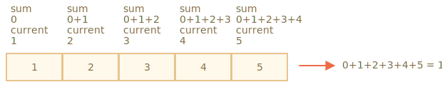

# Métodos de arrays 

Los arrays (también llamados arreglos o matrices) cuentan con muchos métodos. Para hacer las cosas más sencillas, en este capítulo se encuentran divididos en dos partes.

## Agregar/remover ítems

Ya conocemos algunos métodos que agregan o extraen elementos del inicio o final de un array:

- `arr.push(...items)` -- agrega ítems al final,
- `arr.pop()` -- extrae un ítem del final,
- `arr.shift()` -- extrae un ítem del inicio,
- `arr.unshift(...items)` -- agrega ítems al principio.

Veamos algunos métodos más.

### splice

¿Cómo podemos borrar un elemento de un array?

Los arrays son objetos, por lo que podemos intentar con `delete`:

```js run
let arr = ["voy", "a", "casa"];

delete arr[1]; // remueve "a"

alert( arr[1] ); // undefined

// ahora arr = ["voy",  , "casa"];
alert( arr.length ); // 3
```

El elemento fue borrado, pero el array todavía tiene 3 elementos; podemos ver que `arr.length == 3`.

Es natural, porque `delete obj.key` borra el valor de `key`, pero es todo lo que hace. Esto está bien en los objetos, pero en general lo que buscamos en los arrays es que el resto de los elementos se desplace y se ocupe el lugar libre. Lo que esperamos es un array más corto.

Por lo tanto, necesitamos utilizar métodos especiales.

El método [arr.splice](https://developer.mozilla.org/es/docs/Web/JavaScript/Referencia/Objetos_globales/Array/splice) funciona como una navaja suiza para arrays. Puede hacer todo: insertar, remover y remplazar elementos.

La sintaxis es:

```js
arr.splice(start[, deleteCount, elem1, ..., elemN])
```

Esto modifica `arr` comenzando en el índice `start`: remueve la cantidad `deleteCount` de elementos y luego inserta `elem1, ..., elemN` en su lugar. Lo que devuelve es un array de los elementos removidos.

Este método es más fácil de entender con ejemplos.

Empecemos removiendo elementos:

```js run
let arr = ["Yo", "estudio", "JavaScript"];

*!*
arr.splice(1, 1); // desde el índice 1, remover 1 elemento
*/!*

alert( arr ); // ["Yo", "JavaScript"]
```

¿Fácil, no? Empezando desde el índice `1` removió `1` elemento.

En el próximo ejemplo removemos 3 elementos y los reemplazamos con otros 2:

```js run
let arr = [*!*"Yo", "estudio", "JavaScript",*/!* "ahora", "mismo"];

// remueve los primeros 3 elementos y los reemplaza con otros
arr.splice(0, 3, "a", "bailar");

alert( arr ) // ahora [*!*"a", "bailar"*/!*, "ahora", "mismo"]
```

Aquí podemos ver que `splice` devuelve un array con los elementos removidos:

```js run
let arr = [*!*"Yo", "estudio",*/!* "JavaScript", "ahora", "mismo"];

// remueve los 2 primeros elementos
let removed = arr.splice(0, 2);

alert( removed ); // "Yo", "estudio" <-- array de los elementos removidos
```

El método `splice` también es capaz de insertar elementos sin remover ningún otro. Para eso necesitamos establecer `deleteCount` en `0`:

```js run
let arr = ["Yo", "estudio", "JavaScript"];

// desde el index 2
// remover 0
// después insertar "el", "complejo" y "language"
arr.splice(2, 0,"el", "complejo", "language");

alert( arr ); // "Yo", "estudio","el", "complejo", "language", "JavaScript"
```

````smart header="Los índices negativos están permitidos"
En este y en otros métodos de arrays, los índices negativos están permitidos. Estos índices indican la posición comenzando desde el final del array, de la siguiente manera:

```js run
let arr = [1, 2, 5];

// desde el index -1 (un lugar desde el final)
// remover 0 elementos,
// después insertar 3 y 4
arr.splice(-1, 0, 3, 4);

alert( arr ); // 1,2,3,4,5
```
````

### slice

El método [arr.slice](https://developer.mozilla.org/es/docs/Web/JavaScript/Referencia/Objetos_globales/Array/slice) es mucho más simple que `arr.splice`.

La sintaxis es:

```js
arr.slice([principio], [final])
```

Devuelve un nuevo array copiando en el mismo todos los elementos desde `principio` hasta `final` (sin incluir `final`). `principio` y `final` pueden ser negativos, en cuyo caso se asume la posición desde el final del array.

Es similar al método para strings `str.slice`, pero en lugar de substrings genera subarrays.

Por ejemplo:

```js run
let arr = ["t", "e", "s", "t"];

alert( arr.slice(1, 3) ); // e,s (copia desde 1 hasta 3)

alert( arr.slice(-2) ); // s,t (copia desde -2 hasta el final)
```

También podemos invocarlo sin argumentos: `arr.slice()` crea una copia de `arr`. Se utiliza a menudo para obtener una copia que se puede  transformar sin afectar el array original.

### concat

El método [arr.concat](https://developer.mozilla.org/es/docs/Web/JavaScript/Referencia/Objetos_globales/Array/concat) crea un nuevo array que incluye los valores de otros arrays y elementos adicionales.

La sintaxis es:

```js
arr.concat(arg1, arg2...)
```

Este acepta cualquier número de argumentos, tanto arrays como valores.

El resultado es un nuevo array conteniendo los elementos de `arr`, después `arg1`, `arg2` etc.

Si un argumento `argN` es un array, entonces todos sus elementos son copiados. De otro modo el argumento en sí es copiado.

Por ejemplo:

```js run
let arr = [1, 2];

// crea un array a partir de: arr y [3,4]
alert( arr.concat([3, 4]) ); // 1,2,3,4

// crea un array a partir de: arr y [3,4] y [5,6]
alert( arr.concat([3, 4], [5, 6]) ); // 1,2,3,4,5,6

// crea un array a partir de: arr y [3,4], luego agrega los valores 5 y 6
alert( arr.concat([3, 4], 5, 6) ); // 1,2,3,4,5,6
```

Normalmente, solo copia elementos desde arrays. Otros objetos, incluso si parecen arrays, son agregados como un todo:  

```js run
let arr = [1, 2];

let arrayLike = {
  0: "something",
  length: 1
};

alert( arr.concat(arrayLike) ); // 1,2,[object Object]
```

...Pero si un objeto similar a un array tiene la propiedad especial `Symbol.isConcatSpreadable`, entonces `concat` lo trata como un array y en lugar de añadirlo como un todo, solo añade sus elementos.

```js run
let arr = [1, 2];

let arrayLike = {
  0: "something",
  1: "else",
*!*
  [Symbol.isConcatSpreadable]: true,
*/!*
  length: 2
};

alert( arr.concat(arrayLike) ); // 1,2,something,else
```

## Iteración: forEach

El método [arr.forEach](https://developer.mozilla.org/es/docs/Web/JavaScript/Referencia/Objetos_globales/Array/forEach) permite ejecutar una función a cada elemento del array.

La sintaxis:
```js
arr.forEach(function(item, index, array) {
  // ... hacer algo con el elemento
});
```

Por ejemplo, el siguiente código muestra cada elemento del array:

```js run
// para cada elemento ejecuta alert
["Bilbo", "Gandalf", "Nazgul"].forEach(alert);
```

Y este caso más detallado da la posición del elemento en el array:

```js run
["Bilbo", "Gandalf", "Nazgul"].forEach((item, index, array) => {
  alert(`${item} is at index ${index} in ${array}`);
});
```

El resultado de la función (si lo hay) se descarta y se ignora.


## Buscar dentro de un array

Ahora vamos a ver métodos que buscan elementos dentro de un array.

### indexOf/lastIndexOf e includes

Los métodos [arr.indexOf](https://developer.mozilla.org/es/docs/Web/JavaScript/Referencia/Objetos_globales/Array/indexOf), [arr.lastIndexOf](https://developer.mozilla.org/es/docs/Web/JavaScript/Referencia/Objetos_globales/Array/lastIndexOf) y [arr.includes](https://developer.mozilla.org/es/docs/Web/JavaScript/Referencia/Objetos_globales/Array/includes) tienen la misma sintaxis y hacen básicamente lo mismo que sus contrapartes de strings, pero operan sobre elementos en lugar de caracteres:

- `arr.indexOf(item, from)` -- busca `item` comenzando desde el index `from`, y devuelve el index donde fue encontrado, de otro modo devuelve `-1`.
- `arr.lastIndexOf(item, from)` -- igual que el anterior, pero busca de derecha a izquierda.
- `arr.includes(item, from)` -- busca `item` comenzando desde el índice `from`, devuelve `true` en caso de ser encontrado.

Por ejemplo:

```js run
let arr = [1, 0, false];

alert( arr.indexOf(0) ); // 1
alert( arr.indexOf(false) ); // 2
alert( arr.indexOf(null) ); // -1

alert( arr.includes(1) ); // true
```

Tener en cuenta que el método usa comparación estricta (`===`). Por lo tanto, si buscamos `false`, encontrará exactamente `false` y no cero.

Si queremos comprobar si un elemento está incluido y no necesitamos saber su ubicación exacta, es preferible usar `arr.includes`

Además, una pequeña diferencia de `includes` es que puede manejar correctamente `NaN` a diferencia de `indexOf/lastIndexOf`:

```js run
const arr = [NaN];
alert( arr.indexOf(NaN) ); // -1 (debería ser 0, pero la igualdad === no funciona para NaN)
alert( arr.includes(NaN) );// true (correcto)
```

### find y findIndex

Imaginemos que tenemos un array de objetos. ¿Cómo podríamos encontrar un objeto con una condición específica?

Para este tipo de casos es útil el método [arr.find(fn)](https://developer.mozilla.org/es/docs/Web/JavaScript/Referencia/Objetos_globales/Array/find) 

La sintaxis es:
```js
let result = arr.find(function(item, index, array) {
  // si true es devuelto aquí, find devuelve el ítem y la iteración se detiene
  // para el caso en que sea false, devuelve undefined
});
```

La función es llamada para cada elemento del array, uno después del otro:

- `item` es el elemento.
- `index` es su índice.
- `array` es el array mismo.

Si devuelve `true`, la búsqueda se detiene y el `item` es devuelto. Si no encuentra nada, entonces devuelve `undefined`.

Por ejemplo, si tenemos un array de usuarios, cada uno con los campos `id` y `name`. Encontremos el elemento con `id == 1`:

```js run
let users = [
  {id: 1, name: "Celina"},
  {id: 2, name: "David"},
  {id: 3, name: "Federico"}
];

let user = users.find(item => item.id == 1);

alert(user.name); // Celina
```

En la vida real los arrays de objetos son bastante comunes por lo que el método `find` resulta muy útil.

Ten en cuenta que en el ejemplo anterior le pasamos a `find` la función `item => item.id == 1` con un argumento. Esto es lo más común, otros argumentos son raramente usados en esta función.

El método [arr.findIndex](https://developer.mozilla.org/es/docs/Web/JavaScript/Referencia/Objetos_globales/Array/findIndex) es esencialmente lo mismo, pero devuelve el índice donde el elemento fue encontrado en lugar del elemento en sí y devuelve `-1` cuando no encuentra nada.

### filter

El método `find` busca un único elemento (el primero) que haga a la función devolver `true`.

Si existieran varios elementos que cumplen la condición, podemos usar [arr.filter(fn)](https://developer.mozilla.org/es/docs/Web/JavaScript/Referencia/Objetos_globales/Array/filter).

La sintaxis es similar a `find`, pero `filter` devuelve un array con todos los elementos encontrados:

```js
let results = arr.filter(function(item, index, array) {
  // si devuelve true, el elemento es ingresado al array y la iteración continua
  // si nada es encontrado, devuelve un array vacío
});
```

Por ejemplo:

```js run
let users = [
  {id: 1, name: "Celina"},
  {id: 2, name: "David"},
  {id: 3, name: "Federico"}
];

// devuelve un array con los dos primeros usuarios
let someUsers = users.filter(item => item.id < 3);

alert(someUsers.length); // 2
```

## Transformar un array

Pasamos ahora a los métodos que transforman y reordenan un array.

### map

El método [arr.map](https://developer.mozilla.org/es/docs/Web/JavaScript/Referencia/Objetos_globales/Array/map) es uno de los métodos más comunes y ampliamente usados. 

Este método llama a la función para cada elemento del array y devuelve un array con los resultados.

La sintaxis es:

```js
let result = arr.map(function(item, index, array) {
  // devuelve el nuevo valor en lugar de item
});
```

Por ejemplo, acá transformamos cada elemento en el valor de su respectivo largo (length):

```js run
let lengths = ["Bilbo", "Gandalf", "Nazgul"].map(item => item.length);
alert(lengths); // 5,7,6
```

### sort(fn)

Cuando usamos [arr.sort()](https://developer.mozilla.org/es/docs/Web/JavaScript/Referencia/Objetos_globales/Array/sort), este ordena el propio array cambiando el orden de los elementos.

También devuelve un nuevo array ordenado pero éste usualmente se descarta ya que `arr` en sí mismo es modificado.

Por ejemplo:

```js run
let arr = [ 1, 2, 15 ];

// el método reordena el contenido de arr
arr.sort();

alert( arr );  // *!*1, 15, 2*/!*
```

¿Notas algo extraño en los valores de salida?

Los elementos fueron reordenados a `1, 15, 2`. Pero ¿por qué pasa esto?

**Los elementos son ordenados como strings (cadenas de caracteres) por defecto**

Todos los elementos son literalmente convertidos a string para ser comparados. En el caso de strings se aplica el orden lexicográfico, por lo que efectivamente `"2" > "15"`.

Para usar nuestro propio criterio de reordenamiento, necesitamos proporcionar una función como argumento de `arr.sort()`.

La función debe comparar dos valores arbitrarios y devolver el resultado:
```js
function compare(a, b) {
  if (a > b) return 1; // si el primer valor es mayor que el segundo
  if (a == b) return 0; // si ambos valores son iguales
  if (a < b) return -1; // si el primer valor es menor que el segundo
}
```

Por ejemplo, para ordenar como números:

```js run
function compareNumeric(a, b) {
  if (a > b) return 1;
  if (a == b) return 0;
  if (a < b) return -1;
}

let arr = [ 1, 2, 15 ];

*!*
arr.sort(compareNumeric);
*/!*

alert(arr);  // *!*1, 2, 15*/!*
```

Ahora sí funciona como esperábamos.

Detengámonos un momento y pensemos qué es lo que está pasando. El array `arr` puede ser un array de cualquier cosa, ¿no? Puede contener números, strings, objetos o lo que sea. Podemos decir que tenemos un conjunto de *ciertos items*. Para ordenarlos, necesitamos una *función de ordenamiento* que sepa cómo comparar los elementos. El orden por defecto es hacerlo como strings.

El método `arr.sort(fn)` implementa un algoritmo genérico de orden. No necesitamos preocuparnos de cómo funciona internamente (la mayoría de las veces es una forma optimizada del algoritmo [quicksort](https://es.wikipedia.org/wiki/Quicksort) o [Timsort](https://en.wikipedia.org/wiki/Timsort)). Este método va a recorrer el array, comparar sus elementos usando la función dada y, finalmente, reordenarlos. Todo los que necesitamos hacer es proveer la `fn` que realiza la comparación.

Por cierto, si queremos saber qué elementos son comparados, nada nos impide ejecutar alert() en ellos:

```js run
[1, -2, 15, 2, 0, 8].sort(function(a, b) {
  alert( a + " <> " + b );
  return a - b;
});
```

El algoritmo puede comparar un elemento con muchos otros en el proceso, pero trata de hacer la menor cantidad de comparaciones posible.

````smart header="Una función de comparación puede devolver cualquier número"
En realidad, una función de comparación solo es requerida para devolver un número positivo para "mayor" y uno negativo para "menor".

Esto nos permite escribir una función más corta:

```js run
let arr = [ 1, 2, 15 ];

arr.sort(function(a, b) { return a - b; });

alert(arr);  // *!*1, 2, 15*/!*
```
````

````smart header="Mejor, con funciones de flecha"
¿Recuerdas las [arrow functions](info:arrow-functions-basics)? Podemos usarlas en este caso para un ordenamiento más prolijo:

```js
arr.sort( (a, b) => a - b );
```

Esto funciona exactamente igual que la versión más larga de arriba.
````

````smart header="Usa `localeCompare` para strings"
¿Recuerdas el algoritmo de comparación [strings](info:string#correct-comparisons)? Este compara letras por su código por defecto.

Para muchos alfabetos, es mejor usar el método `str.localeCompare` para ordenar correctamente letras como por ejemplo `Ö`.

Por ejemplo, vamos a ordenar algunos países en alemán:

```js run
let paises = ['Österreich', 'Andorra', 'Vietnam'];

alert( paises.sort( (a, b) => a > b ? 1 : -1) ); // Andorra, Vietnam, Österreich (incorrecto)

alert( paises.sort( (a, b) => a.localeCompare(b) ) ); // Andorra,Österreich,Vietnam (¡correcto!)
```
````

### reverse

El método [arr.reverse](https://developer.mozilla.org/es/docs/Web/JavaScript/Referencia/Objetos_globales/Array/reverse) revierte el orden de los elementos en `arr`.

Por ejemplo:

```js run
let arr = [1, 2, 3, 4, 5];
arr.reverse();

alert( arr ); // 5,4,3,2,1
```

También devuelve el array `arr` después de revertir el orden. 

### split y join

Analicemos una situación de la vida real. Estamos programando una app de mensajería y y el usuario ingresa una lista de receptores delimitada por comas: `Celina, David, Federico`. Pero para nosotros un array sería mucho más práctico que una simple string. ¿Cómo podemos hacer para obtener un array?

El método [str.split(delim)](https://developer.mozilla.org/es/docs/Web/JavaScript/Referencia/Objetos_globales/String/split) hace precisamente eso. Separa la string en elementos según el delimitante `delim` dado y los devuelve como un array.

En el ejemplo de abajo, separamos por "coma seguida de espacio":

```js run
let nombres = 'Bilbo, Gandalf, Nazgul';

let arr = nombres.split(', ');

for (let name of arr) {
  alert( `Un mensaje para ${name}.` ); // Un mensaje para Bilbo  (y los otros nombres)
}
```

El método `split` tiene un segundo argumento numérico opcional: un límite en la extensión del array. Si se provee este argumento, entonces el resto de los elementos son ignorados. Sin embargo en la práctica rara vez se utiliza:

```js run
let arr = 'Bilbo, Gandalf, Nazgul, Saruman'.split(', ', 2);

alert(arr); // Bilbo, Gandalf
```

````smart header="Separar en letras"
El llamado a `split(s)` con un `s` vacío separará el string en un array de letras:

```js run
let str = "test";

alert( str.split('') ); // t,e,s,t
```
````

[arr.join(glue)](https://developer.mozilla.org/es/docs/Web/JavaScript/Referencia/Objetos_globales/Array/join) hace lo opuesto a `split`. Crea una string de `arr` elementos unidos con `glue` (pegamento) entre ellos.

Por ejemplo:

```js run
let arr = ['Bilbo', 'Gandalf', 'Nazgul'];

let str = arr.join(';'); // une el array en una string usando ;

alert( str ); // Bilbo;Gandalf;Nazgul
```

### reduce/reduceRight

Cuando necesitamos iterar sobre un array podemos usar `forEach`, `for` o `for..of`.

Cuando necesitamos iterar y devolver un valor por cada elemento podemos usar `map`.

Los métodos [arr.reduce](https://developer.mozilla.org/es/docs/Web/JavaScript/Referencia/Objetos_globales/Array/reduce) y [arr.reduceRight](https://developer.mozilla.org/es/docs/Web/JavaScript/Referencia/Objetos_globales/Array/reduceRight) también pertenecen a ese grupo de acciones pero son un poco más complejos. Se los utiliza para calcular un único valor a partir del array.

La sintaxis es la siguiente:

```js
let value = arr.reduce(function(accumulator, item, index, array) {
  // ...
}, [initial]);
```

La función es aplicada a todos los elementos del array, uno tras de otro, y va arrastrando el resultado parcial al próximo llamado.

Argumentos:

- `accumulator` -- es el resultado del llamado previo de la función, equivale a  `initial` la primera vez (si `initial` es dado como argumento).
- `item` -- es el elemento actual del array.
- `index` -- es la posición.
- `array` -- es el array.

Mientras la función sea llamada, el resultado del llamado anterior se pasa al siguiente como primer argumento.

Entonces, el primer argumento es el acumulador que almacena el resultado combinado de todas las veces anteriores en que se ejecutó, y al final se convierte en el resultado de `reduce`.

¿Suena complicado?

La forma más simple de entender algo es con un ejemplo.

Acá tenemos la suma de un array en una línea:

```js run
let arr = [1, 2, 3, 4, 5];

let result = arr.reduce((sum, current) => sum + current, 0);

alert(result); // 15
```

La función pasada a `reduce` utiliza solo 2 argumentos, esto generalmente es suficiente.

Veamos los detalles de lo que está pasando.

1. En la primera pasada, `sum` es el valor `initial` (el último argumento de `reduce`), equivale a `0`, y `current` es el primer elemento de array, equivale a `1`. Entonces el resultado de la función es `1`.
2. En la segunda pasada, `sum = 1`, agregamos el segundo elemento del array (`2`) y devolvemos el valor.
3. En la tercera pasada, `sum = 3` y le agregamos un elemento más, y así sucesivamente...

El flujo de cálculos:



O en la forma de una tabla, donde cada fila representa un llamado a una función en el próximo elemento del array:

|   |`sum`|`current`|result|
|---|-----|---------|---------|
|primer llamado|`0`|`1`|`1`|
|segundo llamado|`1`|`2`|`3`|
|tercer llamado|`3`|`3`|`6`|
|cuarto llamado|`6`|`4`|`10`|
|quinto llamado|`10`|`5`|`15`|

Acá podemos ver claramente como el resultado del llamado anterior se convierte en el primer argumento del llamado siguiente.

También podemos omitir el valor inicial:

```js run
let arr = [1, 2, 3, 4, 5];

// valor inicial removido (no 0)
let result = arr.reduce((sum, current) => sum + current);

alert( result ); // 15
```

El resultado es el mismo. Esto es porque en el caso de no haber valor inicial, `reduce` toma el primer elemento del array como valor inicial y comienza la iteración a partir del segundo elemento.

La tabla de cálculos es igual a la anterior menos la primer fila.

Pero este tipo de uso requiere tener extremo cuidado. Si el array está vacío, entonces el llamado a `reduce` sin valor inicial devuelve error.

Acá vemos un ejemplo:

```js run
let arr = [];

// Error: Reduce en un array vacío sin valor inicial
// si el valor inicial existe, reduce lo devuelve en el arr vacío.
arr.reduce((sum, current) => sum + current);
```

Por lo tanto siempre se recomienda especificar un valor inicial.

El método [arr.reduceRight](https://developer.mozilla.org/es/docs/Web/JavaScript/Referencia/Objetos_globales/Array/reduceRight) realiza lo mismo, pero va de derecha a izquierda.


## Array.isArray

Los arrays no conforman un tipo diferente. Están basados en objetos.

Por eso `typeof` no ayuda a distinguir un objeto común de un array:

```js run
alert(typeof {}); // object
alert(typeof []); // object
```

...Pero los arrays son utilizados tan a menudo que tienen un método especial para eso: [Array.isArray(value)](https://developer.mozilla.org/es/docs/Web/JavaScript/Referencia/Objetos_globales/Array/isArray). Este devuelve `true` si el `valor` es un array y `false` si no lo es.

```js run
alert(Array.isArray({})); // false

alert(Array.isArray([])); // true
```

## La mayoría de los métodos aceptan "thisArg"

Casi todos los métodos para arrays que realizan llamados a funciones -- como `find`, `filter`, `map`, con la notable excepción de `sort`-- aceptan un parámetro opcional adicional `thisArg`.

Ese parámetro no está explicado en la sección anterior porque es raramente usado. Pero para ser exhaustivos necesitamos verlo.

Esta es la sintaxis completa de estos métodos:

```js
arr.find(func, thisArg);
arr.filter(func, thisArg);
arr.map(func, thisArg);
// ...
// thisArg es el último argumento opcional
```

EL valor del parámetro `thisArg` se convierte en `this` para `func`.

Por ejemplo, acá usamos un método del objeto `army` como un filtro y `thisArg` da el contexto:

```js run
let army = {
  minAge: 18,
  maxAge: 27,
  canJoin(user) {
    return user.age >= this.minAge && user.age < this.maxAge;
  }
};

let users = [
  {age: 16},
  {age: 20},
  {age: 23},
  {age: 30}
];

*!*
// encuentra usuarios para los cuales army.canJoin devuelve true
let soldiers = users.filter(army.canJoin, army);
*/!*

alert(soldiers.length); // 2
alert(soldiers[0].age); // 20
alert(soldiers[1].age); // 23
```

Si en el ejemplo anterior usáramos `users.filter(army.canJoin)`, entonces `army.canJoin` sería llamada como una función independiente con `this=undefined`, lo que llevaría a un error inmediato.

La llamada a `users.filter(army.canJoin, army)` puede ser reemplazada con `users.filter(user => army.canJoin(user))` que realiza lo mismo. Esta última se usa más a menudo ya que es un poco más fácil de entender.

## Resumen

Veamos el ayudamemoria de métodos para arrays:

- Para agregar/remover elementos:
  - `push(...items)` -- agrega ítems al final,
  - `pop()` -- extrae un ítem del final,
  - `shift()` -- extrae un ítem del inicio,
  - `unshift(...items)` -- agrega ítems al inicio.
  - `splice(pos, deleteCount, ...items)` -- desde el índice `pos` borra `deleteCount` elementos e inserta `items`.
  - `slice(start, end)` -- crea un nuevo array y copia elementos desde la posición `start` hasta `end` (no incluido) en el nuevo array.
  - `concat(...items)` -- devuelve un nuevo array: copia todos los elementos del array actual y le agrega `items`. Si alguno de los `items` es un array, se toman sus elementos.

- Para buscar entre elementos:
  - `indexOf/lastIndexOf(item, pos)` -- busca por `item` comenzando desde la posición `pos`, devolviendo el índice o `-1` si no se encuentra.
  - `includes(value)` -- devuelve `true` si el array tiene `value`, si no `false`.
  - `find/filter(func)` -- filtra elementos a través de la función, devuelve el primer/todos los valores que devuelven `true`.
  - `findIndex` es similar a  `find` pero devuelve el índice en lugar del valor.

- Para iterar sobre elementos:
  - `forEach(func)` -- llama la `func` para cada elemento, no devuelve nada.

- Para transformar el array:
  - `map(func)` -- crea un nuevo array a partir de los resultados de llamar a la `func` para cada elemento.
  - `sort(func)` -- ordena el array y lo devuelve.
  - `reverse()` -- ordena el array de forma inversa y lo devuelve.
  - `split/join` -- convierte una cadena en un array y viceversa.
  - `reduce/reduceRight(func, initial)` -- calcula un solo valor para todo el array, llamando a la `func` para cada elemento, obteniendo un resultado parcial en cada llamada y pasándolo a la siguiente.

- Adicional:
  - `Array.isArray(arr)` comprueba si `arr` es un array.

Por favor tener en cuenta que `sort`, `reverse` y `splice` modifican el propio array.

Estos métodos son los más utilizados y cubren el 99% de los casos. Pero existen algunos más:

- [arr.some(fn)](https://developer.mozilla.org/es/docs/Web/JavaScript/Referencia/Objetos_globales/Array/some)/[arr.every(fn)](https://developer.mozilla.org/es/docs/Web/JavaScript/Referencia/Objetos_globales/Array/every) comprueba el array.

  La función `fn` es llamada para cada elemento del array de manera similar a `map`. Si alguno/todos los resultados son `true`, devuelve `true`, si no, `false`.
    
  Estos métodos se comportan con similitud a los operadores `||` y `&&`: si `fn` devuelve un valor verdadero, `arr.some()` devuelve `true` y detiene la iteración de inmediato; si `fn`  devuelve un valor falso, `arr.every()` devuelve `false` y detiene la iteración también.

Podemos usar `every` para comparar arrays:
  ```js run
  function arraysEqual(arr1, arr2) {
    return arr1.length === arr2.length && arr1.every((value, index) => value === arr2[index]);
  }

  alert( arraysEqual([1, 2], [1, 2])); // true
  ```

- [arr.fill(value, start, end)](https://developer.mozilla.org/es/docs/Web/JavaScript/Referencia/Objetos_globales/Array/fill) -- llena el array repitiendo `value` desde el índice `start` hasta `end`.

- [arr.copyWithin(target, start, end)](https://developer.mozilla.org/es/docs/Web/JavaScript/Referencia/Objetos_globales/Array/copyWithin) -- copia sus elementos desde la posición `start` hasta la posición `end` en *si mismo*, a la posición `target` (reescribe lo existente).

- [arr.flat(depth)](https://developer.mozilla.org/es/docs/Web/JavaScript/Referencia/Objetos_globales/Array/flat)/[arr.flatMap(fn)](https://developer.mozilla.org/es/docs/Web/JavaScript/Referencia/Objetos_globales/Array/flatMap) crea un nuevo array plano desde un array multidimensional .

Para la lista completa, ver [manual](https://developer.mozilla.org/es/docs/Web/JavaScript/Referencia/Objetos_globales/Array).

A primera vista puede parecer que hay demasiados métodos para aprender y un tanto difíciles de recordar. Pero con el tiempo se vuelve más fácil.

Revisa el ayudamemoria para conocerlos. Después realiza las prácticas de este capítulo para ganar experiencia con los métodos para arrays.

Finalmente si en algún momento necesitas hacer algo con un array y no sabes cómo, vuelve a esta página, mira el ayudamemoria y encuentra el método correcto. Los ejemplos te ayudarán a escribirlos correctamente y pronto los recordarás automáticamente y sin esfuerzo.
