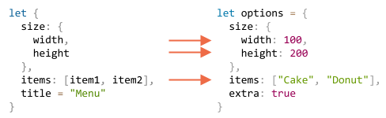

# Asignación Desestructurante

Las dos estructuras de datos más usadas en JavaScript son `Objetos` y `Array`.

Los objetos nos permiten crear una entidad individual que almacena elementos de información por propiedad, y los arrays nos permiten reunir elementos de información en una colección ordenada.

Pero cuando pasamos estos a una función, talvez no necesite un objeto/array como un conjunto, sino más bien piezas individuales.

*Asignación Desestructurante* es una sintaxis especial que nos permite "vaciar" arrays u objetos en varias variables, ya que esto aveces es más conveniente. La desestructuración también funciona bien con funciones complejas que tienen muchos argumentos, valores por defecto, etcétera.

## Desestructuración  de Arrays

Un ejemplo de cómo el array es desestructurado en variables:

```js
// tenemos un array con el nombre y apellido
let arr = ["Ilya", "Kantor"]

*!*
// asignación desestructurante
// fija primerNombre = arr[0]
// y apellido = arr[1]
let [primerNombre, apellido] = arr;
*/!*

alert(primerNombre); // Ilya
alert(apellido);  // Kantor
```

Ahora podemos trabajar con variables en lugar de miembros de array.

Se ve genial cuando se combina con `split` u otro método que devuelva un array:

```js
let [primerNombre, apellido] = "Ilya Kantor".split(' ');
```

````smart header="\"Desestructuración\" no significa \"destructivo\"."
Se llama "asignación desestructurante," porque "desestructura" al copiar elementos dentro de variables. Pero el array en sí no es modificado.

Es sólo una manera más simple de escribir:
```js
// let [primerNombre, apellido] = arr;
let primerNombre = arr[0];
let apellido = arr[1];
```
````

````smart header="Ignorar elementos utilizando comas"
Elementos no deseados de un array también pueden ser descartados por medio de una coma extra:

```js run
*!*
// segundo elemento no es necesario 
let [primerNombre, , título] = ["Julius", "Caesar", "Consul", "of the Roman Republic"];
*/!*

alert( título ); // Consul
```

En el código de arriba, el segundo elemento del array es omitido, el tercero es asignado a `título`, y el resto de los elementos del array también se omiten (debido a que no hay variables para ellos).
````

````smart header="Funciona con cualquier iterable en el lado derecho"

...Incluso, lo podemos usar con cualquier iterable, no sólo arrays:

```js
let [a, b, c] = "abc"; // ["a", "b", "c"]
let [uno, dos, tres] = new Set([1, 2, 3]);
```

````


````smart header="Asignar a cualquier cosa en el lado izquierdo"

Podemos usar cualquier "asignable" en el lado izquierdo.

Por ejemplo, una propiedad de objeto:
```js run
let user = {};
[user.name, user.surname] = "Ilya Kantor".split(' ');

alert(user.name); // Ilya
```

````

````smart header="Bucle con .entries()"

En el capítulo anterior vimos el método [Object.entries(obj)](mdn:js/Object/entries).

Podemos usarlo con la desestructuración para recorrer propiedades-y-valores de un objeto:

```js run
let user = {
  name: "John",
  age: 30
};

// recorrer propiedades-y-valores
*!*
for (let [propiedad, valor] of Object.entries(user)) {
*/!*
  alert(`${propiedad}:${valor}`); // name:John, luego age:30
}
```

...Y lo mismo para map:

```js run
let user = new Map();
user.set("name", "John");
user.set("age", "30");

*!*
for (let [propiedad, valor] of user) {
*/!*
  alert(`${propiedad}:${valor}`); // name:John, luego age:30
}
```
````
### El resto '...'

Si queremos no sólo obtener los primeros valores, pero también reunir todo lo que sigue -- podemos agregar un argumento más que obtiene "el resto" utilizando tres puntos `"..."`:

```js run
let [nombre1, nombre2, *!*...resto*/!*] = ["Julius", "Caesar", *!*"Consul", "of the Roman Republic"*/!*];

alert(nombre1); // Julius
alert(nombre2); // Caesar

*!*
// Notar que el tipo de `resto` es Array.
alert(resto[0]); // Consul
alert(resto[1]); // of the Roman Republic
alert(resto.length); // 2
*/!*
```

El valor de `resto` es un array de los elementos restantes. Podemos
usar cualquier otro nombre de variable en lugar de `resto`, sólo hay que asegurar que tenga tres puntos que lo antecedan y que esté último en la asignación desestructurante.

### Valores predeterminados

Si hay menor cantidad de valores en el array que variables en la asignación, no habrá error. Valor ausentes son considerados undefined:

```js run
*!*
let [primerNombre, apellido] = [];
*/!*

alert(primerNombre); // undefined
alert(apellido); // undefined
```

Si queremos un valor "predeterminado" para reemplzar el valor faltante, podemos proporcionarlo utilizando `=`:

```js run
*!*
// valores predeterminados
let [nombre = "Guest", apellido = "Anonymous"] = ["Julius"];
*/!*

alert(name);    // Julius (desde array)
alert(surname); // Anonymous (predeterminado utilizado)
```

Los valores predeterminados pueden ser más complejos o incluso llamadas de función. Son evaluados sólo si el valor no ha sido proporcionado.

Por ejemplo, aquí utilizamos la función `prompt` para dos valores predeterminados. Pero sólo se ejecutará para el valor faltante:

```js run
// sólo ejecuta prompt para surname
let [nombre = prompt('nombre?'), apellido = prompt('apellido?')] = ["Julius"];

alert(name);    // Julius (desde array)
alert(surname); // lo que reciba prompt
```


## Desestructuración de Objeto

La asignación desestructurante también funciona con objectos.

La sintaxis básica es:

```js
let {var1, var2} = {var1:…, var2:…}
```

Tenemos un objeto existente en el lado derecho, que queremos dividir en variables. El lado izquierdo contiene un "patrón" para propiedades correspondientes. En el caso simple, esto es una lista de nombre de variables en `{...}`.

Por ejemplo:

```js run
let opciones = {
  título: "Menu",
  ancho: 100,
  alto: 200
};

*!*
let {título, ancho, alto} = opciones;
*/!*

alert(título);  // Menu
alert(ancho);  // 100
alert(alto); // 200
```

Las propiedades `opciones.título`, `opciones.ancho` y `opciones.alto` son asignadas a las variables correspondientes. El órden no importa. Esto también funciona:

```js
// cambiado el órden en let {...}
let {alto, ancho, título} = { título: "Menu", alto: 200, ancho: 100 }
```

El patrón de la izquierda puede ser más complejo y especificar el mapeo entre propiedades y variables.

Si queremos asignar una propiedad a una variable con otro nombre, por ejemplo, `opciones.ancho` que vaya en la variable llamada `w`, entonces la podemos fijar usando dos puntos:

```js run
let opciones = {
  título: "Menu",
  ancho: 100,
  alto: 200
};

*!*
// { propiedadOrigen: variableObjetivo }
let {ancho: w, alto: h, título} = opciones;
*/!*

// ancho -> w
// alto -> h
// título -> title

alert(título);  // Menu
alert(w);      // 100
alert(h);      // 200
```

Los dos puntos muestran "qué : va dónde". En el ejemplo de arriba la propiedad `ancho` va a `w`, propiedad `alto` va a `h`, y `título` es asignado al mismo nombre.

Para propiedades potencialmente faltantes podemos establecer valores predeterminados utilizando `"="`, de esta manera:

```js run
let opciones = {
  título: "Menu"
};

*!*
let {ancho = 100, alto = 200, título} = opciones;
*/!*

alert(título);  // Menu
alert(ancho);  // 100
alert(alto); // 200
```

Al igual que con arrays o argumentos de función, los valores predeterminados pueden ser cualquier expresión o incluso llamados a función. Serán evaluados si el valor no ha sido proporcionado.

En el código de abajo `prompt` pregunta por `ancho`, pero no por `título`:

```js run
let opciones = {
  título: "Menu"
};

*!*
let {ancho = prompt("ancho?"), título = prompt("título?")} = opciones;
*/!*

alert(título);  // Menu
alert(ancho);  // (lo que sea el resultado de prompt)
```

También podemos combinar ambos, los dos puntos y la igualdad:

```js run
let options = {
  título: "Menu"
};

*!*
let {ancho: w = 100, alto: h = 200, título} = opciones;
*/!*

alert(título);  // Menu
alert(w);      // 100
alert(h);      // 200
```

Si tenemos un objeto complejo con muchas propiedades, podemos extraer solamente las que necesitamos:

```js run
let opciones = {
  título: "Menu",
  ancho: 100,
  alto: 200
};

// sólo extrae título como variable
let { título } = opciones;

alert(título); // Menu
```

### El patrón resto "..."

Qué pasa si el objeto tiene más propiedades que las que tenemos variables? Podemos tomar algunas y luego asignar el "resto" en alguna parte?

Podemos usar el patrón resto, de la misma forma que lo usamos con arrays. No es 

No es compatible con algunos navegadores antiguos (IE, use Babel para rellenarlo), pero funciona en los navegadores modernos.

Se ve así:

```js run
let opciones = {
  título: "Menu",
  alto: 200,
  ancho: 100
};

*!*
// título = propiedad llamada título
// resto = objeto con el resto de las propiedades
let {título, ...resto} = opciones;
*/!*

// ahora título="Menu", resto={alto: 200, ancho: 100}
alert(resto.alto);  // 200
alert(resto.ancho);   // 100
```

````smart header="Trampa si no hay `let`"
En los ejemplos de arriba, las variables fueron declaradas en la asignación: `let {…} = {…}`. Por supuesto que también podemos usar variables existentes, sint `let`. Pero hay una trampa.

Esto no funcionará:
```js run
let título, ancho, alto;

// error en ésta línea
{título, ancho, alto} = {título: "Menu", ancho: 200, alto: 100};
```

El problema es que JavaScript trata al `{...}` como un bloque de código en el flujo principal de código (no dentro de otra expresión). Estos bloques de código pueden ser usados para agrupar sentencias, de ésta manera:

```js run
{
  // una bloque de código
  let mensaje = "Hola";
  // ...
  alert( mensaje );
}
```

Aquí JavaScript supone que tenemos un bloque de código, eso es porque hay un error. Nosotros, en lugar, queremos desestructuración.

Para mostrar a JavaScript que no es un bloque de código, podemos rodear la expresión en paréntesis `(...)`:

```js run
let título, ancho, alto;

// ahora está bien
*!*(*/!*{título, ancho, alto}
 = {título: "Menu", ancho: 200, alto: 100}*!*)*/!*;

alert( título ); // Menu
```
````

## Desestructuración anidada

Si un objeto o un array contiene objetos y arrays anidados, podemos utilizar patrones del lado izquierdo más complejos para extraer porciones más profundas.

En el código de abajo `opciones` tiene otro objeto en la propiedad `tamaño` y un array en la propiedad `items`. El patrón en el lado izquierdo de la asignación tiene la misma estructura para extraer valores de ellos:

```js run
let options {
  size: {
    width: 100,
    height: 200
  },
  items: ["Cake", "Donut"],
  extra: true   
};

// asignación desestructurante dividida en varias líneas para mayor claridad
let {
  size: { // colocar tamaño aqui
    width,
    height
  },
  items: [item1, item2], // asignar items aqui
  title = "Menu" // no se encuentra en el objeto (se utiliza valor predeterminado)
} = options;

alert(title);  // Menu
alert(width);  // 100
alert(height); // 200
alert(item1);  // Cake
alert(item2);  // Donut
```

Todas las propiedades del objeto `opciones` con excepción de `extra` que no está en el lado izquierda, son asignadas a las variables correspondientes:



Por último tenemos `width`, `height`, `item1`, `item2` y `title` del valor predeterminado.

Tenga en cuenta que no hay variables para `size` y` items`, ya que tomamos su contenido en su lugar.

## Argumentos de función inteligentes

Hay momentos en que una función tiene muchos argumentos, la mayoría de los cuales son opcionales. Eso es especialmente cierto para las interfaces de usuario. Imagine una función que crea un menú. Puede tener ancho, una altura, un título, elementos de lista, etcétera.

Aquí hay una forma errónea de escribir tal función:

```js
function showMenu(title = "Untitled", width = 200, height = 100, items = []) {
  // ...
}
```

En la vida real, el problema es cómo recordar el orden de los argumentos. Normalmente los IDEs (Entorno de desarrollo integrado) intentan ayudarnos, especialmente si el código está bien documentado, pero aún... Otro problema es cómo llamar a la función cuando la mayoría de los argumentos están bien por defecto.

Así?

```js
// undefined cuando los valores predeterminados son correctos
showMenu("My Menu", undefined, undefined, ["Item1", "Item2"])
```

Esto es nada grato. Y se torna ilegible cuando tratamos con muchos argumentos.

La desestructuración llega al rescate!

Podemos pasar argumentos como un objeto, y la función inmediatamente los desestructura en variables:

```js run
// pasamos objeto a función
let options = {
  title: "My menu",
  items: ["Item1", "Item2"]
};

// ...y los expande inmediatamente a variables
function showMenu(*!*{title = "Untitled", width = 200, height = 100, items = []}*/!*) {
  // title, items – taken from options,
  // width, height – defaults used
  alert( `${title} ${width} ${height}` ); // My Menu 200 100
  alert( items ); // Item1, Item2
}

showMenu(options);
```

También podemos usar desestructuración más compleja con objetos anidados y mapeo de dos puntos:

```js run
let options = {
  title: "My menu",
  items: ["Item1", "Item2"]
};

*!*
function showMenu({
  title = "Untitled",
  width: w = 100,  // width goes to w
  height: h = 200, // height goes to h
  items: [item1, item2] // items primer elemento va a item1, segundo elemento a item2
}) {
*/!*
  alert( `${title} ${w} ${h}` ); // My Menu 100 200
  alert( item1 ); // Item1
  alert( item2 ); // Item2
}

showMenu(options);
```

La sintaxis completa es la misma que para una asignación desestructurante:
```js
function({
  propiedadEntrante: varName = valorPredeterminado
  ...
})
```

Luego, para un objeto de argumentos, habrá una variable `varName` para la propiedad `propiedadEntrante`, con `valorPredeterminado` por defecto.

Por favor tome nota que tal des-estructuración supone que `showMenu()` tiene un argumento. Si queremos todos los valores predeterminados, entonces debemos especificar un objeto vació:

```js
showMenu({}); // ok, todos los valores son predeterminados

showMenu(); // esto daría un error
```

Podemos solucionar esto al hacer `{}` el valor predeterminado para todo el objeto de argumentos:

```js run
function showMenu({ title = "Menu", width = 100, height = 200 }*!* = {}*/!*) {
  alert( `${title} ${width} ${height}` );
}

showMenu(); // Menu 100 200
```

En el código de arriba, todo el objeto de argumentos es `{}` por defecto, por lo tanto siempre hay algo para desestructurar.

## Resumen

- La asignación desestructurante permite mapear instantáneamente un objeto o array en varias variables.
- La sintaxis objeto completo:
    ```js
    let {prop : nombreVar = predeterminado, ...resto} = object
    ```

    Esto significa que la propiedad `prop` debería ir en la variable `nombreVar` y, si no existe tal propiedad, entonces el valor `predeterminado` debe ser usado.

    Las propiedades de objeto que no tienen mapeo son copiadas al objeto `resto`.

- La sintaxis array completa:

    ```js
    let [item1 = default, item2, ...resto] = array
    ```

    El primer item va a `item1`; el segundo va dentro de `item2`, todo el resto crea el array `resto`.

- Es posible extraer información desde arrays/objetos anidados, para esto el lado izquierdo debe tener la misma estructura que el lado derecho.
