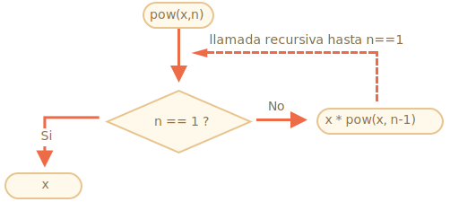
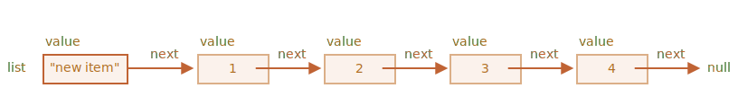

# Recursión y pila

Volvamos a las funciones y estudiémoslas más en profundidad.

Nuestro primer tema será la *recursividad*.

Si no eres nuevo en la programación, probablemente te resulte familiar y podrías saltarte este capítulo.

La recursión es un patrón de programación que es útil en situaciones en las que una tarea puede dividirse naturalmente en varias tareas del mismo tipo, pero más simples. O cuando una tarea se puede simplificar en una acción fácil más una variante más simple de la misma tarea. O, como veremos pronto, tratar con ciertas estructuras de datos.

Cuando una función resuelve una tarea, en el proceso puede llamar a muchas otras funciones. Un caso parcial de esto es cuando una función se llama *a sí misma*. Eso se llama *recursividad*.

## Dos formas de pensar

Para comenzar con algo simple, escribamos una función `pow(x, n)` que eleve `x` a una potencia natural de`n`. En otras palabras, multiplica `x` por sí mismo `n` veces.

```js
pow(2, 2) = 4
pow(2, 3) = 8
pow(2, 4) = 16
```

Hay dos formas de implementarlo.

1. Pensamiento iterativo: el bucle `for`:

    ```js run
    function pow(x, n) {
      let result = 1;

      // multiplicar el resultado por x n veces en el ciclo
      for (let i = 0; i < n; i++) {
        result *= x;
      }

      return result;
    }

    alert( pow(2, 3) ); // 8
    ```

2. Pensamiento recursivo: simplifica la tarea y se llama a sí mismo:

    ```js run
    function pow(x, n) {
      if (n == 1) {
        return x;
      } else {
        return x * pow(x, n - 1);
      }
    }

    alert( pow(2, 3) ); // 8
    ```

Note cómo la variante recursiva es fundamentalmente diferente.

Cuando se llama a `pow(x, n)`, la ejecución se divide en dos ramas:

```js
              if n==1  = x
             /
pow(x, n) =
             \       
              else     = x * pow(x, n - 1)
```

1. Si `n == 1`, entonces todo es trivial. Se llama *la base* de la recursividad, porque produce inmediatamente el resultado obvio: `pow (x, 1)` es igual a `x`.
2. De lo contrario, podemos representar `pow (x, n)` como `x * pow (x, n - 1)`. En matemáticas, uno escribiría <code>x<sup>n</sup> = x * x <sup>n-1</sup></code>. Esto se llama *un paso recursivo*: transformamos la tarea en una acción más simple (multiplicación por `x`) y una llamada más simple de la misma tarea (`pow` con menor `n`). Los siguientes pasos lo simplifican más y más hasta que `n` llegue a` 1`.

También podemos decir que `pow` * recursivamente se llama a sí mismo * hasta que` n == 1`.




Por ejemplo, para calcular `pow (2, 4)` la variante recursiva realiza estos pasos:

1. `pow(2, 4) = 2 * pow(2, 3)`
2. `pow(2, 3) = 2 * pow(2, 2)`
3. `pow(2, 2) = 2 * pow(2, 1)`
4. `pow(2, 1) = 2`

Por lo tanto, la recursión reduce una llamada de función a una más simple y luego -- a una más simple, y así sucesivamente, hasta que el resultado se vuelve obvio.

````smart header="La recursión suele ser más corta"
Una solución recursiva suele ser más corta que una iterativa.

Aquí podemos reescribir lo mismo usando el operador condicional `?` En lugar de `if` para hacer que `pow (x, n)`sea más conciso y aún bastante legible:

```js run
función pow (x, n) {
   volver (n == 1)? x: (x * pow (x, n - 1));
}
```
````

El número máximo de llamadas anidadas (incluida la primera) se llama *profundidad de recursión*. En nuestro caso, será exactamente `n`.

La profundidad máxima de recursión está limitada por el motor de JavaScript. Podemos confiar en que sea 10000, algunos motores permiten más, pero 100000 probablemente esté fuera del límite para la mayoría de ellos. Hay optimizaciones automáticas que ayudan a aliviar esto ("optimizaciones de llamadas de cola"), pero aún no son compatibles en todas partes y funcionan solo en casos simples.

Eso limita la aplicación de la recursividad, pero sigue siendo muy amplia. Hay muchas tareas donde la forma recursiva de pensar proporciona un código más simple, más fácil de mantener.

## El contexto de ejecución y pila

Ahora examinemos cómo funcionan las llamadas recursivas. Para eso observaremos lo que sucede debajo del sombrero en las funciones.

La información sobre el proceso de ejecución de una función en ejecución se almacena en su *contexto de ejecución*.

El [contexto de ejecución](https://tc39.github.io/ecma262/#sec-execution-contexts) es una estructura de datos interna que contiene detalles sobre la ejecución de una función: dónde está el flujo de control ahora, las variables actuales, el valor de `this` (no lo usamos aquí) y algunos otros detalles internos.

Una llamada de función tiene exactamente un contexto de ejecución asociado.

Cuando una función realiza una llamada anidada, sucede lo siguiente:

- La función actual está en pausa.
- El contexto de ejecución asociado con él se recuerda en una estructura de datos especial llamada *pila de contexto de ejecución*.
- La llamada anidada se ejecuta.
- Una vez que finaliza, el antiguo contexto de ejecución se recupera de la pila y la función externa se reanuda desde donde se detuvo.

Veamos qué sucede durante la llamada de `pow (2, 3)`.

### pow (2, 3)

Al comienzo de la llamada `pow (2, 3)` el contexto de ejecución almacenará variables: `x = 2, n = 3`, el flujo de ejecución está en la línea `1` de la función.

Podemos esbozarlo como:

<ul class="function-execution-context-list">
  <li>
    <span class="function-execution-context">Context: { x: 2, n: 3, at line 1 }</span>
    <span class="function-execution-context-call">pow(2, 3)</span>
  </li>
</ul>

Ahí es cuando la función comienza a ejecutarse. La condición `n == 1` es falsa, por lo que el flujo continúa en la segunda rama de` if`:

```js run
function pow(x, n) {
  if (n == 1) {
    return x;
  } else {
*!*
    return x * pow(x, n - 1);
*/!*
  }
}

alert( pow(2, 3) );
```


Las variables son las mismas, pero la línea cambia, por lo que el contexto es ahora:

<ul class="function-execution-context-list">
  <li>
    <span class="function-execution-context">Context: { x: 2, n: 3, at line 5 }</span>
    <span class="function-execution-context-call">pow(2, 3)</span>
  </li>
</ul>

Para calcular `x * pow (x, n - 1)`, necesitamos hacer una sub-llamada de `pow` con nuevos argumentos` pow (2, 2) `.

### pow (2, 2)

Para hacer una llamada anidada, JavaScript recuerda el contexto de ejecución actual en la *pila de contexto de ejecución*.

Aquí llamamos a la misma función `pow`, pero no importa en absoluto. El proceso es el mismo para todas las funciones:

1. El contexto actual se "recuerda" en la parte superior de la pila.
2. El nuevo contexto se crea para la subllamada.
3. Cuando finaliza la subllamada -- el contexto anterior se extrae de la pila y su ejecución continúa.

Aquí está la pila de contexto cuando ingresamos la subllamada `pow (2, 2)`:

<ul class="function-execution-context-list">
  <li>
    <span class="function-execution-context">Context: { x: 2, n: 2, at line 1 }</span>
    <span class="function-execution-context-call">pow(2, 2)</span>
  </li>
  <li>
    <span class="function-execution-context">Context: { x: 2, n: 3, at line 5 }</span>
    <span class="function-execution-context-call">pow(2, 3)</span>
  </li>
</ul>

El nuevo contexto de ejecución actual está en la parte superior (y en negrita), y los contextos recordados anteriores están debajo.

Cuando terminamos la subllamada -- es fácil reanudar el contexto anterior, ya que mantiene ambas variables y el lugar exacto del código donde se detuvo. Aquí en la imagen usamos la palabra "línea", pero por supuesto es más precisa.

### pow(2, 1)

El proceso se repite: se realiza una nueva subllamada en la línea `5`, ahora con argumentos` x = 2`, `n = 1`.

Se crea un nuevo contexto de ejecución, el anterior se coloca en la parte superior de la pila:

<ul class="function-execution-context-list">
  <li>
    <span class="function-execution-context">Context: { x: 2, n: 1, at line 1 }</span>
    <span class="function-execution-context-call">pow(2, 1)</span>
  </li>
  <li>
    <span class="function-execution-context">Context: { x: 2, n: 2, at line 5 }</span>
    <span class="function-execution-context-call">pow(2, 2)</span>
  </li>
  <li>
    <span class="function-execution-context">Context: { x: 2, n: 3, at line 5 }</span>
    <span class="function-execution-context-call">pow(2, 3)</span>
  </li>
</ul>

Hay 2 contextos antiguos ahora y 1 actualmente en ejecución para `pow (2, 1)`.

### La salida

Durante la ejecución de `pow (2, 1)`, a diferencia de antes, la condición `n == 1` es verdadera, por lo que la primera rama de `if` funciona:

```js
function pow(x, n) {
  if (n == 1) {
*!*
    return x;
*/!*
  } else {
    return x * pow(x, n - 1);
  }
}
```

No hay más llamadas anidadas, por lo que la función finaliza y devuelve `2`.

Cuando finaliza la función, su contexto de ejecución ya no es necesario, por lo que se elimina de la memoria. El anterior se restaura desde la parte superior de la pila:


<ul class="function-execution-context-list">
  <li>
    <span class="function-execution-context">Context: { x: 2, n: 2, at line 5 }</span>
    <span class="function-execution-context-call">pow(2, 2)</span>
  </li>
  <li>
    <span class="function-execution-context">Context: { x: 2, n: 3, at line 5 }</span>
    <span class="function-execution-context-call">pow(2, 3)</span>
  </li>
</ul>

Se reanuda la ejecución de `pow (2, 2)`. Tiene el resultado de la subllamada `pow (2, 1)`, por lo que también puede finalizar la evaluación de `x * pow (x, n - 1)`, devolviendo `4`.

Luego se restaura el contexto anterior:

<ul class="function-execution-context-list">
  <li>
    <span class="function-execution-context">Context: { x: 2, n: 3, at line 5 }</span>
    <span class="function-execution-context-call">pow(2, 3)</span>
  </li>
</ul>

Cuando termina, tenemos un resultado de `pow (2, 3) = 8`.

La profundidad de recursión en este caso fue: **3**.

Como podemos ver en las ilustraciones anteriores, la profundidad de recursión es igual al número máximo de contexto en la pila.

Tenga en cuenta los requisitos de memoria. Los contextos toman memoria. En nuestro caso, elevar a la potencia de `n` realmente requiere la memoria para `n` contextos, para todos los valores más bajos de `n`.

Un algoritmo basado en bucles ahorra más memoria:

```js
function pow(x, n) {
  let result = 1;

  for (let i = 0; i < n; i++) {
    result *= x;
  }

  return result;
}
```

El iterativo `pow` utiliza un contexto único que cambia `i` y `result` en el proceso. Sus requisitos de memoria son pequeños, fijos y no dependen de `n`.

**Cualquier recursión puede reescribirse como un bucle. La variante de bucle generalmente se puede hacer más efectiva.**

... Pero a veces la reescritura no es trivial, especialmente cuando la función utiliza sub-llamadas recursivas diferentes según las condiciones y combina sus resultados o cuando la ramificación es más compleja. Y la optimización puede ser innecesaria y no merece la pena el esfuerzo.

La recursión puede dar un código más corto, más fácil de entender y apoyar. No se requieren optimizaciones en todos los lugares, principalmente necesitamos un buen código, por eso se usa.

## Recorridos recursivos

Otra gran aplicación de la recursión es un recorrido recursivo.

Imagina que tenemos una empresa. La estructura del personal se puede presentar como un objeto:

```js
let company = {
  sales: [{
    name: 'John',
    salary: 1000
  }, {
    name: 'Alice',
    salary: 600
  }],

  development: {
    sites: [{
      name: 'Peter',
      salary: 2000
    }, {
      name: 'Alex',
      salary: 1800
    }],

    internals: [{
      name: 'Jack',
      salary: 1300
    }]
  }
};
```

En otras palabras, una empresa tiene departamentos.

- Un departamento puede tener una gran variedad de personal. Por ejemplo, el departamento de ventas `sales` tiene 2 empleados: John y Alice.
- O un departamento puede dividirse en subdepartamentos, como `development` tiene dos ramas: `sites` e `internals`. Cada uno de ellos tiene su propio personal.
- También es posible que cuando un subdepartamento crece, se divida en subdepartamentos (o equipos).

    Por ejemplo, el departamento `sites` en el futuro puede dividirse en equipos para `siteA` y `siteB`. Y ellos, potencialmente, pueden dividirse aún más. Eso no está en la imagen, solo algo a tener en cuenta.

Ahora digamos que queremos una función para obtener la suma de todos los salarios. ¿Cómo podemos hacer eso?

Un enfoque iterativo no es fácil, porque la estructura no es simple. La primera idea puede ser hacer un bucle `for` sobre `company` con un sub-bucle anidado sobre departamentos de primer nivel. Pero luego necesitamos más sub-bucles anidados para iterar sobre el personal en los departamentos de segundo nivel como `sites`. ...¿Y luego otro sub-bucle dentro de los de los departamentos de tercer nivel que podrían aparecer en el futuro? ¿Deberíamos parar en el nivel 3 o hacer 4 niveles de bucles? Si ponemos 3-4 bucles anidados en el código para atravesar un solo objeto, se vuelve bastante feo.

Probemos la recursividad.

Como podemos ver, cuando nuestra función hace que un departamento sume, hay dos casos posibles:

1. O bien es un departamento "simple" con una *array de personas* -- entonces podemos sumar los salarios en un bucle simple.
2. O es *un objeto con subdepartamentos `N`*, entonces podemos hacer llamadas recursivas `N` para obtener la suma de cada uno de los subdepartamentos y combinar los resultados.

El (1) es la base de la recursividad, el caso trivial.

El (2) es el paso recursivo. Una tarea compleja se divide en subtareas para departamentos más pequeños. A su vez, pueden dividirse nuevamente, pero tarde o temprano la división terminará en (1).

El algoritmo es probablemente aún más fácil de leer desde el código:


```js run
let company = { // el mismo objeto, comprimido por brevedad
  sales: [{name: 'John', salary: 1000}, {name: 'Alice', salary: 600 }],
  development: {
    sites: [{name: 'Peter', salary: 2000}, {name: 'Alex', salary: 1800 }],
    internals: [{name: 'Jack', salary: 1300}]
  }
};

// La función para hacer el trabajo
*!*
function sumSalaries(department) {
  if (Array.isArray(department)) { // caso (1)
    return department.reduce((prev, current) => prev + current.salary, 0); // suma del Array
  } else { // caso (2)
    let sum = 0;
    for (let subdep of Object.values(department)) {
      sum += sumSalaries(subdep); // llama recursivamente a subdepartamentos, suma los resultados
    }
    return sum;
  }
}
*/!*

alert(sumSalaries(company)); // 6700
```

El código es corto y fácil de entender (¿Quizás?). Ese es el poder de la recursividad. También funciona para cualquier nivel de anidamiento de subdepartamentos.

Aquí está el diagrama de llamadas:


Podemos ver fácilmente el principio: para un objeto `{...}` se realizan subllamadas, mientras que los Arrays `[...]` son las "hojas" del árbol recursivo, dan un resultado inmediato.

Tenga en cuenta que el código utiliza funciones inteligentes que hemos cubierto antes:

- Método `arr.reduce` explicado en el capítulo <info:array-methods> para obtener la suma del Array.
- Bucle `for (val of Object.values (obj))` para iterar sobre los valores del objeto: `Object.values` devuelve una matriz de ellos.


## Estructuras recursivas

Una estructura de datos recursiva (definida recursivamente) es una estructura que se replica en partes.

Lo acabamos de ver en el ejemplo de la estructura de la empresa anterior.

Una empresa *departamento* es:
- O una gran variedad de personas.
- O un objeto con *departamentos*.

Para los desarrolladores web hay ejemplos mucho más conocidos: documentos HTML y XML.

En el documento HTML, una *etiqueta HTML* puede contener una lista de:
- Piezas de texto.
- Comentarios HTML.
- Otras *etiquetas HTML* (que a su vez pueden contener textos/comentarios, otras etiquetas, etc...).

Esa es una vez más una definición recursiva.

Para una mejor comprensión, cubriremos una estructura recursiva más llamada "Lista enlazada" que podría ser una mejor alternativa para las matrices en algunos casos.

### Lista enlazada

Imagínese, queremos almacenar una lista ordenada de objetos.

La elección natural sería una matriz:

```js
let arr = [obj1, obj2, obj3];
```

...Pero hay un problema con los Arrays. Las operaciones "eliminar elemento" e "insertar elemento" son costosas. Por ejemplo, la operación `arr.unshift(obj)` debe renumerar todos los elementos para dejar espacio para un nuevo `obj`, y si la matriz es grande, lleva tiempo. Lo mismo con `arr.shift ()`.

Las únicas modificaciones estructurales que no requieren renumeración masiva son aquellas que operan con el final del Array: `arr.push/pop`. Por lo tanto, una matriz puede ser bastante lenta para grandes colas.

Alternativamente, si realmente necesitamos una inserción/eliminación rápida, podemos elegir otra estructura de datos llamada [lista enlazada](https://es.wikipedia.org/wiki/Lista_enlazada).

El *elemento de lista enlazada* se define de forma recursiva como un objeto con:
- `value`.
- propiedad `next` que hace referencia al siguiente *elemento de lista enlazado* o `null` si ese es el final.

Por ejemplo:

```js
let list = {
  value: 1,
  next: {
    value: 2,
    next: {
      value: 3,
      next: {
        value: 4,
        next: null
      }
    }
  }
};
```

Representación gráfica de la lista:


Un código alternativo para la creación:

```js no-beautify
let list = { value: 1 };
list.next = { value: 2 };
list.next.next = { value: 3 };
list.next.next.next = { value: 4 };
```

Aquí podemos ver aún más claramente que hay varios objetos, cada uno tiene el `value` y el `next` apuntando al vecino. La variable `list` es el primer objeto en la cadena, por lo que siguiendo los punteros` next` de ella podemos alcanzar cualquier elemento.

La lista se puede dividir fácilmente en varias partes y luego volver a unir:

```js
let secondList = list.next.next;
list.next.next = null;
```


Para unir:

```js
list.next.next = secondList;
```

Y seguramente podemos insertar o eliminar elementos en cualquier lugar.

Por ejemplo, para anteponer un nuevo valor, necesitamos actualizar el encabezado de la lista:

```js
let list = { value: 1 };
list.next = { value: 2 };
list.next.next = { value: 3 };
list.next.next.next = { value: 4 };

*!*
// anteponer el nuevo valor a la lista
list = { value: "new item", next: list };
*/!*
```



Para eliminar un valor del medio, cambie el `next` del anterior:

```js
list.next = list.next.next;
```


Hicimos que `list.next` salte sobre `1` al valor `2`. El valor `1` ahora está excluido de la cadena. Si no se almacena en ningún otro lugar, se eliminará automáticamente de la memoria.

A diferencia de los Arrays, no hay renumeración en masa, podemos reorganizar fácilmente los elementos.

Naturalmente, las listas no siempre son mejores que los Arrays. De lo contrario, todos usarían solo listas.

El principal inconveniente es que no podemos acceder fácilmente a un elemento por su número. En un Array eso es fácil: `arr[n]` es una referencia directa. Pero en la lista tenemos que comenzar desde el primer elemento e ir `siguiente` `N` veces para obtener el enésimo elemento.

... Pero no siempre necesitamos tales operaciones. Por ejemplo, cuando necesitamos una cola o incluso un [deque](https://es.wikipedia.org/wiki/Cola_doblemente_terminada) -- la estructura ordenada que debe permitir agregar/eliminar elementos muy rápidamente desde ambos extremos.

A veces vale la pena agregar otra variable llamada `tail` (cola) para rastrear el último elemento de la lista (y actualizarlo al agregar/eliminar elementos del final). Para grandes conjuntos de elementos, la diferencia de velocidad frente a las matrices es enorme.

## Resumen

Glosario:
- *Recursion* es concepto de programación que significa una función "auto-llamada". Dichas funciones se pueden utilizar para resolver ciertas tareas de manera elegante.

    Cuando una función se llama a sí misma, eso se llama *paso de recursión*. La *base* de la recursividad son los argumentos de la función que hacen que la tarea sea tan simple que la función no realiza más llamadas.

- Una estructura de datos [definida recursivamente](https://en.wikipedia.org/wiki/Recursive_data_type) es una estructura de datos que se puede definir utilizandose a sí misma.

    Por ejemplo, la lista enlazada se puede definir como una estructura de datos que consiste en un objeto que hace referencia a una lista (o nulo).

    ```js
    list = { value, next -> list }
    ```

    Los árboles como el árbol de elementos HTML o el árbol de departamento de este capítulo también son naturalmente recursivos: se ramifican y cada rama puede tener otras ramas.

    Las funciones recursivas se pueden usar para recorrerlas como hemos visto en el ejemplo `sumSalary`.

Cualquier función recursiva puede reescribirse en una iterativa. Y eso a veces es necesario para optimizar las cosas. Pero para muchas tareas, una solución recursiva es lo suficientemente rápida y fácil de escribir y soportar.
