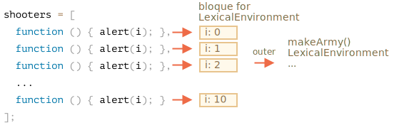

Examinemos lo que se hace dentro de `makeArmy`, y la solución será obvia.

1. Crea un array vacío. `shooters`:

    ```js
    let shooters = [];
    ```
2. Lo llena en el bucle a través de `shooters.push(function...)`.

  Cada elemento es una función, por lo que el array resultante se ve así:

    ```js no-beautify
    shooters = [
      function () { alert(i); },
      function () { alert(i); },
      function () { alert(i); },
      function () { alert(i); },
      function () { alert(i); },
      function () { alert(i); },
      function () { alert(i); },
      function () { alert(i); },
      function () { alert(i); },
      function () { alert(i); }
    ];
    ```

3. El array se devuelve desde la función.

Luego, más tarde, la llamada a `army[5] ()` obtendrá el elemento `army[5]` de el array (será una función) y lo llamará.

Ahora, ¿por qué todas esas funciones muestran lo mismo?

Esto se debe a que no hay una variable local `i` dentro de las funciones `shooter`. Cuando se llama a tal función, toma `i` de su entorno léxico externo.

¿Cuál será el valor de 'i'?

Si miramos la fuente:

```js
function makeArmy() {
  ...
  let i = 0;
  while (i < 10) {
    let shooter = function() { // shooter function
      alert( i ); // debería mostrar su número
    };
    ...
  }
  ...
}
```

... Podemos ver que vive en el entorno léxico asociado con la ejecución actual de `makeArmy()`. Pero cuando se llama a `army[5]()`, `makeArmy` ya ha terminado su trabajo, y `i` tiene el último valor: `10` (el final de `while`).

Como resultado, todas las funciones `shooter` obtienen del mismo entorno léxico externo, el último valor `i = 10`.

Podemos arreglarlo moviendo la definición de variable al bucle:

```js run demo
function makeArmy() {

  let shooters = [];

*!*
  for(let i = 0; i < 10; i++) {
*/!*
    let shooter = function() { // shooter function
      alert( i ); // debería mostrar su número
    };
    shooters.push(shooter);
  }

  return shooters;
}

let army = makeArmy();

army[0](); // 0
army[5](); // 5
```

Ahora funciona correctamente, porque cada vez que se ejecuta el bloque de código en `for (let i = 0 ...) {...}`, se crea un nuevo entorno léxico para él, con la variable correspondiente `i`.

Entonces, el valor de `i` ahora vive un poco más cerca. No en el entorno léxico `makeArmy()`, sino en el entorno léxico que corresponde a la iteración del bucle actual. Por eso ahora funciona.



Aquí reescribimos `while` en `for`.

Podría usarse otro truco, veámoslo para comprender mejor el tema:

```js run
function makeArmy() {
  let shooters = [];

  let i = 0;
  while (i < 10) {
*!*
    let j = i;
*/!*
    let shooter = function() { // shooter function
      alert( *!*j*/!* ); // debería verse el núemero
    };
    shooters.push(shooter);
    i++;
  }

  return shooters;
}

let army = makeArmy();

army[0](); // 0
army[5](); // 5
```

El bucle `while`, al igual que `for`, crea un nuevo entorno léxico para cada ejecución. Así que aquí nos aseguramos de que obtenga el valor correcto para un `shooter`.

Copiamos `let j = i`. Esto hace que el cuerpo del bucle sea `j` local y copia el valor de `i` en él. Los primitivos se copian "por valor", por lo que en realidad obtenemos una copia independiente completa de `i`, que pertenece a la iteración del bucle actual.
