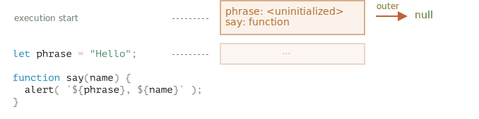

<<<<<<< HEAD
# Ámbito de Variable

JavaScript es un lenguaje muy orientado a funciones. Nos da mucha libertad. Se puede crear una función dinámicamente, pasarla como argumento a otra función y llamarla desde un lugar de código totalmente diferente más adelante.

Ya sabemos que una función puede acceder a variables fuera de ella.

Ahora ampliemos nuestro conocimiento para incluir escenarios más complejos.

```smart header="Hablaremos de las variables let / const aquí"
En JavaScript, hay 3 formas de declarar una variable: `let`, `const` (las modernas) y `var` (más antigua).

- En este artículo usaremos las variables `let` en los ejemplos.
- Las variables, declaradas con `const`, se comportan igual, por lo que este artículo también trata sobre `const`.
- El antiguo `var` tiene algunas diferencias notables, se tratarán en el artículo <info:var>.
```

## Bloques de código

Si una variable se declara dentro de un bloque de código `{...}`, solo es visible dentro de ese bloque.

Por ejemplo:

```js run
{
  // hacer un trabajo con variables locales que no deberían verse fuera
  let message = "Hello"; // solo visible en este bloque
  alert(message); // Hello
}

alert(message); // Error: el mensaje no se ha definido (undefined)
```

Podemos usar esto para aislar un fragmento de código que realiza su propia tarea, con variables que solo le pertenecen a él:

```js run
{
  // ver mensaje
  let message = "Hello";
  alert(message);
}

{
  // ver otro mensaje
  let message = "Goodbye";
  alert(message);
}
```

````smart header="Habría un error sin bloques"
Tenga en cuenta que sin bloques separados, habría un error, si usamos 'let' con el nombre de la variable existente:

```js run
// ver mensaje
let message = "Hello";
alert(message);

// ver otro mensaje
*!*
let message = "Goodbye"; // Error: la variable ya ha sido declarada
*/!*
alert(message);
```
````

Para `if`,` for`, `while` y así sucesivamente, las variables declaradas en `{...} ` de igual manera solo son visibles en el interior:

=======
# Variable scope, closure

JavaScript is a very function-oriented language. It gives us a lot of freedom. A function can be created at any moment, passed as an argument to another function, and then called from a totally different place of code later.

We already know that a function can access variables outside of it ("outer" variables).

But what happens if outer variables change since a function is created? Will the function get newer values or the old ones?

And what if a function is passed along as a parameter and called from another place of code, will it get access to outer variables at the new place?

Let's expand our knowledge to understand these scenarios and more complex ones.

```smart header="We'll talk about `let/const` variables here"
In JavaScript, there are 3 ways to declare a variable: `let`, `const` (the modern ones), and `var` (the remnant of the past).

- In this article we'll use `let` variables in examples.
- Variables, declared with `const`, behave the same, so this article is about `const` too.
- The old `var` has some notable differences, they will be covered in the article <info:var>.
```

## Code blocks

If a variable is declared inside a code block `{...}`, it's only visible inside that block.

For example:

```js run
{
  // do some job with local variables that should not be seen outside

  let message = "Hello"; // only visible in this block

  alert(message); // Hello
}

alert(message); // Error: message is not defined
```

We can use this to isolate a piece of code that does its own task, with variables that only belong to it:

```js run
{
  // show message
  let message = "Hello";
  alert(message);
}

{
  // show another message
  let message = "Goodbye";
  alert(message);
}
```

````smart header="There'd be an error without blocks"
Please note, without separate blocks there would be an error, if we use `let` with the existing variable name:

```js run
// show message
let message = "Hello";
alert(message);

// show another message
*!*
let message = "Goodbye"; // Error: variable already declared
*/!*
alert(message);
```
````

For `if`, `for`, `while` and so on, variables declared in `{...}` are also only visible inside:
>>>>>>> f830bc5d9454d85829e011d914f215eb5896579a

```js run
if (true) {
  let phrase = "Hello!";

  alert(phrase); // Hello!
}

<<<<<<< HEAD
alert(phrase); // ¡Error, no hay tal variable!
```

Aquí, después de que `if` termine, la` alerta` a continuación no verá la `phrase`, de ahí el error.

Eso es genial, ya que nos permite crear variables locales de bloque, específicas de una rama `if`.

De la misma manera que para los bucles `for` y `while`:

```js run
for (let i = 0; i < 3; i++) {
  // la variable i solo es visible dentro de este for
  alert(i); // 0, then 1, then 2
}

alert(i); // ¡Error, no hay tal variable!
```

Visualmente, `let i` está fuera de `{...} `. Pero la construcción `for` es especial aquí: la variable, declarada dentro de ella, se considera parte del bloque.
=======
alert(phrase); // Error, no such variable!
```

Here, after `if` finishes, the `alert` below won't see the `phrase`, hence the error.

That's great, as it allows us to create block-local variables, specific to an `if` branch.

The similar thing holds true for `for` and `while` loops:

```js run
for (let i = 0; i < 3; i++) {
  // the variable i is only visible inside this for
  alert(i); // 0, then 1, then 2
}

alert(i); // Error, no such variable
```
>>>>>>> f830bc5d9454d85829e011d914f215eb5896579a

Visually, `let i` is outside of `{...}`. But the `for` construct is special here: the variable, declared inside it, is considered a part of the block.

## Funciones anidadas

Una función se llama "anidada" cuando se crea dentro de otra función.

Es fácilmente posible hacer esto con JavaScript.

Podemos usarlo para organizar nuestro código, así:

```js
function sayHiBye(firstName, lastName) {

  // función anidada auxiliar para usar a continuación
  function getFullName() {
    return firstName + " " + lastName;
  }

  alert( "Hello, " + getFullName() );
  alert( "Bye, " + getFullName() );

}
```

<<<<<<< HEAD
Aquí la función *anidada* `getFullName()` se hace por conveniencia. Puede acceder a las variables externas y, por lo tanto, puede devolver el nombre completo. Las funciones anidadas son bastante comunes en JavaScript.

Lo que es mucho más interesante, es que puede devolverse una función anidada: ya sea como propiedad de un nuevo objeto o como resultado en sí mismo. Luego se puede usar en otro lugar. No importa dónde, todavía tiene acceso a las mismas variables externas.

A continuación, `makeCounter` crea la función "contador "que devuelve el siguiente número en cada invocación:

=======
Here the *nested* function `getFullName()` is made for convenience. It can access the outer variables and so can return the full name. Nested functions are quite common in JavaScript.

What's much more interesting, a nested function can be returned: either as a property of a new object or as a result by itself. It can then be used somewhere else. No matter where, it still has access to the same outer variables.

Below, `makeCounter` creates the "counter" function that returns the next number on each invocation:
>>>>>>> f830bc5d9454d85829e011d914f215eb5896579a

```js run
function makeCounter() {
  let count = 0;

  return function() {
    return count++;
  };
}

let counter = makeCounter();

alert( counter() ); // 0
alert( counter() ); // 1
alert( counter() ); // 2
```

<<<<<<< HEAD
A pesar de ser simples, las variantes ligeramente modificadas de ese código tienen usos prácticos, por ejemplo, como [random number generator](https://en.wikipedia.org/wiki/Pseudorandom_number_generator) para generar valores aleatorios para pruebas automatizadas.

¿Cómo funciona esto? Si creamos múltiples contadores, ¿serán independientes? ¿Qué está pasando con las variables aquí?

Entender tales cosas es excelente para el conocimiento general de JavaScript y beneficioso para escenarios más complejos. Así que vamos a profundizar un poco.

## Ámbito o alcance léxico

```warn header="¡Aquí hay dragones!"
La explicación técnica en profundidad está por venir.

Me gustaría evitar los detalles de lenguaje de bajo nivel, pero cualquier comprensión sin ellos sería insuficiente e incompleta, así que prepárate.
```

Para mayor claridad, la explicación se divide en múltiples pasos.

### Paso 1. Variables

En JavaScript, todas las funciones en ejecución, el bloque de código `{...}` y el script en su conjunto tienen un objeto interno (oculto) asociado, conocido como *Alcance léxico*.

El objeto del alcance léxico consta de dos partes:

1. *Registro de entorno*: un objeto que almacena todas las variables locales como sus propiedades (y alguna otra información como el valor de `this`).
2. Una referencia al *entorno léxico externo*,  asociado con el código externo.

**Una "variable" es solo una propiedad del objeto interno especial, `Registro de entorno`. "Obtener o cambiar una variable" significa "obtener o cambiar una propiedad de ese objeto".**

En este código simple y sin funciones, solo hay un entorno léxico:


Este es el denominado entorno léxico *global*, asociado con todo el script.

En la imagen de arriba, el rectángulo significa Registro de entornos (almacén de variables) y la flecha significa la referencia externa. El entorno léxico global no tiene referencia externa, por eso la flecha apunta a `nulo`.

A medida que el código comienza a ejecutarse y continúa, el entorno léxico cambia.

Aquí hay un código un poco más largo:


Los rectángulos en el lado derecho demuestran cómo cambia el entorno léxico global durante la ejecución:

1. Cuando se inicia el script, el entorno léxico se rellena previamente con todas las variables declaradas.
     - Inicialmente, están en el estado "No inicializado". Ese es un estado interno especial, significa que el motor conoce la variable, pero no se puede hacer referencia a ella hasta que se haya declarado con `let`. Es casi lo mismo que si la variable no existiera.
2. Luego aparece la definición `let phrase`.Todavía no hay una asignación, por lo que su valor es `undefined`. Podemos usar la variable desde este punto en adelante.
3. `phrase` se le asigna un valor.
4. `phrase` cambia el valor.

Todo parece simple por ahora, ¿verdad?

- Una variable es una propiedad de un objeto interno especial, asociado con el bloque / función / script actualmente en ejecución.
- Trabajar con variables es realmente trabajar con las propiedades de ese objeto.

```smart header="El entorno léxico es un objeto de especificación"
"El entorno léxico "es un objeto de especificación: solo existe" teóricamente "en el [language specification](https://tc39.es/ecma262/#sec-lexical-environments) para describir cómo funcionan las cosas. No podemos obtener este objeto en nuestro código y manipularlo directamente.

Los motores de JavaScript también pueden optimizarlo, descartar variables que no se utilizan para ahorrar memoria y realizar otros trucos internos, siempre que el comportamiento visible permanezca como se describe.
```

### Paso 2. Declaración de funciones

Una función también es un valor, como una variable.

**La diferencia es que una `declaración de función` se inicializa completamente al instante.**

Cuando se crea un entorno léxico, una declaración de función se convierte inmediatamente en una función lista para usar (a diferencia de `let`, que no se puede usar hasta la declaración).

Es por eso que podemos usar una función, declarada como `declaración de función`, incluso antes de la declaración misma.

Por ejemplo, aquí está el estado inicial del entorno léxico global cuando agregamos una función:



Naturalmente, este comportamiento solo se aplica a las `declaraciones de funciones`, no a las `expresiones de funciones`, donde asignamos una función a una variable, como `let say = function (name) ...`.

### Paso 3. Entorno léxico interno y externo

Cuando se ejecuta una función, al comienzo de la llamada, se crea automáticamente un nuevo entorno léxico para almacenar variables y parámetros locales de la llamada.

Por ejemplo, para `say (" John ")`, se ve así (la ejecución está en la línea, etiquetada con una flecha):
=======
Despite being simple, slightly modified variants of that code have practical uses, for instance, as a [random number generator](https://en.wikipedia.org/wiki/Pseudorandom_number_generator) to generate random values for automated tests.

How does this work? If we create multiple counters, will they be independent? What's going on with the variables here?

Undestanding such things is great for the overall knowledge of JavaScript and beneficial for more complex scenarios. So let's go a bit in-depth.

## Lexical Environment

```warn header="Here be dragons!"
The in-depth technical explanation lies ahead.

As far as I'd like to avoid low-level language details, any understanding without them would be lacking and incomplete, so get ready.
```

For clarity, the explanation is split into multiple steps.

### Step 1. Variables

In JavaScript, every running function, code block `{...}`, and the script as a whole have an internal (hidden) associated object known as the *Lexical Environment*.

The Lexical Environment object consists of two parts:

1. *Environment Record* -- an object that stores all local variables as its properties (and some other information like the value of `this`).
2. A reference to the *outer lexical environment*, the one associated with the outer code.

**A "variable" is just a property of the special internal object, `Environment Record`. "To get or change a variable" means "to get or change a property of that object".**

In this simple code without functions, there is only one Lexical Environment:


This is the so-called *global* Lexical Environment, associated with the whole script.

On the picture above, the rectangle means Environment Record (variable store) and the arrow means the outer reference. The global Lexical Environment has no outer reference, that's why the arrow points to `null`.

As the code starts executing and goes on, the Lexical Environment changes.

Here's a little bit longer code:


Rectangles on the right-hand side demonstrate how the global Lexical Environment changes during the execution:

1. When the script starts, the Lexical Environment is pre-populated with all declared variables.
    - Initially, they are in the "Uninitialized" state. That's a special internal state, it means that the engine knows about the variable, but it cannot be referenced until it has been declared with `let`. It's almost the same as if the variable didn't exist.
2. Then `let phrase` definition appears. There's no assignment yet, so its value is `undefined`. We can use the variable from this point forward.
3. `phrase` is assigned a value.
4. `phrase` changes the value.

Everything looks simple for now, right?

- A variable is a property of a special internal object, associated with the currently executing block/function/script.
- Working with variables is actually working with the properties of that object.

```smart header="Lexical Environment is a specification object"
"Lexical Environment" is a specification object: it only exists "theoretically" in the [language specification](https://tc39.es/ecma262/#sec-lexical-environments) to describe how things work. We can't get this object in our code and manipulate it directly.

JavaScript engines also may optimize it, discard variables that are unused to save memory and perform other internal tricks, as long as the visible behavior remains as described.
```

### Step 2. Function Declarations

A function is also a value, like a variable.

**The difference is that a Function Declaration is instantly fully initialized.**

When a Lexical Environment is created, a Function Declaration immediately becomes a ready-to-use function (unlike `let`, that is unusable till the declaration).

That's why we can use a function, declared as Function Declaration, even before the declaration itself.

For example, here's the initial state of the global Lexical Environment when we add a function:


Naturally, this behavior only applies to Function Declarations, not Function Expressions where we assign a function to a variable, such as `let say = function(name)...`.

### Step 3. Inner and outer Lexical Environment

When a function runs, at the beginning of the call, a new Lexical Environment is created automatically to store local variables and parameters of the call.

For instance, for `say("John")`, it looks like this (the execution is at the line, labelled with an arrow):
>>>>>>> f830bc5d9454d85829e011d914f215eb5896579a

<!--
    ```js
    let phrase = "Hello";

    function say(name) {
     alert( `${phrase}, ${name}` );
    }

    say("John"); // Hello, John
    ```-->


<<<<<<< HEAD
Durante la llamada a la función tenemos dos entornos léxicos: el interno (para la llamada a la función) y el externo (global):

- El entorno léxico interno corresponde a la ejecución actual de `say`. Tiene una sola propiedad: `name`, el argumento de la función. Llamamos a `say("John")`, por lo que el valor de `name` es `"John"`.
- El entorno léxico externo es el entorno léxico global. Tiene la variable `phrase` y la función misma.

El entorno léxico interno tiene una referencia al `externo`.

**Cuando el código quiere acceder a una variable: primero se busca el entorno léxico interno, luego el externo, luego el más externo y así sucesivamente hasta el global.**

Si no se encuentra una variable en ninguna parte, se trata de un error en modo estricto (sin `use strict`, una asignación a una variable no existente crea una nueva variable global, por compatibilidad con el código antiguo).

In this example the search proceeds as follows:

- Para la variable `name`, la `alert` dentro de `say` lo enuentra inmediatamente en el entorno léxico interno.
- Cuando quiere acceder a `phrase`, entonces no hay `phrase` localmente, por lo que sigue la referencia al entorno léxico externo y lo encuentra allí.


### Paso 4. Returning a function

Volvamos al ejemplo de `makeCounter`.
=======
During the function call we have two Lexical Environments: the inner one (for the function call) and the outer one (global):

- The inner Lexical Environment corresponds to the current execution of `say`. It has a single property: `name`, the function argument. We called `say("John")`, so the value of the `name` is `"John"`.
- The outer Lexical Environment is the global Lexical Environment. It has the `phrase` variable and the function itself.

The inner Lexical Environment has a reference to the `outer` one.

**When the code wants to access a variable -- the inner Lexical Environment is searched first, then the outer one, then the more outer one and so on until the global one.**

If a variable is not found anywhere, that's an error in strict mode (without `use strict`, an assignment to a non-existing variable creates a new global variable, for compatibility with old code).

In this example the search proceeds as follows:

- For the `name` variable, the `alert` inside `say` finds it immediately in the inner Lexical Environment.
- When it wants to access `phrase`, then there is no `phrase` locally, so it follows the reference to the outer Lexical Environment and finds it there.


### Step 4. Returning a function

Let's return to the `makeCounter` example.
>>>>>>> f830bc5d9454d85829e011d914f215eb5896579a

```js
function makeCounter() {
  let count = 0;

  return function() {
    return count++;
  };
}

let counter = makeCounter();
```

<<<<<<< HEAD
Al comienzo de cada llamada a `makeCounter()`, se crea un nuevo objeto de entorno léxico para almacenar variables para la ejecución `makeCounter`.

Entonces tenemos dos entornos léxicos anidados, como en el ejemplo anterior:


Lo que es diferente es que, durante la ejecución de `makeCounter()`, se crea una pequeña función anidada de solo una línea: `return count ++`. Aunque no la ejecutamos, solo la creamos.

Todas las funciones recuerdan el entorno léxico en el que fueron realizadas. Técnicamente, no hay magia aquí: todas las funciones tienen la propiedad oculta llamada `[[Environment]`, que mantiene la referencia al entorno léxico donde se creó la función:


Entonces, `counter.[[Environment]]` tiene la referencia a `{count: 0}` Entorno léxico.  Así es como la función recuerda dónde se creó, sin importar dónde se llame. La referencia `[[Environment]]` se establece una vez y para siempre en el momento de creación de la función.

Luego, cuando `counter()` es llamado, un nuevo Entorno Lexico es creado por la llamada, y su referencia externa del entorno léxico se toma de `counter.[[Environment]]`:


Ahora cuando el código dentro de `counter()` busca `count` variable, primero busca su propio entorno léxico (vacío, ya que no hay variables locales allí), luego el entorno léxico del exterior llama a `makeCounter()`, donde lo encuentra y lo cambia.

**Una variable se actualiza en el entorno léxico donde vive.**

Aquí está el estado después de la ejecución:


Si llamamos a `counter()` varias veces, la variable `count` se incrementará a `2`, `3` y así sucesivamente, en el mismo lugar.

```smart header="Cierre (Closure)"
Existe un término general de programación "closure" que los desarrolladores generalmente deben conocer.

Una [clausura](https://en.wikipedia.org/wiki/Closure_(computer_programming)) es una función que recuerda sus variables externas y puede acceder a ellas. En algunos lenguajes, eso no es posible, o una función debe escribirse de una manera especial para que suceda. Pero como se explicó anteriormente, en JavaScript, todas las funciones son clausuras naturales (solo hay una excepción, que se cubrirá en <info:new-function>).

Es decir: recuerdan automáticamente dónde se crearon utilizando una propiedad oculta `[[Environment]]`, y luego su código puede acceder a las variables externas.

Cuando en una entrevista, un desarrollador frontend recibe una pregunta sobre "¿qué es una clausura?", Una respuesta válida sería una definición de clausura y una explicación de que todas las funciones en JavaScript son clausuras, y tal vez algunas palabras más sobre detalles técnicos: la propiedad `[[Environment]]` y cómo funcionan los entornos léxicos.
```

## Recolector de basura

Por lo general, un entorno léxico se elimina de la memoria con todas las variables una vez que finaliza la llamada a la función. Eso es porque no hay referencias al respecto. Como cualquier objeto de JavaScript, solo se mantiene en la memoria mientras es accesible.

... Pero si hay una función anidada a la que todavía se puede llegar después del final de una función, entonces tiene la propiedad `[[Environment]]` que hace referencia al entorno léxico.

En ese caso, el entorno léxico aún es accesible incluso después de completar la función, por lo que permanece vivo.

Por ejemplo:
=======
At the beginning of each `makeCounter()` call, a new Lexical Environment object is created, to store variables for this `makeCounter` run.

So we have two nested Lexical Environments, just like in the example above:


What's different is that, during the execution of `makeCounter()`, a tiny nested function is created of only one line: `return count++`. We don't run it yet, only create.

All functions remember the Lexical Environment in which they were made. Technically, there's no magic here: all functions have the hidden property named `[[Environment]]`, that keeps the reference to the Lexical Environment where the function was created:


So, `counter.[[Environment]]` has the reference to `{count: 0}` Lexical Environment. That's how the function remembers where it was created, no matter where it's called. The `[[Environment]]` reference is set once and forever at function creation time.

Later, when `counter()` is called, a new Lexical Environment is created for the call, and its outer Lexical Environment reference is taken from `counter.[[Environment]]`:


Now when the code inside `counter()` looks for `count` variable, it first searches its own Lexical Environment (empty, as there are no local variables there), then the Lexical Environment of the outer `makeCounter()` call, where it finds and changes it.

**A variable is updated in the Lexical Environment where it lives.**

Here's the state after the execution:


If we call `counter()` multiple times, the `count` variable will be increased to `2`, `3` and so on, at the same place.

```smart header="Closure"
There is a general programming term "closure", that developers generally should know.

A [closure](https://en.wikipedia.org/wiki/Closure_(computer_programming)) is a function that remembers its outer variables and can access them. In some languages, that's not possible, or a function should be written in a special way to make it happen. But as explained above, in JavaScript, all functions are naturally closures (there is only one exception, to be covered in <info:new-function>).

That is: they automatically remember where they were created using a hidden `[[Environment]]` property, and then their code can access outer variables.

When on an interview, a frontend developer gets a question about "what's a closure?", a valid answer would be a definition of the closure and an explanation that all functions in JavaScript are closures, and maybe a few more words about technical details: the `[[Environment]]` property and how Lexical Environments work.
```

## Garbage collection

Usually, a Lexical Environment is removed from memory with all the variables after the function call finishes. That's because there are no references to it. As any JavaScript object, it's only kept in memory while it's reachable.

...But if there's a nested function that is still reachable after the end of a function, then it has `[[Environment]]` property that references the lexical environment.

In that case the Lexical Environment is still reachable even after the completion of the function, so it stays alive.

For example:
>>>>>>> f830bc5d9454d85829e011d914f215eb5896579a

```js
function f() {
  let value = 123;

  return function() {
    alert(value);
  }
}

<<<<<<< HEAD
let g = f(); // g.[[Environment]] almacena una referencia al entorno léxico
// de la llamada f() correspondiente
```

Tenga en cuenta que si se llama a `f()` muchas veces y se guardan las funciones resultantes, todos los objetos del entorno léxico correspondientes también se conservarán en la memoria. Veamos las 3 funciones en el siguiente ejemplo:
=======
let g = f(); // g.[[Environment]] stores a reference to the Lexical Environment
// of the corresponding f() call
```

Please note that if `f()` is called many times, and resulting functions are saved, then all corresponding Lexical Environment objects will also be retained in memory. All 3 of them in the code below:
>>>>>>> f830bc5d9454d85829e011d914f215eb5896579a

```js
function f() {
  let value = Math.random();

  return function() { alert(value); };
}

<<<<<<< HEAD
// 3 funciones en un array, cada una de ellas enlaza con el entorno léxico
// desde la ejecución f() correspondiente
=======
// 3 functions in array, every one of them links to Lexical Environment
// from the corresponding f() run
>>>>>>> f830bc5d9454d85829e011d914f215eb5896579a
let arr = [f(), f(), f()];
```

Un objeto de entorno léxico muere cuando se vuelve inalcanzable (como cualquier otro objeto). En otras palabras, existe solo mientras haya al menos una función anidada que haga referencia a ella.

<<<<<<< HEAD
En el siguiente código, después de eliminar la función anidada, su entorno léxico adjunto (y por lo tanto el `value`) se limpia de la memoria:
=======
In the code below, after the nested function is removed, its enclosing Lexical Environment (and hence the `value`) is cleaned from memory:
>>>>>>> f830bc5d9454d85829e011d914f215eb5896579a

```js
function f() {
  let value = 123;

  return function() {
    alert(value);
  }
}
<<<<<<< HEAD
let g = f(); // mientras exista la función g, el valor permanece en la memoria
g = null; // ... y ahora la memoria está limpia
=======

let g = f(); // while g function exists, the value stays in memory

g = null; // ...and now the memory is cleaned up
>>>>>>> f830bc5d9454d85829e011d914f215eb5896579a
```

### Optimizaciones en la vida real

Como hemos visto, en teoría, mientras una función está viva, todas las variables externas también se conservan.

<<<<<<< HEAD
Pero en la práctica, los motores de JavaScript intentan optimizar eso. Analizan el uso de variables y si es obvio que el código no usa una variable externa, la elimina.
=======
But in practice, JavaScript engines try to optimize that. They analyze variable usage and if it's obvious from the code that an outer variable is not used -- it is removed.
>>>>>>> f830bc5d9454d85829e011d914f215eb5896579a

**Un efecto secundario importante en V8 (Chrome, Opera) es que dicha variable no estará disponible en la depuración.**

Intente ejecutar el siguiente ejemplo en Chrome con las Herramientas para desarrolladores abiertas.

Cuando se detiene, en el tipo de consola `alert(value)`.

```js run
function f() {
  let value = Math.random();
  function g() {
<<<<<<< HEAD
    debugger; // en console: type alert(value); ¡No hay tal variable!
=======
    debugger; // in console: type alert(value); No such variable!
>>>>>>> f830bc5d9454d85829e011d914f215eb5896579a
  }
  return g;
}

let g = f();
g();
```

Como puede ver, ¡no existe tal variable! En teoría, debería ser accesible, pero el motor lo optimizó.

Eso puede conducir a problemas de depuración divertidos (si no son muy largos). Uno de ellos: podemos ver una variable externa con el mismo nombre en lugar de la esperada:

```js run global
let value = "Surprise!";

function f() {
  let value = "the closest value";

  function g() {
    debugger; // in console: type alert(value); Surprise!
  }

  return g;
}

let g = f();
g();
```
Esta característica de V8 es bueno saberla. Si está depurando con Chrome / Opera, tarde o temprano lo encontrará.

<<<<<<< HEAD
Eso no es un error en el depurador, sino más bien una característica especial de V8. Tal vez en algún momento la cambiarán. Siempre puede verificarlo ejecutando los ejemplos en esta página.
=======
This feature of V8 is good to know. If you are debugging with Chrome/Opera, sooner or later you will meet it.

That is not a bug in the debugger, but rather a special feature of V8. Perhaps it will be changed sometime. You always can check for it by running the examples on this page.
>>>>>>> f830bc5d9454d85829e011d914f215eb5896579a
