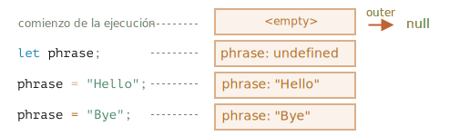
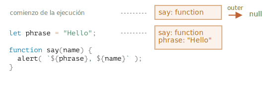
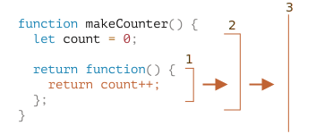
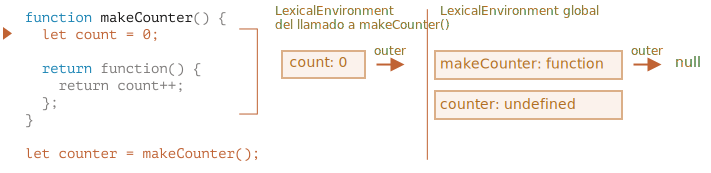
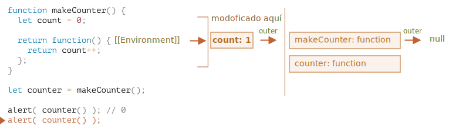

# Closure

JavaScript es un lenguaje orientado a funciones principalmente. Esto nos da bastante libertad. Una función puede ser creada en un momento concreto, después copiada a una variable o pasada como argumento de otra función y llamarla desde un lugar diferente más tarde.

Como ya sabemos, una función puede acceder a variables que están fuera de ella; Esta característica es bastante habitual.

¿Pero qué pasa cuando una variable externa cambia? ¿La función usará el valor más reciente o el valor que existía cuando la función fue creada?

Además de esto, ¿qué pasa cuando una función viaja a otro punto en el código y es llamada desde ahí? ¿tiene acceso a las variables externas del nuevo sitio en donde se encuentra?

El comportamiento en varios lenguajes, es bastante diferente en este aspecto y en este capítulo vamos a ver el comportamiento de JavaScript.

## Un par de preguntas

Tengamos en cuenta dos situaciones para empezar con ello y después estudiaremos los mecanismos internos pieza por pieza, para esto, podrás responder las siguientes preguntas y las posteriores que puedan ser más complejas.

1. La función `sayHi` usa una variable externa `name`. En el momento en que la función se ejecute, ¿qué variable usará?

    ```js
    let name = "John";

    function sayHi() {
      alert("Hi, " + name);
    }

    name = "Pete";

    *!*
    sayHi(); // qué resultado mostrará: ¿"John" o "Pete"?
    */!*
    ```

    Este tipo de situaciones son comunes tanto para el desarrollo en navegadores, como para el desarrollo  en servidores. La función puede estar configurada para ejecutarse después de ser creada, por ejemplo, después de que un usuario realice una acción o haya una petición.

    Entonces, la pregunta es: ¿cogerá los últimos cambios?


2. La función `makeWorker` creará otra función y la devolverá. Esta nueva función puede ser llamada desde cualquier otro sitio. ¿Tendrá acceso a las variables externas desde donde fue creada, o desde donde se hace la llamada, o ambos?

    ```js
    function makeWorker() {
      let name = "Pete";

      return function() {
        alert(name);
      };
    }

    let name = "John";

    // crea la función
    let work = makeWorker();

    // llama a la función
    *!*
    work(); // ¿qué resultado mostrará? ¿"Pete" (name dónde fue creada) o "John" (name dónde fue llamada)?
    */!*
    ```


## Lexical Environment

Para entender qué está pasando, veamos primero qué es una "variable".

En JavaScript, las funciones en ejecución, los bloques de código y el script en su conjunto tiene un objeto asociado conocido como *Lexical Environment*.

El objeto Lexical Environment consta de dos partes:

1. *Environment Record* -- Un objeto que tiene todas las variables locales como sus propiedades (y otro tipo de información como el valor de `this`).
2. Una referencia al *outer lexical environment*, que normalmente esta relacionado con el código léxicamente a la derecha de el mismo (externo a las llaves actuales).

**Así que, una "variable" es sólo una propiedad de un objeto especial interno del Environment Record. "Para obtener o cambiar una variable", es decir, "para cambiar una propiedad de ese objeto".**

Por ejemplo, en este código sencillo, solo hay un Lexical Environment:


Esto es comúnmente llamado Lexical Environment global, asociado a todo el script. En los navegadores, todas las etiquetas `<script>` comparten el mismo entorno global.

En la imagen anterior, el rectángulo significa Environment Record (que almacena la variable) y la flecha significa la referencia externa. El Lexical Environment global no tiene referencia externa, por lo que apunta a `null`.

Veamos una imagen más completa de como las variables `let` funcionan:



Los rectángulos del lado derecho demuestran cómo el Lexical Environment global cambia durante la ejecución:

1. Cuando el script se ejecuta, el Lexical Environment está vacío.
2. La definición `let phrase` aparece. Ha sido asignada sin valor, por lo que su valor es `undefined`.
3. Se asigna un valor a `phrase`.
4. Se asigna un nuevo valor a `phrase`.

Todo parece sencillo por ahora, ¿verdad?

En resumen:

- Una variable es una propiedad de un objeto especial interno, asociada al bloque/función/script actual de la ejecución.
- Trabajar con variables es trabajar con las propiedades de ese objeto.

### Function Declaration

Hasta ahora, solo nos hemos fijado en las variables. Veamos las Function Declaration.

**A diferencia de las variables `let`, estas han sido inicializadas por completo no cuando el código las llama, sino antes, cuando el Lexical Environment es creado.**

Para las funciones más externas, esto sucede en el momento de ejecución inicial del script.

Es por esto por lo que podemos llamar a una función antes de que haya sido definida.

El siguiente código ilustra que el Lexical Environment no está vacío en su inicio. Tiene `say`, porque es una Function Declaration. Después tendrá `phrase`, declarado con `let`.



### Lexical Environment interno y externo

Sigamos con el tema y exploremos que sucede cuando una función accede a una variable externa.

Durante la llamada, `say()` usa la variable externa `phrase`, veamos en detalle qué está pasando.

Para empezar, cuando se ejecuta una función, esta función crea automáticamente un nuevo Lexical Environment. Esta es una norma general para todas las funciones. Este Lexical Environment es usado para almacenar las variables locales y los parámetros de la llamada.

Por ejemplo, en `say("John")`, lo podríamos ver (la ejecución está la línea marcada con una flecha):

<!--
    ```js
    let phrase = "Hello";

    function say(name) {
     alert( `${phrase}, ${name}` );
    }

    say("John"); // Hello, John
    ```-->


Por tanto, durante la llamada a la función, tenemos dos Lexical Environments: el interno (para la llamada de la función) y el externo (el global).

- El Lexical Environment interno corresponde con la ejecución actual de `say`.

    Tiene solo una variable: `name`, como argumento de la función. Llamamos `say("John")`, por lo que el valor de la variable `name` es `"John"`.
- El Lexical Environment externo es el Lexical Environment global.

    Tiene `phrase` y la función.

El Lexical Environment interno tiene la referencia del externo también.

**Cuando el código quiere acceder a la variable -- el Lexical Environment interno buscará primero en el mismo, después en el externo, después en los más externos y así hasta que acaba la cadena.**

Veamos cómo es el proceso de búsqueda en nuestro ejemplo:

- Cuando `alert` dentro de `say` quiere acceder a `name`, lo busca inmediatamente en el Lexical Environment de la función.
- Cuando este quiere acceder a `phrase`, no encontrará `phrase` localmente, así que buscará la referencia en el Lexical Environment que lo envuelve y lo encontrará.


Ahora podemos dar una respuesta a la primera pregunta del principio del capítulo.

**Una función obtiene las variables externas como son en ese momento; usa los valores más recientes.**

Esto sucede debido al mecanismo que hemos descrito. Los valores antiguos de las variables no se guardarán en ningún lugar. Cuando una función los quiera obtener, cogerá los valores actuales desde el mismo o desde un Lexical Environment externo.

Por tanto, la respuesta a la primera pregunta es `Pete`:

```js
let name = "John";

function sayHi() {
  alert("Hi, " + name);
}

name = "Pete"; // (*)

*!*
sayHi(); // Pete
*/!*
```


El flujo de ejecución del código será el siguiente:

1. El Lexical Environment global tiene `name: "John"`.
2. En la línea `(*)` la variable global ha cambiado, ahora tendrá `name: "Pete"`.
3. Cuando la función `sayHi()`, es ejecutada y obtendrá `name` desde fuera. Aquí es desde dónde el Lexical Environment global tiene definido `"Pete"`.


```smart header="One call -- one Lexical Environment"
Porfavor, ten en cuenta que el nuevo Lexical Environment de la función es creado al momento en que la función se ejecuta.

Si la función es llamada varias veces, entonces en cada ejecución tendrá su propio Lexical Environment, con variables locales y parámetros específicos para cada ejecución.
```

```smart header="Lexical Environment is a specification object"
El "Lexical Environment" es un objeto de la especificación. No podemos obtener este objeto en nuestro código y manipularlo directamente. El motor de JavaScript además, puede optimizarlo, desechando variables que no están en uso para liberar memoria e internamente poder hacer trucos de rendimiento, pero el comportamiento visible debería de ser el descrito.
```


## Funciones anidadas

Llamamos a una función "anidada" cuando es creada dentro de otra función.

Esto es muy sencillo hacerlo en JavaScript.

Podemos usarlo para organizar nuestro código de la siguiente manera:

```js
function sayHiBye(firstName, lastName) {

  // función anidada para usar más adelante
  function getFullName() {
    return firstName + " " + lastName;
  }

  alert( "Hello, " + getFullName() );
  alert( "Bye, " + getFullName() );

}
```

Aquí, la función *anidada* `getFullName()` está creada por comodidad. Puede acceder a las variables externas y además puede devolver el nombre completo. Las funciones anidadas son muy comunes en JavaScript.

Lo que es más interesate, una función anidada puede ser devuelta: ya sea como una propiedad de un nuevo objeto (si la función externa crea un objeto con métodos) o como resultado de ella misma. Esta puede por tanto, ser usada en otro lugar. No importa donde, porque seguirá teniendo acceso a las mismas variables externas.

Por ejemplo, aqui la función anidada es asignada a un nuevo objeto por la [función del constructor](info:constructor-new):

```js run
// la función constructora devolverá un nuevo objeto
function User(name) {

  // el método del objeto es creado como una función anidada
  this.sayHi = function() {
    alert(name);
  };
}

let user = new User("John");
user.sayHi(); // el código del método "sayHi" tiene acceso al "name" externo
```

Y aquí estamos creando y devolviendo una función "counting":

```js run
function makeCounter() {
  let count = 0;

  return function() {
    return count++; // tiene acceso al contador externo
  };
}

let counter = makeCounter();

alert( counter() ); // 0
alert( counter() ); // 1
alert( counter() ); // 2
```

Fijémonos en el ejemplo `makeCounter`. Este crea la función "contador" que devuelve el siguiente número en cada ejecución. A pesar de ser sencillo, hay ligeras variaciones en el código que usa, por ejemplo, como el [generador de números pseudoaleatorios](https://es.wikipedia.org/wiki/Generador_de_n%C3%BAmeros_pseudoaleatorios) y más.

¿Cómo funciona el contador internamente?

Cuando la función interna es ejecutada, la variable en `count++` será buscada de dentro a fuera. Para el siguiente ejemplo, el orden será:



1. El nivel local de la función anidada...
2. Las variables de la función externa...
3. Y así hasta que alcance las variables globales.

En este ejemplo `count` se encontra en el paso `2`. Cuando la variable externa es modificada, será cambiada donde haya sido encontrada. Por lo que `count++` busca la variable externa y la incrementa en el Lexical Environment en el que se encuentre. Como si tuviésemos `let count = 1`.

Aquí tenemos dos preguntas para este caso:

1. ¿Podemos de alguna forma reiniciar el contador `count`desde el código que no se encuentre en `makeCounter`? P.e. Después de las llamadas `alert` en el ejemplo anterior.
2. Si llamamos a `makeCounter()` varias veces -- este devolverá varias funciones `counter`. ¿Son independientes o comparten el mismo `count`?

Intenta responder a las preguntas antes de continuar leyendo.

...

¿Terminaste?

Vale, vamos a ver las respuestas.

1. No hay manera: `count` es una variable de la función local, no tenemos acceso a ella desde fuera.
2. Para cada llamada a `makeCounter()` se crea un nuevo Lexical Environment de la función con su propio `count`. Lo que hace que las funciones  `counter` sean independientes.

Veamos un caso:

```js run
function makeCounter() {
  let count = 0;
  return function() {
    return count++;
  };
}

let counter1 = makeCounter();
let counter2 = makeCounter();

alert( counter1() ); // 0
alert( counter1() ); // 1

alert( counter2() ); // 0 (independiente)
```


Por suerte, la situación de las variables externas es bastante clara por ahora. Pero en situaciones más complejas es necesario entender profundamente el funcionamiento interno. Así que profundicemos más.

## Environments en detalle

Ahora que entiendes cómo funcionan las closures de forma general, es un muy buen punto de partida.

Veamos que pasa en el ejemplo `makeCounter` paso por paso, siguiéndolo y asegurando que sabes cosas con más detalle.

Porfavor, fíjate que la propiedad `[[Environment]]` está mencionada aquí. Anteriormente no la hemos mencionado por simplicidad.

1. Cuando el script acaba de ser ejecutado, solo existe un Lexical Environment global:

    

    Al inicio, solo hay una función `makeCounter`, porque esta es una Declaración de Función. Esta no será ejecutada por ahora.

    **Todas las funciones "en su nacimiento" tendrán una propiedad `[[Environment]]` con una referencia al Lexical Environment cuando son creadas.** No hemos hablado sobre esto aún, pero es así como la función sabe que ha sido creada.

    En este punto, `makeCounter` es creado en el Lexical Environment global, así que `[[Environment]]` guarda la referencia.

    En otras palabras, una función se "imprime" con la referencia del Lexical Environment en donde ha nacido. Y `[[Environment]]` es la propiedad oculta de la función que tiene esa referencia.

2. El código continúa ejecutándose, la nueva variable global `counter` está declarada y su valor es una llamada a `makeCounter()`. Podemos ver el momento en el que la ejecución está en la primera dentro de `makeCounter()`.

    

    En el momento de hacer la llamada a `makeCounter()`, el Lexical Environment se crea para guardar las variables y los argumentos.

    Como cualquier Lexical Environment, guardará dos cosas:
    1. Un Environment Record con variables locales. En nuestro caso `count` es la única variable local (que aparece cuando la línea `let count` es ejecutada).
    2. La referencia léxica externa, que está definida en el `[[Environment]]` de la función. Aquí el `[[Environment]]` de `makeCounter` hace referencia al Lexical Environment global.

    Así que, ahora tenemos dos Lexical Environments: el primero es global y el segundo es de la llamada actual `makeCounter`, con la referencia externa global.

3. Durante la ejecución de `makeCounter()`, una pequeña función anidada es creada.

    No importa si la función se ha creado usando Function Declaration o Function Expression. Todas las funciones tienen la propiedad `[[Environment]]` que hace referencia al Lexical Environment en el cuál se han creado. Así que nuestra nueva pequeña función anidada lo tendrá también.

    Para nuestra nueva función anidada el valor de `[[Environment]]` es el actual Lexical Environment de `makeCounter()` (en donde ha nacido):

    

    Porfavor, fijate que en este paso la función interna fue creada, pero no ha sido llamada. El código dentro de `function() { return count++; }` no está ejecutándose; volveremos a ello dentro de poco.

4. La ejecución continúa, la llamada a `makeCounter()` termina y el resultado (la pequeña función anidada) es asignada a la variable global `counter`:

    

    La función solo tiene una línea: `return count++`, que será ejecutado cuando estemos dentro.

5. Cuando `counter()` es llamado, se crea un Lexical Environment "vacío". Este no tiene variables locales propias. Pero el `[[Environment]]` de `counter` es usado como referencia externa para él, así que tiene acceso a las primeras variables en donde `makeCounter()` ha sido creado:

    

    Ahora si accede a la variable, buscará en su propio Lexical Environment (vacío), después en el Lexical Environment creado en la llamada a `makeCounter()` y después en el global.

    Cuando este busque `count`, mirará en todas las variables de `makeCounter`, en el Lexical Environment exterior más cercano.

    Ten en cuenta cómo está funcionando la gestión de la memoria. A pesar de que la llamada a  `makeCounter()`  ha terminado hace algo de tiempo, su Lexical Environment lo ha guardado en memoria porque hay una función anidada con un `[[Environment]]` que lo referencia.

    Normalmente, el objeto del Lexical Environment persiste mientras haya una función que pueda usarlo. Y solo cuando no haya ninguna más, se limpiará.

6. La llamada a `counter()` no solo devuelve el valor de `count`, sino que también lo incrementa. Fíjate que la modificación se realiza en el mismo sitio. El valor de `count` es modificado exactamente en el entorno donde fué encontrado.

    

    Así que, si volvemos al paso anterior con un solo cambio -- el nuevo valor de `count`. Todas las siguientes llamadas harán lo mismo.

7. Las siguientes llamadas a `counter()` harán lo mismo.

La respuesta a la segunda pregunta del principio del capítulo debería ser obvia.

La función `work()` en el código de abajo usa el `name` desde el lugar del que es originario a través de la referencia del Lexical Environment externa:


Así que el resultado es `"Pete"` en este caso.

Pero si no hubiese un `let name` en `makeWorker()`, la búsqueda iría hacia afuera y cogería la variable global como podemos ver en la cadena anterior. Es ese caso el resultado sería `"John"`.

```smart header="Closures"
Existe un término común en programación llamado "closure", que los desarrolladores normalmente deberían conocer.

Una [closure](https://es.wikipedia.org/wiki/Clausura_(inform%C3%A1tica)) es una función que recuerda las variables externas y puede acceder a ellas. En algunos lenguajes, esto no es posible, o la función debe ser escrita de una forma especial para que suceda. Pero como hemos explicado, en JavaScript, todas las funciones son naturalmente closures (solo hay una excepción, explicada en <info:new-function>).

Esto es: recuerdan automáticamente dónde fueron creadas usando la propiedad oculta `[[Environment]]` y todos ellos tienen acceso a las variables externas.

En una entrevista de trabajo, un desarrollador frontend hará una pregunta parecida a "¿qué es una closure?", una respuesta válida sería la definición de la closure y la explicación de que todas las funciones en JavaScript son closures, y además unas palabras más sobre detalles técnicos: la propiedad `[[Environment]]` y cómo funcionan los Lexical Environments.
```

## Bloques de código y bucles, IIFE

En los ejemplos anteriores nos hemos centrado en las funciones. Pero el Lexical Environment existe para cualquier bloque de código `{...}`.

El Lexical Environment es creado cuando un bloque de código se ejecuta y contiene variables dentro de su bloque. Aquí tenemos un par de ejemplos.

### If

En el siguiente ejemplo, la variable `user` solo existe en el bloque `if`:

<!--
    ```js run
    let phrase = "Hello";

    if (true) {
        let user = "John";

        alert(`${phrase}, ${user}`); // Hello, John
    }

    alert(user); // Error, can't see such variable!
    ```-->


Cuando la ejecución se encuentra dentro del bloque `if`, el nuevo "si solo" Lexical Environment se crea para él.

Este tiene una referencia del externo, por lo que encontrará `phrase`. Pero todas las variables y Function Expressions declaradas dentro del `if`, residen en ese Lexical Environment y no pueden ser vistas desde fuera.

Por ejemplo, después de que termine el `if`, el `alert` de después no verá el `user`, por lo que dará error.

### For, while

En cuanto a los bucles, cada iteración tiene un Lexical Environment separado. Si la variable está declarada en el `for`, entonces este también lo estará en el Lexical Environment:

```js run
for (let i = 0; i < 10; i++) {
  // cada iteración tiene su propio Lexical Environment
  // {i: value}
}

alert(i); // Error, no existe esa variable
```

Ten en cuenta: `let i` visualmente se encuentra fuera del `{...}`. El constructor del `for` es algo especial: cada iteración del bucle tiene su propio Lexical Environment con el valor `i` actual.

De nuevo, de forma similar a `if`, después del bucle `i` no es visible.

### Bloque de código

También podemos usar un bloque de código "simple" `{...}` para aislar las variables en un "ámbito local".

Por ejemplo, en un navegador web todos los scripts tienen el mismo área global compartida. Así que si creamos una variable global en un script, estará disponible en todas las demás. Pero esto es una fuente de problemas si dos scripts usan el mismo nombre de variable y una sobreescribe a la otra.

Esto puede pasar si el nombre de la variable es una palabra común, y los autores del script no se conocen entre sí.

Si quisieramos evitar esto, tenemos que usar un bloque de código para aislar el script completo o parte de él.

```js run
{
  // hace el mismo trabajo con variables locales que no deberían verse por fuera

  let message = "Hello";

  alert(message); // Hello
}

alert(message); // Error: message is not defined
```

El código de fuera del bloque (o dentro de otro script) no ve las variables de dentro del bloque, porque el bloque tiene su propio Lexical Environment.

### IIFE

En el pasado, no había Lexical Environment a nivel de bloque en JavaScript.

Por lo que los programadores tuvieron que inventar algo. A lo que llamaron "inmediately-invoked function expressions" (abreviado como IIFE).

Esto es algo que no se usa hoy día, pero puedes encontrarlo en antiguos scripts, por lo que es mejor entenderlo.

Un IIFE tiene esta forma:

```js run
(function() {

  let message = "Hello";

  alert(message); // Hello

})();
```

Esta Function Expression está creada y llamada inmediatamente. Así que el código lo ejecuta inmediatamente y tiene sus propias variables privadas.

La Function Expression está envuelta entre paréntesis `(function {...})`, porque cuando JavaScript encuenta `"function"` en el flujo de ejecución principal, lo entiende como el comienzo de una Function Declaration. Pero una Function Declaration debe tener un nombre, por lo que este tipo de código dará un error:

```js run
// intenta declarar una función y llamarla inmediatamente
function() { // <-- Error: Unexpected token (

  let message = "Hello";

  alert(message); // Hello

}();
```

Incluso si decimos: "vale, pongamosle un nombre", no funcionará, JavaScript no permite que una Function Declaration sea llamada inmediatamente:

```js run
// error de sintaxis por el paréntesis de más abajo
function go() {

}(); // <-- no se puede llamar a una Function Declaration inmediatamente
```

Por lo que, los paréntesis que envuelven la función es un truco de JavaScript para que la función creada en otro contexto distinto al de la expresión, por lo tanto será una Function Expression: que no necesita un nombre y puede ser llamada inmediatamente.

Existen otras maneras además de los paréntesis de decirle a JavaScript lo que entendemos como una Function Expression:

```js run
// Formas de crear un IIFE

(function() {
  alert("Parentheses around the function");
}*!*)*/!*();

(function() {
  alert("Parentheses around the whole thing");
}()*!*)*/!*;

*!*!*/!*function() {
  alert("Bitwise NOT operator starts the expression");
}();

*!*+*/!*function() {
  alert("Unary plus starts the expression");
}();
```

En todos los casos anteriores declaramos una Function Expression y la ejecutamos inmediatamente después.

## Garbage collection

Normalmente, el Lexical Environment se limpia y se borra después de la ejecución de la función. Por ejemplo:

```js
function f() {
  let value1 = 123;
  let value2 = 456;
}

f();
```

Las dos variables son técnicamente propiedades del Lexical Environment. Pero después de que `f()` finalice, el Lexical Environment se volverá irrecuperable, por lo que se borrará de la memoria.

...Pero si hay una función anidada que aún puede ser alcanzable después de que termine la ejecución de `f`, entonces la referencia a su `[[Environment]]` se mantendrá activa en el Lexical Environment externo:

```js
function f() {
  let value = 123;

  function g() { alert(value); }

*!*
  return g;
*/!*
}

let g = f(); // g es alcanzable, y mantiene el lexical environment externo en memoria
```

Fíjate que si `f()` es llamado varias veces, dando como resultado varias funciones que se guardarán, después el correspondiente objeto Lexical Environment tambien lo mantendrá en memoria. Los 3 en el siguiente código:

```js
function f() {
  let value = Math.random();

  return function() { alert(value); };
}

// 3 funciones en el conjunto (array), cada una de ellas enlaza al Lexical Environment
// desde la ejecución correspondiente de f()
//         LE   LE   LE
let arr = [f(), f(), f()];
```

Un objeto Lexical Environment muere cuando se vuelve inalcanzable (como cualquier otro objeto). En otras palabras, existe solo mientras haya al menos una función anidada que la referencie.

En el siguiente código, después de que `g` se vuelva inalcanzable, junto con el Lexical Environment (y por tanto su `value`) son limpiados de la memoria:

```js
function f() {
  let value = 123;

  function g() { alert(value); }

  return g;
}

let g = f(); // while g is alive
// there corresponding Lexical Environment lives

g = null; // ...and now the memory is cleaned up
```

### Optimizaciones en la vida real

Como hemos visto, en teoría mientras una función siga viva, todas las variables externas pueden ser usadas.

Pero en la práctica, el motor de JavaScript intenta optimizar esto. Analizará el uso de la variable y si ve que una variable externa no es usada -- será borrada.

**Un efecto secundario importante en V8 (Chrome, Opera) es que este tipo de variable no estará disponible en la depuración.**

Intenta ejecutar el siguiente código en Chrome con las Herramientas de Desarrollo abiertas.

Cuando se pause, escribe en la consola `alert(value)`.

```js run
function f() {
  let value = Math.random();

  function g() {
    debugger; // en la consola: escribe alert( value ); No such variable!
  }

  return g;
}

let g = f();
g();
```
Como puedes ver -- ¡no existe tal variable! En teoría, debería ser accesible, pero el motor lo optimiza.

Esto puede llevar a situaciones graciosas (sin ser tan largas) depurando problemas. Uno de ellos -- podemos ver la variable externa con el mismo nombre en vez de la que esperaríamos:

```js run global
let value = "Surprise!";

function f() {
  let value = "the closest value";

  function g() {
    debugger; // en consola: type alert( value ); Surprise!
  }

  return g;
}

let g = f();
g();
```

```warn header="See ya!"
Esta característica de V8 es bueno conocerlo. Si estás depurando con Chrome/Opera, tarde o temprano te lo encontrarás.

Esto no es un fallo en el depurador, pero si es una característica especial de V8. Puede que esto cambie en algún momento.
Deberás revisarlo ejecutando los ejemplos que hemos visto en esta página.
```
