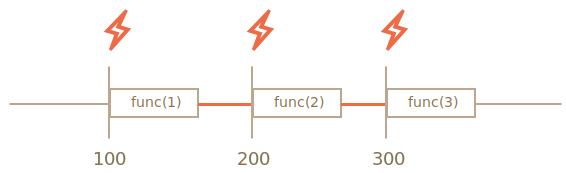

# Planificación: setTimeout y setInterval

Podemos decidir ejecutar una función no ahora, sino en un momento posterior. Eso se llama "planificar una llamada".

Hay dos métodos para ello:

- `setTimeout` nos permite ejecutar una función una vez después del intervalo de tiempo.
- `setInterval` nos permite ejecutar una función repetidamente, comenzando después del intervalo de tiempo, luego repitiéndose continuamente en ese intervalo.

Estos métodos no son parte de la especificación de JavaScript. Pero la mayoría de los entornos tienen el planificador interno y proporcionan estos métodos. En particular, son compatibles con todos los navegadores y Node.js.

## setTimeout

La sintaxis:

```js
let timerId = setTimeout(func|código, [retraso], [arg1], [arg2], ...)
```

Parámetros:

`func|código`
: Función o una cadena de código para ejecutar.
Por lo general, es una función. Por razones históricas, se puede pasar una cadena de código, pero eso no es recomendable.

`retraso`
: El retraso o *delay* antes de la ejecución, en milisegundos (1000 ms = 1 segundo), por defecto 0.

`arg1`, `arg2`...
: Argumentos para la función (no compatible con IE9-)

Por ejemplo, este código llama a `sayHi()` después de un segundo:

```js run
function sayHi() {
  alert('Hola');
}

*!*
setTimeout(sayHi, 1000);
*/!*
```

Con argumentos:

```js run
function sayHi(phrase, who) {
  alert( phrase + ', ' + who );
}

*!*
setTimeout(sayHi, 1000, "Hola", "John"); // Hello, John
*/!*
```

Si el primer argumento es un string, entonces JavaScript crea una función a partir de ella.

Entonces, esto también funcionará:

```js run no-beautify
setTimeout("alert('Hola')", 1000);
```

Pero no se recomienda usar strings, use funciones de flecha en lugar de ellas, como esta:

```js run no-beautify
setTimeout(() => alert('Hola'), 1000);
```

````smart header="Pasa una función, pero no la ejecuta"
Los desarrolladores novatos a veces cometen un error al agregar paréntesis `()` después de la función:

```js
// mal!
setTimeout(sayHi(), 1000);
```
Eso no funciona, porque `setTimeout` espera una referencia a una función. Y aquí `sayHi()` ejecuta la función, y el *resultado de su ejecución* se pasa a `setTimeout`. En nuestro caso, el resultado de `sayHi()` es `undefined` (la función no devuelve nada), por lo que no hay nada planificado.
````

### Cancelando con clearTimeout

Una llamada a `setTimeout` devuelve un "identificador de temporizador" `timerId` que podemos usar para cancelar la ejecución.

La sintaxis para cancelar:

```js
let timerId = setTimeout(...);
clearTimeout(timerId);
```

En el siguiente código, planificamos la función y luego la cancelamos (cambiamos de opinión). Como resultado, no pasa nada:

```js run no-beautify
let timerId = setTimeout(() => alert("no pasa nada"), 1000);
alert(timerId); // identificador del temporizador

clearTimeout(timerId);
alert(timerId); // mismo identificador (No se vuelve nulo después de cancelar)
```

Como podemos ver en la salida `alert`, en un navegador el identificador del temporizador es un número. En otros entornos, esto puede ser otra cosa. Por ejemplo, Node.js devuelve un objeto de temporizador con métodos adicionales.

Nuevamente, no hay una especificación universal para estos métodos.

Para los navegadores, los temporizadores se describen en el [timers section](https://www.w3.org/TR/html5/webappapis.html#timers) de el estándar HTML5.

## setInterval

El método `setInterval` tiene la misma sintaxis que `setTimeout`:

```js
let timerId = setInterval(func|código, [retraso], [arg1], [arg2], ...)
```
Todos los argumentos tienen el mismo significado. Pero a diferencia de `setTimeout`, ejecuta la función no solo una vez, sino regularmente después del intervalo de tiempo dado.

Para detener las llamadas, debemos llamar a 'clearInterval (timerId)'.

El siguiente ejemplo mostrará el mensaje cada 2 segundos. Después de 5 segundos, la salida se detiene:

```js run
// repetir con el intervalo de 2 segundos
let timerId = setInterval(() => alert('tick'), 2000);

// después de 5 segundos parar
setTimeout(() => { clearInterval(timerId); alert('stop'); }, 5000);
```

```smart header="El tiempo pasa mientras se muestra 'alerta'"
En la mayoría de los navegadores, incluidos Chrome y Firefox, el temporizador interno continúa "marcando" mientras muestra "alert / confirm / prompt".

Entonces, si ejecuta el código anterior y no descarta la ventana de 'alerta' por un tiempo, en la próxima 'alerta' se mostrará de inmediato. El intervalo real entre alertas será más corto que 2 segundos.
```

## setTimeout anidado

Hay dos formas de ejecutar algo regularmente.

Uno es `setInterval`. El otro es un `setTimeout` anidado, como este:

```js
/** en vez de:
let timerId = setInterval(() => alert('tick'), 2000);
*/

let timerId = setTimeout(function tick() {
  alert('tick');
*!*
  timerId = setTimeout(tick, 2000); // (*)
*/!*
}, 2000);
```

El `setTimeout` anterior planifica la siguiente llamada justo al final de la actual `(*)`.

El `setTimeout` anidado es un método más flexible que `setInterval`. De esta manera, la próxima llamada se puede planificar de manera diferente, dependiendo de los resultados de la actual.

Por ejemplo, necesitamos escribir un servicio que envíe una solicitud al servidor cada 5 segundos solicitando datos, pero, en caso de que el servidor esté sobrecargado, debería aumentar el intervalo a 10, 20, 40 segundos ...

Aquí está el pseudocódigo:
```js
let delay = 5000;

let timerId = setTimeout(function request() {
  ...enviar solicitud...

  if (solicitud fallida debido a sobrecarga del servidor) {
    //aumentar el intervalo en la próxima ejecución
    delay *= 2;
  }

  timerId = setTimeout(request, delay);

}, delay);
```

Y si las funciones que estamos planificando requieren mucha CPU, entonces podemos medir el tiempo que tarda la ejecución y planificar la próxima llamada, tarde o temprano.

**`setTimeout` anidado permite establecer el retraso entre las ejecuciones con mayor precisión que `setInterval`.**

Comparemos dos fragmentos de código. El primero usa `setInterval`:

```js
let i = 1;
setInterval(function() {
  func(i++);
}, 100);
```

El segundo usa `setTimeout` anidado:

```js
let i = 1;
setTimeout(function run() {
  func(i++);
  setTimeout(run, 100);
}, 100);
```

Para  `setInterval` el planificador interno se ejecutará `func(i++)` cada 100ms:



¿Te diste cuenta?

**¡El retraso real entre las llamadas de `func` para `setInterval` es menor que en el código!**

Eso es normal, porque el tiempo que tarda la ejecución de `func` "consume" una parte del intervalo.

Es posible que la ejecución de `func` sea más larga de lo esperado y demore más de 100 ms.

En este caso, el motor espera a que se complete `func`, luego verifica el planificador y, si se acabó el tiempo, lo ejecuta de nuevo *inmediatamente*.

En el caso límite, si la función siempre se ejecuta más que el `retraso` ms, entonces las llamadas se realizarán sin pausa alguna.

Y aquí está la imagen para el `setTimeout` anidado:


**El `setTimeout` anidado garantiza el retraso fijo (aquí 100ms).**

Esto se debe a que se planea una nueva llamada al final de la anterior.

````smart header="Recolección de basura y setInterval/setTimeout callback"
Cuando se pasa una función en `setInterval / setTimeout`, se crea una referencia interna y se guarda en el planificador. Evita que la función se recolecte, incluso si no hay otras referencias a ella..

```js
// la función permanece en la memoria hasta que el planificador la llame
setTimeout(function() {...}, 100);
```

Para `setInterval`, la función permanece en la memoria hasta que se invoca `clearInterval`.

Hay un efecto secundario. Una función hace referencia al entorno léxico externo, por lo tanto, mientras vive, las variables externas también viven. Pueden tomar mucha más memoria que la función misma. Entonces, cuando ya no necesitamos la función planificada, es mejor cancelarla, incluso si es muy pequeña.

## Retraso cero en setTimeout

Hay un caso de uso especial: `setTimeout (func, 0)`, o simplemente `setTimeout (func)`.

Esto planifica la ejecución de `func` lo antes posible. Pero el planificador lo invocará solo después de que se complete el script que se está ejecutando actualmente.

Por lo tanto, la función está planificada para ejecutarse "justo después" del script actual.

Por ejemplo, esto genera "Hola", e inmediatamente después "Mundo":

```js run
setTimeout(() => alert("Mundo"));

alert("Hola");
```

La primera línea "pone la llamada en el calendario después de 0 ms". Pero el planificador solo "verificará el calendario" una vez que se haya completado el script actual, por lo que "Hola" es primero y "Mundo"` -- después.

También hay casos de uso avanzados relacionados con el navegador y el tiempo de espera cero (zero-delay), que discutiremos en el capítulo <info:event-loop>.

````smart header="De hecho, el retraso cero no es cero (en un navegador)"
En el navegador, hay una limitación de la frecuencia con la que se pueden ejecutar los temporizadores anidados. EL [HTML5 standard](https://html.spec.whatwg.org/multipage/timers-and-user-prompts.html#timers) dice: "después de cinco temporizadores anidados, el intervalo debe ser de al menos 4 milisegundos".

Demostremos lo que significa con el siguiente ejemplo. La llamada `setTimeout` se planifica a sí misma con cero retraso. Cada llamada recuerda el tiempo real de la anterior en el array `times`. ¿Cómo son los retrasos reales? Veamos:

```js run
let start = Date.now();
let times = [];

setTimeout(function run() {
  times.push(Date.now() - start); // recuerda el retraso de la llamada anterior

  if (start + 100 < Date.now()) alert(times); // smostrar los retrasos después de 100 ms
  else setTimeout(run); // de lo contrario replanificar
});

// Un ejemplo de la salida:
// 1,1,1,1,9,15,20,24,30,35,40,45,50,55,59,64,70,75,80,85,90,95,100
```

Los primeros temporizadores se ejecutan inmediatamente (tal como está escrito en la especificación), y luego vemos `9, 15, 20, 24 ...`. Entra en juego el retraso obligatorio de más de 4 ms entre invocaciones.

Lo mismo sucede si usamos `setInterval` en lugar de `setTimeout`: `setInterval(f)` ejecuta `f` algunas veces con cero retardo, y luego con 4+ ms de retraso.

Esa limitación proviene de la antigüedad y muchos guiones dependen de ella, por lo que existe por razones históricas.

Para JavaScript del lado del servidor, esa limitación no existe, y existen otras formas de planificar un trabajo asincrónico inmediato, como [setImmediate](https://nodejs.org/api/timers.html) para Node.js. Entonces esta nota es específica del navegador.
````

## Resumen

- Los métodos `setTimeout(func, delay, ... args)` y `setInterval(func, delay, ... args)` nos permiten ejecutar el `func` una vez / regularmente después de un retarso (delay) en milisegundos.
- Para cancelar la ejecución, debemos llamar a `clearTimeout / clearInterval` con el valor devuelto por `setTimeout / setInterval`.
- Las llamadas anidadas `setTimeout` son una alternativa más flexible a `setInterval`, lo que nos permite establecer el tiempo *entre* ejecuciones con mayor precisión.
- La programación de retardo cero con `setTimeout(func, 0) `(lo mismo que `setTimeout(func)`) se usa para programar la llamada "lo antes posible, pero después de que se complete el script actual".
- El navegador limita la demora mínima para cinco o más llamadas anidadas de `setTimeout` o para `setInterval` (después de la quinta llamada) a 4 ms. Eso es por razones históricas.

Tenga en cuenta que todos los métodos de planifiación no *garantizan* el retraso exacto.

Por ejemplo, el temporizador en el navegador puede ralentizarse por muchas razones:
- La CPU está sobrecargada.
- La pestaña del navegador está en modo de fondo.
- El portátil está con batería.

Todo eso puede aumentar la resolución mínima del temporizador (el retraso mínimo) a 300 ms o incluso 1000 ms dependiendo de la configuración de rendimiento del navegador y del nivel del sistema operativo.
