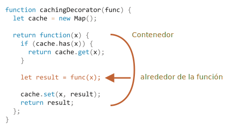

# Decoradores y redirecciones, call/apply

JavaScript ofrece una flexibilidad excepcional cuando se trata de funciones. Se pueden pasar, usar como objetos, y ahora veremos cómo *redireccionar* las llamadas entre ellos y *decorarlos*.

## Caché transparente

Digamos que tenemos una función `slow(x)` que es pesada para la CPU, pero sus resultados son estables. En otras palabras, la misma `x` siempre devuelve el mismo resultado.

Si la función se llama con frecuencia, es posible que queramos almacenar en caché (recordar) los resultados para evitar perder tiempo extra en los nuevos cálculos.

Pero en lugar de agregar esa funcionalidad en `slow()` crearemos una función de contenedor, que agrega almacenamiento en caché. Como veremos, hacer esto trae beneficios.

Aquí está el código, y siguiendo las explicaciones:

```js run
function slow(x) {
  // puede haber un trabajo pesado de CPU aquí
  alert(`Called with ${x}`);
  return x;
}

function cachingDecorator(func) {
  let cache = new Map();

  return function(x) {
    if (cache.has(x)) {  // si hay tal propiedad en caché
      return cache.get(x); // lee el resultado
    }

    let result = func(x);  // de lo contrario llame a func

    cache.set(x, result);  // y cacheamos (recordamos) el resultado
    return result;
  };
}

slow = cachingDecorator(slow);

alert( slow(1) ); // slow(1) es cacheado
alert( "Again: " + slow(1) ); // lo mismo

alert( slow(2) ); // slow(2) es cacheado
alert( "Again: " + slow(2) ); // lo mismo
```

En el código anterior, `cachingDecorator` es un *decorador*: una función especial que toma otra función y altera su comportamiento.

La idea es que podemos llamar a `cachingDecorator` para cualquier función, y devolver el contenedor de almacenamiento en caché. Eso es genial, porque podemos tener muchas funciones que podrían usar dicha función, y todo lo que tenemos que hacer es aplicarles 'cachingDecorator'.

Al separar el caché del código de la función principal, también permite mantener el código principal más simple.

El resultado de `cachingDecorator(func)` es un `contenedor`: `function(x)` que `envuelve` la llamada de `func(x)` en la lógica de almacenamiento en caché:



Desde un código externo, la función `slow` envuelta sigue haciendo lo mismo. Simplemente se agregó un aspecto de almacenamiento en caché a su comportamiento.

Para resumir, hay varios beneficios de usar un `cachingDecorator` separado en lugar de alterar el código de `slow` en sí mismo:

- El `cachingDecorator` es reutilizable. Podemos aplicarlo a otra función.
- La lógica de almacenamiento en caché es independiente, no aumentó la complejidad de `slow` en sí misma(si hubiera alguna).
- Podemos combinar múltiples decoradores si es necesario.

## Usando "func.call" para el contexto

El decorador de caché mencionado anteriormente no es adecuado para trabajar con métodos de objetos.

Por ejemplo, en el siguiente código, `worker.slow()` deja de funcionar después de la decoración:
```js run
// // haremos el trabajo en caché de .slow 
let worker = {
  someMethod() {
    return 1;
  },

  slow(x) {
    // una aterradora tarea muy pesada para la CPU 
    alert("Called with " + x);
    return x * this.someMethod(); // (*)
  }
};

// algo de código después
function cachingDecorator(func) {
  let cache = new Map();
  return function(x) {
    if (cache.has(x)) {
      return cache.get(x);
    }
*!*
    let result = func(x); // (**)
*/!*
    cache.set(x, result);
    return result;
  };
}

alert( worker.slow(1) ); // el método original trabajando

worker.slow = cachingDecorator(worker.slow); // ahora hazlo en caché

*!*
alert( worker.slow(2) ); // Whoops! Error: Cannot read property 'someMethod' of undefined
*/!*
```

El error ocurre en la línea `(*)` que intenta acceder a `this.someMethod` y falla. ¿Puedes ver por qué?

La razón es que el contenedor llama a la función original como `func(x)` en la línea `(**)`. Y, cuando se llama así, la función obtiene `this = undefined`.

Observaríamos un síntoma similar si intentáramos ejecutar:

```js
let func = worker.slow;
func(2);
```

Entonces, el contenedor pasa la llamada al método original, pero sin el contexto `this`. De ahí el error.

Vamos a solucionar esto: 

Hay un método de función  especial incorporado [func.call(context, ...args)](mdn:js/Function/call) que permite llamar a una función que establece explícitamente `this`.

La sintaxis es:

```js
func.call(context, arg1, arg2, ...)
```

Ejecuta `func` proporcionando el primer argumento como `this`, y el siguiente como los argumentos.

En pocas palabras, estas dos llamadas hacen casi lo mismo:
```js
func(1, 2, 3);
func.call(obj, 1, 2, 3)
```

Ambos llaman `func` con argumentos `1`, `2` y `3`. La única diferencia es que `func.call` también establece `this` en `obj`.

Como ejemplo, en el siguiente código llamamos a `sayHi` en el contexto de diferentes objetos: `sayHi.call(user)` ejecuta `sayHi` estableciendo `this = user`, y la siguiente línea establece `this = admin`:

```js run
function sayHi() {
  alert(this.name);
}

let user = { name: "John" };
let admin = { name: "Admin" };

// use call para pasar diferentes objetos como "this"
sayHi.call( user ); // John
sayHi.call( admin ); // Admin
```

Y aquí usamos `call` para llamar a `say` con el contexto y la frase dados:


```js run
function say(phrase) {
  alert(this.name + ': ' + phrase);
}

let user = { name: "John" };

// user se convierte en this, y "Hello" se convierte en el primer argumento
say.call( user, "Hello" ); // John: Hello
```

En nuestro caso, podemos usar `call` en el contenedor para pasar el contexto a la función original:

```js run
let worker = {
  someMethod() {
    return 1;
  },

  slow(x) {
    alert("Called with " + x);
    return x * this.someMethod(); // (*)
  }
};

function cachingDecorator(func) {
  let cache = new Map();
  return function(x) {
    if (cache.has(x)) {
      return cache.get(x);
    }
*!*
    let result = func.call(this, x); // "this" se pasa correctamente ahora
*/!*
    cache.set(x, result);
    return result;
  };
}

worker.slow = cachingDecorator(worker.slow); // ahora hazlo en caché

alert( worker.slow(2) ); // funciona
alert( worker.slow(2) ); // funciona, no llama al original (en caché)
```

Ahora todo está bien.

Para aclararlo todo, veamos más profundamente cómo se transmite `this`:

1. Después del decorador `worker.slow`, ahora el contenedor es `function(x) { ... }`.
2. Entonces, cuando `worker.slow(2)` se ejecuta, el contenedor toma `2` como un argumento y a `this=worker` (objeto antes del punto).
3. Dentro del contenedor, suponiendo que el resultado aún no se haya almacenado en caché, `func.call(this, x)` pasa el acutal `this` (`=worker`) y el argumento actual (`=2`) al método original.

## Veamos los multi-argumentos

Ahora hagamos que `cachingDecorator` sea aún más universal. Hasta ahora solo funcionaba con funciones de un sólo argumento.

Ahora, ¿cómo almacenar en caché el método multi-argumento `worker.slow`?

```js
let worker = {
  slow(min, max) {
    return min + max; // una aterradora tarea muy pesada para la CPU 
  }
};

// debería recordar llamadas del mismo argumento
worker.slow = cachingDecorator(worker.slow);
```

Anteriormente, para un solo argumento `x` podríamos simplemente usar `cache.set(x, result)` para guardar el resultado y `cache.get(x)` para recuperarlo. Pero ahora necesitamos recordar el resultado para una *combinación de argumentos* `(min, max)`. El `Map` nativo toma solo un valor como clave.

Hay muchas posibles soluciones:

1. Implemente una nueva estructura de datos similar a un mapa (o use un tercero) que sea más versátil y permita múltiples propiedades.
2. Use mapas anidados `cache.set(min)` será un `Map` que almacena el par `(max, result)`. Para que podamos obtener `result` como `cache.get(min).get(max)`.
3. Une dos valores en uno. En nuestro caso particular, podemos usar un string `"min,max"` como la propiedad de `Map`. Por flexibilidad, podemos permitir proporcionar un *función hashing* para el decorador, que sabe hacer un valor de muchos.

Para muchas aplicaciones prácticas, la tercera variante es lo suficientemente buena, por lo que nos mantendremos en esa opción.

También necesitamos pasar no solo `x`, sino todos los argumentos en `func.call`. Recordemos que en una `función()` podemos obtener un pseudo-array (*array-like*) de sus argumentos como `arguments`, por lo que `func.call(this, x)` debería reemplazarse por `func.call(this, ...arguments) `.

Aquí un mejorado y poderosísimo `cachingDecorator`:

```js run
let worker = {
  slow(min, max) {
    alert(`Called with ${min},${max}`);
    return min + max;
  }
};

function cachingDecorator(func, hash) {
  let cache = new Map();
  return function() {
*!*
    let key = hash(arguments); // (*)
*/!*
    if (cache.has(key)) {
      return cache.get(key);
    }

*!*
    let result = func.call(this, ...arguments); // (**)
*/!*

    cache.set(key, result);
    return result;
  };
}

function hash(args) {
  return args[0] + ',' + args[1];
}

worker.slow = cachingDecorator(worker.slow, hash);

alert( worker.slow(3, 5) ); // funciona
alert( "Again " + worker.slow(3, 5) ); // lo mismo (cacheado)
```

Ahora funciona con cualquier número de argumentos (aunque la función hash también necesitaría ser ajustada para permitir cualquier número de argumentos. Una forma interesante de manejar esto se tratará a continuación).

Hay dos cambios:

- En la línea `(*)` llama a `hash` para crear una sola propiedad de `arguments`. Aquí usamos una simple función de "unión" que convierte los argumentos `(3, 5)` en la propiedad `"3,5"`. Los casos más complejos pueden requerir otras funciones hash.
- Entonces `(**)` usa `func.call(this, ...arguments)` para pasar tanto el contexto como todos los argumentos que obtuvo el contenedor (no solo el primero) a la función original.

## func.apply

En vez de `func.call(this, ...arguments)` nosotros podríamos usar `func.apply(this, arguments)`.

La sintaxis del método incorporado [func.apply](mdn:js/Function/apply) es:

```js
func.apply(context, args)
```

Ejecuta la configuración `func` `this = context` y usa un objeto tipo array `args` como lista de argumentos.

La única diferencia de sintaxis entre `call` y `apply` es que `call` espera una lista de argumentos, mientras que `apply` lleva consigo un objeto tipo matriz.

Entonces estas dos llamadas son casi equivalentes:

```js
func.call(context, ...args); // pasar un array como lista con sintaxis extendida
func.apply(context, args);   // es lo mismo que usar apply
```

Solo hay una sutil diferencia:

- La sintáxis extendida `...` permite pasar un *iterable* `args` como una lista para `call`.
- La opción `apply` acepta solo `args` como *array-like*.

Entonces, cuando esperamos un iterable, `call` funciona, y donde esperamos un array, `apply` funciona.

Y para los objetos que son iterables y array-like, como un array real, podemos usar cualquiera de ellos, pero `apply` probablemente será más rápido, porque la mayoría de los motores de JavaScript lo optimizan mejor internamente.

Pasar todos los argumentos junto con el contexto a otra función se llama *redirección de llamadas*.

Esta es la forma más simple:

```js
let wrapper = function() {
  return func.apply(this, arguments);
};
```

Cuando un código externo llama a tal `wrapper`, no se puede distinguir de la llamada de la función original `func` .

## Préstamo de método [#method-borrowing]

Ahora hagamos una pequeña mejora en la función de hash:

```js
function hash(args) {
  return args[0] + ',' + args[1];
}
```

A partir de ahora, funciona solo en dos argumentos. Sería mejor si pudiera adherir (*glue*) cualquier número de `args`.

La solución natural sería usar el método [arr.join](mdn:js/Array/join):

```js
function hash(args) {
  return args.join();
}
```

... Desafortunadamente, eso no funcionará. Debido a que estamos llamando a `hash (arguments)`, y el objeto `arguments` es iterable y *array-like* (similar a un array, pero no es un array real).

Por lo tanto, llamar a `join` en él fallará, como podemos ver a continuación:

```js run
function hash() {
*!*
  alert( arguments.join() ); // Error: arguments.join is not a function
*/!*
}

hash(1, 2);
```

Aún así, hay una manera fácil de usar la unión (*join*) de arrays:

```js run
function hash() {
*!*
  alert( [].join.call(arguments) ); // 1,2
*/!*
}

hash(1, 2);
```

El truco se llama *préstamo de método* (method borrowing).

Tomamos (prestado) el método *join* de un array regular (`[].join`) y usamos `[].join.call` para ejecutarlo en el contexto de `arguments`.

¿Por qué funciona?

Esto se debe a que el algoritmo interno del método nativo `arr.join (glue)` es muy simple.

Tomado de la especificación casi "tal cual":

1. Deje que `glue` sea el primer argumento o, si no hay argumentos, entonces una coma `","`.
2. Deje que `result` sea una cadena vacía.
3. Agregue `this[0]` a `result`.
4. Agregue `glue` y `this[1]`.
5. Agregue `glue` y `this[2]`.
6. ...hazlo hasta que los elementos `this.length` estén adheridos.
7. Devuelva `result`.

Entones, tecnicamente `this` une `this[0]`, `this[1]` ...etc. Está escrito intencionalmente de una manera que permite cualquier tipo de array `this` (no es una coincidencia, muchos métodos siguen esta práctica). Es por eso que también funciona con `this = arguments`

## Decoradores y propiedades de funciones

Por lo general, es seguro reemplazar una función o un método con un decorador, excepto por una pequeña cosa. Si la función original tenía propiedades, como `func.calledCount` o cualquier otra, entonces la función decoradora no las proporcionará. Porque eso es una envoltura. Por lo tanto, se debe tener cuidado al usarlo.


E.j. en el ejemplo anterior, si la función `slow` tenía propiedades, entonces `cachingDecorator(slow)` sería un contendor, pero sin contener dichas propiedades.

Algunos decoradores pueden proporcionar sus propias propiedades. P.ej. un decorador puede contar cuántas veces se invocó una función y cuánto tiempo tardó, y exponer esta información a través de propiedades de envoltura.

Existe una forma de crear decoradores que mantienen el acceso a las propiedades de la función, pero esto requiere el uso de un objeto especial `Proxy` para ajustar una función. Lo discutiremos más adelante en el artículo [Proxy and Reflect](https://javascript.info/proxy#proxy-apply)

## Resumen

*Decorator / Decorador* es un contenedor alrededor de una función que altera su comportamiento. El trabajo principal todavía lo realiza la función.

Los decoradores se pueden ver como "características" o "aspectos" que se pueden agregar a una función. Podemos agregar uno o agregar muchos. ¡Y todo esto sin cambiar su código!

Para implementar `cachingDecorator`, estudiamos los siguientes métodos:

- [func.call(context, arg1, arg2...)](mdn:js/Function/call) -- llama a `func` con el contexto y argumentos dados.
- [func.apply(context, args)](mdn:js/Function/apply) -- llama a `func` pasando `context` como `this` y array-like `args` en una lista de argumentos.

La *redirección de llamadas* genérica generalmente se realiza con `apply`:

```js
let wrapper = function() {
  return original.apply(this, arguments);
};
```

También vimos un ejemplo de *préstamo de método* cuando tomamos un método de un objeto y lo `llamamos` en el contexto de otro objeto. Es bastante común tomar métodos de array y aplicarlos a `argumentos`. La alternativa es utilizar el objeto de parámetros rest que es un array real.

Hay muchos decoradores a tu alrededor. Verifique si es bueno encuentrándolos resolviendo las tareas de este capítulo.
