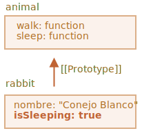

# Herencia prototípica

En programación, a menudo queremos tomar algo y extenderlo.

Por ejemplo, tenemos un objeto `user` con sus propiedades y métodos, y queremos hacer que `admin` y `guest` sean variantes ligeramente modificadas del mismo. Nos gustaría reutilizar lo que tenemos en `user`, no copiar/reimplementar sus métodos, solo construir un nuevo objeto encima de él.

*La herencia de prototipos* es una característica del lenguaje que ayuda en eso.

## [[Prototype]]

En JavaScript, los objetos tienen una propiedad oculta especial `[[Prototype]]` (como se menciona en la especificación), que es `nulo` o hace referencia a otro objeto. Ese objeto se llama "un prototipo":


El prototipo es un poco "mágico". Cuando queremos leer una propiedad de `object`, y falta, JavaScript la toma automáticamente del prototipo. En programación, tal cosa se llama "herencia prototípica". Muchas características geniales del lenguaje y técnicas de programación se basan en él.

La propiedad `[[Prototype]]` es interna y está oculta, pero hay muchas formas de configurarla.

Una de ellas es usar el nombre especial `__proto__`, así:

```js run
let animal = {
  eats: true
};
let rabbit = {
  jumps: true
};

*!*
rabbit.__proto__ = animal;
*/!*
```

```smart header="`__proto__` es un getter/setter histórico para `[[Prototype]]`"
Tenga en cuenta que `__proto__` *no es lo mismo* que `[[Prototype]] `. Es un getter/setter para este.

Existe por razones históricas. En lenguaje moderno, se reemplaza con las funciones `Object.getPrototypeOf/Object.setPrototypeOf` que también obtienen/establecen el prototipo. Estudiaremos las razones de eso y estas funciones más adelante.

Según la especificación, `__proto__` solo debe ser compatible con los navegadores, pero de hecho todos los entornos lo admiten, incluido el lado del servidor. Por ahora, como la notación `__proto__` es un poco más intuitiva, la usaremos en los ejemplos.
```

Si buscamos una propiedad en `rabbit`, y falta, JavaScript automáticamente la toma de `animal`.

Por ejemplo:

```js
let animal = {
  eats: true
};
let rabbit = {
  jumps: true
};

*!*
rabbit.__proto__ = animal; // (*)
*/!*

// // podemos encontrar ambas propiedades en conejo ahora:
*!*
alert( rabbit.eats ); // verdadero (**)
*/!*
alert( rabbit.jumps ); // verdadero
```

Aquí la línea `(*)` establece que `animal` es un prototipo de `rabbit`.

Luego, cuando `alert` intenta leer la propiedad `rabbit.eats` `(**)`, no está en `rabbit`, por lo que JavaScript sigue la referencia `[[Prototype]]` y la encuentra en `animal` (mira de abajo hacia arriba):


Aquí podemos decir que "`animal` es el prototipo de `rabbit`" o "`rabbit` hereda prototípicamente de `animal`".

Entonces, si `animal` tiene muchas propiedades y métodos útiles, entonces estarán automáticamente disponibles en `rabbit`. Dichas propiedades se denominan "heredadas".

Si tenemos un método en `animal`, se puede llamar en `rabbit`:

```js run
let animal = {
  eats: true,
*!*
  walk() {
    alert("Animal da un paseo");
  }
*/!*
};

let rabbit = {
  jumps: true,
  __proto__: animal
};

// walk es tomado del prototipo
*!*
rabbit.walk(); // Animal da un paseo
*/!*
```

El método se toma automáticamente del prototipo, así:


La cadena prototipo puede ser más larga:

```js run
let animal = {
  eats: true,
  walk() {
    alert("Animal da un paseo");
  }
};

let rabbit = {
  jumps: true,
*!*
  __proto__: animal
*/!*
};

let longEar = {
  earLength: 10,
*!*
  __proto__: rabbit
*/!*
};

// walk se toma de la cadena prototipo
longEar.walk(); // Animal da un paseo
alert(longEar.jumps); // verdadero (desde rabbit)
```


Solo hay dos limitaciones:

1. Las referencias no pueden ir en círculos. JavaScript arrojará un error si intentamos asignar `__proto__` en un círculo.
2. El valor de `__proto__` puede ser un objeto o `nulo`. Otros tipos son ignorados.

También puede ser obvio, pero aún así: solo puede haber un `[[Prototype]]`. Un objeto no puede heredar desde dos.

## La escritura no usa prototipo

El prototipo solo se usa para leer propiedades.

Las operaciones de escritura/eliminación funcionan directamente con el objeto.

En el ejemplo a continuación, asignamos su propio método `walk` a `rabbit`:

```js run
let animal = {
  eats: true,
  walk() {
    /* este método no será utilizado por rabbit */  
  }
};

let rabbit = {
  __proto__: animal
};

*!*
rabbit.walk = function() {
  alert("¡Conejo! Rebota-rebota!");
};
*/!*

rabbit.walk(); // ¡Conejo! Rebota-rebota!
```

De ahora en adelante, la llamada `rabbit.walk()` encuentra el método inmediatamente en el objeto y lo ejecuta, sin usar el prototipo:


Las propiedades de acceso son una excepción, ya que la asignación es manejada por una función setter. Por lo tanto, escribir en una propiedad de este tipo es en realidad lo mismo que llamar a una función.

Por esa razón, `admin.fullName` funciona correctamente en el siguiente código:

```js run
let user = {
  name: "John",
  surname: "Smith",

  set fullName(value) {
    [this.name, this.surname] = value.split(" ");
  },

  get fullName() {
    return `${this.name} ${this.surname}`;
  }
};

let admin = {
  __proto__: user,
  isAdmin: true
};

alert(admin.fullName); // John Smith (*)

// disparadores setter!
admin.fullName = "Alice Cooper"; // (**)
```

Aquí en la línea `(*)` la propiedad `admin.fullName` tiene un getter en el prototipo `user`, por lo que es llamado. Y en la línea `(**)` la propiedad tiene un setter en el prototipo, por lo que es llamado.

## El valor de "this"

Puede surgir una pregunta interesante en el ejemplo anterior: ¿cuál es el valor de `this` dentro de `set fullName(value)`? ¿Dónde están escritas las propiedades `this.name` y ` this.surname`: en `user` o `admin`?

La respuesta es simple: "this" no se ve afectado por los prototipos en absoluto.

**No importa dónde se encuentre el método: en un objeto o su prototipo. En una llamada al método, `this` es siempre el objeto antes del punto.**

Entonces, la llamada al setter `admin.fullName=` usa `admin` como` this`, no a `user`.

Eso es realmente algo muy importante, porque podemos tener un gran objeto con muchos métodos y tener objetos que hereden de él. Y cuando los objetos heredados ejecutan los métodos heredados, modificarán solo sus propios estados, no el estado del gran objeto.

Por ejemplo, aquí `animal` representa un "método de almacenamiento", y `rabbit` lo utiliza.

La llamada `rabbit.sleep()` establece `this.isSleeping` en el objeto `rabbit`:

```js run
// animal tiene métodos
let animal = {
  walk() {
    if (!this.isSleeping) {
      alert(`Yo camino`);
    }
  },
  sleep() {
    this.isSleeping = true;
  }
};

let rabbit = {
  name: "Conejo Blanco",
  __proto__: animal
};

// modifica rabbit.isSleeping
rabbit.sleep();

alert(rabbit.isSleeping); // Verdadero
alert(animal.isSleeping); // undefined (no existe tal propiedad en el prototipo)
```

La imagen resultante:



Si tuviéramos otros objetos, como `bird`, `snake`, etc., heredados de `animal`, también tendrían acceso a los métodos de `animal`. Pero `this` en cada llamada al método sería el objeto correspondiente, evaluado en el momento de la llamada (antes del punto), no `animal`. Entonces, cuando escribimos datos en `this`, se almacenan en estos objetos.

Como resultado, los métodos se comparten, pero el estado del objeto no.

## Bucle for..in

El bucle `for..in` también itera sobre las propiedades heredadas.

Por ejemplo:

```js run
let animal = {
  eats: true
};

let rabbit = {
  jumps: true,
  __proto__: animal
};

*!*
// Object.keys solo devuelve claves propias
alert(Object.keys(rabbit)); // jumps
*/!*

*!*
// for..in recorre las claves propias y heredadas
for(let prop in rabbit) alert(prop); // jumps, despues eats
*/!*
```

Si no queremos eso, y quisieramos excluir las propiedades heredadas, hay un método incorporado [obj.hasOwnProperty(key)] (mdn:js/Object/hasOwnProperty): devuelve `true` si `obj` tiene la propiedad interna (no heredada) llamada `key`.

Entonces podemos filtrar las propiedades heredadas (o hacer algo más con ellas):

```js run
let animal = {
  eats: true
};

let rabbit = {
  jumps: true,
  __proto__: animal
};

for(let prop in rabbit) {
  let isOwn = rabbit.hasOwnProperty(prop);

  if (isOwn) {
    alert(`Es nuestro: ${prop}`); // Es nuestro: jumps
  } else {
    alert(`Es heredado: ${prop}`); // Es heredado: eats
  }
}
```

Aquí tenemos la siguiente cadena de herencia: `rabbit` hereda de `animal`, que hereda de `Object.prototype` (porque `animal` es un objetc `{...}` literal, entonces es por defecto), y luego `null` encima de él:


Nota, hay una cosa divertida. ¿De dónde viene el método `rabbit.hasOwnProperty`? No lo definimos. Mirando la cadena podemos ver que el método es proporcionado por `Object.prototype.hasOwnProperty`. En otras palabras, se hereda.

...Pero, ¿por qué `hasOwnProperty` no aparece en el bucle `for..in` como `eats` y `jumps`, si `for..in` enumera las propiedades heredadas?

La respuesta es simple: no es enumerable. Al igual que todas las demás propiedades de `Object.prototype`, tiene la bandera `enumerable: false`. Y `for..in` solo enumera las propiedades enumerables. Es por eso que este y el resto de las propiedades de `Object.prototype` no están en la lista.

```smart header="Casi todos los demás métodos de obtención de valor/clave ignoran las propiedades heredadas"
Casi todos los demás métodos de obtención de valores/claves, como `Object.keys`, `Object.values`, etc., ignoran las propiedades heredadas.

Solo operan en el objeto mismo. Las propiedades del prototipo *no* se tienen en cuenta.
```

## Resumen

- En JavaScript, todos los objetos tienen una propiedad oculta `[[Prototype]]` que es otro objeto o `nulo`.
- Podemos usar `obj.__proto__` para acceder a él (un getter/setter histórico, hay otras formas, que se cubrirán pronto).
- El objeto al que hace referencia `[[Prototype]]` se denomina "prototipo".
- Si queremos leer una propiedad de `obj` o llamar a un método, y no existe, entonces JavaScript intenta encontrarla en el prototipo.
- Las operaciones de escritura/eliminación actúan directamente sobre el objeto, no usan el prototipo (suponiendo que sea una propiedad de datos, no un setter).
- Si llamamos a `obj.method()`, y `method` se toma del prototipo, `this` todavía hace referencia a `obj`. Por lo tanto, los métodos siempre funcionan con el objeto actual, incluso si se heredan.
- El bucle `for..in` itera sobre las propiedades propias y heredadas. Todos los demás métodos de obtención de valor/clave solo operan en el objeto mismo.
