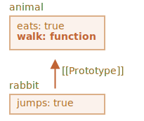

# Herencia prototípica

En programación, a menudo queremos tomar algo y extenderlo.

Por ejemplo, tenemos un objeto `user` con sus propiedades y métodos, y queremos hacer que `admin` y `guest` sean variantes ligeramente modificadas del mismo. Nos gustaría reutilizar lo que tenemos en `user`, no copiar/reimplementar sus métodos, solo construir un nuevo objeto encima de él.

*La herencia de prototipos* es una característica del lenguaje que ayuda en eso.

## [[Prototype]]

En JavaScript, los objetos tienen una propiedad oculta especial `[[Prototype]]` (como se menciona en la especificación), que es `nulo` o hace referencia a otro objeto. Ese objeto se llama "un prototipo":


<<<<<<< HEAD
El prototipo es un poco "mágico". Cuando queremos leer una propiedad de `object`, y falta, JavaScript la toma automáticamente del prototipo. En programación, tal cosa se llama "herencia prototípica". Muchas características geniales del lenguaje y técnicas de programación se basan en él.
=======
The prototype is a little bit "magical". When we want to read a property from `object`, and it's missing, JavaScript automatically takes it from the prototype. In programming, such thing is called "prototypal inheritance". Many cool language features and programming techniques are based on it.
>>>>>>> f830bc5d9454d85829e011d914f215eb5896579a

La propiedad `[[Prototype]]` es interna y está oculta, pero hay muchas formas de configurarla.

<<<<<<< HEAD
Una de ellas es usar el nombre especial `__proto__`, así:
=======
One of them is to use the special name `__proto__`, like this:
>>>>>>> f830bc5d9454d85829e011d914f215eb5896579a

```js run
let animal = {
  eats: true
};
let rabbit = {
  jumps: true
};

*!*
rabbit.__proto__ = animal;
*/!*
```

<<<<<<< HEAD
```smart header="`__proto__` es un getter/setter histórico para `[[Prototype]]`"
Tenga en cuenta que `__proto__` *no es lo mismo* que `[[Prototype]] `. Es un getter/setter para este.

Existe por razones históricas. En lenguaje moderno, se reemplaza con las funciones `Object.getPrototypeOf/Object.setPrototypeOf` que también obtienen/establecen el prototipo. Estudiaremos las razones de eso y estas funciones más adelante.
=======
```smart header="`__proto__` is a historical getter/setter for `[[Prototype]]`"
Please note that `__proto__` is *not the same* as `[[Prototype]]`. It's a getter/setter for it.

It exists for historical reasons. In modern language it is replaced with functions `Object.getPrototypeOf/Object.setPrototypeOf` that also get/set the prototype. We'll study the reasons for that and these functions later.
>>>>>>> f830bc5d9454d85829e011d914f215eb5896579a

Según la especificación, `__proto__` solo debe ser compatible con los navegadores, pero de hecho todos los entornos lo admiten, incluido el lado del servidor. Por ahora, como la notación `__proto__` es un poco más intuitiva, la usaremos en los ejemplos.
```

Si buscamos una propiedad en `rabbit`, y falta, JavaScript automáticamente la toma de `animal`.

Por ejemplo:

```js
let animal = {
  eats: true
};
let rabbit = {
  jumps: true
};

*!*
rabbit.__proto__ = animal; // (*)
*/!*

// // podemos encontrar ambas propiedades en conejo ahora:
*!*
alert( rabbit.eats ); // verdadero (**)
*/!*
alert( rabbit.jumps ); // verdadero
```

Aquí la línea `(*)` establece que `animal` es un prototipo de `rabbit`.

Luego, cuando `alert` intenta leer la propiedad `rabbit.eats` `(**)`, no está en `rabbit`, por lo que JavaScript sigue la referencia `[[Prototype]]` y la encuentra en `animal` (mira de abajo hacia arriba):


Aquí podemos decir que "`animal` es el prototipo de `rabbit`" o "`rabbit` hereda prototípicamente de `animal`".

Entonces, si `animal` tiene muchas propiedades y métodos útiles, entonces estarán automáticamente disponibles en `rabbit`. Dichas propiedades se denominan "heredadas".

Si tenemos un método en `animal`, se puede llamar en `rabbit`:

```js run
let animal = {
  eats: true,
*!*
  walk() {
    alert("Animal da un paseo");
  }
*/!*
};

let rabbit = {
  jumps: true,
  __proto__: animal
};

// walk es tomado del prototipo
*!*
rabbit.walk(); // Animal da un paseo
*/!*
```

<<<<<<< HEAD
El método se toma automáticamente del prototipo, así:
=======
The method is automatically taken from the prototype, like this:


>>>>>>> f830bc5d9454d85829e011d914f215eb5896579a


<<<<<<< HEAD
La cadena prototipo puede ser más larga:

=======
>>>>>>> f830bc5d9454d85829e011d914f215eb5896579a
```js run
let animal = {
  eats: true,
  walk() {
    alert("Animal da un paseo");
  }
};

let rabbit = {
  jumps: true,
*!*
  __proto__: animal
*/!*
};

let longEar = {
  earLength: 10,
*!*
  __proto__: rabbit
*/!*
};

// walk se toma de la cadena prototipo
longEar.walk(); // Animal da un paseo
alert(longEar.jumps); // verdadero (desde rabbit)
```


<<<<<<< HEAD
Solo hay dos limitaciones:

1. Las referencias no pueden ir en círculos. JavaScript arrojará un error si intentamos asignar `__proto__` en un círculo.
2. El valor de `__proto__` puede ser un objeto o `nulo`. Otros tipos son ignorados.
=======
There are only two limitations:

1. The references can't go in circles. JavaScript will throw an error if we try to assign `__proto__` in a circle.
2. The value of `__proto__` can be either an object or `null`. Other types are ignored.
>>>>>>> f830bc5d9454d85829e011d914f215eb5896579a

También puede ser obvio, pero aún así: solo puede haber un `[[Prototype]]`. Un objeto no puede heredar desde dos.

## La escritura no usa prototipo

El prototipo solo se usa para leer propiedades.

Las operaciones de escritura/eliminación funcionan directamente con el objeto.

En el ejemplo a continuación, asignamos su propio método `walk` a `rabbit`:

```js run
let animal = {
  eats: true,
  walk() {
    /* este método no será utilizado por rabbit */  
  }
};

let rabbit = {
  __proto__: animal
};

*!*
rabbit.walk = function() {
  alert("¡Conejo! Rebota-rebota!");
};
*/!*

rabbit.walk(); // ¡Conejo! Rebota-rebota!
```

De ahora en adelante, la llamada `rabbit.walk()` encuentra el método inmediatamente en el objeto y lo ejecuta, sin usar el prototipo:


<<<<<<< HEAD
Las propiedades de acceso son una excepción, ya que la asignación es manejada por una función setter. Por lo tanto, escribir en una propiedad de este tipo es en realidad lo mismo que llamar a una función.
=======
Accessor properties are an exception, as assignment is handled by a setter function. So writing to such a property is actually the same as calling a function.
>>>>>>> f830bc5d9454d85829e011d914f215eb5896579a

Por esa razón, `admin.fullName` funciona correctamente en el siguiente código:

```js run
let user = {
  name: "John",
  surname: "Smith",

  set fullName(value) {
    [this.name, this.surname] = value.split(" ");
  },

  get fullName() {
    return `${this.name} ${this.surname}`;
  }
};

let admin = {
  __proto__: user,
  isAdmin: true
};

alert(admin.fullName); // John Smith (*)

// disparadores setter!
admin.fullName = "Alice Cooper"; // (**)

alert(admin.fullName); // Alice Cooper , state of admin modified
alert(user.fullName); // John Smith , state of user protected
```

Aquí en la línea `(*)` la propiedad `admin.fullName` tiene un getter en el prototipo `user`, por lo que es llamado. Y en la línea `(**)` la propiedad tiene un setter en el prototipo, por lo que es llamado.

## El valor de "this"

<<<<<<< HEAD
Puede surgir una pregunta interesante en el ejemplo anterior: ¿cuál es el valor de `this` dentro de `set fullName(value)`? ¿Dónde están escritas las propiedades `this.name` y ` this.surname`: en `user` o `admin`?
=======
An interesting question may arise in the example above: what's the value of `this` inside `set fullName(value)`? Where are the properties `this.name` and `this.surname` written: into `user` or `admin`?
>>>>>>> f830bc5d9454d85829e011d914f215eb5896579a

La respuesta es simple: "this" no se ve afectado por los prototipos en absoluto.

**No importa dónde se encuentre el método: en un objeto o su prototipo. En una llamada al método, `this` es siempre el objeto antes del punto.**

Entonces, la llamada al setter `admin.fullName=` usa `admin` como` this`, no a `user`.

<<<<<<< HEAD
Eso es realmente algo muy importante, porque podemos tener un gran objeto con muchos métodos y tener objetos que hereden de él. Y cuando los objetos heredados ejecutan los métodos heredados, modificarán solo sus propios estados, no el estado del gran objeto.
=======
That is actually a super-important thing, because we may have a big object with many methods, and have objects that inherit from it. And when the inheriting objects run the inherited methods, they will modify only their own states, not the state of the big object.
>>>>>>> f830bc5d9454d85829e011d914f215eb5896579a

Por ejemplo, aquí `animal` representa un "método de almacenamiento", y `rabbit` lo utiliza.

La llamada `rabbit.sleep()` establece `this.isSleeping` en el objeto `rabbit`:

```js run
// animal tiene métodos
let animal = {
  walk() {
    if (!this.isSleeping) {
      alert(`Yo camino`);
    }
  },
  sleep() {
    this.isSleeping = true;
  }
};

let rabbit = {
  name: "Conejo Blanco",
  __proto__: animal
};

// modifica rabbit.isSleeping
rabbit.sleep();

alert(rabbit.isSleeping); // Verdadero
alert(animal.isSleeping); // undefined (no existe tal propiedad en el prototipo)
```

La imagen resultante:


Si tuviéramos otros objetos, como `bird`, `snake`, etc., heredados de `animal`, también tendrían acceso a los métodos de `animal`. Pero `this` en cada llamada al método sería el objeto correspondiente, evaluado en el momento de la llamada (antes del punto), no `animal`. Entonces, cuando escribimos datos en `this`, se almacenan en estos objetos.

Como resultado, los métodos se comparten, pero el estado del objeto no.

## Bucle for..in

El bucle `for..in` también itera sobre las propiedades heredadas.

Por ejemplo:

```js run
let animal = {
  eats: true
};

let rabbit = {
  jumps: true,
  __proto__: animal
};

*!*
// Object.keys solo devuelve claves propias
alert(Object.keys(rabbit)); // jumps
*/!*

<<<<<<< HEAD
*!*
// for..in recorre las claves propias y heredadas
for(let prop in rabbit) alert(prop); // jumps, despues eats
*/!*
```

Si no queremos eso, y quisieramos excluir las propiedades heredadas, hay un método incorporado [obj.hasOwnProperty(key)] (mdn:js/Object/hasOwnProperty): devuelve `true` si `obj` tiene la propiedad interna (no heredada) llamada `key`.
=======


If we had other objects, like `bird`, `snake`, etc., inheriting from `animal`, they would also gain access to methods of `animal`. But `this` in each method call would be the corresponding object, evaluated at the call-time (before dot), not `animal`. So when we write data into `this`, it is stored into these objects.
>>>>>>> f830bc5d9454d85829e011d914f215eb5896579a

Entonces podemos filtrar las propiedades heredadas (o hacer algo más con ellas):

```js run
let animal = {
  eats: true
};

let rabbit = {
  jumps: true,
  __proto__: animal
};


for(let prop in rabbit) {
  let isOwn = rabbit.hasOwnProperty(prop);

  if (isOwn) {
    alert(`Es nuestro: ${prop}`); // Es nuestro: jumps
  } else {
    alert(`Es heredado: ${prop}`); // Es heredado: eats
  }
}
```

Aquí tenemos la siguiente cadena de herencia: `rabbit` hereda de `animal`, que hereda de `Object.prototype` (porque `animal` es un objetc `{...}` literal, entonces es por defecto), y luego `null` encima de él:


Nota, hay una cosa divertida. ¿De dónde viene el método `rabbit.hasOwnProperty`? No lo definimos. Mirando la cadena podemos ver que el método es proporcionado por `Object.prototype.hasOwnProperty`. En otras palabras, se hereda.

...Pero, ¿por qué `hasOwnProperty` no aparece en el bucle `for..in` como `eats` y `jumps`, si `for..in` enumera las propiedades heredadas?

La respuesta es simple: no es enumerable. Al igual que todas las demás propiedades de `Object.prototype`, tiene la bandera `enumerable: false`. Y `for..in` solo enumera las propiedades enumerables. Es por eso que este y el resto de las propiedades de `Object.prototype` no están en la lista.

```smart header="Casi todos los demás métodos de obtención de valor/clave ignoran las propiedades heredadas"
Casi todos los demás métodos de obtención de valores/claves, como `Object.keys`, `Object.values`, etc., ignoran las propiedades heredadas.

Solo operan en el objeto mismo. Las propiedades del prototipo *no* se tienen en cuenta.
```

<<<<<<< HEAD
## Resumen

- En JavaScript, todos los objetos tienen una propiedad oculta `[[Prototype]]` que es otro objeto o `nulo`.
- Podemos usar `obj.__proto__` para acceder a él (un getter/setter histórico, hay otras formas, que se cubrirán pronto).
- El objeto al que hace referencia `[[Prototype]]` se denomina "prototipo".
- Si queremos leer una propiedad de `obj` o llamar a un método, y no existe, entonces JavaScript intenta encontrarla en el prototipo.
- Las operaciones de escritura/eliminación actúan directamente sobre el objeto, no usan el prototipo (suponiendo que sea una propiedad de datos, no un setter).
- Si llamamos a `obj.method()`, y `method` se toma del prototipo, `this` todavía hace referencia a `obj`. Por lo tanto, los métodos siempre funcionan con el objeto actual, incluso si se heredan.
- El bucle `for..in` itera sobre las propiedades propias y heredadas. Todos los demás métodos de obtención de valor/clave solo operan en el objeto mismo.
=======
## for..in loop

The `for..in` loop iterates over inherited properties too.

For instance:

```js run
let animal = {
  eats: true
};

let rabbit = {
  jumps: true,
  __proto__: animal
};

*!*
// Object.keys only returns own keys
alert(Object.keys(rabbit)); // jumps
*/!*

*!*
// for..in loops over both own and inherited keys
for(let prop in rabbit) alert(prop); // jumps, then eats
*/!*
```

If that's not what we want, and we'd like to exclude inherited properties, there's a built-in method [obj.hasOwnProperty(key)](mdn:js/Object/hasOwnProperty): it returns `true` if `obj` has its own (not inherited) property named `key`.

So we can filter out inherited properties (or do something else with them):

```js run
let animal = {
  eats: true
};

let rabbit = {
  jumps: true,
  __proto__: animal
};

for(let prop in rabbit) {
  let isOwn = rabbit.hasOwnProperty(prop);

  if (isOwn) {
    alert(`Our: ${prop}`); // Our: jumps
  } else {
    alert(`Inherited: ${prop}`); // Inherited: eats
  }
}
```

Here we have the following inheritance chain: `rabbit` inherits from `animal`, that inherits from `Object.prototype` (because `animal` is a literal object `{...}`, so it's by default), and then `null` above it:


Note, there's one funny thing. Where is the method `rabbit.hasOwnProperty` coming from? We did not define it. Looking at the chain we can see that the method is provided by `Object.prototype.hasOwnProperty`. In other words, it's inherited.

...But why does `hasOwnProperty` not appear in the `for..in` loop like `eats` and `jumps` do, if `for..in` lists inherited properties?

The answer is simple: it's not enumerable. Just like all other properties of `Object.prototype`, it has `enumerable:false` flag. And `for..in` only lists enumerable properties. That's why it and the rest of the `Object.prototype` properties are not listed.

```smart header="Almost all other key/value-getting methods ignore inherited properties"
Almost all other key/value-getting methods, such as `Object.keys`, `Object.values` and so on ignore inherited properties.

They only operate on the object itself. Properties from the prototype are *not* taken into account.
```

## Summary

- In JavaScript, all objects have a hidden `[[Prototype]]` property that's either another object or `null`.
- We can use `obj.__proto__` to access it (a historical getter/setter, there are other ways, to be covered soon).
- The object referenced by `[[Prototype]]` is called a "prototype".
- If we want to read a property of `obj` or call a method, and it doesn't exist, then JavaScript tries to find it in the prototype.
- Write/delete operations act directly on the object, they don't use the prototype (assuming it's a data property, not a setter).
- If we call `obj.method()`, and the `method` is taken from the prototype, `this` still references `obj`. So methods always work with the current object even if they are inherited.
- The `for..in` loop iterates over both its own and its inherited properties. All other key/value-getting methods only operate on the object itself.
>>>>>>> f830bc5d9454d85829e011d914f215eb5896579a
