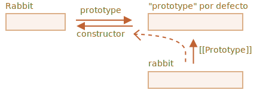

# F.prototype

Recuerde, se pueden crear nuevos objetos con una función constructora, como `new F()`.

<<<<<<< HEAD
Si `F.prototype` es un objeto, entonces el operador `new` lo usa para establecer `[[Prototype]]` para el nuevo objeto.
=======
If `F.prototype` is an object, then the `new` operator uses it to set `[[Prototype]]` for the new object.
>>>>>>> 445bda39806050acd96f87166a7c97533a0c67e9

```smart
JavaScript tenía herencia prototípica desde el principio. Era una de las características principales del lenguaje.

Pero en los viejos tiempos, no había acceso directo a él. Lo único que funcionó de manera confiable fue una propiedad `"prototype"` de la función constructora, descrita en este capítulo. Así que hay muchos scripts que todavía lo usan.
```

Tenga en cuenta que `F.prototype` aquí significa una propiedad regular llamada `"prototype"` en `F`. Suena algo similar al término "prototype", pero aquí realmente queremos decir una propiedad regular con este nombre.

Aquí está el ejemplo:

```js run
let animal = {
  eats: true
};

function Rabbit(name) {
  this.name = name;
}

*!*
Rabbit.prototype = animal;
*/!*

let rabbit = new Rabbit("Conejo Blanco"); //  rabbit.__proto__ == animal

alert( rabbit.eats ); // verdadero
```

La configuración de `Rabbit.prototype = animal` literalmente establece lo siguiente: "Cuando se crea un `new Rabbit`, asigne su `[[Prototype]]` a `animal`".

Esta es la imagen resultante:


En la imagen, `"prototype"` es una flecha horizontal, que significa una propiedad regular, y `[[Prototype]]` es vertical, que significa la herencia de `rabbit` desde `animal`.

<<<<<<< HEAD
```smart header="`F.prototype` solo se usa en el momento `new F`"
La propiedad `F.prototype` solo se usa cuando se llama a `new F`, asigna `[[Prototype]]` del nuevo objeto.

Si, después de la creación, la propiedad `F.prototype` cambia (`F.prototype = <otro objeto>`), los nuevos objetos creados por `new F` tendrán otro objeto como `[[Prototype]]`, pero ya los objetos existentes conservan el antiguo.
=======
```smart header="`F.prototype` only used at `new F` time"
`F.prototype` property is only used when `new F` is called, it assigns `[[Prototype]]` of the new object.

If, after the creation, `F.prototype` property changes (`F.prototype = <another object>`), then new objects created by `new F` will have another object as `[[Prototype]]`, but already existing objects keep the old one.
>>>>>>> 445bda39806050acd96f87166a7c97533a0c67e9
```

## F.prototype predeterminado, propiedad del constructor

Cada función tiene la propiedad `"prototype"` incluso si no la suministramos.

El `"prototype"` predeterminado es un objeto con la única propiedad `constructor` que apunta de nuevo a la función misma.

Como esto:

```js
function Rabbit() {}

/* prototipo predeterminado
Rabbit.prototype = { constructor: Rabbit };
*/
```


Lo podemos comprobar:

```js run
function Rabbit() {}
// por defecto:
// Rabbit.prototype = { constructor: Rabbit }

alert( Rabbit.prototype.constructor == Rabbit ); // verdadero
```

Naturalmente, si no hacemos nada, la propiedad `constructor` está disponible para todos los rabbits a través de `[[Prototype]]`:

```js run
function Rabbit() {}
// por defecto:
// Rabbit.prototype = { constructor: Rabbit }

let rabbit = new Rabbit(); // hereda de {constructor: Rabbit}

alert(rabbit.constructor == Rabbit); // verdadero (desde prototype)
```



Podemos usar la propiedad `constructor` para crear un nuevo objeto usando el constructor ya existente.

Como aqui:

```js run
function Rabbit(name) {
  this.name = name;
  alert(name);
}

let rabbit = new Rabbit("Conejo Blanco");

*!*
let rabbit2 = new rabbit.constructor("Conejo Negro");
*/!*
```

Eso es útil cuando tenemos un objeto, no sabemos qué constructor se usó para él (por ejemplo, proviene de una biblioteca de terceros), y necesitamos crear otro del mismo tipo.

Pero probablemente lo más importante sobre `"constructor"` es que ...

**...JavaScript en sí mismo no garantiza el valor correcto de `"constructor"`.**

Sí, existe en el `"prototipo"` predeterminado para las funciones, pero eso es todo. Lo que sucede con eso más tarde, depende totalmente de nosotros.

En particular, si reemplazamos el prototipo predeterminado como un todo, entonces no habrá `"constructor"` en él.

Por ejemplo:

```js run
function Rabbit() {}
Rabbit.prototype = {
  jumps: true
};

let rabbit = new Rabbit();
*!*
alert(rabbit.constructor === Rabbit); // falso
*/!*
```

Entonces, para mantener el `"constructor"` correcto, podemos elegir agregar/eliminar propiedades al `"prototipo"` predeterminado en lugar de sobrescribirlo como un todo:

```js
function Rabbit() {}

// No sobrescribir totalmente Rabbit.prototype
// solo agrégale
Rabbit.prototype.jumps = true
// se conserva el Rabbit.prototype.constructor predeterminado
```

O, alternativamente, vuelva a crear la propiedad `constructor` manualmente:

```js
Rabbit.prototype = {
  jumps: true,
*!*
  constructor: Rabbit
*/!*
};

// ahora el constructor también es correcto, porque lo agregamos
```


## Resumen

En este capítulo describimos brevemente la forma de establecer un `[[Prototype]]` para los objetos creados a través de una función de constructor. Más adelante veremos patrones de programación más avanzados que dependen de él.

<<<<<<< HEAD
Todo es bastante simple, solo algunas notas para aclarar las cosas:

- La propiedad `F.prototype` (no la confunda con `[[Prototype]]`) establece `[[Prototype]]` de objetos nuevos cuando se llama a `new F()`.
- El valor de `F.prototype` debe ser un objeto o `null`: otros valores no funcionarán.
-  La propiedad `"prototype"` solo tiene un efecto tan especial cuando se establece en una función de constructor, y se invoca con `new`.
=======
Everything is quite simple, just a few notes to make things clear:

- The `F.prototype` property (don't mistake it for `[[Prototype]]`) sets `[[Prototype]]` of new objects when `new F()` is called.
- The value of `F.prototype` should be either an object or `null`: other values won't work.
-  The `"prototype"` property only has such a special effect when set on a constructor function, and invoked with `new`.
>>>>>>> 445bda39806050acd96f87166a7c97533a0c67e9

En los objetos normales, el `prototype` no es nada especial:
```js
let user = {
  name: "John",
  prototype: "Bla-bla" // sin magia en absoluto
};
```

Por defecto, todas las funciones tienen `F.prototype = {constructor: F}`, por lo que podemos obtener el constructor de un objeto accediendo a su propiedad `"constructor"`.
