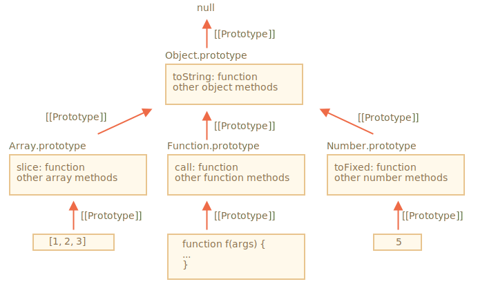
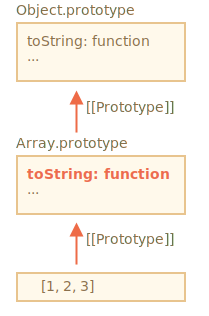

# Prototipos nativos

La propiedad `"prototipo"` es ampliamente utilizada por el núcleo de JavaScript mismo. Todas las funciones de constructor integradas lo usan.

Primero veremos los detalles y luego cómo usarlo para agregar nuevas capacidades a los objetos integrados.

## Object.prototype

Digamos que sacamos un objeto vacío:

```js run
let obj = {};
alert( obj ); // "[object Object]" ?
```

¿Dónde está el código que genera la cadena `"[objeto Objeto]"`? Ese es un método integrado `toString`, pero ¿dónde está? ¡El `obj` está vacío!

...Pero la notación corta `obj = {}` es la misma que `obj = new Object()`, donde `Object` es una función de constructor de objeto integrado, con su propio `prototype` que hace referencia a un objeto enorme con `toString` y otros métodos

Esto es lo que está pasando:


Cuando se llama a `new Object()` (o se crea un objeto literal `{...}`), el `[[Prototype]]` se establece en `Object.prototype` de acuerdo con la regla que discutimos en el capitulo anterior:


Entonces, cuando se llama a `obj.toString()`, el método se toma de `Object.prototype`.

Lo podemos comprobar así:

```js run
let obj = {};

alert(obj.__proto__ === Object.prototype); // verdadero
// obj.toString === obj.__proto__.toString == Object.prototype.toString
```

Tenga en cuenta que no hay más `[[Prototype]]` en la cadena sobre `Object.prototype`:

```js run
alert(Object.prototype.__proto__); // null
```

## Otros prototipos integrados

Otros objetos integrados como `Array`, `Date` , `Function` y otros también mantienen métodos en prototipos.

Por ejemplo, cuando creamos una matriz `[1, 2, 3]`, el constructor predeterminado `new Array()` se usa internamente. Entonces `Array.prototype` se convierte en su prototipo y proporciona métodos. Eso es muy eficiente en memoria.

Por especificación, todos los prototipos integrados tienen `Object.prototype` en la parte superior. Es por eso que algunas personas dicen que "todo hereda de los objetos".

Aquí está la imagen general (para que encajen 3 integrados):



Verifiquemos los prototipos manualmente:

```js run
let arr = [1, 2, 3];

// se hereda de Array.prototype?
alert( arr.__proto__ === Array.prototype ); // verdadero

// y despues desde Object.prototype?
alert( arr.__proto__.__proto__ === Object.prototype ); // verdadero

// Y null en la parte superior.
alert( arr.__proto__.__proto__.__proto__ ); // null
```

Algunos métodos en prototipos pueden superponerse, por ejemplo, `Array.prototype` tiene su propio `toString` que enumera elementos delimitados por comas:

```js run
let arr = [1, 2, 3]
alert(arr); // 1,2,3 <-- el resultado de Array.prototype.toString
```

Como hemos visto antes, `Object.prototype` también tiene `toString`, pero `Array.prototype` está más cerca de la cadena, por lo que se utiliza la variante de array.





Las herramientas en el navegador, como la consola de desarrollador de Chrome, también muestran herencia (es posible que deba utilizarse `console.dir` para los objetos integrados):


Otros objetos integrados también funcionan de la misma manera. Incluso las funciones: son objetos de un constructor `Function` integrado, y sus métodos (`call`/`apply` y otros) se toman de `Function.prototype`. Las funciones también tienen su propio `toString`.

```js run
function f() {}

alert(f.__proto__ == Function.prototype); // ferdadero
alert(f.__proto__.__proto__ == Object.prototype); // verdadero, hereda de objetos
```

## Primitivos

Lo más intrincado sucede con cadenas, números y booleanos.

Como recordamos, no son objetos. Pero si tratamos de acceder a sus propiedades, se crean los objetos contenedores temporales utilizando los constructores integrados `String`, `Number` y `Boolean`. Proporcionan los métodos y desaparecen.

Estos objetos se crean de manera invisible para nosotros y la mayoría de los motores los optimizan, pero la especificación lo describe exactamente de esta manera. Los métodos de estos objetos también residen en prototipos, disponibles como `String.prototype`, `Number.prototype` y `Boolean.prototype`.

```warn header="Los valores `null` y `undefined` no tienen objetos contenedores"
Los valores especiales `null` y `undefined` se distinguen. No tienen objetos contenedores, por lo que los métodos y propiedades no están disponibles para ellos. Y tampoco hay prototipos correspondientes.
```

## Cambiando prototipos nativos [#native-prototype-change]

Los prototipos nativos pueden ser modificados. Por ejemplo, si agregamos un método a `String.prototype`, estará disponible para todas las cadenas:

```js run
String.prototype.show = function() {
  alert(this);
};

"BOOM!".show(); // BOOM!
```

Durante el proceso de desarrollo, podemos tener ideas para nuevos métodos integrados que nos gustaría tener, y podemos sentir la tentación de agregarlos a los prototipos nativos. Pero eso es generalmente una mala idea.

```warn
Los prototipos son globales, por lo que es fácil generar un conflicto. Si dos bibliotecas agregan un método `String.prototype.show`, entonces una de ellas sobrescribirá el método de la otra.

Por lo tanto, en general, modificar un prototipo nativo se considera una mala idea.
```

**En la programación moderna, solo hay un caso en el que se aprueba la modificación de prototipos nativos. Eso es polyfilling (polirelleno).**

Polyfilling (polirellenado) es un término para sustituir un método que existe en la especificación de JavaScript, pero que aún no es compatible con un motor de JavaScript en particular.

Luego podemos implementarlo manualmente y llenar el prototipo integrado con él.

Por ejemplo:

```js run
if (!String.prototype.repeat) { // si no hay tal método
  // agregarlo al prototipo

  String.prototype.repeat = function(n) {
    // repite la cadena n veces

    // en realidad, el código debería ser un poco más complejo que eso
    // (el algoritmo completo está en la especificación)
    // pero incluso un polirelleno imperfecto a menudo se considera lo suficientemente bueno
    return new Array(n + 1).join(this);
  };
}

alert( "La".repeat(3) ); // LaLaLa
```


## Préstamo de prototipos

En el capítulo <info:call-apply-decorators#method-borrowing> hablamos sobre el préstamo de método .

Es entonces cuando tomamos un método de un objeto y lo copiamos en otro.

A menudo se toman prestados algunos métodos de prototipos nativos.

Por ejemplo, si estamos haciendo un objeto tipo array, es posible que queramos copiar algunos métodos de 'Array'.

P. ej..

```js run
let obj = {
  0: "Hola",
  1: "mundo!",
  length: 2,
};

*!*
obj.join = Array.prototype.join;
*/!*

alert( obj.join(',') ); // Hola,mundo!
```

Funciona porque el algoritmo interno del método integrado `join` solo se preocupa por los índices correctos y la propiedad `length`. No comprueba si el objeto es realmente un arreglo. Muchos métodos integrados son así.

Otra posibilidad es heredar estableciendo `obj.__proto__` en `Array.prototype`, de modo que todos los métodos `Array` estén disponibles automáticamente en `obj`.

Pero eso es imposible si `obj` ya hereda de otro objeto. Recuerde, solo podemos heredar de un objeto a la vez.

Los métodos de préstamo son flexibles, permiten mezclar funcionalidades de diferentes objetos si es necesario.

## Resumen

- Todos los objetos integrados siguen el mismo patrón:
    - Los métodos se almacenan en el prototipo (`Array.prototype`, `Object.prototype`, `Date.prototype`, etc.)
    - El objeto en sí solo almacena los datos (elementos de arreglo, propiedades de objeto, la fecha)
- Los primitivos también almacenan métodos en prototipos de objetos contenedores: `Number.prototype`, `String.prototype` y `Boolean.prototype`. Solo `undefined` y `null` no tienen objetos contenedores
- Los prototipos integrados se pueden modificar o completar con nuevos métodos. Pero no se recomienda cambiarlos. El único caso permitido es probablemente cuando agregamos un nuevo estándar, pero aún no es compatible con el motor de JavaScript
