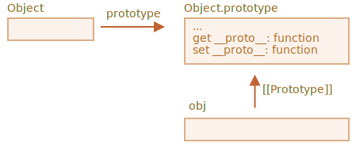

# Métodos prototipo, objetos sin __proto__

En el primer capítulo de esta sección, mencionamos que existen métodos modernos para configurar un prototipo.

<<<<<<< HEAD
=======
The `__proto__` is considered outdated and somewhat deprecated (in browser-only part of the JavaScript standard).
>>>>>>> b0464bb32c8efc2a98952e05f363f61eca1a99a2

`__proto__` se considera desactualizado y algo obsoleto (en la parte propia del navegador dentro del estándar JavaScript).

<<<<<<< HEAD
=======
- [Object.create(proto, [descriptors])](mdn:js/Object/create) -- creates an empty object with given `proto` as `[[Prototype]]` and optional property descriptors.
- [Object.getPrototypeOf(obj)](mdn:js/Object/getPrototypeOf) -- returns the `[[Prototype]]` of `obj`.
- [Object.setPrototypeOf(obj, proto)](mdn:js/Object/setPrototypeOf) -- sets the `[[Prototype]]` of `obj` to `proto`.
>>>>>>> b0464bb32c8efc2a98952e05f363f61eca1a99a2

Los métodos modernos son:

- [Object.create(proto[, descriptors])] (mdn:js/Object/create): crea un objeto vacío con el "proto" dado como `[[Prototype]]` y descriptores de propiedad opcionales.
- [Object.getPrototypeOf(obj)](mdn:js/Object/getPrototypeOf) - devuelve el `[[Prototype]]` de `obj`.
- [Object.setPrototypeOf(obj, proto)](mdn:js/Object/setPrototypeOf) - establece el `[[Prototype]]` de `obj` en `proto`.

Estos deben usarse en lugar de `__proto__`.

Por ejemplo:

```js run
let animal = {
  eats: true
};

// crear un nuevo objeto con animal como prototipo
*!*
let rabbit = Object.create(animal);
*/!*

alert(rabbit.eats); // true

*!*
alert(Object.getPrototypeOf(rabbit) === animal); // true
*/!*

*!*
Object.setPrototypeOf(rabbit, {}); // cambia el prototipo de rabbit a {}
*/!*
```

`Object.create` tiene un segundo argumento opcional: descriptores de propiedad. Podemos proporcionar propiedades adicionales al nuevo objeto allí, así:

```js run
let animal = {
  eats: true
};

let rabbit = Object.create(animal, {
  jumps: {
    value: true
  }
});

alert(rabbit.jumps); // true
```

Los descriptores están en el mismo formato que se describe en el capítulo <info:property-descriptors>.

Podemos usar `Object.create` para realizar una clonación de objetos más poderosa que copiar propiedades en el ciclo `for..in`:

```js
<<<<<<< HEAD
// // clon superficial de obj totalmente idéntico
=======
>>>>>>> b0464bb32c8efc2a98952e05f363f61eca1a99a2
let clone = Object.create(Object.getPrototypeOf(obj), Object.getOwnPropertyDescriptors(obj));
```

Esta llamada hace una copia verdaderamente exacta de `obj`, que incluye todas las propiedades: enumerables y no enumerables, propiedades de datos y setters/getters, todo, y con el `[[Prototype]]` correcto.

## Breve historia

Si contamos todas las formas de administrar `[[Prototype]]`, ¡hay muchas! ¡Muchas maneras de hacer lo mismo!

¿Por qué?


<<<<<<< HEAD
Eso es por razones históricas.

=======
If we count all the ways to manage `[[Prototype]]`, there are a lot! Many ways to do the same thing!

Why?
>>>>>>> b0464bb32c8efc2a98952e05f363f61eca1a99a2

- La propiedad "prototipo" de una función de constructor ha funcionado desde tiempos muy antiguos.
- Más tarde, en el año 2012, apareció `Object.create` en el estándar. Le dio la capacidad de crear objetos con un prototipo dado, pero no proporcionó la capacidad de obtenerlo/configurarlo. Entonces, los navegadores implementaron el acceso no estándar `__proto__` que permitió al usuario obtener/configurar un prototipo en cualquier momento.
- Más tarde, en el año 2015, `Object.setPrototypeOf` y `Object.getPrototypeOf` se agregaron al estándar, para realizar la misma funcionalidad que `__proto__`. Como `__proto__` se implementó de facto en todas partes, fue desaprobado y llegó al Anexo B de la norma, es decir: opcional para entornos que no son del navegador.

<<<<<<< HEAD
=======
- The `"prototype"` property of a constructor function has worked since very ancient times.
- Later, in the year 2012, `Object.create` appeared in the standard. It gave the ability to create objects with a given prototype, but did not provide the ability to get/set it. So browsers implemented the non-standard `__proto__` accessor that allowed the user to get/set a prototype at any time.
- Later, in the year 2015, `Object.setPrototypeOf` and `Object.getPrototypeOf` were added to the standard, to perform the same functionality as `__proto__`. As `__proto__` was de-facto implemented everywhere, it was kind-of deprecated and made its way to the Annex B of the standard, that is: optional for non-browser environments.
>>>>>>> b0464bb32c8efc2a98952e05f363f61eca1a99a2

A partir de ahora tenemos todas estas formas a nuestra disposición.

<<<<<<< HEAD

¿Por qué se reemplazó `__proto__` por las funciones `getPrototypeOf/setPrototypeOf`? Esa es una pregunta interesante, que requiere que comprendamos por qué `__proto__` es malo. Sigue leyendo para obtener la respuesta.

```warn header="No cambie `[[Prototype]]` en objetos existentes si la velocidad es importante"
Técnicamente, podemos obtener/configurar `[[Prototype]]` en cualquier momento. Pero generalmente solo lo configuramos una vez en el momento de creación del objeto y ya no lo modificamos: `rabbit` hereda de `animal`, y eso no va a cambiar.

Y los motores de JavaScript están altamente optimizados para esto. Cambiar un prototipo "sobre la marcha" con `Object.setPrototypeOf` u `obj.__ proto __=` es una operación muy lenta ya que rompe las optimizaciones internas para las operaciones de acceso a la propiedad del objeto. Por lo tanto, evítelo a menos que sepa lo que está haciendo, o no le importe la velocidad de JavaScript .
```

## Objetos "muy simples" [#very-plain]

=======
Why was `__proto__` replaced by the functions `getPrototypeOf/setPrototypeOf`? That's an interesting question, requiring us to understand why `__proto__` is bad. Read on to get the answer.

```warn header="Don't change `[[Prototype]]` on existing objects if speed matters"
Technically, we can get/set `[[Prototype]]` at any time. But usually we only set it once at the object creation time and don't modify it anymore: `rabbit` inherits from `animal`, and that is not going to change.

And JavaScript engines are highly optimized for this. Changing a prototype "on-the-fly" with `Object.setPrototypeOf` or `obj.__proto__=` is a very slow operation as it breaks internal optimizations for object property access operations. So avoid it unless you know what you're doing, or JavaScript speed totally doesn't matter for you.
```

## "Very plain" objects [#very-plain]
>>>>>>> b0464bb32c8efc2a98952e05f363f61eca1a99a2

Como sabemos, los objetos se pueden usar como arreglos asociativas para almacenar pares clave/valor.

...Pero si tratamos de almacenar claves *proporcionadas por el usuario* en él (por ejemplo, un diccionario ingresado por el usuario), podemos ver una falla interesante: todas las claves funcionan bien excepto `"__proto __ "`.

Mira el ejemplo:

```js run
let obj = {};

let key = prompt("Cual es la clave?", "__proto__");
obj[key] = "algún valor";

alert(obj[key]); // [object Object], no es "algún valor"!
```

<<<<<<< HEAD

Aquí, si el usuario escribe en `__proto__`, ¡la asignación se ignora!

Eso no debería sorprendernos. La propiedad `__proto__` es especial: debe ser un objeto o `null`. Una cadena no puede convertirse en un prototipo.


Pero no *intentamos* implementar tal comportamiento, ¿verdad? Queremos almacenar pares clave/valor, y la clave llamada `"__proto__"` no se guardó correctamente. ¡Entonces eso es un error!
=======
Here, if the user types in `__proto__`, the assignment is ignored!

That shouldn't surprise us. The `__proto__` property is special: it must be either an object or `null`. A string can not become a prototype.
>>>>>>> b0464bb32c8efc2a98952e05f363f61eca1a99a2


<<<<<<< HEAD
Aquí las consecuencias no son terribles. Pero en otros casos podemos estar asignando valores de objeto, y luego el prototipo puede ser cambiado. Como resultado, la ejecución irá mal de maneras totalmente inesperadas.

Lo que es peor: generalmente los desarrolladores no piensan en tal posibilidad en absoluto. Eso hace que tales errores sean difíciles de notar e incluso los convierta en vulnerabilidades, especialmente cuando se usa JavaScript en el lado del servidor.

También pueden ocurrir cosas inesperadas al asignar a `toString`, que es una función por defecto, y a otros métodos integrados.

¿Cómo podemos evitar este problema?

Primero, podemos elegir usar `Map` para almacenamiento en lugar de objetos simples, luego todo queda bien.

Pero 'Objeto' también puede servirnos bien aquí, porque los creadores del lenguaje pensaron en ese problema hace mucho tiempo.

`__proto__` no es una propiedad de un objeto, sino una propiedad de acceso de `Object.prototype`:

=======
Here the consequences are not terrible. But in other cases we may be assigning object values, and then the prototype may indeed be changed. As a result, the execution will go wrong in totally unexpected ways.

What's worse -- usually developers do not think about such possibility at all. That makes such bugs hard to notice and even turn them into vulnerabilities, especially when JavaScript is used on server-side.

Unexpected things also may happen when assigning to `toString`, which is a function by default, and to other built-in methods.

How can we avoid this problem?

First, we can just switch to using `Map` for storage instead of plain objects, then everything's fine.

But `Object` can also serve us well here, because language creators gave thought to that problem long ago.

`__proto__` is not a property of an object, but an accessor property of `Object.prototype`:


>>>>>>> b0464bb32c8efc2a98952e05f363f61eca1a99a2


Entonces, si se lee o establece `obj.__ proto__`, el getter/setter correspondiente se llama desde su prototipo y obtiene/establece `[[Prototype]]`.

<<<<<<< HEAD
Como se dijo al comienzo de esta sección del tutorial: `__proto__` es una forma de acceder a `[[Prototype]]`, no es `[[Prototype]]` en sí.


Ahora, si pretendemos usar un objeto como una arreglo asociativa y no tener tales problemas, podemos hacerlo con un pequeño truco:
=======
Now, if we intend to use an object as an associative array and be free of such problems, we can do it with a little trick:
>>>>>>> b0464bb32c8efc2a98952e05f363f61eca1a99a2

```js run
*!*
let obj = Object.create(null);
*/!*

let key = prompt("Cual es la clave", "__proto__");
obj[key] = "algún valor";

alert(obj[key]); // "algún valor"
```

`Object.create(null)` crea un objeto vacío sin un prototipo (`[[Prototype]]` es `null`):


<<<<<<< HEAD
Entonces, no hay getter/setter heredado para `__proto__`. Ahora se procesa como una propiedad de datos normal, por lo que el ejemplo anterior funciona correctamente.
=======

>>>>>>> b0464bb32c8efc2a98952e05f363f61eca1a99a2


<<<<<<< HEAD
Podemos llamar a estos objetos: objetos "muy simples" o "de diccionario puro", porque son aún más simples que el objeto simple normal `{...}`.
=======
We can call such objects "very plain" or "pure dictionary" objects, because they are even simpler than the regular plain object `{...}`.
>>>>>>> b0464bb32c8efc2a98952e05f363f61eca1a99a2


Una desventaja es que dichos objetos carecen de métodos de objetos integrados, p.ej. `toString`:

```js run
*!*
let obj = Object.create(null);
*/!*

alert(obj); // Error (no hay toString)
```

...Pero eso generalmente está bien para arreglos asociativas.


Tenga en cuenta que la mayoría de los métodos relacionados con objetos son `Object.algo(...)`, como `Object.keys(obj)`  y no están en el prototipo, por lo que seguirán trabajando en dichos objetos:

<<<<<<< HEAD
=======
Note that most object-related methods are `Object.something(...)`, like `Object.keys(obj)` -- they are not in the prototype, so they will keep working on such objects:
>>>>>>> b0464bb32c8efc2a98952e05f363f61eca1a99a2


```js run
let chineseDictionary = Object.create(null);
chineseDictionary.hello = "你好";
chineseDictionary.bye = "再见";

alert(Object.keys(chineseDictionary)); // hola,adios
```

## Resumen


Los métodos modernos para configurar y acceder directamente al prototipo son:

<<<<<<< HEAD
- [Object.create(proto[, descriptores])](mdn:js/Object/create) - crea un objeto vacío con un `proto` dado como `[[Prototype]]` (puede ser `nulo`) y descriptores de propiedad opcionales.
- [Object.getPrototypeOf(obj)](mdn:js/Object.getPrototypeOf) - devuelve el `[[Prototype]]` de `obj` (igual que el getter de `__proto__`).
- [Object.setPrototypeOf(obj, proto)](mdn:js/Object.setPrototypeOf) - establece el `[[Prototype]]` de `obj` en `proto` (igual que el setter de `__proto__`).

El getter/setter incorporado de `__proto__` no es seguro si queremos poner claves generadas por el usuario en un objeto. Aunque un usuario puede ingresar `"__proto __"` como clave, y habrá un error, con consecuencias levemente dañinas, pero generalmente impredecibles.

=======
Modern methods to set up and directly access the prototype are:

- [Object.create(proto, [descriptors])](mdn:js/Object/create) -- creates an empty object with a given `proto` as `[[Prototype]]` (can be `null`) and optional property descriptors.
- [Object.getPrototypeOf(obj)](mdn:js/Object.getPrototypeOf) -- returns the `[[Prototype]]` of `obj` (same as `__proto__` getter).
- [Object.setPrototypeOf(obj, proto)](mdn:js/Object.setPrototypeOf) -- sets the `[[Prototype]]` of `obj` to `proto` (same as `__proto__` setter).

The built-in `__proto__` getter/setter is unsafe if we'd want to put user-generated keys into an object. Just because a user may enter `"__proto__"` as the key, and there'll be an error, with hopefully light, but generally unpredictable consequences.
>>>>>>> b0464bb32c8efc2a98952e05f363f61eca1a99a2

Entonces podemos usar `Object.create(null)` para crear un objeto "muy simple" sin `__proto__`, o apegarnos a los objetos `Map` para eso.

Además, `Object.create` proporciona una manera fácil de copiar llanamente un objeto con todos los descriptores:

```js
let clone = Object.create(Object.getPrototypeOf(obj), Object.getOwnPropertyDescriptors(obj));
```

We also made it clear that `__proto__` is a getter/setter for `[[Prototype]]` and resides in `Object.prototype`, just like other methods.

<<<<<<< HEAD
También dejamos en claro que `__proto__` es un getter/setter para `[[Prototype]]`  y reside en `Object.prototype`, al igual que otros métodos.

Podemos crear un objeto sin prototipo mediante `Object.create(null)`. Dichos objetos se utilizan como "diccionarios puros", no tienen problemas con `"__proto __"` como clave.

Otros métodos:

- [Object.keys(obj)](mdn:js/Object/keys) / [Object.values(obj)](mdn:js/Object/values) / [Object.entries(obj)](mdn:js/Object/entries): devuelve una arreglo de pares clave-valor: nombres/valores, de propiedades de cadena propios enumerables.
- [Object.getOwnPropertySymbols(obj)](mdn:js/Object/getOwnPropertySymbols): devuelve un arreglo de todas las claves simbólicas propias.
- [Object.getOwnPropertyNames(obj)](mdn:js/Object/getOwnPropertyNames): devuelve un arreglo de todas las claves de cadena propias.
- [Reflect.ownKeys(obj)](mdn:js/Reflect/ownKeys): devuelve un arreglo de todas las claves propias.
- [obj.hasOwnProperty(key)](mdn:js/Object/hasOwnProperty): devuelve `true` si `obj` tiene su propia clave (no heredada) llamada `key`.

Todos los métodos que devuelven propiedades de objeto (como `Object.keys` y otros) - devuelven propiedades "propias". Si queremos heredados, podemos usar `for..in`.

=======
We can create an object without a prototype by `Object.create(null)`. Such objects are used as "pure dictionaries", they have no issues with `"__proto__"` as the key.

Other methods:

- [Object.keys(obj)](mdn:js/Object/keys) / [Object.values(obj)](mdn:js/Object/values) / [Object.entries(obj)](mdn:js/Object/entries) -- returns an array of enumerable own string property names/values/key-value pairs.
- [Object.getOwnPropertySymbols(obj)](mdn:js/Object/getOwnPropertySymbols) -- returns an array of all own symbolic keys.
- [Object.getOwnPropertyNames(obj)](mdn:js/Object/getOwnPropertyNames) -- returns an array of all own string keys.
- [Reflect.ownKeys(obj)](mdn:js/Reflect/ownKeys) -- returns an array of all own keys.
- [obj.hasOwnProperty(key)](mdn:js/Object/hasOwnProperty): returns `true` if `obj` has its own (not inherited) key named `key`.

All methods that return object properties (like `Object.keys` and others) -- return "own" properties. If we want inherited ones, we can use `for..in`.
>>>>>>> b0464bb32c8efc2a98952e05f363f61eca1a99a2
