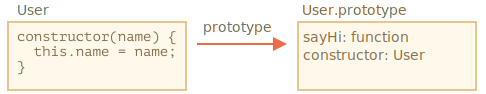

# Sintaxis básica de `class`

```quote author="Wikipedia"
En informática, una clase es una plantilla para la creación de objetos de datos según un modelo predefinido. Las clases se utilizan para representar entidades o conceptos, como los sustantivos en el lenguaje. Cada clase es un modelo que define un conjunto de variables —el estado—, y métodos apropiados para operar con dichos datos —el comportamiento—.
```

En la práctica a menudo necesitamos crear muchos objetos del mismo tipo: usuarios, bienes, lo que sea.

Como ya sabemos del capítulo <info:constructor-new>, `new function` puede ayudar con eso.

Pero en JavaScript moderno hay un constructor más avanzado, "class", que introduce características nuevas muy útiles para la programación orientada a objetos.

## La sintaxis "class"

La sintaxis básica es:
```js
class MyClass {
  // métodos de clase
  constructor() { ... }
  method1() { ... }
  method2() { ... }
  method3() { ... }
  ...
}
```

Entonces usamos `new MyClass()` para crear un objeto nuevo con todos los métodos listados.

El método `constructor()` es llamado automáticamente por `new`, así podemos inicializar el objeto allí.

Por ejemplo:

```js run
class User {

  constructor(name) {
    this.name = name;
  }

  sayHi() {
    alert(this.name);
  }

}

// Uso:
let user = new User("John");
user.sayHi();
```

Cuando se llama a `new User("John")`:
1. Un objeto nuevo es creado.
2. El `constructor` se ejecuta con el argumento dado y lo asigna a `this.name`.

...Entonces podemos llamar a sus métodos, como `user.sayHi()`.


```warn header="No va una coma entre métodos de clase"
Un tropiezo común en desarrolladores principiantes es poner una coma entre los métodos de clase, lo que resulta en un error de sintaxis.

La notación aquí no debe ser confundida con la sintaxis de objeto literal. Dentro de la clase no se requieren comas.
```

## ¿Qué es una clase?

Entonces, ¿qué es exactamente `class`? No es una entidad completamente nueva a nivel de lenguaje como uno podría pensar.

Desvelemos la magia y veamos lo que realmente es una clase. Ayudará a entender muchos aspectos complejos.

En JavaScript, una clase es un tipo de función.

Veamos:

```js run
class User {
  constructor(name) { this.name = name; }
  sayHi() { alert(this.name); }
}

// La prueba: User es una función
*!*
alert(typeof User); // function
*/!*
```

Lo que la construcción `class User {...}` hace realmente es:

1. Crea una función llamada `User`, la que se vuelve el resultado de la declaración de la clase. El código de la función es tomado del método `constructor` (se asume vacío si no se escribe tal método).
2. Almacena los métodos de clase, tales como `sayHi`, en `User.prototype`.

Después de que el objeto `new User` es creado, cuando llamamos a sus métodos estos son tomados del prototipo, tal como se describe en el capítulo <info:function-prototype>. Así el objeto tiene acceso a métodos de clase.

Podemos ilustrar el resultado de la declaración de `class User` como:



Aquí el código para inspeccionarlo:

```js run
class User {
  constructor(name) { this.name = name; }
  sayHi() { alert(this.name); }
}

// una clase es una función
alert(typeof User); // function

// ...o, más precisamente, el método constructor
alert(User === User.prototype.constructor); // true

// Los métodos están en User.prototype, por ejemplo:
alert(User.prototype.sayHi); // el código del método sayHi

// Hay exactamente dos métodos en el prototipo
alert(Object.getOwnPropertyNames(User.prototype)); // constructor, sayHi
```

## No es solamente azúcar sintáctica

A veces se dice que `class` es "azúcar sintáctica" (sintaxis que es diseñada para que sea más fácil de leer pero no introduce nada nuevo), porque en realidad podemos declarar lo mismo sin la palabra clave `class` en absoluto:

```js run
// reescribiendo la clase User puramente con funciones

// 1. Crear la función constructor
function User(name) {
  this.name = name;
}
// un prototipo de función tiene la propiedad "constructor" por defecto,
// así que no necesitamos crearla

// 2. Agregar el método al prototipo
User.prototype.sayHi = function() {
  alert(this.name);
};

// Uso:
let user = new User("John");
user.sayHi();
```

El resultado de esta definición es el mismo. Así, efectivamente hay razones para que `class` sea considerada azúcar sintáctica para definir un constructor junto con sus métodos de prototipo.

Aún así hay diferencias importantes.

1. Primero, una función creada por `class` es etiquetada por una propiedad interna especial `[[IsClassConstructor]]:true`. Entones no es exactamente lo mismo que crearla manualmente.

    El lenguaje verifica esa propiedad en varios lugares. Por ejemplo, a diferencia de las funciones regulares, esta debe ser llamada con `new`:

    ```js run
    class User {
      constructor() {}
    }

    alert(typeof User); // function
    User(); // Error: El constructor de clase User no puede ser invocado sin 'new'
    ```

    Además una representación string de un constructor de clase en la mayoría de los motores JavaScript comienzan con "class..."

    ```js run
    class User {
      constructor() {}
    }

    alert(User); // class User { ... }
    ```
    Hay otras diferencias que veremos pronto.

2. Los métodos de clase no son enumerables.
    La definición de clase establece la bandera `enumerable` a `false` para todos los métodos en `"prototype"`.

    Esto es bueno porque si hacemos `for..in` a un objeto usualmente no queremos sus métodos de clase.

3. Las clases siempre asumen `use strict`.
    Todo el código dentro del constructor de clase está automáticamente en modo estricto.

Además la sintaxis de `class` brinda muchas otras características que exploraremos luego.

## Expresión de clases

Al igual que las funciones, las clases pueden ser definidas dentro de otra expresión, pasadas, devueltas, asignadas, etc.

Aquí hay un ejemplo de una expresión de clase:

```js
let User = class {
  sayHi() {
    alert("Hello");
  }
};
```

Al igual que las expresiones de función, las expresiones de clase pueden tener un nombre.

Si una expresión de clase tiene un nombre, este es visible solamente dentro de la clase.

```js run
// Expresiones de clase con nombre
// ("Named Class Expression" no figura así en la especificación, pero es equivalente a "Named Function Expression")
let User = class *!*MyClass*/!* {
  sayHi() {
    alert(MyClass); // El nombre de MyClass solo es visible dentro de la clase
  }
};

new User().sayHi(); // Funciona, muestra la definición de MyClass

alert(MyClass); // error, el nombre de MyClass no es visible fuera de la clase
```

Podemos inclusive crear clases dinámicamente "a pedido", como esto:

```js run
function makeClass(phrase) {
  // declara una clase y la devuelve
  return class {
    sayHi() {
      alert(phrase);
    }
  };
}

// Crea una nueva clase
let User = makeClass("Hello");

new User().sayHi(); // Hello
```


## Getters/setters

Al igual que los objetos literales, las clases pueden incluir getters/setters, propiedades calculadas, etc.

Aquí hay un ejemplo de `user.name`, implementado usando `get/set`:

```js run
class User {

  constructor(name) {
    // invoca el setter
    this.name = name;
  }

*!*
  get name() {
*/!*
    return this._name;
  }

*!*
  set name(value) {
*/!*
    if (value.length < 4) {
      alert("Nombre demasiado corto.");
      return;
    }
    this._name = value;
  }

}

let user = new User("John");
alert(user.name); // John

user = new User(""); // Nombre demasiado corto.
```

Técnicamente, la declaración de clase funciona creando getters y setters en `User.prototype`.

## Nombres calculados [...]

Aquí hay un ejemplo con un nombre de método calculado usando corchetes `[...]`:

```js run
class User {

*!*
  ['say' + 'Hi']() {
*/!*
    alert("Hello");
  }

}

new User().sayHi();
```

Es una característica fácil de recordar porque se asemeja a la de los objetos literales.

## Campos de clase (Class fields) 

```warn header="Los navegadores viejos pueden necesitar polyfill"
Los campos de clase son un agregado reciente al lenguaje.
```

Antes, nuestras clases tenían solamente métodos.

"Campos de clase" es una sintaxis que nos permite agregar una propiedad cualquiera.

Por ejemplo, agreguemos la propiedad `name` a la clase `User`:

```js run
class User {
*!*
  name = "John";
*/!*

  sayHi() {
    alert(`Hello, ${this.name}!`);
  }
}

new User().sayHi(); // Hello, John!
```

Así, simplemente escribimos "<property name> = <value>" en la declaración, y eso es todo.

La diferencia importante de las propiedades definidas como "campos de clase" es que estas son establecidas en los objetos individuales, no compartidas en `User.prototype`:

```js run
class User {
*!*
  name = "John";
*/!*
}

let user = new User();
alert(user.name); // John
alert(User.prototype.name); // undefined
```

También podemos asignar valores usando expresiones más complejas y llamados a función:

```js run
class User {
*!*
  name = prompt("Name, please?", "John");
*/!*
}

let user = new User();
alert(user.name); // John
```

### Vinculación de métodos (binding) usando campos de clase

Como se demostró en el capítulo <info:bind>, las funciones en JavaScript tienen un `this` dinámico. Este depende del contexto del llamado.

Entonces si un método de objeto es pasado y llamado en otro contexto, `this` ya no será una referencia a su objeto.

Por ejemplo, este código mostrará `undefined`:

```js run
class Button {
  constructor(value) {
    this.value = value;
  }

  click() {
    alert(this.value);
  }
}

let button = new Button("hello");

*!*
setTimeout(button.click, 1000); // undefined
*/!*
```

Este problema es denominado "pérdida de `this`".

Hay dos enfoques para solucionarlo, como se discute en el capítulo <info:bind>:

1. Pasar un contenedor o wrapper-function como: `setTimeout(() => button.click(), 1000)`.
2. Vincular el método al objeto, por ejemplo en el constructor.

Los campos de clase brindan otra sintaxis, bastante elegante:

```js run
class Button {
  constructor(value) {
    this.value = value;
  }
*!*
  click = () => {
    alert(this.value);
  }
*/!*
}

let button = new Button("hello");

setTimeout(button.click, 1000); // hello
```

Un campo de clase `click = () => {...}` es creado para cada objeto. Hay una función para cada objeto `Button`, con `this` dentro referenciando ese objeto. Podemos pasar `button.click` a cualquier lado y el valor de `this` siempre será el correcto.

Esto es especialmente práctico, en el ambiente de los navegadores, para los "event listeners".

## Resumen

La sintaxis básica de clase se ve así:

```js
class MyClass {
  prop = value; // propiedad

  constructor(...) { // constructor
    // ...
  }

  method(...) {} // método

  get something(...) {} // método getter
  set something(...) {} // método setter

  [Symbol.iterator]() {} // método con nombre calculado (aquí, symbol)
  // ...
}
```

`MyClass` es técnicamente una función (la que proveemos como `constructor`), mientras que los métodos, getters y setters son escritos en `MyClass.prototype`.

En los siguientes capítulos aprenderemos más acerca de clases, incluyendo herencia y otras características.
