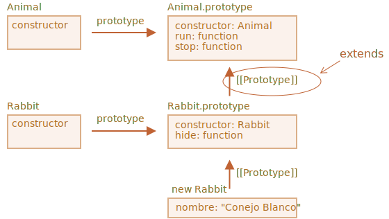

# Herencia de clase

La herencia de clase es un método para que una clase extienda a otra.

Entonces podemos crear una nueva funcionalidad además de la existente.

## La palabra clave "extends"

Digamos que tenemos la clase `Animal`:

```js
class Animal {
  constructor(name) {
    this.speed = 0;
    this.name = name;
  }
  run(speed) {
    this.speed = speed;
    alert(`${this.name} corre a una velocidad de ${this.speed}.`);
  }
  stop() {
    this.speed = 0;
    alert(`${this.name} se queda quieto.`);
  }
}

let animal = new Animal("Mi animal");
```

Así es como podemos representar gráficamente el objeto `animal` y la clase `Animal`:


...Y nos gustaría crear otra clase `Rabbit`.

Como los conejos son animales, la clase 'Rabbit' debe basarse en 'Animal', tener acceso a métodos animales, para que los conejos puedan hacer lo que los animales "genéricos" pueden hacer.

La sintaxis para extender otra clase es: `class Child extends Parent`.

Construyamos la clase `Rabbit` que herede de `Animal`:

```js
*!*
class Rabbit extends Animal {
*/!*
  hide() {
    alert(`${this.name} se esconde!`);
  }
}

let rabbit = new Rabbit("Conejo Blanco");

rabbit.run(5); // Conejo Blanco corre a una velocidad de 5.
rabbit.hide(); // Conejo Blanco se esconde!
```

Los objetos de la clase `Rabbit` tienen acceso a los métodos de `Rabbit`, como `rabbit.hide()`, y también a los métodos `Animal`, como `rabbit.run()`.

Internamente, la palabra clave `extends` funciona con la buena mecánica de prototipo. Establece `Rabbit.prototype. [[Prototype]]` a `Animal.prototype`. Entonces, si no se encuentra un método en `Rabbit.prototype`, JavaScript lo toma de` Animal.prototype`.



Por ejemplo, para encontrar el método `rabbit.run`, el motor verifica (de abajo hacia arriba en la imagen) que:
1. El objeto `rabbit` (no tiene el método `run`).
2. Su prototipo, que es `Rabbit.prototype` (tiene el método `hide`, pero no el método `run`).
3. Su prototipo,  `Animal.prototype` (debido a `extends`), este finalmente tiene el método `run`.

Como podemos recordar del capítulo <info:native-prototypes>, JavaScript usa la misma herencia prototípica para los objetos incorporados. P.ej. `Date.prototype.[[Prototype]]` es `Object.prototype`, por lo que "Date" tiene métodos de objeto genéricos.

````smart header="Cualquier expresión está permitida después de `extends`"
La sintaxis de clase permite especificar no solo una clase, sino cualquier expresión después de `extends`.

Por ejemplo, una llamada a función que genera la clase padre:

```js run
function f(phrase) {
  return class {
    sayHi() { alert(phrase) }
  }
}

*!*
class User extends f("Hola") {}
*/!*

new User().sayHi(); // Hola
```
Observa: `class User` hereda del resultado de `f("Hola")`.

Eso puede ser útil para patrones de programación avanzados cuando usamos funciones para generar clases dependiendo de muchas condiciones y podamos heredar de ellas.
````

## Sobrescribir un método

Ahora avancemos y sobrescribamos un método. Por defecto, todos los métodos que no están especificados en la clase `Rabbit` se toman directamente "tal cual" de la clase `Animal`.

Si especificamos nuestro propio método `stop()` en `Rabbit`, se utilizará en su lugar:

```js
class Rabbit extends Animal {
  stop() {
    // ...esto se usará para rabbit.stop()
    // en lugar de stop() de la clase Animal
  }
}
```

...Pero, por lo general, no queremos reemplazar totalmente un método padre, sino más bien construir sobre él, modificar o ampliar su funcionalidad. Hacemos algo en nuestro método, pero llamamos al método padre antes/después o en el proceso.

Las clases proporcionan la palabra clave `"super"` para eso.

- `super.method(...)` llama un método padre.
- `super(...)` llama un constructor padre (solo dentro de nuestro constructor).

Por ejemplo, dejemos que nuestro conejo se oculte automáticamente cuando se detenga:

```js run
class Animal {

  constructor(name) {
    this.speed = 0;
    this.name = name;
  }

  run(speed) {
    this.speed = speed;
    alert(`${this.name} corre a una velocidad de ${this.speed}.`);
  }

  stop() {
    this.speed = 0;
    alert(`${this.name} se queda quieto.`);
  }

}

class Rabbit extends Animal {
  hide() {
    alert(`${this.name} se esconde!`);
  }

*!*
  stop() {
    super.stop(); // llama el stop padre
    this.hide(); // y luego hide
  }
*/!*
}

let rabbit = new Rabbit("Conejo Blanco");

rabbit.run(5); // Conejo Blanco corre a una velocidad de 5.
rabbit.stop(); // Conejo Blanco se queda quieto. Conejo Blanco se esconde!
```

Ahora `Rabbit` tiene el método `stop` que llama al padre `super.stop()` en el proceso.

````smart header="Las funciones de flecha no tienen `super`"
Como se mencionó en el capítulo <info:arrow-functions>, las funciones de flecha no tienen `super`.

Si se accede, se toma de la función externa. Por ejemplo:
```js
class Rabbit extends Animal {
  stop() {
    setTimeout(() => super.stop(), 1000); // llama al stop() padre despues de 1seg
  }
}
```

El método `super` en la función de flecha es el mismo que en `stop()`, y funciona según lo previsto. Si aquí especificamos una función "regular", habría un error:

```js
// super inesperado
setTimeout(function() { super.stop() }, 1000);
```
````


## Sobrescribir un constructor

Con los constructores se pone un poco complicado.

Hasta ahora, `Rabbit` no tenía su propio `constructor`.

De acuerdo con la [especificación](https://tc39.github.io/ecma262/#sec-runtime-semantics-classdefinitionevaluation), si una clase extiende otra clase y no tiene `constructor`, se genera el siguiente `constructor` "vacío":

```js
class Rabbit extends Animal {
  // generado para extender clases sin constructores propios
*!*
  constructor(...args) {
    super(...args);
  }
*/!*
}
```

Como podemos ver, básicamente llama al padre `constructor` pasándole todos los argumentos. Eso sucede si no escribimos un constructor propio.

Ahora agreguemos un constructor personalizado a `Rabbit`. Especificará `earLength` además de `name`:

```js run
class Animal {
  constructor(name) {
    this.speed = 0;
    this.name = name;
  }
  // ...
}

class Rabbit extends Animal {

*!*
  constructor(name, earLength) {
    this.speed = 0;
    this.name = name;
    this.earLength = earLength;
  }
*/!*

  // ...
}

*!*
// No funciona!
let rabbit = new Rabbit("Conejo Blanco", 10); // Error: esto no está definido.
*/!*
```

Vaya! Tenemos un error. Ahora no podemos crear conejos. ¿Qué salió mal?

La respuesta corta es: 
- **Los constructores en las clases heredadas deben llamar a `super(...)`, y (!) hacerlo antes de usar `this`**.

...¿Pero por qué? ¿Que está pasando aqui? De hecho, el requisito parece extraño.

Por supuesto, hay una explicación. Vamos a entrar en detalles, para que realmente entiendas lo que está pasando.

En JavaScript, hay una distinción entre una función constructora de una clase heredera (llamada "constructor derivado") y otras funciones. Un constructor derivado tiene una propiedad interna especial `[[ConstructorKind]]:"derived"`. Esa es una etiqueta interna especial.

Esa etiqueta afecta su comportamiento con `new`.

- Cuando una función regular se ejecuta con `new`, crea un objeto vacío y lo asigna a `this`.
- Pero cuando se ejecuta un constructor derivado, no hace esto. Espera que el constructor padre haga este trabajo.

**Por lo tanto, un constructor derivado debe llamar a `super` para ejecutar su constructor padre (no derivado), de lo contrario no se creará el objeto para `this`. Y obtendremos un error.**

Para que el constructor `Rabbit` funcione, necesita llamar a `super()` antes de usar `this`, como aquí:

```js run
class Animal {

  constructor(name) {
    this.speed = 0;
    this.name = name;
  }

  // ...
}

class Rabbit extends Animal {

  constructor(name, earLength) {
*!*
    super(name);
*/!*
    this.earLength = earLength;
  }

  // ...
}

*!*
// now fine
let rabbit = new Rabbit("Conejo Blanco", 10);
alert(rabbit.name); // Conejo Blanco
alert(rabbit.earLength); // 10
*/!*
```
### Overriding class fields: a tricky note

```warn header="Advanced note"
This note assumes you have a certain experience with classes, maybe in other programming languages.
It provides better insight into the language and also explains the behavior that might be a source of bugs (but not very often).
If you find it difficult to understand, just go on, continue reading, then return to it some time later.
```

We can override not only methods, but also class fields.

Although, there's a tricky behavior when we access an overridden field in parent constructor, quite different from most other programming languages.

Consider this example:

```js run
class Animal {
  name = 'animal'
  constructor() {
    alert(this.name); // (*)
  }
}
class Rabbit extends Animal {
  name = 'rabbit';
}
new Animal(); // animal
*!*
new Rabbit(); // animal
*/!*
```

Here, class `Rabbit` extends `Animal` and overrides `name` field with its own value.

There's no own constructor in `Rabbit`, so `Animal` constructor is called.

What's interesting is that in both cases: `new Animal()` and `new Rabbit()`, the `alert` in the line `(*)` shows `animal`.

**In other words, parent constructor always uses its own field value, not the overridden one.**

What's odd about it?

If it's not clear yet, please compare with methods.

Here's the same code, but instead of `this.name` field we call `this.showName()` method:

```js run
class Animal {
  showName() {  // instead of this.name = 'animal'
    alert('animal');
  }
  constructor() {
    this.showName(); // instead of alert(this.name);
  }
}
class Rabbit extends Animal {
  showName() {
    alert('rabbit');
  }
}
new Animal(); // animal
*!*
new Rabbit(); // rabbit
*/!*
```

Please note: now the output is different.

And that's what we naturally expect. When the parent constructor is called in the derived class, it uses the overridden method.

...But for class fields it's not so. As said, the parent constructor always uses the parent field.

Why is there the difference?

Well, the reason is in the field initialization order. The class field is initialized:
- Before constructor for the base class (that doesn't extend anything),
- Imediately after `super()` for the derived class.

In our case, `Rabbit` is the derived class. There's no `constructor()` in it. As said previously, that's the same as if there was an empty constructor with only `super(...args)`.

So, `new Rabbit()` calls `super()`, thus executing the parent constructor, and (per the rule for derived classes) only after that its class fields are initialized. At the time of the parent constructor execution, there are no `Rabbit` class fields yet, that's why `Animal` fields are used.

This subtle difference between fields and methods is specific to JavaScript

Luckily, this behavior only reveals itself if an overridden field is used in the parent constructor. Then it may be difficult to understand what's going on, so we're explaining it here.

If it becomes a problem, one can fix it by using methods or getters/setters instead of fields.

## [[HomeObject]]: el `super` interno 

```warn header="Información avanzada"
Si está leyendo el tutorial por primera vez, esta sección puede omitirse.

Esta sección trata de los mecanismos internos detrás de la herencia y el método `super`.
```

Vamos a profundizar un poco más el tema de `super`. Veremos algunas cosas interesantes en el camino.

En primer lugar, de todo lo que hemos aprendido hasta ahora, ¡es imposible que `super` funcione en absoluto!

Sí, de hecho, preguntémonos, ¿cómo debería funcionar técnicamente? Cuando se ejecuta un método de objeto, obtiene el objeto actual como `this`. Si llamamos a `super.method()` entonces, el motor necesita obtener el `method` del prototipo del objeto actual. ¿Pero cómo?

La tarea puede parecer simple, pero no lo es. El motor conoce el objeto actual `this`, por lo que podría obtener el `method`  padre como `this.__proto __.method`. Desafortunadamente, una solución tan "ingenua" no funcionará.

Demostremos el problema. Sin clases, usando objetos puros por simplicidad.

Puedes omitir esta parte e ir a la subsección `[[HomeObject]]` si no deseas conocer los detalles. Eso no hará daño. O sigue leyendo si estás interesado en comprender las cosas en profundidad.

En el siguiente ejemplo, se hace la asignación `rabbit.__ proto__ = animal`. Ahora intentemos: en `rabbit.eat()` llamaremos a `animal.eat()`, usando `this.__proto__`:

```js run
let animal = {
  name: "Animal",
  eat() {
    alert(`${this.name} come.`);
  }
};

let rabbit = {
  __proto__: animal,
  name: "Conejo",
  eat() {
*!*
    // así es como supuestamente podría funcionar super.eat()
    this.__proto__.eat.call(this); // (*)
*/!*
  }
};

rabbit.eat(); // Conejo come.
```

En la línea `(*)` tomamos `eat` del prototipo (`animal`) y lo llamamos en el contexto del objeto actual. Tenga en cuenta que `.call(this)` es importante aquí, porque un simple `this.__ proto __.eat()` ejecutaría al padre `eat` en el contexto del prototipo, no del objeto actual.

Y en el código anterior, funciona según lo previsto: tenemos el `alert` correcto.

Ahora agreguemos un objeto más a la cadena. Veremos cómo se rompen las cosas:

```js run
let animal = {
  name: "Animal",
  eat() {
    alert(`${this.name} come.`);
  }
};

let rabbit = {
  __proto__: animal,
  eat() {
    // ...rebota al estilo de conejo y llama al método padre (animal)
    this.__proto__.eat.call(this); // (*)
  }
};

let longEar = {
  __proto__: rabbit,
  eat() {
    // ...haz algo con orejas largas y llama al método padre (rabbit)
    this.__proto__.eat.call(this); // (**)
  }
};

*!*
longEar.eat(); // Error: Se excedió el número máximo de llamadas a la pila
*/!*
```

¡El código ya no funciona! Podemos ver el error al intentar llamar a `longEar.eat()`.

Puede que no sea tan obvio, pero si depuramos la llamada `longEar.eat()`, podremos ver por qué. En ambas líneas `(*)` y `(**)` el valor de `this` es el objeto actual (`longEar`). Eso es esencial: todos los métodos de objeto obtienen el objeto actual como `this`, no un prototipo o algo así.

Entonces, en ambas líneas `(*)` y `(**)` el valor de `this.__proto__` es exactamente el mismo: `rabbit`. Ambos llaman a  `rabbit.eat` sin subir la cadena en el bucle sin fin.

Aquí está la imagen de lo que sucede:


1. Dentro de `longEar.eat()`, la línea `(**)` llama a `rabbit.eat` proporcionándole `this=longEar`.
    ```js
    // dentro de longEar.eat() tenemos this = longEar
    this.__proto__.eat.call(this) // (**)
    // se convierte en
    longEar.__proto__.eat.call(this)
    // es decir
    rabbit.eat.call(this);
    ```
2. Luego, en la línea `(*)` de `rabbit.eat`, nos gustaría pasar la llamada aún más arriba en la cadena, evitando `this=longEar`, entonces `this.__ proto__.eat` es nuevamente `rabbit.eat`!

    ```js
    // dentro de rabbit.eat () también tenemos this = longEar
    this.__proto__.eat.call(this) // (*)
    // se convierte en
    longEar.__proto__.eat.call(this)
    // o (de nuevo)
    rabbit.eat.call(this);
    ```

3. ...Entonces `rabbit.eat` se llama a sí mismo en el bucle sin fin, porque no puede ascender más.

El problema no se puede resolver usando solo `this`.

### `[[HomeObject]]`

Para proporcionar la solución, JavaScript agrega una propiedad interna especial para las funciones: `[[HomeObject]]`.

Cuando una función se especifica como un método de clase u objeto, su propiedad `[[HomeObject]]` se convierte en ese objeto.

Entonces `super` lo usa para resolver el problema del prototipo padre y sus métodos.

Veamos cómo funciona, primero con objetos simples:

```js run
let animal = {
  name: "Animal",
  eat() {         // animal.eat.[[HomeObject]] == animal
    alert(`${this.name} come.`);
  }
};

let rabbit = {
  __proto__: animal,
  name: "Conejo",
  eat() {         // rabbit.eat.[[HomeObject]] == rabbit
    super.eat();
  }
};

let longEar = {
  __proto__: rabbit,
  name: "Oreja Larga",
  eat() {         // longEar.eat.[[HomeObject]] == longEar
    super.eat();
  }
};

*!*
// funciona correctamente
longEar.eat();  // Oreja Larga come.
*/!*
```

Funciona según lo previsto, debido a la mecánica de `[[HomeObject]]`. Un método, como `longEar.eat`, conoce su `[[HomeObject]]` y toma el método padre de su prototipo. Sin el uso de `this`.

### Los métodos no son "libres"

Como hemos sabido antes, generalmente las funciones son "libres", es decir no están vinculadas a objetos en JavaScript. Para que puedan copiarse entre objetos y llamarse con otro 'this`.

La existencia misma de `[[HomeObject]]` viola ese principio, porque los métodos recuerdan sus objetos. `[[HomeObject]]` no se puede cambiar, por lo que este vínculo es para siempre.

El único lugar en el lenguaje donde se usa `[[HomeObject]]` es en `super`. Si un método no usa `super`, entonces todavía podemos considerarlo "libre" y copiarlo entre objetos. Pero con `super` las cosas pueden salir mal.

Aquí está la demostración de un resultado incorrecto de `super` después de copiarlo:

```js run
let animal = {
  sayHi() {
    console.log(`Soy un animal`);
  }
};

// rabbit hereda de animal
let rabbit = {
  __proto__: animal,
  sayHi() {
    super.sayHi();
  }
};

let plant = {
  sayHi() {
    console.log("Soy una planta");
  }
};

// tree hereda de plant
let tree = {
  __proto__: plant,
*!*
  sayHi: rabbit.sayHi // (*)
*/!*
};

*!*
tree.sayHi();  // Soy un animal (?!?)
*/!*
```

Una llamada a `tree.sayHi()` muestra "Soy un animal". Definitivamente mal.

La razón es simple:
- En la línea `(*)`, el método `tree.sayHi` se copió de `rabbit`. ¿Quizás solo queríamos evitar la duplicación de código?
- Su `[[HomeObject]]` es `rabbit`, ya que fue creado en `rabbit`. No hay forma de cambiar `[[HomeObject]]`.
- El código de `tree.sayHi()` tiene dentro a `super.sayHi()`. Sube desde 'rabbit' y toma el método de 'animal'.

Aquí está el diagrama de lo que sucede:


### Métodos, no propiedades de función

`[[HomeObject]]` se define para métodos tanto en clases como en objetos simples. Pero para los objetos, los métodos deben especificarse exactamente como `method()`, no como `"method: function()"`.

La diferencia puede no ser esencial para nosotros, pero es importante para JavaScript.

En el siguiente ejemplo, se utiliza una sintaxis sin método para la comparación. La propiedad `[[HomeObject]]` no está establecida y la herencia no funciona:

```js run
let animal = {
  eat: function() { // escrito así intencionalmente en lugar de eat() {...
    // ...
  }
};

let rabbit = {
  __proto__: animal,
  eat: function() {
    super.eat();
  }
};

*!*
rabbit.eat();  // Error al llamar a super (porque no hay [[HomeObject]])
*/!*
```

## Resumen

1. Para extender una clase: `class Child extends Parent`:
     - Eso significa que `Child.prototype.__proto__` será `Parent.prototype`, por lo que los métodos se heredan.
2. Al sobrescribir un constructor:
     - Debemos llamar al constructor padre como `super()` en el constructor `Child` antes de usar `this`.
3. Al sobrescribir otro método:
     - Podemos usar `super.method()` en un método `Child` para llamar al método `Parent`.
4. Características internas:
     - Los métodos recuerdan su clase/objeto en la propiedad interna `[[HomeObject]]`. Así es como `super` resuelve los métodos padres.
     - Por lo tanto, no es seguro copiar un método con `super` de un objeto a otro.

También:
- Las funciones de flecha no tienen su propio `this` o `super`, por lo que se ajustan de manera transparente al contexto circundante.
