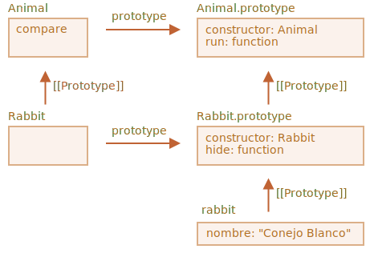

# Propiedades y métodos estáticos.

También podemos asignar métodos a la funcionalidad de una clase en sí, no a su `"prototype"`. Dichos métodos se llaman *static*.

En una clase, están precedidos por la palabra clave `static`, como esta:

```js run
class User {
*!*
  static staticMethod() {
*/!*
    alert(this === User);
  }
}

User.staticMethod(); // verdadero
```

Eso realmente hace lo mismo que asignarlo como una propiedad directamente:

```js run
class User { }

User.staticMethod = function() {
  alert(this === User);
};

User.staticMethod(); // verdadero
```

El valor de `this` en la llamada `User.staticMethod()` es el mismo constructor de clase `User` (la regla "objeto antes de punto").

Por lo general, los métodos estáticos se utilizan para implementar funciones que pertenecen a la clase, pero no a ningún objeto particular de la misma.

Por ejemplo, tenemos objetos `Article` y necesitamos una función para compararlos. Una solución natural sería agregar el método `Article.compare`, como este:

```js run
class Article {
  constructor(title, date) {
    this.title = title;
    this.date = date;
  }

*!*
  static compare(articleA, articleB) {
    return articleA.date - articleB.date;
  }
*/!*
}

// uso
let articles = [
  new Article("HTML", new Date(2019, 1, 1)),
  new Article("CSS", new Date(2019, 0, 1)),
  new Article("JavaScript", new Date(2019, 11, 1))
];

*!*
articles.sort(Article.compare);
*/!*

alert( articles[0].title ); // CSS
```

Aquí `Article.compare` se encuentra "encima" de los artículos, como un medio para compararlos. No es el método de un artículo, sino de toda la clase.

Otro ejemplo sería un método llamado "factory". Imagina, necesitamos pocas formas para crear un artículo:

1. Crearlo por parámetros dados (`title`,`date` etc.).
2. Crear un artículo vacío con la fecha de hoy.
3. ... o cualquier otra manera.

La primera forma puede ser implementada por el constructor. Y para el segundo podemos hacer un método estático de la clase.

Al igual que `Article.createTodays()` aquí:

```js run
class Article {
  constructor(title, date) {
    this.title = title;
    this.date = date;
  }

*!*
  static createTodays() {
    // recuerda, this = Article
    return new this("Resumen de hoy", new Date());
  }
*/!*
}

let article = Article.createTodays();

alert( article.title ); // Resumen de hoy
```

Ahora, cada vez que necesitamos crear un resumen de hoy, podemos llamar a `Article.createTodays()`. Una vez más, ese no es el método de un objeto artículo, sino el método de toda la clase.

Los métodos estáticos también se utilizan en clases relacionadas con base de datos para buscar/guardar/eliminar entradas de la misma, como esta:

```js
// suponiendo que el artículo es una clase especial para gestionar artículos
// método estático para eliminar el artículo:
Article.remove({id: 12345});
```

## Propiedades estáticas

[recent browser=Chrome]

Las propiedades estáticas también son posibles, se ven como propiedades de clase regular, pero precedidas por `static`:

```js run
class Article {
  static publisher = "Ilya Kantor";
}

alert( Article.publisher ); // Ilya Kantor
```

Eso es lo mismo que una asignación directa a `Article`:

```js
Article.publisher = "Ilya Kantor";
```

## Herencia de propiedades y métodos estáticos.

Las propiedades y métodos estáticos son heredados.

Por ejemplo, `Animal.compare` y `Animal.planet` en el siguiente código son heredados y accesibles como `Rabbit.compare` y `Rabbit.planet`:

```js run
class Animal {
  static planet = "Tierra";

  constructor(name, speed) {
    this.speed = speed;
    this.name = name;
  }

  run(speed = 0) {
    this.speed += speed;
    alert(`${this.name} corre a una velocidad de ${this.speed}.`);
  }

*!*
  static compare(animalA, animalB) {
    return animalA.speed - animalB.speed;
  }
*/!*

}

// Hereda de Animal
class Rabbit extends Animal {
  hide() {
    alert(`${this.name} se esconde!`);
  }
}

let rabbits = [
  new Rabbit("Conejo Blanco", 10),
  new Rabbit("Conejo Negro", 5)
];

*!*
rabbits.sort(Rabbit.compare);
*/!*

rabbits[0].run(); // Conejo Negro corre a una velocidad de 5.

alert(Rabbit.planet); // Tierra
```

Ahora, cuando llamemos a `Rabbit.compare`, se llamará a `Animal.compare` heredado.

¿Como funciona? Nuevamente, usando prototipos. Como ya habrás adivinado, `extends` da a `Rabbit` el `[[Prototype]]` referente a `Animal`.



Entonces, `Rabbit extends Animal` crea dos referencias `[[Prototype]]`:

1. La función `Rabbit` se hereda prototípicamente de la función `Animal`.
2. `Rabbit.prototype` prototípicamente hereda de `Animal.prototype`.

Como resultado, la herencia funciona tanto para métodos regulares como estáticos.

Verifiquemos eso por código, aquí:

```js run
class Animal {}
class Rabbit extends Animal {}

// para la estática
alert(Rabbit.__proto__ === Animal); // verdadero

// para métodos regulares
alert(Rabbit.prototype.__proto__ === Animal.prototype); // verdadero
```

## Resumen

Los métodos estáticos se utilizan en la funcionalidad propia de la clase "en su conjunto". No se relaciona con una instancia de clase concreta.

Por ejemplo, un método para comparar `Article.compare (article1, article2)` o un método de fábrica `Article.createTodays()`.

Están etiquetados por la palabra `static` en la declaración de clase.

Las propiedades estáticas se utilizan cuando queremos almacenar datos a nivel de clase, también no vinculados a una instancia.

La sintaxis es:

```js
class MyClass {
  static property = ...;

  static method() {
    ...
  }
}
```

Técnicamente, la declaración estática es lo mismo que asignar a la clase misma:

```js
MyClass.property = ...
MyClass.method = ...
```

Las propiedades y métodos estáticos se heredan.

Para `class B extends A` el prototipo de la clase `B` en sí mismo apunta a `A`: `B.[[Prototipo]] = A`. Entonces, si no se encuentra un campo en `B`, la búsqueda continúa en `A`.
