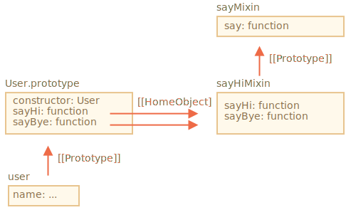

# Los Mixins

En JavaScript podemos heredar de un solo objeto. Solo puede haber un `[[Prototype]]` para un objeto. Y una clase puede extender únicamente otra clase.

Pero a veces eso se siente restrictivo. Por ejemplo, tenemos una clase `StreetSweeper` y una clase `Bicycle`, y queremos hacer su combinación: un `StreetSweepingBicycle`.

O tenemos una clase `User` y una clase `EventEmitter` que implementa la generación de eventos, y nos gustaría agregar la funcionalidad de `EventEmitter` a `User`, para que nuestros usuarios puedan emitir eventos.

Hay un concepto que puede ayudar aquí, llamado "mixins".

Como se define en Wikipedia, un [mixin](https://es.wikipedia.org/wiki/Mixin) es una clase que contiene métodos que pueden ser utilizados por otras clases sin necesidad de heredar de ella.

En otras palabras, un *mixin* proporciona métodos que implementan cierto comportamiento, pero su uso no es exclusivo, lo usamos para agregar el comportamiento a otras clases.

## Un ejemplo de mixin

La forma más sencilla de implementar un mixin en JavaScript es hacer un objeto con métodos útiles, para que podamos combinarlos fácilmente en un prototipo de cualquier clase.

Por ejemplo, aquí el mixin `sayHiMixin` se usa para agregar algo de "diálogo" a `User`:

```js run
*!*
// mixin
*/!*
let sayHiMixin = {
  sayHi() {
    alert(`Hola ${this.name}`);
  },
  sayBye() {
    alert(`Adiós ${this.name}`);
  }
};

*!*
// uso:
*/!*
class User {
  constructor(name) {
    this.name = name;
  }
}

// copia los métodos
Object.assign(User.prototype, sayHiMixin);

// Ahora el User puede decir hola
new User("tío").sayHi(); // Hola tío!
```

No hay herencia, sino un simple método de copia. Entonces, `User` puede heredar de otra clase y también incluir el mixin para "mezclar" los métodos adicionales, como este:

```js
class User extends Person {
  // ...
}

Object.assign(User.prototype, sayHiMixin);
```

Los mixins pueden hacer uso de la herencia dentro de sí mismos.

Por ejemplo, aquí `sayHiMixin` hereda de `sayMixin`:

```js run
let sayMixin = {
  say(phrase) {
    alert(phrase);
  }
};

let sayHiMixin = {
  __proto__: sayMixin, // (o podríamos usar Object.setPrototypeOf para configurar el prototype aquí)

  sayHi() {
    *!*
    // llama al método padre
    */!*
    super.say(`Hola ${this.name}`); // (*)
  },
  sayBye() {
    super.say(`Adios ${this.name}`); // (*)
  }
};

class User {
  constructor(name) {
    this.name = name;
  }
}

// copia los métodos
Object.assign(User.prototype, sayHiMixin);

// User ahora puede decir hola
new User("tío").sayHi(); // Hola tío!
```

Ten en cuenta que la llamada al método padre `super.say()` de `sayHiMixin` (en las líneas etiquetadas con `(*)`) busca el método en el prototipo de ese mixin, no en la clase.

Aquí está el diagrama (ver la parte derecha):



Esto se debe a que los métodos `sayHi` y `sayBye` se crearon inicialmente en `sayHiMixin`. Entonces, a pesar de que se copiaron, su propiedad interna `[[[HomeObject]]` hace referencia a `sayHiMixin`, como se muestra en la imagen de arriba.

Como `super` busca métodos primarios en `[[HomeObject]].[[Prototype]]`,  significa que busca `sayHiMixin.[[Prototype]]`, no `User.[[Prototype]]`.

## EventMixin

Ahora hagamos un mixin para la vida real.

Una característica importante de muchos objetos del navegador (por ejemplo) es que pueden generar eventos. Los eventos son una excelente manera de "transmitir información" a cualquiera que lo desee. Así que hagamos un mixin que nos permita agregar fácilmente funciones relacionadas con eventos a cualquier clase/objeto.

- El mixin proporcionará un método `.trigger(name, [...data])` para "generar un evento" cuando le ocurra algo importante. El argumento `name` es un nombre del evento, opcionalmente seguido de argumentos adicionales con datos del evento.
- También el método `.on(name, handler)` que agrega la función `handler` como listener a eventos con el nombre dado. Se llamará cuando se desencadene un evento con el nombre `name` dado, y obtenga los argumentos de la llamada `.trigger`.
- ...Y el método `.off(name, handler)` que elimina el listener `handler`.

Después de agregar el mixin, un objeto `user` podrá generar un evento `"login"` cuando el visitante inicie sesión. Y otro objeto, por ejemplo, `calendar` puede querer escuchar dichos eventos para cargar el calendario para el persona registrada.

O bien, un `menu` puede generar el evento `"seleccionar"` cuando se selecciona un elemento del menú, y otros objetos pueden asignar controladores para reaccionar ante ese evento. Y así.

Aquí está el código:

```js run
let eventMixin = {
  /**
   * Suscribe al evento, uso:
   *  menu.on('select', function(item) { ... }
  */
  on(eventName, handler) {
    if (!this._eventHandlers) this._eventHandlers = {};
    if (!this._eventHandlers[eventName]) {
      this._eventHandlers[eventName] = [];
    }
    this._eventHandlers[eventName].push(handler);
  },

  /**
   * Cancelar la suscripción, uso:
   *  menu.off('select', handler)
   */
  off(eventName, handler) {
    let handlers = this._eventHandlers?.[eventName];
    if (!handlers) return;
    for (let i = 0; i < handlers.length; i++) {
      if (handlers[i] === handler) {
        handlers.splice(i--, 1);
      }
    }
  },

  /**
   * Generar un evento con el nombre y los datos
   *  this.trigger('select', data1, data2);
   */
  trigger(eventName, ...args) {
   if (!this._eventHandlers?.[eventName]) {
      return; // no hay controladores para ese nombre de evento
    }

    // Llama al controlador
    this._eventHandlers[eventName].forEach(handler => handler.apply(this, args));
  }
};
```


- `.on(eventName, handler)`: asigna la función `handler` para que se ejecute cuando se produce el evento con ese nombre. Técnicamente, hay una propiedad `_eventHandlers` que almacena una matriz de controladores para cada nombre de evento, y simplemente la agrega a la lista.
- `.off(eventName, handler)` - elimina la función de la lista de controladores.
- `.trigger(eventName, ...args)` - genera el evento: se llama a todos los controladores de `_eventHandlers[eventName]`, con una lista de argumentos `...args`.

Uso:

```js run
// Construir una clase
class Menu {
  choose(value) {
    this.trigger("select", value);
  }
}
// Agrega el mixin con métodos relacionados con eventos
Object.assign(Menu.prototype, eventMixin);

let menu = new Menu();

// agrega un controlador, que se llamará en la selección:
*!*
menu.on("select", value => alert(`Valor seleccionado: ${value}`));
*/!*

// desencadena el evento => el controlador anterior se ejecuta y muestra:
// Valor seleccionado: 123
menu.choose("123");
```

Ahora, si queremos que el código reaccione a una selección de menú, podemos escucharlo con `menu.on(...)`.

Y el mixin de `eventMixin`  hace que sea fácil agregar ese comportamiento a tantas clases como queramos, sin interferir con la cadena de herencia.

## Resumen

*Mixin* -- es un término genérico de programación orientado a objetos: una clase que contiene métodos para otras clases.

Algunos lenguajes permiten la herencia múltiple. JavaScript no admite la herencia múltiple, pero los mixins se pueden implementar copiando métodos en el prototipo.

Podemos usar mixins como una forma de expandir una clase agregando múltiples comportamientos, como el manejo de eventos que hemos visto anteriormente.

Los mixins pueden convertirse en un punto de conflicto si sobrescriben accidentalmente los métodos de clase existentes. Por lo tanto, generalmente debes planificar correctamente la definición de métodos de un mixin, para minimizar la probabilidad de que suceda.
