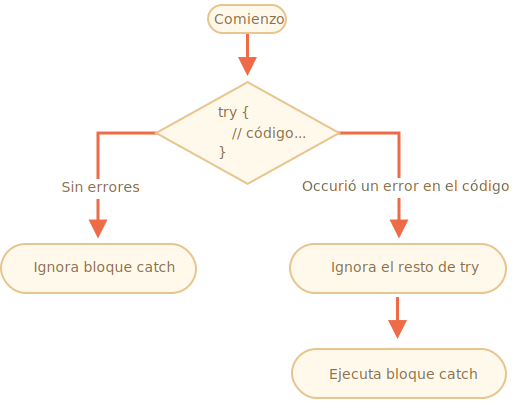

# Manejo de errores, "try..catch"

No importa lo buenos que seamos en la programación, a veces nuestros scripts tienen errores. Pueden ocurrir debido a nuestros descuidos, una entrada inesperada del usuario, una respuesta errónea del servidor y por miles de otras razones.

Por lo general, un script "muere" (se detiene inmediatamente) en caso de error, imprimiéndolo en la consola.

Pero hay una construcción de sintaxis `try..catch` que nos permite "atrapar" errores para que el script pueda, en lugar de morir, hacer algo más razonable.

## La sintaxis "try..catch"

La construcción `try..catch` tiene dos bloques principales: `try`, y luego `catch`:

```js
try {

  // codigo...

} catch (err) {

  // manipualción de error

}
```

Funciona así:

1. Primero, se ejecuta el código en `try {...}`.
2. Si no hubo errores, se ignora `catch(err)`: la ejecución llega al final de `try` y continúa, omitiendo `catch`.
3. Si se produce un error, la ejecución de `try` se detiene y el control fluye al comienzo de `catch(err)`. La variable `err` (podemos usar cualquier nombre para ella) contendrá un objeto de error con detalles sobre lo que sucedió.



Entonces, un error dentro del bloque `try {...}` no mata el script; tenemos la oportunidad de manejarlo en `catch`.

Veamos algunos ejemplos.

- Un ejemplo sin errores: muestra `alert` `(1)` y `(2)`:

    ```js run
    try {

      alert('Inicio de intentos de prueba');  // *!*(1) <--*/!*

      // ...no hay errores aquí

      alert('Fin de las corridas de prueba');   // *!*(2) <--*/!*

    } catch(err) {

      alert('Se ignora la captura porque no hay errores'); // (3)

    }
    ```
- Un ejemplo con un error: muestra `(1)` y `(3)`:

    ```js run
    try {

      alert('Inicio de intentos de prueba');  // *!*(1) <--*/!*

    *!*
      lalala; // error, variable no está definida!
    */!*

      alert('Fin del intento (nunca alcanzado)');  // (2)

    } catch(err) {

      alert(`¡Un error ha ocurrido!`); // *!*(3) <--*/!*

    }
    ```


````warn header="`try..catch` solo funciona para errores de tiempo de ejecución"
Para que `try..catch` funcione, el código debe ser ejecutable. En otras palabras, debería ser JavaScript válido.

No funcionará si el código es sintácticamente incorrecto, por ejemplo, tiene llaves sin cerrar:

```js run
try {
  {{{{{{{{{{{{
} catch(e) {
  alert("El motor no puede entender este código, no es válido.");
}
```

El motor de JavaScript primero lee el código y luego lo ejecuta. Los errores que ocurren en la fase de lectura se denominan errores de "tiempo de análisis" y son irrecuperables (desde dentro de ese código). Eso es porque el motor no puede entender el código.

Entonces, `try..catch` solo puede manejar errores que ocurren en un código válido. Dichos errores se denominan "errores de tiempo de ejecución" o, a veces, "excepciones".
````


````warn header="`try..catch` trabaja sincrónicamente"
Si ocurre una excepción en el código "programado", como en `setTimeout`, entonces `try..catch` no lo detectará:

```js run
try {
  setTimeout(function() {
    noSuchVariable; // el script morirá aquí
  }, 1000);
} catch (e) {
  alert( "no funcionará" );
}
```

Esto se debe a que la función en sí misma se ejecuta más tarde, cuando el motor ya ha abandonado la construcción `try..catch`.

Para detectar una excepción dentro de una función programada, `try..catch` debe estar dentro de esa función:
```js run
setTimeout(function() {
  try {    
    noSuchVariable; // try..catch maneja el error!
  } catch {
    alert( "El error se detecta aquí!" );
  }
}, 1000);
```
````

## Objeto Error

Cuando se produce un error, JavaScript genera un objeto que contiene los detalles al respecto. El objeto se pasa como argumento para `catch`:

```js
try {
  // ...
} catch(err) { // <-- el "objeto error", podría usar otra palabra en lugar de err
  // ...
}
```

Para todos los errores integrados, el objeto error tiene dos propiedades principales:

`name`
: Nombre de error. Por ejemplo, para una variable indefinida que es `"ReferenceError"`.

`message`
: Mensaje de texto sobre detalles del error.

Hay otras propiedades no estándar disponibles en la mayoría de los entornos. Uno de los más utilizados y compatibles es:

`stack`
: Pila de llamadas actual: una cadena con información sobre la secuencia de llamadas anidadas que condujeron al error. Utilizado para fines de depuración.

Por ejemplo:

```js run untrusted
try {
*!*
  lalala; // error, variable no está definida!
*/!*
} catch(err) {
  alert(err.name); // ReferenceError
  alert(err.message); // lalala no está definida!
  alert(err.stack); // ReferenceError: lalala no está definida en (...call stack)

  // También puede mostrar un error como un todo
  // El error se convierte en cadena como "nombre: mensaje" alert(err); // ReferenceError: lalala no está definido
}
```

## Omitiendo "catch" obligatorio

[recent browser=new]

Si no necesitamos detalles del error, `catch` puede omitirlo:

```js
try {
  // ...
} catch { // <-- sin (err)
  // ...
}
```

## Usando "try..catch"

Exploremos un caso de uso de la vida real de `try..catch`.

Como ya sabemos, JavaScript admite el método [JSON.parse(str)](mdn:js/JSON/parse) para leer valores codificados con JSON.

Por lo general, se utiliza para decodificar datos recibidos a través de la red, desde el servidor u otra fuente.

Lo recibimos y llamamos a `JSON.parse` así:

```js run
let json = '{"name":"John", "age": 30}'; // datos del servidor

*!*
let user = JSON.parse(json); // convierte la representación de texto a objeto JS
*/!*

// ahora user es un objeto con propiedades de la cadena
alert( user.name ); // John
alert( user.age );  // 30
```

Puede encontrar información más detallada sobre JSON en el capítulo <info:json>.

**Si `json` está mal formado, `JSON.parse` genera un error, por lo que el script "muere".**

¿Deberíamos estar satisfechos con eso? ¡Por supuesto no!

De esta manera, si algo anda mal con los datos, el visitante nunca lo sabrá (a menos que abra la consola del desarrollador). Y a la gente realmente no le gusta cuando algo "simplemente muere" sin ningún mensaje de error.

Usemos `try..catch` para manejar el error:

```js run
let json = "{ json malo }";

try {

*!*
  let user = JSON.parse(json); // <-- cuando ocurre un error ...
*/!*
  alert( user.name ); // no funciona

} catch (e) {
*!*
  // ...la ejecución salta aquí
  alert( "Nuestras disculpas, los datos tienen errores, intentaremos solicitarlos una vez más." );
  alert( e.name );
  alert( e.message );
*/!*
}
```

Aquí usamos el bloque `catch` solo para mostrar el mensaje, pero podemos hacer mucho más: enviar una nueva solicitud de red, sugerir una alternativa al visitante, enviar información sobre el error a una instalación de registro, .... Todo mucho mejor que solo morir.

## Lanzando nuestros propios errores

¿Qué sucede si `json` es sintácticamente correcto, pero no tiene una propiedad requerida de `name`?

Como este:

```js run
let json = '{ "age": 30 }'; // dato incompleto

try {

  let user = JSON.parse(json); // <-- sin errores
*!*
  alert( user.name ); // sin nombre!
*/!*

} catch (e) {
  alert( "no se ejecuta" );
}
```

Aquí `JSON.parse` se ejecuta normalmente, pero la ausencia de `name` es en realidad un error nuestro.

Para unificar el manejo de errores, usaremos el operador `throw`.

### El operador "throw" 

El operador `throw` genera un error.

La sintaxis es:

```js
throw <error object>
```

Técnicamente, podemos usar cualquier cosa como un objeto error. Eso puede ser incluso un primitivo, como un número o una cadena, pero es mejor usar objetos, preferiblemente con propiedades `name` y `message` (para mantenerse algo compatible con los errores incorporados).

JavaScript tiene muchos constructores integrados para errores estándar: `Error`, `SyntaxError`, `ReferenceError`, `TypeError` y otros. Podemos usarlos para crear objetos de error también.

Su sintaxis es:

```js
let error = new Error(message);
// or
let error = new SyntaxError(message);
let error = new ReferenceError(message);
// ...
```

Para errores incorporados (no para cualquier objeto, solo para errores), la propiedad `name` es exactamente el nombre del constructor. Y `mensaje` se toma del argumento.

Por ejemplo:

```js run
let error = new Error("Las cosas pasan o_O");

alert(error.name); // Error
alert(error.message); // Las cosas pasan o_O
```

Veamos qué tipo de error genera `JSON.parse`:

```js run
try {
  JSON.parse("{ json malo o_O }");
} catch(e) {
*!*
  alert(e.name); // SyntaxError
*/!*
  alert(e.message); // Token b inesperado en JSON en la posición 2
}
```

Como podemos ver, ese es un `SyntaxError`.

Y en nuestro caso, la ausencia de `name` es un error, ya que los usuarios deben tener un `name`.

Así que vamos a lanzarlo:

```js run
let json = '{ "age": 30 }'; // dato incompleto

try {

  let user = JSON.parse(json); // <-- sin errores

  if (!user.name) {
*!*
    throw new SyntaxError("dato incompleto: sin nombre"); // (*)
*/!*
  }

  alert( user.name );

} catch(e) {
  alert( "Error en JSON: " + e.message ); // Error en JSON: dato incompleto: sin nombre
}
```

En la línea `(*)`, el operador `throw` genera un `SyntaxError` con el `message` dado, de la misma manera que JavaScript lo generaría él mismo. La ejecución de `try` se detiene inmediatamente y el flujo de control salta a `catch`.

Ahora `catch` se convirtió en un lugar único para todo el manejo de errores: tanto para `JSON.parse` como para otros casos.

## Relanzando

En el ejemplo anterior usamos `try..catch` para manejar datos incorrectos. Pero, ¿es posible que *ocurra otro error inesperado* dentro del bloque `try{...}`? Como un error de programación (la variable no está definida) o algo más, no solo esta cosa de "datos incorrectos".

Por ejemplo:

```js run
let json = '{ "age": 30 }'; // dato incompleto

try {
  user = JSON.parse(json); // <-- olvidé poner "let" antes del usuario

  // ...
} catch(err) {
  alert("Error en JSON: " + err); // Error en JSON: ReferenceError: user no está definido
  // (sin error JSON en realidad)
}
```

¡Por supuesto, todo es posible! Los programadores cometen errores. Incluso en las utilidades de código abierto utilizadas por millones durante décadas, de repente se puede descubrir un error que conduce a hacks terribles.

En nuestro caso, `try..catch` está destinado a detectar errores de "datos incorrectos". Pero por su naturaleza, `catch` obtiene *todos* los errores de `try`. Aquí recibe un error inesperado, pero aún muestra el mismo mensaje de "Error en JSON". Eso está mal y también hace que el código sea más difícil de depurar.

Afortunadamente, podemos averiguar qué error obtenemos, por ejemplo, de su `name`:

```js run
try {
  user = { /*...*/ };
} catch(e) {
*!*
  alert(e.name); // "ReferenceError" para acceder a una variable indefinida
*/!*
}
```

La regla es simple:

**Catch solo debe procesar los errores que conoce y "volver a lanzar" a todos los demás.**

La técnica de "rethrowing" se puede explicar con más detalle como:

1. Catch obtiene todos los errores.
2. En el bloque `catch(err) {...}` analizamos el objeto error `err`.
2. Si no sabemos cómo manejarlo, hacemos `throw err`.

En el siguiente código, usamos el relanzamiento para que `catch` solo maneje `SyntaxError`:

```js run
let json = '{ "age": 30 }'; // dato incompleto
try {

  let user = JSON.parse(json);

  if (!user.name) {
    throw new SyntaxError("dato incompleto: sin nombre");
  }

*!*
  blabla(); // error inesperado
*/!*

  alert( user.name );

} catch(e) {

*!*
  if (e.name == "SyntaxError") {
    alert( "Error en JSON: " + e.message );
  } else {
    throw e; // rethrow (*)
  }
*/!*

}
```

El error lanzado en la línea `(*)` desde dentro del bloque `catch` "cae" desde `try..catch` y puede ser atrapado por una construcción externa `try..catch` (si existe), o mata el script.

Por lo tanto, el bloque `catch` en realidad maneja solo los errores con los que sabe cómo lidiar y "omite" todos los demás.

El siguiente ejemplo demuestra cómo dichos errores pueden ser detectados por un nivel más de `try..catch`:

```js run
function readData() {
  let json = '{ "age": 30 }';

  try {
    // ...
*!*
    blabla(); // error!
*/!*
  } catch (e) {
    // ...
    if (e.name != 'SyntaxError') {
*!*
      throw e; // volver a lanzar (no sé cómo lidiar con eso)
*/!*
    }
  }
}

try {
  readData();
} catch (e) {
*!*
  alert( "La captura externa tiene: " + e ); // capturado!
*/!*
}
```

Aquí `readData` solo sabe cómo manejar `SyntaxError`, mientras que el `try..catch` externo sabe cómo manejar todo.

## try..catch..finally

Espera, eso no es todo.

La construcción `try..catch` puede tener una cláusula de código más: `finally`.

Si existe, se ejecuta en todos los casos:

- después de `try`, si no hubo errores,
- después de `catch`, si hubo errores.

La sintaxis extendida se ve así:

```js
*!*try*/!* {
   ... intenta ejecutar el código ...
} *!*catch*/!*(e) {
   ... capturar errores ...
} *!*finally*/!* {
   ... ejecutar siempre ...
}
```

Intenta ejecutar este código:

```js run
try {
  alert( 'intento' );
  if (confirm('¿Cometer un error?')) BAD_CODE();
} catch (e) {
  alert( 'atrapa' );
} finally {
  alert( 'finalmente' );
}
```

El código tiene dos formas de ejecución:

1. Si responde "Sí" a "¿Cometer un error?", Entonces `try -> catch -> finally`.
2. Si dice "No", entonces `try -> finally`.

La cláusula `finally` a menudo se usa cuando comenzamos a hacer algo y queremos finalizarlo en cualquier caso de resultado.

Por ejemplo, queremos medir el tiempo que tarda una función de números de Fibonacci `fib(n)`. Naturalmente, podemos comenzar a medir antes de que se ejecute y terminar después. ¿Pero qué pasa si hay un error durante la llamada a la función? En particular, la implementación de `fib(n)` en el código siguiente devuelve un error para números negativos o no enteros.

La cláusula `finally` es un excelente lugar para terminar las mediciones, pase lo que pase.

Aquí `finally` garantiza que el tiempo se medirá correctamente en ambas situaciones, en caso de una ejecución exitosa de `fib` y en caso de error:

```js run
let num = +prompt("Ingrese un número entero positivo?", 35)

let diff, result;

function fib(n) {
  if (n < 0 || Math.trunc(n) != n) {
    throw new Error("Debe ser un número positivo y entero.");
  }
  return n <= 1 ? n : fib(n - 1) + fib(n - 2);
}

let start = Date.now();

try {
  result = fib(num);
} catch (e) {
  result = 0;
*!*
} finally {
  diff = Date.now() - start;
}
*/!*

alert(result || "error ocurrido");

alert( `la ejecución tomó ${diff}ms` );
```

Puede verificar ejecutando el código ingresando `35` en `prompt`; se ejecuta normalmente, `finalmente` después de `try`. Y luego ingrese `-1` - habrá un error inmediato, y la ejecución tomará `0ms`. Ambas mediciones se realizan correctamente.

En otras palabras, la función puede terminar con `return` o `throw`, eso no importa. La cláusula `finally` se ejecuta en ambos casos.


```smart header="Las variables son locales dentro de `try..catch..finally`"
Tenga en cuenta que las variables `result` y `diff` en el código anterior se declaran *antes de* `try..catch`.

De lo contrario, si declaramos `let` en el bloque `try`, solo sería visible dentro de él.
```

````smart header="`finally` y `return`"
La cláusula `finally` funciona para *cualquier* salida de `try..catch`. Eso incluye un `return` explícito.

En el ejemplo a continuación, hay un `return` en `try`. En este caso, `finally` se ejecuta justo antes de que el control regrese al código externo.

```js run
function func() {

  try {
*!*
    return 1;
*/!*

  } catch (e) {
    /* ... */
  } finally {
*!*
    alert( 'finalmente' );
*/!*
  }
}

alert( func() ); // primero funciona la alerta de "finally", y luego este
```
````

````smart header="`try..finally`"

La construcción `try..finally`, sin la cláusula `catch`, también es útil. Lo aplicamos cuando no queremos manejar los errores aquí (dejarlos caer), pero queremos asegurarnos de que los procesos que comenzamos estén finalizados.

```js
function func() {
  // comenzar a hacer algo que necesita ser completado (como mediciones)
  try {
    // ...
  } finally {
    // completar esa cosa incluso si todo muere
  }
}
```
En el código anterior, siempre se produce un error dentro de `try`, porque no hay `catch`. Pero `finally` funciona antes de que el flujo de ejecución abandone la función.
````

## Captura global

```warn header="Específico del entorno"
La información de esta sección no es parte del núcleo de JavaScript.
```

Imaginemos que tenemos un error fatal fuera de `try..catch`, y el script murió. Como un error de programación o alguna otra cosa terrible.

¿Hay alguna manera de reaccionar ante tales ocurrencias? Es posible que queramos registrar el error, mostrarle algo al usuario (normalmente no ve mensajes de error), etc.

No hay ninguna en la especificación, pero los entornos generalmente lo proporcionan, porque es realmente útil. Por ejemplo, Node.js tiene [`process.on("uncaughtException")`](https://nodejs.org/api/process.html#process_event_uncaughtexception) para eso. Y en el navegador podemos asignar una función a la propiedad especial [window.onerror](mdn:api/GlobalEventHandlers/onerror), que se ejecutará en caso de un error no detectado.

La sintaxis:

```js
window.onerror = function(message, url, line, col, error) {
  // ...
};
```

`message`
: Mensaje de error.

`url`
: URL del script donde ocurrió el error.

`line`, `col`
: Números de línea y columna donde ocurrió el error.

`error`
: El objeto error.

Por ejemplo:

```html run untrusted refresh height=1
<script>
*!*
  window.onerror = function(message, url, line, col, error) {
    alert(`${message}\n At ${line}:${col} of ${url}`);
  };
*/!*

  function readData() {
    badFunc(); // ¡Vaya, algo salió mal!
  }

  readData();
</script>
```

El rol del controlador global `window.onerror` generalmente no es recuperar la ejecución del script, probablemente sea imposible en caso de errores de programación, pero si enviar el mensaje de error a los desarrolladores.

También hay servicios web que proporcionan registro de errores para tales casos, como <https://errorception.com> o <http://www.muscula.com>.

Ellos trabajan asi:

1. Nos registramos en el servicio y obtenemos un fragmento de JS (o una URL de script) para insertar en las páginas.
2. Ese script JS establece una función personalizada `window.onerror`.
3. Cuando se produce un error, envía una solicitud de red al servicio.
4. Podemos iniciar sesión en la interfaz web del servicio y ver errores.

## Resumen

La construcción `try..catch` permite manejar errores de tiempo de ejecución. Literalmente permite "intentar" ejecutar el código y "atrapar" errores que pueden ocurrir en él.

La sintaxis es:

```js
try {
  // ejecuta este código
} catch(err) {
  // si ocurrió un error, entonces salta aquí
  // err es el objeto error
} finally {
  // hacer en cualquier caso después de try/catch
}
```

Puede que no haya una sección `catch` o `finally`, por lo que las construcciones más cortas `try..catch` y `try..finally` también son válidas.

Los objetos Error tienen las siguientes propiedades:

- `message` -- el mensaje de error legible por humanos.
- `name` -- la cadena con el nombre del error (nombre del constructor de error).
- `stack` (No estándar, pero bien soportado) -- la pila en el momento de la creación del error.

Si no se necesita un objeto error, podemos omitirlo usando `catch {` en lugar de `catch(err) {`.

También podemos generar nuestros propios errores utilizando el operador `throw`. Técnicamente, el argumento de `throw` puede ser cualquier cosa, pero generalmente es un objeto error heredado de la clase incorporada `Error`. Más sobre la extensión de errores en el próximo capítulo.

*Relanzado* es un patrón muy importante de manejo de errores: un bloque `catch` generalmente espera y sabe cómo manejar el tipo de error en particular, por lo que debería volver a arrojar errores que no conoce.

Incluso si no tenemos `try..catch`, la mayoría de los entornos nos permiten configurar un controlador de errores "global" para detectar errores "desprendidos". En el navegador, eso es `window.onerror`.
