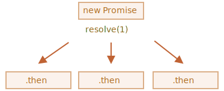
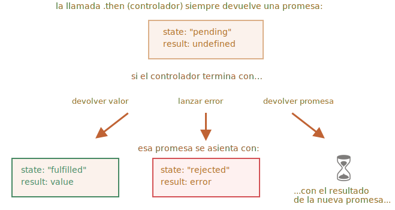

# Encadenamiento de promesas

Volvamos al problema mencionado en el capítulo <info:callbacks>: tenemos una secuencia de tareas asincrónicas que se realizarán una tras otra, por ejemplo, cargar scripts. ¿Cómo podemos codificarlo bien?

Las promesas proporcionan un par de recetas para hacer eso.

En este capítulo cubrimos el encadenamiento de promesas.

Se parece a esto:

```js run
new Promise(function(resolve, reject) {

  setTimeout(() => resolve(1), 1000); // (*)

}).then(function(result) { // (**)

  alert(result); // 1
  return result * 2;

}).then(function(result) { // (***)

  alert(result); // 2
  return result * 2;

}).then(function(result) {

  alert(result); // 4
  return result * 2;

});
```

La idea es que el resultado pase a través de la cadena de controladores `.then`.

Aquí el flujo es:
1. La promesa inicial se resuelve en 1 segundo `(*)`,
2. Entonces se llama el controlador `.then`  `(**) `.
3. El valor que devuelve se pasa al siguiente controlador `.then` `(***)`
4. ...y así.

A medida que el resultado se pasa a lo largo de la cadena de controladores, podemos ver una secuencia de llamadas de alerta: `1` -> `2` -> `4`.


Todo funciona, porque una llamada a `promise.then` devuelve una promesa, para que podamos llamar a la siguiente `.then`.

Cuando un controlador devuelve un valor, se convierte en el resultado de esa promesa, por lo que se llama al siguiente `.then`.

**Un error clásico de novato: técnicamente también podemos agregar muchos '.then' a una sola promesa. Esto no está encadenando.**

Por ejemplo:
```js run
let promise = new Promise(function(resolve, reject) {
  setTimeout(() => resolve(1), 1000);
});

promise.then(function(result) {
  alert(result); // 1
  return result * 2;
});

promise.then(function(result) {
  alert(result); // 1
  return result * 2;
});

promise.then(function(result) {
  alert(result); // 1
  return result * 2;
});
```

Lo que hicimos aquí fue varios controladores para una sola promesa. No se pasan el resultado el uno al otro; en su lugar lo procesan de forma independiente.

Aquí está la imagen (compárela con el encadenamiento anterior):



Todos los '.then' en la misma promesa obtienen el mismo resultado: el resultado de esa promesa. Entonces, en el código sobre todo `alert` muestra lo mismo: `1`.

En la práctica, rara vez necesitamos múltiples manejadores para una promesa. El encadenamiento se usa mucho más a menudo.

## Retornando promesas

Un controlador, utilizado en `.then(handler)` puede crear y devolver una promesa.

En ese caso, otros manejadores esperan hasta que se estabilice y luego obtienen su resultado.

Por ejemplo:

```js run
new Promise(function(resolve, reject) {

  setTimeout(() => resolve(1), 1000);

}).then(function(result) {

  alert(result); // 1

*!*
  return new Promise((resolve, reject) => { // (*)
    setTimeout(() => resolve(result * 2), 1000);
  });
*/!*

}).then(function(result) { // (**)

  alert(result); // 2

  return new Promise((resolve, reject) => {
    setTimeout(() => resolve(result * 2), 1000);
  });

}).then(function(result) {

  alert(result); // 4

});
```

Aquí el primer `.then` muestra `1` y devuelve `new Promise(...)` en la línea `(*)`. Después de un segundo, se resuelve, y el resultado (el argumento de `resolve`, aquí es `result * 2`) se pasa al controlador del segundo `.then`. Ese controlador está en la línea `(**)`, muestra `2` y hace lo mismo.

Por lo tanto, la salida es la misma que en el ejemplo anterior: 1 -> 2 -> 4, pero ahora con 1 segundo de retraso entre las llamadas de alerta.

Devolver las promesas nos permite construir cadenas de acciones asincrónicas.

## El ejemplo: loadScript

Usemos esta función con el `loadScript` prometido, definido en el [capítulo anterior](info:promise-basics#loadscript), para cargar los scripts uno por uno, en secuencia:

```js run
loadScript("/article/promise-chaining/one.js")
  .then(function(script) {
    return loadScript("/article/promise-chaining/two.js");
  })
  .then(function(script) {
    return loadScript("/article/promise-chaining/three.js");
  })
  .then(function(script) {
    // usar funciones declaradas en scripts
    // para mostrar que efectivamente cargaron
    one();
    two();
    three();
  });
```

Este código se puede acortar un poco con las funciones de flecha:

```js run
loadScript("/article/promise-chaining/one.js")
  .then(script => loadScript("/article/promise-chaining/two.js"))
  .then(script => loadScript("/article/promise-chaining/three.js"))
  .then(script => {
    // los scripts se cargan, podemos usar funciones declaradas allí
    one();
    two();
    three();
  });
```


Aquí cada llamada a `loadScript` devuelve una promesa, y el siguiente `.then` se ejecuta cuando se resuelve. Luego inicia la carga del siguiente script. Entonces los scripts se cargan uno tras otro.

Podemos agregar más acciones asincrónicas a la cadena. Tenga en cuenta que el código sigue siendo "plano": crece hacia abajo, no a la derecha. No hay signos de la "pirámide del destino".

Técnicamente, podríamos agregar `.then` directamente a cada `loadScript`, así:

```js run
loadScript("/article/promise-chaining/one.js").then(script1 => {
  loadScript("/article/promise-chaining/two.js").then(script2 => {
    loadScript("/article/promise-chaining/three.js").then(script3 => {
      // esta función tiene acceso a las variables script1, script2 y script3
      one();
      two();
      three();
    });
  });
});
```

Este código hace lo mismo: carga 3 scripts en secuencia. Pero "crece hacia la derecha". Entonces tenemos el mismo problema que con los callbacks.

Las personas que comienzan a usar promesas a veces no saben de encadenamiento, por lo que lo escriben de esta manera. En general, se prefiere el encadenamiento.

A veces está bien escribir `.then` directamente, porque la función anidada tiene acceso al ámbito externo. En el ejemplo anterior, el callback más anidado tiene acceso a todas las variables `script1`, `script2`, `script3`. Pero eso es una excepción más que una regla.


````smart header="Objetos Thenables"
Para ser precisos, un controlador puede devolver no exactamente una promesa, sino un objeto llamado "thenable", un objeto arbitrario que tiene un método `.then`. Será tratado de la misma manera que una promesa.

La idea es que las librerias de terceros puedan implementar sus propios objetos "compatibles con la promesa". Pueden tener un conjunto extendido de métodos, pero también pueden ser compatibles con las promesas nativas, porque implementan `.then`.

Aquí hay un ejemplo de un objeto que se puede guardar:

```js run
class Thenable {
  constructor(num) {
    this.num = num;
  }
  then(resolve, reject) {
    alert(resolve); // function() { código nativo }
    // resolve con this.num*2 después de 1 segundo
    setTimeout(() => resolve(this.num * 2), 1000); // (**)
  }
}

new Promise(resolve => resolve(1))
  .then(result => {
*!*
    return new Thenable(result); // (*)
*/!*
  })
  .then(alert); // muestra 2 después de 1000 ms
```

JavaScript comprueba el objeto devuelto por el controlador `.then` en la línea `(*)`: si tiene un método invocable llamado `then`, entonces llama a ese método que proporciona funciones nativas `resolve`, `accept` como argumentos (similar a un ejecutor) y espera hasta que se llame a uno de ellos. En el ejemplo anterior, se llama a `resolve(2)` después de 1 segundo `(**)`. Luego, el resultado se pasa más abajo en la cadena.

Esta característica nos permite integrar objetos personalizados con cadenas de promesa sin tener que heredar de `Promise`.
````


## Ejemplo más grande: fetch

En la interfaz de programación, las promesas a menudo se usan para solicitudes de red. Así que veamos un ejemplo extendido de eso.

Utilizaremos el método [fetch](info:fetch) para cargar la información sobre el usuario desde el servidor remoto. Tiene muchos parámetros opcionales cubiertos en [capítulos separados](info:fetch), pero la sintaxis básica es bastante simple:

```js
let promise = fetch(url);
```

Esto hace una solicitud de red a la `url` y devuelve una promesa. La promesa se resuelve con un objeto 'response' cuando el servidor remoto responde con encabezados, pero  *antes de que se descargue la respuesta completa*.

Para leer la respuesta completa, debemos llamar al método `response.text()`: devuelve una promesa que se resuelve cuando se descarga el texto completo del servidor remoto, con ese texto como resultado.

El siguiente código hace una solicitud a `user.json` y carga su texto desde el servidor:

```js run
fetch('/article/promise-chaining/user.json')
  // .a continuación, se ejecuta cuando el servidor remoto responde
  .then(function(response) {
    // response.text() devuelve una nueva promesa que se resuelve con el texto de respuesta completo
    // cuando se carga
    return response.text();
  })
  .then(function(text) {
    // ...y aquí está el contenido del archivo remoto
    alert(text); // {"nombre": "iliakan", isAdmin: true}
  });
```

El objeto `response` devuelto por `fetch` también incluye el método `response.json()` que lee los datos remotos y los analiza como JSON. En nuestro caso, eso es aún más conveniente, así que pasemos a ello.

También usaremos las funciones de flecha por brevedad:

```js run
// igual que el anterior, pero response.json() analiza el contenido remoto como JSON
fetch('/article/promise-chaining/user.json')
  .then(response => response.json())
  .then(user => alert(user.name)); // iliakan, tengo nombre de usuario
```

Ahora hagamos algo con el usuario cargado.

Por ejemplo, podemos hacer una solicitud más a GitHub, cargar el perfil de usuario y mostrar el avatar:

```js run
// Hacer una solicitud para user.json
fetch('/article/promise-chaining/user.json')
  // Cárgalo como json
  .then(response => response.json())
  // Hacer una solicitud a GitHub
  .then(user => fetch(`https://api.github.com/users/${user.name}`))
  // Cargue la respuesta como json
  .then(response => response.json())
  // Mostrar la imagen de avatar (githubUser.avatar_url) durante 3 segundos (tal vez animarla)
  .then(githubUser => {
    let img = document.createElement('img');
    img.src = githubUser.avatar_url;
    img.className = "promise-avatar-example";
    document.body.append(img);

    setTimeout(() => img.remove(), 3000); // (*)
  });
```

El código funciona; ver comentarios sobre los detalles. Sin embargo, hay un problema potencial, un error típico para aquellos que comienzan a usar promesas.

Mire la línea `(*)`: ¿cómo podemos hacer algo *después de* que el avatar haya terminado de mostrarse y se elimine? Por ejemplo, nos gustaría mostrar un formulario para editar ese usuario u otra cosa. A partir de ahora, no hay manera.

Para que la cadena sea extensible, debemos devolver una promesa que se resuelva cuando el avatar termine de mostrarse.

Como este:

```js run
fetch('/article/promise-chaining/user.json')
  .then(response => response.json())
  .then(user => fetch(`https://api.github.com/users/${user.name}`))
  .then(response => response.json())
*!*
  .then(githubUser => new Promise(function(resolve, reject) { // (*)
*/!*
    let img = document.createElement('img');
    img.src = githubUser.avatar_url;
    img.className = "promise-avatar-example";
    document.body.append(img);

    setTimeout(() => {
      img.remove();
*!*
      resolve(githubUser); // (**)
*/!*
    }, 3000);
  }))
  // se dispara después de 3 segundos
  .then(githubUser => alert(`Terminado de mostrar ${githubUser.name}`));
```

Es decir, el controlador `.then` en la línea `(*)` ahora devuelve `new Promise`, que se resuelve solo después de la llamada de `resolve(githubUser)` en `setTimeout` `(**)`. El siguiente '.then' en la cadena esperará eso.

Como buena práctica, una acción asincrónica siempre debe devolver una promesa. Eso hace posible planificar acciones posteriores; incluso si no planeamos extender la cadena ahora, es posible que la necesitemos más adelante.

Finalmente, podemos dividir el código en funciones reutilizables:

```js run
function loadJson(url) {
  return fetch(url)
    .then(response => response.json());
}

function loadGithubUser(name) {
  return fetch(`https://api.github.com/users/${name}`)
    .then(response => response.json());
}

function showAvatar(githubUser) {
  return new Promise(function(resolve, reject) {
    let img = document.createElement('img');
    img.src = githubUser.avatar_url;
    img.className = "promise-avatar-example";
    document.body.append(img);

    setTimeout(() => {
      img.remove();
      resolve(githubUser);
    }, 3000);
  });
}

// Úsalos:
loadJson('/article/promise-chaining/user.json')
  .then(user => loadGithubUser(user.name))
  .then(showAvatar)
  .then(githubUser => alert(`Finished showing ${githubUser.name}`));
  // ...
```

## Resumen

Si un controlador `.then` (o `catch/finally`, no importa) devuelve una promesa, el resto de la cadena espera hasta que se asiente. Cuando lo hace, su resultado (o error) se pasa más allá.

Aquí hay una imagen completa:


