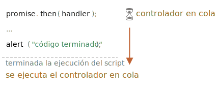

<<<<<<< HEAD
# Microtareas (Microtasks)
=======
# Microtasks
>>>>>>> fe571b36ed9e225f29239e82947005b08d74ac05

Los manejadores o controladores (en adelante controladores) de promesas `.then`/`.catch`/`.finally` son siempre asincrónicos.

<<<<<<< HEAD
Incluso cuando una promesa es inmediatamente resuelta, el código en las líneas *debajo de* `.then`/`.catch`/`.finally` se ejecutará antes que estos controladores.

Veamos una demostración:
=======
Even when a Promise is immediately resolved, the code on the lines *below* `.then`/`.catch`/`.finally` will still execute before these handlers.

Here's a demo:
>>>>>>> fe571b36ed9e225f29239e82947005b08d74ac05

```js run
let promise = Promise.resolve();

<<<<<<< HEAD
promise.then(() => alert("¡Promesa realizada!"));
=======
promise.then(() => alert("promise done!"));
>>>>>>> fe571b36ed9e225f29239e82947005b08d74ac05

alert("código finalizado"); // esta alerta se muestra primero
```

<<<<<<< HEAD
Si ejecutas esto, verás `código finalizado` primero, y después `¡promesa realizada!`.
=======
If you run it, you see `code finished` first, and then `promise done!`.
>>>>>>> fe571b36ed9e225f29239e82947005b08d74ac05

Es algo extraño, porque la promesa se realiza por completo desde el principio.

¿Por qué `.then` se disparó después? ¿Qué está pasando?

<<<<<<< HEAD
## Cola de microtareas (Microtasks queue)

Las tareas asincrónicas necesitan una gestión adecuada. Para ello, el estándar ECMA especifica una cola interna `PromiseJobs`, en ocasiones más conocida como "cola de microtareas" (término ES8).

Como se indica en la [especificación](https://tc39.github.io/ecma262/#sec-jobs-and-job-queues):
=======
## Microtasks queue

Asynchronous tasks need proper management. For that, the ECMA standard specifies an internal queue `PromiseJobs`, more often referred to as the "microtask queue" (ES8 term).

As stated in the [specification](https://tc39.github.io/ecma262/#sec-jobs-and-job-queues):
>>>>>>> fe571b36ed9e225f29239e82947005b08d74ac05

- La cola es first-in-first-out (FIFO), es decir, primero en entrar primero en salir: la tarea que entró primero en la cola, será la primera en ejecutarse.
- La ejecución de una tarea se inicia sólo cuando *no* se está ejecutando nada más.

<<<<<<< HEAD
O, en palabras más simples, cuando una promesa está lista, sus controladores `.then/catch/finally` se ponen en la cola; ellos aún no se ejecutan. Cuando el motor de Javascript se libera del código actual, toma una tarea de la cola y la ejecuta.
=======
Or, to say more simply, when a promise is ready, its `.then/catch/finally` handlers are put into the queue; they are not executed yet. When the JavaScript engine becomes free from the current code, it takes a task from the queue and executes it.
>>>>>>> fe571b36ed9e225f29239e82947005b08d74ac05

Es por eso que el "código finalizado" en el ejemplo anterior se muestra primero.



<<<<<<< HEAD
Los controladoes de promesas siempre pasan por esta cola interna.

Si hay una cadena con múltiples `.then/catch/finally`, entonces cada uno de ellos se ejecuta de forma asincrónica. Es decir, primero se pone en la cola, luego se ejecuta cuando se completa el código actual y se finalizan los controladores previamente en la cola.

**¿Qué pasa si lo que estamos pidiendo es importante? ¿Cómo podemos hacer que `código finalizado` se ejecute después de `¡promesa realizada!`?**
=======
Promise handlers always go through this internal queue.

If there's a chain with multiple `.then/catch/finally`, then every one of them is executed asynchronously. That is, it first gets queued, then executed when the current code is complete and previously queued handlers are finished.

**What if the order matters for us? How can we make `code finished` run after `promise done`?**
>>>>>>> fe571b36ed9e225f29239e82947005b08d74ac05

Fácil, solo ponlo en la cola con `.then`:

```js run
Promise.resolve()
  .then(() => alert("promesa realiazada!"))
  .then(() => alert("código finalizado"));
```

Ahora el orden es el previsto.

<<<<<<< HEAD
## Rechazo no controlado

Recuerdas el evento `unhandledrejection` del artículo <info:promise-error-handling>?

Ahora podemos ver exactamente cómo Javascript descubre que hubo un rechazo no controlado o *unhandled rejection*

**Se produce un "rechazo no controlado" cuando no se maneja un error de promesa al final de la cola de microtareas.**

Normalmente, si esperamos un error, agregamos `.catch` a la cadena de promesa para manejarlo:

```js run
let promise = Promise.reject(new Error("¡Promesa fallida!"));
*!*
promise.catch(err => alert('atrapado'));
*/!*

// no se ejecuta: error controlado
window.addEventListener('unhandledrejection', event => alert(event.reason));
```

Pero si olvidas añadir el `.catch`, entonces, después de que la cola de microtareas esté vacía, el motor activa el evento:

```js run
let promise = Promise.reject(new Error("¡Promesa fallida!"));

// Promesa fallida!
window.addEventListener('unhandledrejection', event => alert(event.reason));
```

¿Qué pasa si controlamos el error más tarde? Como esto:
=======
## Unhandled rejection

Remember the `unhandledrejection` event from the article <info:promise-error-handling>?

Now we can see exactly how JavaScript finds out that there was an unhandled rejection.

**An "unhandled rejection" occurs when a promise error is not handled at the end of the microtask queue.**

Normally, if we expect an error, we add `.catch` to the promise chain to handle it:

```js run
let promise = Promise.reject(new Error("Promise Failed!"));
*!*
promise.catch(err => alert('caught'));
*/!*

// doesn't run: error handled
window.addEventListener('unhandledrejection', event => alert(event.reason));
```

But if we forget to add `.catch`, then, after the microtask queue is empty, the engine triggers the event:

```js run
let promise = Promise.reject(new Error("Promise Failed!"));

// Promise Failed!
window.addEventListener('unhandledrejection', event => alert(event.reason));
```

What if we handle the error later? Like this:
>>>>>>> fe571b36ed9e225f29239e82947005b08d74ac05

```js run
let promise = Promise.reject(new Error("¡Promesa fallida!"));
*!*
<<<<<<< HEAD
setTimeout(() => promise.catch(err => alert('atrapado')), 1000);
=======
setTimeout(() => promise.catch(err => alert('caught')), 1000);
>>>>>>> fe571b36ed9e225f29239e82947005b08d74ac05
*/!*

// Error: ¡Promesa fallida!
window.addEventListener('unhandledrejection', event => alert(event.reason));
```

<<<<<<< HEAD
Ahora si lo ejecutamos, veremos `¡Promesa fallida!` primero y después `atrapado`.

Si no supiéramos acerca de la cola de microtareas podríamos preguntarnos: "¿Por qué se ejecutó el controlador `unhandledrejection`? ¡Capturamos y manejamos el error!

Pero ahora entendemos que `unhandledrejection` se genera cuando se completa la cola de microtareas: el motor examina las promesas y, si alguna de ellas está en el estado "rechazado", entonces el evento se dispara.

En el ejemplo anterior, `.catch` agregado por `setTimeout` también se dispara. Pero lo hace más tarde, después de que `unhandledrejection` ya ha ocurrido, por lo que no cambia nada.

## Resumen

El control de promesas siempre es asíncrono, ya que todas las acciones de promesa pasan por la cola interna de "PromiseJobs", también llamada "cola de microtareas" (término ES8).

Entonces, los controladores `.then/catch/finally` siempre se llaman después de que el código actual ha finalizado.

Si necesitamos garantizar que un código se ejecute después de `.then/catch/finally`, podemos agregarlo a una llamada encadenada `.then`.

En la mayoría de los motores de Javascript, incluidos los navegadores y Node.js, el concepto de microtareas está estrechamente relacionado con el "bucle de eventos" o "event loop" y "macrotareas" o "macrotasks". Como estos no tienen relación directa con las promesas, están cubiertos en otra parte del tutorial, en el artículo <info:event-loop>.
=======
Now, if we run it, we'll see `Promise Failed!` first and then `caught`.

If we didn't know about the microtasks queue, we could wonder: "Why did `unhandledrejection` handler run? We did catch and handle the error!"

But now we understand that `unhandledrejection` is generated when the microtask queue is complete: the engine examines promises and, if any of them is in the "rejected" state, then the event triggers.

In the example above, `.catch` added by `setTimeout` also triggers. But it does so later, after `unhandledrejection` has already occurred, so it doesn't change anything.

## Summary

Promise handling is always asynchronous, as all promise actions pass through the internal "promise jobs" queue, also called "microtask queue" (ES8 term).

So `.then/catch/finally` handlers are always called after the current code is finished.

If we need to guarantee that a piece of code is executed after `.then/catch/finally`, we can add it into a chained `.then` call.

In most Javascript engines, including browsers and Node.js, the concept of microtasks is closely tied with the "event loop" and "macrotasks". As these have no direct relation to promises, they are covered in another part of the tutorial, in the article <info:event-loop>.
>>>>>>> fe571b36ed9e225f29239e82947005b08d74ac05
