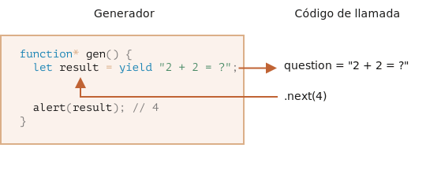
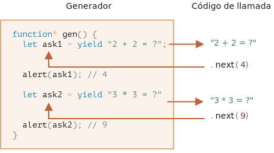

# Generadores

Las funciones regulares devuelven solo un valor único (o nada).

Los generadores pueden producir ("yield") múltiples valores, uno tras otro, a pedido. Funcionan muy bien con los [iterables](info:iterable), permitiendo crear flujos de datos con facilidad.

## Funciones Generadoras

Para crear un generador, necesitamos una construcción de sintaxis especial: `function*`, la llamada "función generadora".

Se parece a esto:

```js
function* generateSequence() {
  yield 1;
  yield 2;
  return 3;
}
```

Las funciones generadoras se comportan de manera diferente a las normales. Cuando se llama a dicha función, no ejecuta su código. En su lugar, devuelve un objeto especial, llamado "objeto generador", para gestionar la ejecución.

Echa un vistazo aquí:

```js run
function* generateSequence() {
  yield 1;
  yield 2;
  return 3;
}

// "función generadora" crea "objeto generador"
let generator = generateSequence();
*!*
alert(generator); // [object Generator]
*/!*
```

La ejecución del código de la función aún no ha comenzado:


El método principal de un generador es `next()`. Cuando se llama, se ejecuta hasta la declaración `yield <value>` más cercana (se puede omitir `value`, entonces será `undefined`). Luego, la ejecución de la función se detiene y el `value` obtenido se devuelve al código externo.

El resultado de `next()` es siempre un objeto con dos propiedades:
- `value`: el valor de yield.
- `done`: `true` si el código de la función ha terminado, de lo contrario `false`.

Por ejemplo, aquí creamos el generador y obtenemos su primer valor yield:

```js run
function* generateSequence() {
  yield 1;
  yield 2;
  return 3;
}

let generator = generateSequence();

*!*
let one = generator.next();
*/!*

alert(JSON.stringify(one)); // {value: 1, done: false}
```

A partir de ahora, obtuvimos solo el primer valor y la ejecución de la función está en la segunda línea:


Llamemos a `generator.next()` nuevamente. Reanuda la ejecución del código y devuelve el siguiente `yield`:

```js
let two = generator.next();

alert(JSON.stringify(two)); // {value: 2, done: false}
```


Y, si lo llamamos por tercera vez, la ejecución llega a la declaración `return` que finaliza la función:

```js
let three = generator.next();

alert(JSON.stringify(three)); // {value: 3, *!*done: true*/!*}
```


Ahora el generador está listo. Deberíamos verlo desde `done: true` y procesar `value: 3` como el resultado final.

Las nuevas llamadas a `generator.next()` ya no tienen sentido. Si las hacemos, devuelven el mismo objeto: `{done: true}`.

```smart header="¿`function* f(…)` o `function *f(…)`?"
Ambas sintaxis son correctas.

Pero generalmente se prefiere la primera sintaxis, ya que la estrella `*` denota que es una función generadora, describe el tipo, no el nombre, por lo que debería seguir a la palabra clave `function`.
```

## Los Generadores son iterables

Como probablemente ya adivinó mirando el método `next()`, los generadores son [iterables](info:iterable).

Podemos recorrer sus valores usando `for..of`:

```js run
function* generateSequence() {
  yield 1;
  yield 2;
  return 3;
}

let generator = generateSequence();

for(let value of generator) {
  alert(value); // 1, then 2
}
```

Parece mucho mejor que llamar a `.next().value`, ¿verdad?

... Pero tenga en cuenta: el ejemplo anterior muestra `1`, luego` 2`, y eso es todo. ¡No muestra `3`!

Es porque la iteración `for..of` ignora el último `value`, cuando `done: true`. Entonces, si queremos que todos los resultados se muestren con `for..of`, debemos devolverlos con `yield`:

```js run
function* generateSequence() {
  yield 1;
  yield 2;
*!*
  yield 3;
*/!*
}

let generator = generateSequence();

for(let value of generator) {
  alert(value); // 1, luego 2, luego 3
}
```

Como los generadores son iterables, podemos llamar a todas las funciones relacionadas, p. Ej. la sintaxis de propagación `...`:

```js run
function* generateSequence() {
  yield 1;
  yield 2;
  yield 3;
}

let sequence = [0, ...generateSequence()];

alert(sequence); // 0, 1, 2, 3
```

En el código anterior, `... generateSequence ()` convierte el objeto generador iterable en un array de elementos (lea más sobre la sintaxis de propagación en el capítulo [](info:rest-parameters-spread#spread-syntax))

## Usando generadores para iterables

Hace algún tiempo, en el capítulo [](info:iterable) creamos un objeto iterable `range` que devuelve valores `from..to`.

Recordemos el código aquí:

```js run
let range = {
  from: 1,
  to: 5,

  // for..of range llama a este método una vez al principio
  [Symbol.iterator]() {
    // ...devuelve el objeto iterador:
    // en adelante, for..of funciona solo con ese objeto, solicitándole los siguientes valores
    return {
      current: this.from,
      last: this.to,

      // next() es llamado en cada iteración por el bucle for..of
      next() {
        // debería devolver el valor como un objeto {done:.., value :...}
        if (this.current <= this.last) {
          return { done: false, value: this.current++ };
        } else {
          return { done: true };
        }
      }
    };
  }
};

// iteración sobre range devuelve números desde range.from  a range.to
alert([...range]); // 1,2,3,4,5
```

Podemos utilizar una función generadora para la iteración proporcionándola como `Symbol.iterator`.

Este es el mismo `range`, pero mucho más compacto:

```js run
let range = {
  from: 1,
  to: 5,

  *[Symbol.iterator]() { // una taquigrafía para [Symbol.iterator]: function*()
    for(let value = this.from; value <= this.to; value++) {
      yield value;
    }
  }
};

alert( [...range] ); // 1,2,3,4,5
```

Eso funciona, porque `range[Symbol.iterator]()` ahora devuelve un generador, y los métodos de generador son exactamente lo que espera `for..of`:
- tiene un método `.next()`
- que devuelve valores en la forma `{value: ..., done: true/false}`

Eso no es una coincidencia, por supuesto. Los generadores se agregaron al lenguaje JavaScript con iteradores en mente, para implementarlos fácilmente.

La variante con un generador es mucho más concisa que el código iterable original de `range` y mantiene la misma funcionalidad.

```smart header="Los generadores pueden generar valores para siempre"
En los ejemplos anteriores, generamos secuencias finitas, pero también podemos hacer un generador que produzca valores para siempre. Por ejemplo, una secuencia interminable de números pseudoaleatorios.

Eso seguramente requeriría un `break` (o `return`) en `for..of` sobre dicho generador. De lo contrario, el bucle se repetiría para siempre y se colgaría.
```

## Composición del generador

La composición del generador es una característica especial de los generadores que permite "incrustar" generadores entre sí de forma transparente.

Por ejemplo, tenemos una función que genera una secuencia de números:

```js
function* generateSequence(start, end) {
  for (let i = start; i <= end; i++) yield i;
}
```

Ahora nos gustaría reutilizarlo para generar una secuencia más compleja:
- primero, dígitos `0..9` (con códigos de caracteres 48..57),
- seguido de letras mayúsculas del alfabeto `A..Z` (códigos de caracteres 65..90)
- seguido de letras del alfabeto en minúscula `a..z` (códigos de carácter 97..122)

Podemos usar esta secuencia, p. Ej. para crear contraseñas seleccionando caracteres de él (también podría agregar caracteres de sintaxis), pero vamos a generarlo primero.

En una función regular, para combinar los resultados de muchas otras funciones, las llamamos, almacenamos los resultados y luego nos unimos al final.

Para los generadores, hay una sintaxis especial `yield*` para "incrustar" (componer) un generador en otro.

El generador compuesto:

```js run
function* generateSequence(start, end) {
  for (let i = start; i <= end; i++) yield i;
}

function* generatePasswordCodes() {

*!*
  // 0..9
  yield* generateSequence(48, 57);

  // A..Z
  yield* generateSequence(65, 90);

  // a..z
  yield* generateSequence(97, 122);
*/!*

}

let str = '';

for(let code of generatePasswordCodes()) {
  str += String.fromCharCode(code);
}

alert(str); // 0..9A..Za..z
```

La directiva `yield*` *delega* la ejecución a otro generador. Este término significa que `yield* gen` itera sobre el generador `gen` y reenvía de forma transparente sus yields al exterior. Como si los valores fueran proporcionados por el generador externo.

El resultado es el mismo que si insertamos el código de los generadores anidados:

```js run
function* generateSequence(start, end) {
  for (let i = start; i <= end; i++) yield i;
}

function* generateAlphaNum() {

*!*
  // yield* generateSequence(48, 57);
  for (let i = 48; i <= 57; i++) yield i;

  // yield* generateSequence(65, 90);
  for (let i = 65; i <= 90; i++) yield i;

  // yield* generateSequence(97, 122);
  for (let i = 97; i <= 122; i++) yield i;
*/!*

}

let str = '';

for(let code of generateAlphaNum()) {
  str += String.fromCharCode(code);
}

alert(str); // 0..9A..Za..z
```

La composición de un generador es una forma natural de insertar un flujo de un generador en otro. No usa memoria adicional para almacenar resultados intermedios.

## "yield" es una calle de doble sentido

Hasta este momento, los generadores eran similares a los objetos iterables, con una sintaxis especial para generar valores. Pero de hecho son mucho más potentes y flexibles.

Eso es porque `yield` es una calle de doble sentido: no solo devuelve el resultado al exterior, sino que también puede pasar el valor dentro del generador.

Para hacerlo, deberíamos llamar a `generator.next (arg)`, con un argumento. Ese argumento se convierte en el resultado de `yield`.

Veamos un ejemplo:

```js run
function* gen() {
*!*
  // Pasar una pregunta al código externo y esperar una respuesta
  let result = yield "2 + 2 = ?"; // (*)
*/!*

  alert(result);
}

let generator = gen();

let question = generator.next().value; // <-- yield devuelve el valor

generator.next(4); // --> pasar el resultado al generador
```



1. La primera llamada a `generator.next ()` debe hacerse siempre sin un argumento (el argumento se ignora si se pasa). Inicia la ejecución y devuelve el resultado del primer `yield "2 + 2  = ?"`. En este punto, el generador detiene la ejecución, mientras permanece en la línea `(*)`.
2. Luego, como se muestra en la imagen de arriba, el resultado de `yield` entra en la variable `question` en el código de llamada.
3. En `generator.next(4)`, el generador se reanuda y `4` entra como resultado: `let result = 4`.

Tenga en cuenta que el código externo no tiene que llamar inmediatamente a `next(4)`. Puede que lleve algún tiempo. Eso no es un problema: el generador esperará.

Por ejemplo:

```js
// reanudar el generador después de algún tiempo
setTimeout(() => generator.next(4), 1000);
```

Como podemos ver, a diferencia de las funciones regulares, un generador y el código de llamada pueden intercambiar resultados pasando valores en `next/yield`.

Para hacer las cosas más obvias, aquí hay otro ejemplo, con más llamadas:

```js run
function* gen() {
  let ask1 = yield "2 + 2 = ?";

  alert(ask1); // 4

  let ask2 = yield "3 * 3 = ?"

  alert(ask2); // 9
}

let generator = gen();

alert( generator.next().value ); // "2 + 2 = ?"

alert( generator.next(4).value ); // "3 * 3 = ?"

alert( generator.next(9).done ); // true
```

Imagen de la ejecución:



1. El primer `.next()` inicia la ejecución ... Llega al primer `yield`.
2. El resultado se devuelve al código externo.
3. El segundo `.next(4)` pasa `4` de nuevo al generador como resultado del primer `yield` y reanuda la ejecución.
4. ...Alcanza el segundo `yield`, que se convierte en el resultado de la llamada del generador.
5. El tercer `next(9)` pasa `9` al generador como resultado del segundo `yield` y reanuda la ejecución que llega al final de la función, así que `done: true`.

Es como un juego de "ping-pong". Cada `next(value)` (excluyendo el primero) pasa un valor al generador, que se convierte en el resultado del `yield` actual, y luego recupera el resultado del siguiente `yield`.

## generator.throw

Como observamos en los ejemplos anteriores, el código externo puede pasar un valor al generador, como resultado de `yield`.

...Pero también puede iniciar (lanzar) un error allí. Eso es natural, ya que un error es una especie de resultado.

Para pasar un error a un `yield`, deberíamos llamar a `generator.throw(err)`. En ese caso, el `err` se coloca en la línea con ese `yield`.

Por ejemplo, aquí el yield de `"2 + 2 = ?"` conduce a un error:

```js run
function* gen() {
  try {
    let result = yield "2 + 2 = ?"; // (1)

    alert("La ejecución no llega aquí, porque la excepción se lanza arriba");
  } catch(e) {
    alert(e); // muestra el error
  }
}

let generator = gen();

let question = generator.next().value;

*!*
generator.throw(new Error("The answer is not found in my database")); // (2)
*/!*
```

El error, arrojado al generador en la línea `(2)` conduce a una excepción en la línea `(1)` con `yield`. En el ejemplo anterior, `try..catch` lo captura y lo muestra.

Si no lo detectamos, al igual que cualquier excepción, "cae" del generador en el código de llamada.

La línea actual del código de llamada es la línea con `generator.throw`, etiquetada como `(2)`. Entonces podemos atraparlo aquí, así:

```js run
function* generate() {
  let result = yield "2 + 2 = ?"; // Error en esta linea
}

let generator = generate();

let question = generator.next().value;

*!*
try {
  generator.throw(new Error("La respuesta no se encuentra en mi base de datos"));
} catch(e) {
  alert(e); // mostrar el error
}
*/!*
```

Si no detectamos el error allí, entonces, como de costumbre, pasa al código de llamada externo (si lo hay) y, si no se detecta, mata el script.

## generator.return

`generator.return(value)` detiene la ejecución de generator y devuelve el valor `value` dado.

```js
function* gen() {
  yield 1;
  yield 2;
  yield 3;
}

const g = gen();

g.next();        // { value: 1, done: false }
g.return('foo'); // { value: "foo", done: true }
g.next();        // { value: undefined, done: true }
```

Si volvemos a usar `generator.return()` en un generator finalizado, devolverá ese valor nuevamente ([MDN](https://developer.mozilla.org/en-US/docs/Web/JavaScript/Reference/Global_Objects/Generator/return)).

No lo usamos a menudo, ya que la mayor parte del tiempo queremos todos los valores, pero puede ser útil cuando queremos detener el generador en una condición específica.

## Resumen

- Los generadores son creados por funciones generadoras `function* f(…) {…}`.
- Dentro de los generadores (solo) existe un operador `yield`.
- El código externo y el generador pueden intercambiar resultados a través de llamadas `next/yield`.

En JavaScript moderno, los generadores rara vez se utilizan. Pero a veces son útiles, porque la capacidad de una función para intercambiar datos con el código de llamada durante la ejecución es bastante única. Y, seguramente, son geniales para hacer objetos iterables.

Además, en el próximo capítulo aprenderemos los generadores asíncronos, que se utilizan para leer flujos de datos generados asincrónicamente (por ejemplo, recuperaciones paginadas a través de una red) en bucles `for await ... of`.

En la programación web, a menudo trabajamos con datos transmitidos, por lo que ese es otro caso de uso muy importante.
