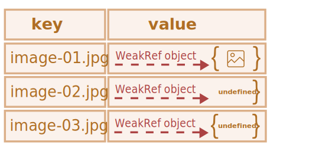
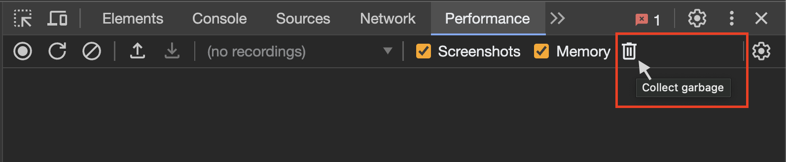

# WeakRef y FinalizationRegistry

```warn header="Características \"ocultas\" del lenguaje"
Este artículo trata un tema muy específico que la mayoría de los desarrolladores rara vez encuentran en la práctica, e incluso pueden desconocer su existencia.

Si recién estás aprendiendo JavaScript, te recomendamos saltar este capítulo.  
```

El *principio de alcance*, explicado en el capítulo <info:garbage-collection>,
establece que el motor de JavaScript garantiza que se mantengan en memoria los valores mientras sean accesibles o estén en uso.

Por ejemplo:


```js
//  la variable user mantiene una referencia fuerte al objeto 
let user = { name: "John" };

// sobrescribimos el valor de la variable user 
user = null;

// la referencia se pierde y el objeto será eliminado de la memoria

```

Compliquemos un poco el código con dos referencias fuertes:

```js
//  la variable user mantiene una referencia fuerte al objeto 
let user = { name: "John" };

// copiamos la referencia fuerte al objeto en la variable admin
*!*
let admin = user;
*/!*

// sobrescribimos el valor de la variable user
user = null;

// el objeto sigue siendo accesible a través de la variable admin 
```
El objeto `{ name: "John" }` solo se eliminará de la memoria si no quedan referencias fuertes a él; es decir, si también sobrescribimos la variable `admin`.

En JavaScript existe un concepto llamado `WeakRef`, o referencia débil, que se comporta de manera diferente.


````smart header="Términos: \"Referencia fuerte\", \"Referencia débil\""
**Referencia fuerte** -- es una referencia a un objeto o valor que impide que el recolector de basura lo elimine, manteniéndolo en memoria.

Esto significa que el objeto o valor permanecerá en memoria y no será eliminado por el recolector de basura mientras haya referencias fuertes activas a él.

En JavaScript, las referencias típicas son fuertes. Por ejemplo:

```js
//  la variable user mantiene una referencia fuerte al objeto
let user = { name: "John" };
```
**Referencia débil** -- es una referencia a un objeto o valor que *no* impide que sean eliminados por el recolector de basura.
Un objeto o valor puede ser borrado por el recolector de basura si las únicas referencias a él son débiles.
````

## WeakRef


````warn header="Advertencia"
Antes de profundizar en el tema, es importante señalar que su uso requiere una planificación cuidadosa y que, en general, es mejor evitarlas si no son estrictamente necesarias.
````

`WeakRef` -- es un objeto que mantiene referencias débiles a otros objetos, llamados objetivo (`target`) o referente (`referent`).

La particularidad de `WeakRef` es que no impide que el recolector de basura elimine a su "referente". En otras palabras, un objeto `WeakRef` no mantiene vivo al objeto referido.

Ahora tomemos la variable `user` como "referente" y establezcamos una referencia débil hacia ella en la variable `admin`.
Para crear una referencia débil se debe usar el constructor `WeakRef`, pasando como argumento el objetivo (el objeto al que queremos hacer la referencia débil).

En nuestro caso, ese objeto es la variable `user`:


```js
//  la variable user mantiene una referencia fuerte al objeto
let user = { name: "John" };

//  la variable admin mantiene una referencia débil al objeto
*!*
let admin = new WeakRef(user);
*/!*

```

El siguiente diagrama muestra los dos tipos de referencia: una referencia fuerte con la variable `user` y una referencia débil con la variable `admin`:


Luego, en algún momento, dejamos de usar la variable `user` (su valor se sobrescribe, sale de alcance, etc.), pero la instancia de `WeakRef` sigue almacenada en la variable `admin`:

```js
// sobrescribimos el valor de la variable user
user = null;
```

Una referencia débil a un objeto no es suficiente para mantenerlo "vivo". Si las únicas referencias restantes a un objeto referido son débiles, el recolector de basura puede destruirlo y reutilizar su memoria para otra cosa.

Sin embargo, hasta que el objeto sea realmente eliminado, la referencia débil puede seguir devolviéndolo, incluso si ya no existen referencias fuertes hacia él.
Es decir, nuestro objeto se convierte en una especie de "gato de Schrödinger": no podemos saber con certeza si está "vivo" o "muerto".


En este punto, para obtener el objeto desde la instancia de `WeakRef`, usamos su método `deref()`.

El método `deref()` devuelve el objeto referido al que apunta el `WeakRef`, si aún está en memoria. Si el objeto ha sido eliminado por el recolector de basura,`deref()` devolverá `undefined`:


```js
let ref = admin.deref();

if (ref) {
  // el objeto sigue accesible: podemos manipularlo libremente
} else {
  // el objeto ha sido eliminado por el recolector de basura
}
```

## WeakRef, casos de uso

`WeakRef` se usa típicamente para crear cachés o [arrays asociativos](https://es.wikipedia.org/wiki/Tabla_hash) que almacenan objetos con un alto consumo de recursos.
Esto permite evitar que dichos objetos permanezcan en memoria solo por estar en la caché o en un array asociativo..  

Uno de los principales ejemplos es cuando manejamos múltiples objetos de imagen binaria (por ejemplo, representados como `ArrayBuffer` o `Blob`), y queremos asociarles un nombre o una ruta.
Las estructuras de datos existentes no son del todo adecuadas para esto:

- Usar  `Map` para asociar nombres con imágenes (o viceversa) mantiene las imágenes en memoria, ya que siguen presentes en el `Map` como claves o valores.
- `WeakMap` tampoco es una opción válida: los objetos usados como claves en `WeakMap` tienen referencias débiles, por lo que el recolector de basura puede eliminarlos.

En este caso, necesitamos una estructura de datos que use referencias débiles en sus valores.

Para ello, podemos usar una colección `Map`, donde los valores sean instancias de `WeakRef` apuntando a los objetos grandes que queremos manejar.
Así, evitamos mantener estos objetos grandes e innecesarios en memoria más tiempo del necesario.  

De este modo, si el objeto aún es accesible, podemos obtenerlo desde la caché.
Si ha sido eliminado por el recolector de basura, lo regeneramos o lo descargamos nuevamente.  

Esto permite reducir el uso de memoria en ciertas situaciones.  

## Ejemplo №1: Uso de WeakRef para caché

A continuación, se muestra un fragmento de código que demuestra el uso de `WeakRef`.  

En resumen, utilizamos un `Map` con claves de tipo string y objetos `WeakRef` vomo valores.
Si el objeto referenciado por `WeakRef` no ha sido eliminado por el recolector de basura, lo recuperamos de la caché.
Caso contrario, lo descargamos nuevamente y lo almacenamos en la caché para su posible reutilización:  

```js
function fetchImg() {
    // función abstracta para descargar imágenes...
}

function weakRefCache(fetchImg) { // (1)
    const imgCache = new Map(); // (2)

    return (imgName) => { // (3)
        const cachedImg = imgCache.get(imgName); // (4)

        if (cachedImg?.deref()) { // (5)
            return cachedImg?.deref();
        }

        const newImg = fetchImg(imgName); // (6)
        imgCache.set(imgName, new WeakRef(newImg)); // (7)

        return newImg;
    };
}

const getCachedImg = weakRefCache(fetchImg);
```

Analicemos en detalle lo que ocurre aquí:
1. `weakRefCache` -- es una función de orden superior que recibe otra función, `fetchImg`, como argumento. En este ejemplo, no es necesario describir `fetchImg` en detalle, ya que puede ser cualquier lógica para descargar imágenes.
2. `imgCache` -- es una caché de imágenes que almacena los resultados de `fetchImg` en un `map`, con claves de tipo `string` para los nombres de las imágenes y objetos `WeakRef` como valores.
3. Se devuelve una función anónima que toma el nombre de la imagen como argumento. Este argumento se usa como clave en la caché.
4. Se intenta obtener el resultado almacenado en caché usando la clave proporcionada.
5. Si la caché contiene un valor para la clave especificada y el objeto referenciado por `WeakRef` aún existe, se devuelve el resultado en caché.
6. Si no hay una entrada en la caché con la clave solicitada, o si `deref()` devuelve `undefined` (lo que significa que el objeto ha sido eliminado por el recolector de basura), se vuelve a descargar la imagen con `fetchImg`.
7. La imagen descargada se almacena en la caché como un objeto `WeakRef`. 

Ahora tenemos una colección `Map`donde las claves son string con los nombres de imágenes y los valores son objetos `WeakRef` que contienen las imágenes.

Esta técnica ayuda a evitar la asignación innecesaria de grandes cantidades de memoria a objetos que ya no están en uso.
Pero también ahorra memoria y tiempo cuando se reutilizan objetos en caché.  

Aquí hay una representación visual de este código:  


Sin embargo, esta implementación tiene una desventaja: con el tiempo, `Map` se llenará de claves `string` que apuntan a `WeakRef` cuyos objetos referenciados ya han sido eliminados por el recolector de basura:  



Una forma de manejar este problema es limpiar periódicamente la caché para eliminar las entradas "muertas".
Otra opción es usar finalizadores, que exploraremos a continuación.  


## Ejemplo №2: Usando WeakRef para rastrear objetos del DOM

Otro caso de uso de `WeakRef` es rastrear objetos del DOM. 

Imaginemos un escenario en el que un código o biblioteca de terceros interactúa con elementos de nuestra página mientras existan en el DOM.
Por ejemplo, podría ser una utilidad externa que monitorea y notifica el estado del sistema (comúnmente llamada "logger", un programa que envía mensajes informativos llamados "logs").

Ejemplo interactivo:

[codetabs height=420 src="weakref-dom"]

Cuando se hace clic en el botón "Iniciar envío de mensajes", comienzan a aparecer mensajes (logs) en la llamada "ventana de visualización de logs" (un elemento con la clase `.window__body`).

Sin embargo, tan pronto como este elemento es eliminado del DOM, el logger debería dejar de enviar mensajes.
Para simular la eliminación de este elemento, simplemente haz clic en el botón "Cerrar" en la esquina superior derecha.

Para evitar la necesidad de notificar al código externo cada vez que nuestro elemento DOM está disponible o no, podemos simplemente crear una referencia débil con `WeakRef`.

Una vez que el elemento es eliminado del DOM, el logger lo detectará y dejará de enviar mensajes.

Ahora veamos en detalle el código fuente (*pestaña `index.js`*):

1. Obtener el elemento DOM del botón "Iniciar envío de mensajes".
2. Obtener el elemento DOM del botón "Cerrar".
3. Obtener el elemento DOM de la ventana de logs usando el constructor `new WeakRef()`. De esta manera, la variable `windowElementRef` mantiene una referencia débil al elemento del DOM.
4. Agregar un event listener al botón "Iniciar envío de mensajes", que inicia el logger cuando se hace clic.
5. Agregar un event listener al botón "Cerrar", que elimina la ventana de logs del DOM cuando se hace clic.
6. Usar  `setInterval` para mostrar un nuevo mensaje cada segundo.
7. Si el elemento DOM de la ventana de logs sigue disponible en memoria, crear y enviar un nuevo mensaje.
8. Si el método `deref()` devuelve `undefined`, significa que el elemento DOM ha sido eliminado de la memoria. En este caso, el logger deja de mostrar mensajes y se limpia el temporizador.
9. Mostrar un`alert`, cuando el elemento DOM de la ventana de logs haya sido eliminado de la memoria (es decir, después de hacer clic en el botón "Cerrar"). **Nota: La eliminación de la memoria puede no ocurrir de inmediato, ya que depende únicamente de los mecanismos internos del recolector de basura.**

   No podemos controlar este proceso directamente desde el código. Sin embargo, aún es posible forzar la recolección de basura en el navegador.

   En Google Chrome, por ejemplo, para hacer esto, abre las herramientas para desarrolladores (`key:Ctrl` + `key:Shift` + `key:J` en Windows/Linux o `key:Option` + `key:⌘` + `key:J` en macOS), ve a la pestaña "Performance" y haz clic en el ícono de la papelera – "Collect garbage":

   

    <br>
     Esta funcionalidad está disponible en la mayoría de los navegadores modernos. Después de realizar estos pasos, el  <code>alert</code> se activará inmediatamente.

## FinalizationRegistry

Es momento de hablar sobre los finalizadores. Aclaremos la terminología antes de continuar:  

**Callback de limpieza (finalizador)** -- es una función que se ejecuta cuando un objeto registrado en `FinalizationRegistry` es eliminado de la memoria por el recolector de basura.

Su propósito es permitir realizar operaciones adicionales relacionadas con el objeto después de que haya sido eliminado de la memoria.

**Registro** (o `FinalizationRegistry`) -- es un objeto especial en JavaScript que gestiona el registro y la eliminación de objetos, junto con sus callbacks de limpieza. 

Este mecanismo permite registrar un objeto para rastrearlo y asociarle un callback de limpieza.
Básicamente, es una estructura que almacena información sobre los objetos registrados y sus callbacks de limpieza, y luego los invoca automáticamente cuando los objetos son eliminados de la memoria. 

Para crear una instancia de `FinalizationRegistry`, se debe llamar a su constructor, el que recibe un solo argumento: el callback de limpieza (finalizador).

Sintaxis:

```js
function cleanupCallback(heldValue) { 
  // código del callback de limpieza 
}

const registry = new FinalizationRegistry(cleanupCallback);
```

Donde:

- `cleanupCallback` -- es la función que se ejecutará automáticamente cuando un objeto registrado sea eliminado de la memoria.
- `heldValue` -- es el valor que se pasará como argumento al callback de limpieza. Si `heldValue`  es un objeto, el registro mantiene una referencia fuerte a él.
- `registry` -- es la instancia de `FinalizationRegistry`.

Métodos de `FinalizationRegistry`:

- `register(target, heldValue [, unregisterToken])` -- registra un objeto en el registro.

  `target` --  el objeto a registrar. Si `target` es recolectado por el recolector de basura, el callback de limpieza se ejecutará con `heldValue` como argumento.

  Opcional `unregisterToken` -- un token de desregistro. Se puede usar para anular el registro de un objeto antes de que el recolector de basura lo elimine. Por convención, suele ser el mismo `target`.
- `unregister(unregisterToken)` -- elimina un objeto del registro. Recibe un argumento: `unregisterToken` (el token usado al registrar el objeto).

Veamos un ejemplo. Usemos el ya conocido objeto `user` y creemos una instancia de `FinalizationRegistry`:

```js
let user = { name: "John" };

const registry = new FinalizationRegistry((heldValue) => {
  console.log(`${heldValue} ha sido recolectado por el recolector de basura.`);
});
```

Luego, registramos el objeto que requiere limpieza llamando al método `register`:

```js
registry.register(user, user.name);
```

El registro no mantiene una referencia fuerte al objeto, ya que eso impediría que el recolector de basura lo eliminara.

Si el objeto es eliminado por el recolector de basura, el callback de limpieza puede ejecutarse en algún momento futuro con el `heldValue` pasado como argumento:

```js
// Cuando el objeto user sea eliminado, se imprimirá en la consola:
"John ha sido recolectado por el recolector de basura."
```

Hay casos donde el callback tiene posibilidades de no ejecutarse.

Por ejemplo:
- Cuando el programa termina por completo su operación (por ejemplo, al cerrar una pestaña en el navegador).
- Cuando la instancia de `FinalizationRegistry` mismo deja de estar accesible en el código.
  Si el objeto que creó la instancia de `FinalizationRegistry` sale del ámbito o es eliminado, los callbacks de limpieza registrados en tal registro podrían no ser invocados.

## Caché con FinalizationRegistry

Volviendo a nuestro ejemplo de caché *débil*, podemos notar lo siguiente:
- Aunque los valores envueltos en `WeakRef` hayan sido recolectados por el recolector de basura, sigue existiendo un problema de "fuga de memoria" debido a las claves restantes cuyos valores han sido eliminados.

Esta es una versión mejorada de la caché usando `FinalizationRegistry`:

```js
function fetchImg() {
  // función abstracta para descargar imágenes...
}

function weakRefCache(fetchImg) {
  const imgCache = new Map();

  *!*
  const registry = new FinalizationRegistry((imgName) => { // (1)
    const cachedImg = imgCache.get(imgName);
    if (cachedImg && !cachedImg.deref()) imgCache.delete(imgName);
  });
  */!*

  return (imgName) => {
    const cachedImg = imgCache.get(imgName);
    
    if (cachedImg?.deref()) {
      return cachedImg?.deref();
    }

    const newImg = fetchImg(imgName);
    imgCache.set(imgName, new WeakRef(newImg));
    *!*
    registry.register(newImg, imgName); // (2)
    */!*

    return newImg;
  };
}

const getCachedImg = weakRefCache(fetchImg);
```

1. Para gestionar la limpieza de las entradas "muertas" de la caché cuando los objetos `WeakRef`  son eliminados por el recolector de basura, creamos un registro de limpieza con `FinalizationRegistry`.

   Es importante comprobar en el callback de limpieza si la entrada fue eliminada por el recolector y no ha sido reinsertada, para evitar borrar una entrada "viva".
2. Una vez que se descarga una nueva imagen y se almacena en la caché, la registramos en el `FinalizationRegistry` para rastrear el objeto `WeakRef`.

Esta implementación solo mantiene pares clave/valor realmente "vivos". 
En este caso, cada objeto `WeakRef` se registra en `FinalizationRegistry`.
Y después de que los objetos sean eliminados por el recolector de basura, el callback de limpieza eliminará todas las entradas `undefined`.

Aquí la representación visual del código actualizado:


Un aspecto clave de esta implementación es que los finalizadores permiten la ejecución en paralelo entre el programa principal y los callbacks de limpieza.
En el contexto de JavaScript, el "programa principal" es el código JavaScript que se ejecuta en nuestra aplicación o página web.  

Por lo tanto, desde el momento en que un objeto es marcado para eliminación por el recolector de basura hasta que el callback de limpieza se ejecuta, puede haber un cierto lapso.
Es importante entender que, durante este tiempo, el programa principal puede modificar el objeto o incluso restaurarlo en la memoria.  

Por eso, en el callback de limpieza debemos verificar si la entrada ha sido agregada nuevamente a la caché para evitar eliminar valores "vivos".
Del mismo modo, al buscar una clave en la caché, existe la posibilidad de que su valor haya sido eliminado por el recolector de basura, pero el callback de limpieza aún no se haya ejecutado.

Estas situaciones requieren especial atención si trabajas con `FinalizationRegistry`.

## Uso de WeakRef y FinalizationRegistry en la práctica

Pasando de la teoría a la práctica, imaginemos un escenario real en el que un usuario sincroniza sus fotos en un dispositivo móvil con un servicio en la nube
(como [iCloud](https://en.wikipedia.org/wiki/ICloud) o [Google Photos](https://en.wikipedia.org/wiki/Google_Photos)), y quiere verlas desde otros dispositivos.
Además de la funcionalidad básica de visualización, estos servicios ofrecen características adicionales como:

- Edición de fotos y efectos de video.
- Creación de "recuerdos" y álbumes.
- Montajes de video a partir de una serie de fotos.
- ... y mucho más.

Aquí, como ejemplo, usaremos una implementación bastante primitiva de un servicio similar.
El objetivo principal es mostrar un posible escenario en el que `WeakRef` y `FinalizationRegistry` se utilicen juntos en una aplicación real.

Así es como se ve:


<br>
A la izquierda, hay una biblioteca de fotos en la nube (mostradas como miniaturas).
Podemos seleccionar imágenes y crear un collage haciendo clic en el botón "Crear collage" en la derecha.
Luego, el collage resultante se puede descargar como una imagen.
</br><br>

Para acelerar la carga de la página, lo lógico es descargar y mostrar las miniaturas en calidad *comprimida*,
pero al crear el collage, descargar y usar las imágenes en *calidad completa*.

Las miniaturas tienen un tamaño de 240x240 píxeles.
Este tamaño se eligió intencionalmente para optimizar la velocidad de carga.
En el modo de vista previa, tampoco necesitamos imágenes en tamaño completo.


<br>
Supongamos que queremos crear un collage con 4 fotos. Las seleccionamos y hacemos clic en "Crear collage".
Aquí, la ya conocida función <code>weakRefCache</code> verifica si la imagen requerida está en caché.
Si no lo está, la descarga desde la nube y la almacena para futuros usos.
Esto ocurre para cada imagen seleccionada:
</br><br>


</br>

Al observar la consola podemos ver qué fotos fueron descargadas desde la nube, indicadas por <span style="background-color:#133159;color:white;font-weight:500">FETCHED_IMAGE</span>.
Como es la primera vez que se crea el collage, la "caché débil" estaba vacía, así que todas las imágenes se descargaron de la nube.

Pero al mismo tiempo el recolector de basura está limpiando la memoria.
Esto significa que las imágenes almacenadas con referencias débiles pueden ser eliminadas.
Cuando esto sucede, nuestro finalizador borra la clave correspondiente de la caché.
<span style="background-color:#901e30;color:white;font-weight:500;">CLEANED_IMAGE</span> nos lo notifica:


<br>
Después, nos damos cuenta de que no nos gusta el collage y decidimos cambiar una de las imágenes.
Para esto, desmarcamos una, seleccionamos otra y hacemos clic en "Crear collage" de nuevo:
</br><br>


<br>
Pero esta vez, no todas las imágenes se descargaron de la red, algunas se obtuvieron de la caché débil, como indica el mensaje <span style="background-color:#385950;color:white;font-weight:500;">CACHED_IMAGE</span>.
Esto significa que el recolector de basura aún no eliminó algunas imágenes,
lo que reduce el número de descargas y acelera el proceso de creación del collage.
</br><br>


<br>
Juguemos un poco más. Volvamos a cambiar otra imagen y creemos un nuevo collage:
</br><br>


<br>
Esta vez, el resultado es aún mejor. De las 4 imágenes seleccionadas, 3 fueron recuperadas de la caché débil y solo una tuvo que descargarse.
La reducción en el uso de la red fue del 75%. Nada mal.
</br><br>


</br>

Es importante recordar que este comportamiento no está garantizado y depende de la implementación específica del recolector de basura.

Dicho esto, surge una pregunta lógica: ¿por qué no usar una caché normal, que podamos gestionar manualmente en lugar de depender del recolector de basura?
En la mayoría de los casos, no hay necesidad de usar `WeakRef` y `FinalizationRegistry`.

Aquí simplemente demostramos una alternativa con un enfoque diferente y características interesantes del lenguaje.
Sin embargo, este ejemplo no es fiable si necesitamos resultados constantes y predecibles.

Puedes [abrir este ejemplo en el sandbox.](sandbox:weakref-finalizationregistry).

## Resumen

`WeakRef` -- permite crear referencias débiles a objetos, permitiendo que el recolector de basura los elimine si no hay referencias fuertes a ellos.
Esto ayuda a optimizar el uso de memoria y recursos del sistema.

`FinalizationRegistry` -- permite registrar callbacks que se ejecutan cuando un objeto sin referencias fuertes es eliminado.
Esto permite liberar recursos o realizar tareas de limpieza antes de que el objeto desaparezca de la memoria.
