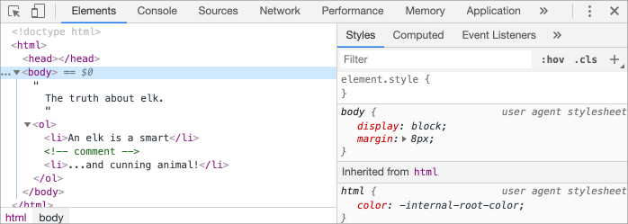

libs:
  - d3
  - domtree

---

# Árbol del Modelo de Objetos del Documento (DOM)

<<<<<<< HEAD
La estructura de un documento HTML son las etiquetas.

Según el Modelo de Objetos del Documento (DOM), cada etiqueta HTML es un objeto. Las etiquetas anidadas son llamadas "hijas" de la etiqueta que las contiene. El texto dentro de una etiqueta también es un objeto.

Todos estos objetos son accesibles empleando JavaScript, y podemos usarlos para modificar la página.

Por ejemplo, `document.body` es el objeto que representa la etiqueta `<body>`.

Ejecutar el siguiente código hará que el `<body>` sea de color rojo durante 3 segundos:

```js run
document.body.style.background = 'red'; // establece un color de fondo rojo

setTimeout(() => document.body.style.background = '', 3000); // volver atrás
```

En el caso anterior usamos `style.background` para cambiar el color de fondo del `document.body`, sin embargo existen muchas otras propiedades, tales como:

- `innerHTML` -- contenido HTML del nodo.
- `offsetWidth` -- ancho del nodo (en píxeles).
- ..., etc.

Más adelante, aprenderemos otras formas de manipular el DOM, pero primero necesitamos conocer su estructura.

## Un ejemplo del DOM

Comencemos con el siguiente documento simple:
=======
The backbone of an HTML document is tags.

According to the Document Object Model (DOM), every HTML tag is an object. Nested tags are  "children" of the enclosing one. The text inside a tag is an object as well.

All these objects are accessible using JavaScript, and we can use them to modify the page.

For example, `document.body` is the object representing the `<body>` tag.

Running this code will make the `<body>` red for 3 seconds:

```js run
document.body.style.background = 'red'; // make the background red

setTimeout(() => document.body.style.background = '', 3000); // return back
```

Here we used `style.background` to change the background color of `document.body`, but there are many other properties, such as:

- `innerHTML` -- HTML contents of the node.
- `offsetWidth` -- the node width (in pixels)
- ...and so on.

Soon we'll learn more ways to manipulate the DOM, but first we need to know about its structure.

## An example of the DOM

Let's start with the following simple document:
>>>>>>> fbf443e414097e5a3a41dd1273ef9a4a3230e72c

```html run no-beautify
<!DOCTYPE HTML>
<html>
<head>
  <title>About elk</title>
</head>
<body>
  The truth about elk.
</body>
</html>
```

El DOM representa HTML como una estructura de árbol de etiquetas. A continuación podemos ver como se muestra:

<div class="domtree"></div>

<script>
let node1 = {"name":"HTML","nodeType":1,"children":[{"name":"HEAD","nodeType":1,"children":[{"name":"#text","nodeType":3,"content":"\n    "},{"name":"TITLE","nodeType":1,"children":[{"name":"#text","nodeType":3,"content":"About elk"}]},{"name":"#text","nodeType":3,"content":"\n  "}]},{"name":"#text","nodeType":3,"content":"\n  "},{"name":"BODY","nodeType":1,"children":[{"name":"#text","nodeType":3,"content":"\n  The truth about elk."}]}]}

drawHtmlTree(node1, 'div.domtree', 690, 320);
</script>

```online
En la imagen de arriba, puedes hacer clic sobre los nodos del elemento y como resultado se expanden/colapsan sus nodos hijos.
```

<<<<<<< HEAD
Cada nodo del árbol es un objeto.
=======
Every tree node is an object.

Tags are *element nodes* (or just elements) and form the tree structure: `<html>` is at the root, then `<head>` and `<body>` are its children, etc.
>>>>>>> fbf443e414097e5a3a41dd1273ef9a4a3230e72c

Las etiquetas son *nodos de elementos* (o solo elementos) y forman la estructura del árbol: `<html>` está ubicado en la raíz del documento, por lo tanto, `<head>` y `<body>` son sus hijos, etc.

<<<<<<< HEAD
El texto dentro de los elementos forma *nodos de texto*, etiquetados como `#text`. Un nodo de texto contiene solo una cadena. Esta puede no tener hijos y siempre es una hoja del árbol.
=======
For instance, the `<title>` tag has the text `"About elk"`.
>>>>>>> fbf443e414097e5a3a41dd1273ef9a4a3230e72c

Por ejemplo, la etiqueta `<title>` tiene el texto `"About elk"`.

Hay que tener en cuenta los caracteres especiales en nodos de texto:

<<<<<<< HEAD
- una línea nueva: `↵` (en JavaScript se emplea `\n` para obtener este resultado)
- un espacio: `␣`

Los espacios y líneas nuevas son caracteres totalmente válidos, al igual que letras y dígitos. Ellos forman nodos de texto y se convierten en parte del DOM. Así, por ejemplo, en el caso de arriba la etiqueta `<head>` contiene algunos espacios antes de la etiqueta `<title>`, entonces ese texto se convierte en el nodo `#text`, que contiene una nueva línea y solo algunos espacios.

Hay solo dos excepciones de nível superior:
1. Los espacios y líneas nuevas antes de la etiqueta `<head>` son ignorados por razones históricas.
2. Si colocamos algo después de la etiqueta `</body>`, automáticamente se sitúa dentro de `body`, al final, ya que, la especificación HTML necesita que todo el contenido esté dentro de la etiqueta `<body>`, no puede haber espacios después de esta.
=======
Spaces and newlines are totally valid characters, like letters and digits. They form text nodes and become a part of the DOM. So, for instance, in the example above the `<head>` tag contains some spaces before `<title>`, and that text becomes a `#text` node (it contains a newline and some spaces only).

There are only two top-level exclusions:
1. Spaces and newlines before `<head>` are ignored for historical reasons.
2. If we put something after `</body>`, then that is automatically moved inside the `body`, at the end, as the HTML spec requires that all content must be inside `<body>`. So there can't be any spaces after `</body>`.

In other cases everything's straightforward -- if there are spaces (just like any character) in the document, then they become text nodes in the DOM, and if we remove them, then there won't be any.
>>>>>>> fbf443e414097e5a3a41dd1273ef9a4a3230e72c

En otros casos todo es sencillo -- si hay espacios (como cualquier carácter) en el documento, se convierten en nodos de texto en el DOM, y si los eliminamos, entonces no habrá ninguno.

En el siguiente ejemplo, no hay nodos de texto con espacios en blanco:

```html no-beautify
<!DOCTYPE HTML>
<html><head><title>About elk</title></head><body>The truth about elk.</body></html>
```

<div class="domtree"></div>

<script>
let node2 = {"name":"HTML","nodeType":1,"children":[{"name":"HEAD","nodeType":1,"children":[{"name":"TITLE","nodeType":1,"children":[{"name":"#text","nodeType":3,"content":"About elk"}]}]},{"name":"BODY","nodeType":1,"children":[{"name":"#text","nodeType":3,"content":"The truth about elk."}]}]}

drawHtmlTree(node2, 'div.domtree', 690, 210);
</script>

<<<<<<< HEAD
```smart header="Los espacios al inicio/final de la cadena y los nodos de texto que solo contienen espacios en blanco, por lo general, están ocultos en las herramientas.
Las herramientas del navegador (las veremos más adelante) que trabajan con DOM usualmente no muestran espacios al inicio/final del texto y nodos de texto vacíos (saltos de línea) entre etiquetas.

De esta manera, las herramientas para desarrolladores ahorran espacio en la pantalla.

En otras representaciones del DOM, las omitiremos cuando sean irrelevantes. Tales espacios generalmente no afectan la forma en la cual  el documento es mostrado.
```

## Autocorreción

Si el navegador encuentra HTML mal escrito, lo corrige automáticamente al construir el DOM.

Por ejemplo, la etiqueta superior siempre será `<html>`. Incluso si no existe en el documento, ésta existirá en el DOM, puesto que, el navegador la creará. Sucede lo mismo con la etiqueta `<body>`.
=======
```smart header="Spaces at string start/end and space-only text nodes are usually hidden in tools"
Browser tools (to be covered soon) that work with DOM usually do not show spaces at the start/end of the text and empty text nodes (line-breaks) between tags.

Developer tools save screen space this way.

On further DOM pictures we'll sometimes omit them when they are irrelevant. Such spaces usually do not affect how the document is displayed.
```

## Autocorrection

If the browser encounters malformed HTML, it automatically corrects it when making the DOM.

For instance, the top tag is always `<html>`. Even if it doesn't exist in the document, it will exist in the DOM, because the browser will create it. The same goes for `<body>`.

As an example, if the HTML file is the single word `"Hello"`, the browser will wrap it into `<html>` and `<body>`, and add the required `<head>`, and the DOM will be:
>>>>>>> fbf443e414097e5a3a41dd1273ef9a4a3230e72c

Como ejemplo de esto, si el archivo HTML es la palabra `"Hello"`, el navegador lo envolverá con las etiquetas `<html>` y `<body>`, y añadirá la etiqueta `<head>` la cual es requerida, basado en esto,  el DOM resultante será:

<div class="domtree"></div>

<script>
let node3 = {"name":"HTML","nodeType":1,"children":[{"name":"HEAD","nodeType":1,"children":[]},{"name":"BODY","nodeType":1,"children":[{"name":"#text","nodeType":3,"content":"Hello"}]}]}

drawHtmlTree(node3, 'div.domtree', 690, 150);
</script>

Al generar el DOM, los navegadores procesan automaticamente los errores en el documento, cierran etiquetas, etc.

<<<<<<< HEAD
Un documento sin etiquetas de cierre:
=======
A document with unclosed tags:
>>>>>>> fbf443e414097e5a3a41dd1273ef9a4a3230e72c

```html no-beautify
<p>Hello
<li>Mom
<li>and
<li>Dad
```
<<<<<<< HEAD
...se convertirá en un DOM normal a medida que el navegador lee las etiquetas y compone las partes faltantes:
=======

...will become a normal DOM as the browser reads tags and restores the missing parts:
>>>>>>> fbf443e414097e5a3a41dd1273ef9a4a3230e72c

<div class="domtree"></div>

<script>
let node4 = {"name":"HTML","nodeType":1,"children":[{"name":"HEAD","nodeType":1,"children":[]},{"name":"BODY","nodeType":1,"children":[{"name":"P","nodeType":1,"children":[{"name":"#text","nodeType":3,"content":"Hello"}]},{"name":"LI","nodeType":1,"children":[{"name":"#text","nodeType":3,"content":"Mom"}]},{"name":"LI","nodeType":1,"children":[{"name":"#text","nodeType":3,"content":"and"}]},{"name":"LI","nodeType":1,"children":[{"name":"#text","nodeType":3,"content":"Dad"}]}]}]}

drawHtmlTree(node4, 'div.domtree', 690, 360);
</script>

<<<<<<< HEAD
````warn header="Las tablas siempre tienen la etiqueta `<tbody>`"
Un "caso especial" interesante son las tablas. De acuerdo a la especificación DOM debe tener `<tbody>`, sin embargo, el texto HTML por convención puede omitir esto. Por lo tanto, el navegador crea automáticamente la etiqueta `<tbody>` en el DOM.
=======
````warn header="Tables always have `<tbody>`"
An interesting "special case" is tables. By the DOM specification they must have `<tbody>`, but HTML text may (officially) omit it. Then the browser creates `<tbody>` in the DOM automatically.
>>>>>>> fbf443e414097e5a3a41dd1273ef9a4a3230e72c

Para el HTML:

```html no-beautify
<table id="table"><tr><td>1</td></tr></table>
```

La estructura del DOM será:
<div class="domtree"></div>

<script>
let node5 = {"name":"TABLE","nodeType":1,"children":[{"name":"TBODY","nodeType":1,"children":[{"name":"TR","nodeType":1,"children":[{"name":"TD","nodeType":1,"children":[{"name":"#text","nodeType":3,"content":"1"}]}]}]}]};

drawHtmlTree(node5,  'div.domtree', 600, 200);
</script>

¿Lo ves? La etiqueta `<tbody>` apareció de la nada. Debes tener esto en cuenta al trabajar con tablas para evitar sorpresas.
````

## Otros tipos de nodos

Existen otros tipos de nodos además de elementos y nodos de texto. 

<<<<<<< HEAD
Por ejemplo, los comentarios:
=======
There are some other node types besides elements and text nodes.

For example, comments:
>>>>>>> fbf443e414097e5a3a41dd1273ef9a4a3230e72c

```html
<!DOCTYPE HTML>
<html>
<body>
  The truth about elk.
  <ol>
    <li>An elk is a smart</li>
*!*
    <!-- comentario -->
*/!*
    <li>...y el astuto animal!</li>
  </ol>
</body>
</html>
```

<div class="domtree"></div>

<script>
<<<<<<< HEAD
let node6 = {"name":"HTML","nodeType":1,"children":[{"name":"HEAD","nodeType":1,"children":[]},{"name":"BODY","nodeType":1,"children":[{"name":"#text","nodeType":3,"content":"\n  The truth about elk.\n    "},{"name":"OL","nodeType":1,"children":[{"name":"#text","nodeType":3,"content":"\n      "},{"name":"LI","nodeType":1,"children":[{"name":"#text","nodeType":3,"content":"An elk is a smart"}]},{"name":"#text","nodeType":3,"content":"\n      "},{"name":"#comment","nodeType":8,"content":"comment"},{"name":"#text","nodeType":3,"content":"\n      "},{"name":"LI","nodeType":1,"children":[{"name":"#text","nodeType":3,"content":"...y el astuto animal!"}]},{"name":"#text","nodeType":3,"content":"\n    "}]},{"name":"#text","nodeType":3,"content":"\n  \n"}]}]};
=======
let node6 = {"name":"HTML","nodeType":1,"children":[{"name":"HEAD","nodeType":1,"children":[]},{"name":"BODY","nodeType":1,"children":[{"name":"#text","nodeType":3,"content":"\n  The truth about elk.\n    "},{"name":"OL","nodeType":1,"children":[{"name":"#text","nodeType":3,"content":"\n      "},{"name":"LI","nodeType":1,"children":[{"name":"#text","nodeType":3,"content":"An elk is a smart"}]},{"name":"#text","nodeType":3,"content":"\n      "},{"name":"#comment","nodeType":8,"content":"comment"},{"name":"#text","nodeType":3,"content":"\n      "},{"name":"LI","nodeType":1,"children":[{"name":"#text","nodeType":3,"content":"...and cunning animal!"}]},{"name":"#text","nodeType":3,"content":"\n    "}]},{"name":"#text","nodeType":3,"content":"\n  \n"}]}]};
>>>>>>> fbf443e414097e5a3a41dd1273ef9a4a3230e72c

drawHtmlTree(node6, 'div.domtree', 690, 500);
</script>

<<<<<<< HEAD
Aquí podemos ver un nuevo tipo de nodo de árbol -- *nodo de comentario*, etiquetado como `#comment`, entre dos nodos de texto.

Podemos pensar -- ¿Por qué se agrega un comentario al DOM? Esto no afecta la representación de ninguna manera. Pero hay una regla -- si algo está en el código HTML, entonces también debe estar en el árbol DOM.
=======
We can see here a new tree node type -- *comment node*, labeled as `#comment`, between two text nodes.
>>>>>>> fbf443e414097e5a3a41dd1273ef9a4a3230e72c

**Todo en HTML, incluso los comentarios, se convierte en parte del DOM.**

Hasta la declaración `<!DOCTYPE...>` al principio del HTML es un nodo del DOM. Su ubicación en el DOM es justo antes de la etiqueta `<html>`. No vamos a tocar ese nodo, por esa razón ni siquiera lo dibujamos en diagramas, pero esta ahí.

El objeto `document` que representa todo el documento es también, formalmente, un nodo DOM.

Hay [12 tipos de nodos](https://dom.spec.whatwg.org/#node). En la práctica generalmente trabajamos con 4 de ellos:

1. `document` -- el "punto de entrada" en el DOM.
2. nodos de elementos -- Etiquetas-HTML, los bloques de construcción del árbol.
3. nodos de texto -- contienen texto.
4. comentarios -- a veces podemos colocar información allí, no se mostrará, pero JS puede leerla desde el DOM.

<<<<<<< HEAD
## Véalo usted mismo
=======
1. `document` -- the "entry point" into DOM.
2. element nodes -- HTML-tags, the tree building blocks.
3. text nodes -- contain text.
4. comments -- sometimes we can put information there, it won't be shown, but JS can read it from the DOM.
>>>>>>> fbf443e414097e5a3a41dd1273ef9a4a3230e72c

Para ver la estructura del DOM en tiempo real, intente [Live DOM Viewer] (http://software.hixie.ch/utilities/js/live-dom-viewer/). Simplemente escriba el documento, y se mostrará como un DOM al instante.

<<<<<<< HEAD
Otra forma de explorar el DOM es usando la herramienta para desarrolladores del navegador. En realidad, eso es lo que usamos cuando estamos desarrollando.

Para hacerlo, abra la página web [elk.html](elk.html), active las herramientas para desarroladores del navegador y cambie la pestaña a elementos.
=======
To see the DOM structure in real-time, try [Live DOM Viewer](http://software.hixie.ch/utilities/js/live-dom-viewer/). Just type in the document, and it will show up as a DOM at an instant.
>>>>>>> fbf443e414097e5a3a41dd1273ef9a4a3230e72c

Debe verse así:

<<<<<<< HEAD

=======
To do so, open the web page [elk.html](elk.html), turn on the browser developer tools and switch to the Elements tab.
>>>>>>> fbf443e414097e5a3a41dd1273ef9a4a3230e72c

Puedes ver el DOM, hacer clic sobre los elementos, ver sus detalles, etc.

<<<<<<< HEAD
Tenga en cuenta que la estructura DOM en la herramienta para desarrolladores está simplificada. Los nodos de texto se muestran como texto. Y absolutamente no hay nodos de texto con espacios en blanco. Esto está bien, porque la mayoría de las veces nos interesan los nodos de elementos.
=======

>>>>>>> fbf443e414097e5a3a41dd1273ef9a4a3230e72c

Hacer clic en el botón <span class="devtools" style="background-position:-328px -124px"></span> ubicado en la esquina superior izquierda nos permite elegir un nodo desde la página web utilizando un "mouse" (u otros dispositivos de puntero) e "inspeccionar" (desplazarse hasta él en la pestaña elementos). Esto funciona muy bien cuando tenemmos una página HTML enorme (y el DOM correspondiente es enorme) y nos gustaría ver la posición de un elemento en particular.

Otra forma de realizarlo sería hacer clic derecho en la página web y en el menú contextual elegir la opción "Inspeccionar Elemento".

<<<<<<< HEAD

=======
Clicking the <span class="devtools" style="background-position:-328px -124px"></span> button in the left-upper corner allows us to choose a node from the webpage using a mouse (or other pointer devices) and "inspect" it (scroll to it in the Elements tab). This works great when we have a huge HTML page (and corresponding huge DOM) and would like to see the place of a particular element in it.
>>>>>>> fbf443e414097e5a3a41dd1273ef9a4a3230e72c

En la parte derecha de las herramientos encontramos las siguientes sub-pestañas:
- **Styles** -- podemos ver CSS aplicado al elemento actual regla por regla, incluidas las reglas integradas (gris). Casi todo puede ser editado en el lugar, incluyendo las dimensiones/márgenes/relleno de la siguiente caja.
- **Computed** -- nos permite ver cada propiedad CSS aplicada al elemento: para cada propiedad podemos ver la regla que la provee (inluida la herencia CSS y demás).
- **Event Listeners** -- nos ayuda a ver los listener de eventos adjuntos a elementos del DOM (los cubriremos en la siguiente parte del tutorial). 
- ...,etc.

<<<<<<< HEAD
La manera de estudiarlos es haciendo clic en ellos. Casi todos los valores son editables en el lugar.
=======

>>>>>>> fbf443e414097e5a3a41dd1273ef9a4a3230e72c

## Interacción con la consola

A medida que trabajamos el DOM, también podemos querer aplicarle JavaScript. Al igual que: obtener un nodo y ejecutar algún código para modificarlo, para ver el resultado. Aquí hay algunos consejos para desplazarse entre la pestaña elementos y la consola.

Para empezar:

<<<<<<< HEAD
1. Seleccione el primer elemento `<li>` en la pestaña elementos.
2. Presiona la tecla `Esc` -- esto abrirá la consola justo debajo de la pestaña de elementos.

Ahora el último elemento seleccionado esta disponible como `$0`, el seleccionado previamente es `$1`, etc.
=======
As we work the DOM, we also may want to apply JavaScript to it. Like: get a node and run some code to modify it, to see the result. Here are few tips to travel between the Elements tab and the console.

For the start:

1. Select the first `<li>` in the Elements tab.
2. Press `key:Esc` -- it will open console right below the Elements tab.
>>>>>>> fbf443e414097e5a3a41dd1273ef9a4a3230e72c

Podemos ejecutar comandos en ellos. Por ejemplo, `$0.style.background = 'red'` hace que el elemento de la lista seleccionado sea rojo, algo así:


<<<<<<< HEAD
Así es como en la consola, se obtiene un nodo de los elementos.

También hay un camino de regreso. Si hay una variable que hace referencia a un nodo del DOM, usamos el comando `inspect(node)` en la consola para verlo en el panel de elementos.

O simplemente podemos generar el nodo del DOM en la consola y explorar en el lugar, así como `document.body` a continuación:
=======


That's how to get a node from Elements in Console.

There's also a road back. If there's a variable referencing a DOM node, then we can use the command `inspect(node)` in Console to see it in the Elements pane.

Or we can just output the DOM node in the console and explore "in-place", like `document.body` below:
>>>>>>> fbf443e414097e5a3a41dd1273ef9a4a3230e72c


Desde luego, eso es para propósitos de depuración del curso. A partir del siguiente capítulo accederemos y modificaremos el DOM usando JavaScript.

Las herramientas para desarrolladores del navegador son de mucha ayuda en el desarrollo: podemos explorar el DOM, probar cosas y ver que sale mal.

## Resumen

Un documento HTML/XML esta representado dentro del navegador como un árbol de nodos (DOM).

- Las etiquetas se convierten en nodos de elemento y forman la estructura.
- El texto se convierte en nodos de texto.
- ...etc, todos los elementos de HTML tienen su lugar en el DOM, incluso los comentarios.

Podemos utilizar las herramientas para desarrolladores para inspeccionar el DOM y modificarlo manualmente.

Aquí cubrimos los conceptos básicos, las acciones más importantes y más utilizadas, para comenzar. Hay una extensa documentación acerca de las herramientas para desarrolladores de Chrome en <https://developers.google.com/web/tools/chrome-devtools>. La mejor forma de aprender a usar las herramientas es hacer clic en ellas, leer los menús: la mayoría de las opciones son obvias. Más adelante, cuando tenga conocimiento general sobre ellas, lea los documentos y elija el resto.

<<<<<<< HEAD
Los nodos del DOM tienen propiedades y métodos que nos permiten desplazarnos entre ellos, modificarlos, movernos por la página, y más.  Empezaremos a realizar todo esto en los siguienes capítulos.
=======
DOM nodes have properties and methods that allow us to travel between them, modify them, move around the page, and more. We'll get down to them in the next chapters.
>>>>>>> fbf443e414097e5a3a41dd1273ef9a4a3230e72c
