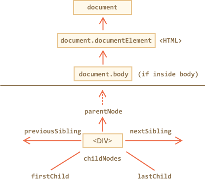

libs:
  - d3
  - domtree

---


# Recorriendo el DOM

El DOM permite hacer cualquier cosa con los elementos y sus contenidos, pero primero necesitamos alcanzar el objeto DOM correspondiente, convertirlo en una variable y luego podemos modificarlo.

Todas las operaciones en el DOM comienzan con el objeto `document`. Desde el podemos acceder a cualquier nodo.

Aquí hay una foto de enlaces que permiten desplazarse entre nodos DOM:



Vamos a estudiarlo con más detalle.

## En la parte superior: documentElement y body

Los nodos del árbol superior están disponibles directamente como propiedades del objeto `document`:

`<html>` = `document.documentElement`
: El nodo superior es `document.documentElement`. Ese es el nodo DOM de la etiqueta `<html>`.

`<body>` = `document.body`
: Otro nodo DOM muy utilizado es el elemento `<body>` - `document.body`.

`<head>` = `document.head`
: La etiqueta `<head>` está disponible como `document.head`.

````warn header="Hay un problema: `document.body` puede ser `null`"
Un script no puede acceder a un elemento que no existe en el momento de la ejecución.

En particular, si un script está dentro de `<head>`, entonces `document.body` no está disponible, porque el navegador aún no lo leyó.

Entonces, en el siguiente ejemplo, el primer "alert" muestra "null":

```html run
<html>

<head>
  <script>
*!*
    alert( "Desde HEAD: " + document.body ); // null, <body> aún no está disponible
*/!*
  </script>
</head>

<body>

  <script>
    alert( "Desde BODY: " + document.body ); // HTMLBodyElement, ahora existe
  </script>

</body>
</html>
```
````

```smart header="En el mundo DOM 'null' significa \"no existe\""
En el DOM, el valor `null` significa "no existe" o "no existe tal nodo ".
```

## Hijos: childNodes, firstChild, lastChild

Hay dos términos que usaremos de ahora en adelante:

- **Nodos hijos (o hijos)** - Elementos que son *hijos directos*. En otras palabras, están anidados exactamente en un elemento. Por ejemplo, `<head>` y `<body>` son hijos del elemento `<html>`.
- **Descendientes** - todos los elementos que están anidados en un elemento, incluidos los hijos, los hijos de sus hijos, etc.

Por ejemplo, aquí `<body>` tiene hijos `<div>` y `<ul>` (y algunos nodos de texto en blanco):

```html run
<html>
<body>
  <div>Inicio</div>

  <ul>
    <li>
      <b>Información</b>
    </li>
  </ul>
</body>
</html>
```

... Y si pedimos todos los descendientes de `<body>`, entonces obtenemos hijos directos `<div>`, `<ul>` y también más elementos anidados como `<li>` (hijo de `<ul>`) y `<b>` (hijo de `<li>`) - todo el subárbol.

**La colección `childNodes` proporciona acceso a todos los nodos secundarios, incluidos los nodos de texto.**

El siguiente ejemplo muestra a los hijos de `document.body`:

```html run
<html>
<body>
  <div>Inicio</div>

  <ul>
    <li>Información</li>
  </ul>

  <div>Fin</div>

  <script>
*!*
    for (let i = 0; i < document.body.childNodes.length; i++) {
      alert( document.body.childNodes[i] ); // Text, DIV, Text, UL, ..., SCRIPT
    }
*/!*
  </script>
  ...mas cosas...
</body>
</html>
```

Por favor, tenga en cuenta un detalle interesante aquí. Si ejecutamos el ejemplo anterior, el último elemento mostrado es `<script>`. De hecho, el documento tiene más información a continuación, pero en el momento de la ejecución del script el navegador aún no lo ha leído, por lo que el script no lo ve.

**Las propiedades `firstChild` y` lastChild` le dan acceso rápido al primer y último hijo.**

Son sólo atajos. Si existen nodos secundarios, lo siguiente siempre es verdadero:
```js
elem.childNodes[0] === elem.firstChild
elem.childNodes[elem.childNodes.length - 1] === elem.lastChild
```

También hay una función especial `elem.hasChildNodes()` para verificar si existen nodos secundarios.

### Collecciones DOM

Como podemos ver, `childNodes` parece un array (matriz). Pero en realidad no es un array, sino una *colección*: un objeto iterable especial similar a un array.

Hay dos consecuencias importantes:

1. Podemos usar `for..of` para iterar sobre él:
  ```js
  for (let node of document.body.childNodes) {
    alert(node); // Muestra todos los nodos de la colección.
  }
  ```
  Eso es porque es iterable (proporciona la propiedad `Symbol.iterator`, según sea necesario).

2. Los métodos de array no funcionarán, porque no es un array:
  ```js run
  alert(document.body.childNodes.filter); // undefined (No existe el método filter!)
  ```

Lo primero es bueno. Lo segundo es tolerable, porque podemos usar `Array.from` para crear una matriz "real" de la colección, si queremos métodos de array:

  ```js run
  alert( Array.from(document.body.childNodes).filter ); // ahora funciona
  ```

```warn header="Las colecciones DOM son de solo lectura"
Colecciones DOM: *todas* las propiedades de navegación enumeradas en este capítulo son de solo lectura.

No podemos reemplazar a un hijo por otra cosa `childNodes[i] = ...`.

Para cambiar el DOM necesita otros métodos, los veremos en el siguiente capítulo.
```

```warn header="Las colecciones DOM están vivas"
Casi todas las colecciones DOM, con pequeñas excepciones, están *vivas*. En otras palabras, reflejan el estado actual del DOM.

Si mantenemos una referencia a `elem.childNodes`, y agregamos/eliminamos nodos en el DOM, entonces aparecerán en la colección automáticamente.
```

````warn header="No use `for..in` para recorrer las colecciones"
Las colecciones son iterables usando `for..of`. A veces la gente trata de usar `for..in` para eso.

Por favor no lo hagas. El bucle `for..in` itera sobre todas las propiedades enumerables. Y las colecciones tienen algunas propiedades "extra" que rara vez se usan y que normalmente no queremos obtener:

```html run
<body>
<script>
  // muestra 0, 1, length, item, values and more.
  for (let prop in document.body.childNodes) alert(prop);
</script>
</body>
````

## Hermanos y padre

*Los hermanos* son nodos que son hijos del mismo padre. Por ejemplo, `<head>` y `<body>` son hermanos:
- Se dice que `<body>` es el hermano "siguiente" o "derecho" de `<head>`,
- Se dice que `<head>` es el hermano "anterior" o "izquierdo" de `<body>`.

El padre está disponible como `parentNode`.

El siguiente nodo en el mismo padre (siguiente hermano) es `nextSibling`, y el anterior es `previousSibling`.

Por ejemplo:

```html run
<html><head></head><body><script>
  // el padre de <body> es <html>
  alert( document.body.parentNode === document.documentElement ); // true

  // después de <head> va <body>
  alert( document.head.nextSibling ); // HTMLBodyElement

  // antes de <body> va <head>
  alert( document.body.previousSibling ); // HTMLHeadElement
</script></body></html>
```

## Navegando solo por elementos

Las propiedades de navegación enumeradas anteriormente se refieren a *todos* los nodos. Por ejemplo, en `childNodes` podemos ver nodos de texto, nodos de elementos e incluso nodos de comentarios, si existen.

Pero para muchas tareas no queremos nodos de texto o comentarios. Queremos manipular los nodos de elementos que representan etiquetas y forman la estructura de la página.

Así que veamos más enlaces de navegación que solo toman en cuenta los *nodos* de elementos:


Los enlaces son similares a los vistos anteriormente, solo con la palabra `Element` dentro:

- `children` -- aquellos hijos que son nodos de tipo `element`.
- `firstElementChild`,` lastElementChild` -- primer y último elemento hijo.
- `previousElementSibling`, `nextElementSibling` -- elementos vecinos
- `parentElement` -- elemento padre.

````smart header="¿Por qué `parentElement`? ¿Puede el padre *no* ser un elemento?"
La propiedad `parentElement` devuelve el "elemento" padre, mientras que `parentNode` devuelve "cualquier nodo" padre. Estas propiedades son generalmente las mismas: ambas obtienen el padre.

Con la única excepción de `document.documentElement`:

```js run
alert( document.documentElement.parentNode ); // document
alert( document.documentElement.parentElement ); // null
```

En otras palabras, el `documentElement` (`<html>`) es el nodo raíz. Formalmente, tiene `document` como su padre. Pero `document` no es un nodo de elemento, por lo que `parentNode` lo devuelve y `parentElement` no lo hace.

A veces, eso importa cuando estamos recorriendo sobre la cadena de padres y llamamos a un método para cada uno de ellos, pero el `document` no lo tiene, por lo que lo excluimos.
````

Modifiquemos uno de los ejemplos anteriores: reemplace `childNodes` con` children`. Ahora muestra solo elementos:

```html run
<html>
<body>
  <div>Inicio</div>

  <ul>
    <li>Información</li>
  </ul>

  <div>Fin</div>

  <script>
*!*
    for (let elem of document.body.children) {
      alert(elem); // DIV, UL, DIV, SCRIPT
    }
*/!*
  </script>
  ...
</body>
</html>
```

## Más enlaces: tablas [#dom-navigation-tables]

Hasta ahora describimos las propiedades básicas de navegación.

Ciertos tipos de elementos DOM pueden proporcionar propiedades adicionales, específicas para su tipo, para mayor comodidad.

Las tablas son un gran ejemplo e importante caso particular de eso.

**El elemento `<table>`** admite (además de lo indicado anteriormente) estas propiedades:
- `table.rows` -- la colección de elementos `<tr>` de la tabla.
- `table.caption/tHead/tFoot` -- referencias a los elementos `<caption>`, `<thead>`, `<tfoot>`.
- `table.tBodies` -- la colección de elementos `<tbody>` (pueden ser muchos según el estándar).

Los elementos **`<thead>`, `<tfoot>`, `<tbody>`** proporcionan la propiedad `rows`:
- `tbody.rows` -- la colección de `<tr>` dentro.

**`<tr>`:**
- `tr.cells` -- la colección de celdas `<td>` y `<th>` dentro del `<tr>` dado.
- `tr.sectionRowIndex` -- la posición (índice) del `<tr>` dentro del `<thead>/<tbody>/<tfoot>` dado.
- `tr.rowIndex` -- el número de `<tr>` en la tabla como un todo (incluidas todas las filas de la tabla).

**`<td>` and `<th>`:**
- `td.cellIndex` - el número de la celda dentro del `<tr>`.

Un ejemplo:

```html run height=100
<table id="table">
  <tr>
    <td>uno</td><td>dos</td>
  </tr>
  <tr>
    <td>tres</td><td>cuatro</td>
  </tr>
</table>

<script>
  // obtener el contenido de la primera fila, segunda celda
  alert( table.*!*rows[0].cells[1]*/!*.innerHTML ) // "dos"
</script>
```

La especificación: [datos tabulares](https://html.spec.whatwg.org/multipage/tables.html).

También hay propiedades de navegación adicionales para formularios HTML. Los veremos más adelante cuando empecemos a trabajar con formularios.

# Resumen

Dado un nodo DOM, podemos ir a sus vecinos inmediatos utilizando las propiedades de navegación.

Hay dos conjuntos principales:

- Para todos los nodos: `parentNode`, `childNodes`, `firstChild`, `lastChild`, `previousSibling`, `nextSibling`.
- Solo para nodos de elementos: `parentElement`, `children`, `firstElementChild`, `lastElementChild`, `previousElementSibling`, `nextElementSibling`.

Algunos tipos de elementos DOM, por ejemplo, `tables`, proporcionan propiedades adicionales y colecciones para acceder a su contenido.
