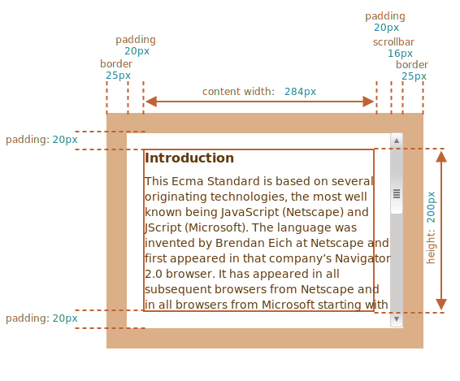

# Tamaño de elementos y desplazamiento

Hay muchas propiedades en JavaScript que nos permiten leer información sobre el ancho, alto y otras características geométricas de los elementos.

A menudo necesitamos de ellas cuando movemos o posicionamos un elemento en JavaScript.

## Elemento de muestra

Como un elemento de muestra para demostrar las propiedades, usaremos el que se indica a continuación:

```html no-beautify
<div id="example">
  ...Texto...
</div>
<style>
  #example {
    width: 300px;
    height: 200px;
    border: 25px solid #E8C48F;
    padding: 20px;
    overflow: auto;
  }
</style>
```

Este tiene borde, relleno y desplazamiento. El conjunto completo de funciones. No hay márgenes porque no son parte del elemento en sí, y no tienen propiedades especiales.

El elemento tiene este aspecto:



Puedes [abrir el documento en la zona de pruebas](sandbox:metric).

```smart header="Atento a la barra de desplazamiento (scrollbar)"
La imagen de arriba muestra el caso más complejo cuando el elemento tiene una barra de desplazamiento. Algunos navegadores (no todos) reservan espacio para tomarlo del contenido (el etiquetado como "content width" arriba).

Entonces, sin la barra de desplazamiento el ancho del contenido sería `300px`, pero si la barra de desplazamiento tiene un ancho de `16px` (el ancho puede variar entre dispositivos y navegadores) entonces solo queda `300 - 16 = 284px`, y deberíamos tenerlo en cuenta. Es por eso que los ejemplos de este capítulo asumen que hay una barra de desplazamiento. Sin ella, algunos cálculos son más sencillos.
```

```smart header="El área `padding-bottom` puede estar lleno de texto"
Por lo general, los rellenos se muestran vacíos en nuestras ilustraciones, pero si hay mucho texto en el elemento y se desborda, los navegadores muestran el texto "desbordado" en `padding-bottom`, eso es normal.
```

## Geometría

Aquí está la imagen general con propiedades geométricas:


Los valores de estas propiedades son técnicamente números, pero estos números son "de píxeles", así que estas son medidas de píxeles.

Comencemos a explotar las propiedades, iniciando desde el exterior del elemento.

## offsetParent, offsetLeft/Top

Estas propiedades son raramente necesarias, pero aún son las propiedades de geometría "más externas" así que comenzaremos con ellas.

El `offsetParent` es el antepasado más cercano que usa el navegador para calcular las coordenadas durante el renderizado.

Ese es el antepasado más cercano que es uno de los siguientes:

1. Posicionado por CSS (`position` es `absolute`, `relative`, `fixed` o `sticky`),  o...
2. `<td>`, `<th>`, or `<table>`,  o...
3. `<body>`.

Las propiedades `offsetLeft/offsetTop` proporcionan coordenadas x/y relativas a la esquina superior izquierda de `offsetParent`.

En el siguiente ejemplo el `<div>` más interno tiene `<main>` como `offsetParent`, y `offsetLeft/offsetTop` lo desplaza desde su esquina superior izquierda (`180`):

```html run height=10
<main style="position: relative" id="main">
  <article>
    <div id="example" style="position: absolute; left: 180px; top: 180px">...</div>
  </article>
</main>
<script>
  alert(example.offsetParent.id); // main
  alert(example.offsetLeft); // 180 (nota: es un número, no un string "180px")
  alert(example.offsetTop); // 180
</script>
```


Hay varias ocasiones en la que `offsetParent` es `null`:

1. Para elementos no mostrados (`display:none` o no en el documento).
2. Para `<body>` y `<html>`.
3. Para elementos con `position:fixed`.

## offsetWidth/Height

Ahora pasemos al elemento en sí.

Estas dos propiedades son las más simples. Proporcionan el ancho y alto "exterior" del elemento. O, en otras palabras, su tamaño completo, incluidos los bordes.


Para nuestro elemento de muestra:

- `offsetWidth = 390` -- el ancho exterior, puede ser calculado como CSS-width interno (`300px`) más acolchonados (`2 * 20px`) y bordes (`2 * 25px`).
- `offsetHeight = 290` -- el alto exterior.

````smart header="Las propiedades geométricas para elementos no mostrados son cero o null"
Las propiedades geométricas son calculadas solo para elementos mostrados.

En un elemento (o cualquiera de sus antepasados) tiene `display:none` o no está en el documento, entonces las propiedades geométricas son cero (o `null` para `offsetParent`).

Por ejemplo, `offsetParent` es `null`, y `offsetWidth`, `offsetHeight` son `0` cuando creamos un elemento pero aún no lo han insertado en el documento, o cuando éste (o su ancestro) tiene `display:none`.

Nosotros podemos usar esto para verificar si un elemento está oculto, así: 

```js
function isHidden(elem) {
  return !elem.offsetWidth && !elem.offsetHeight;
}
```

Observa que tal `isHidden` devuelve `true` para elementos que están en pantalla pero tienen tamaño cero.
````

## clientTop/Left

Dentro del elemento, tenemos los bordes.

Para medirlos, están las propiedades `clientTop` y `clientLeft`.

En nuestro ejemplo:

- `clientLeft = 25` -- ancho del borde izquierdo
- `clientTop = 25` -- ancho del borde superior


... pero para ser precisos: estas propiedades no son el ancho/alto del borde sino las coordenadas relativas del lado interior respecto al lado exterior.

¿Cuál es la diferencia?

Esto se vuelve evidente cuando el documento está de derecha a izquierda (con el sistema operativo en idioma árabe, o hebreo). La barra de desplazamiento no está a la derecha sino a la izquierda, entonces `clientLeft` también incluye el ancho de la barra de desplazamiento.

En este caso, `clientLeft` no es `25`, sino que se suma el ancho de la barra de desplazamiento `25 + 16 = 41`.

Aquí está el ejemplo en hebreo:


## clientWidth/Height

Esta propiedad proporciona el tamaño del área dentro de los bordes del elemento.

Incluyen el ancho del contenido junto con los rellenos, pero sin la barra de desplazamiento:


En la imagen de arriba, consideramos primero `clientHeight`.

No hay una barra de desplazamiento horizontal, por lo que es exactamente la suma de lo que está dentro de los bordes: CSS-height `200px` más el relleno superior e inferior (`2 * 20px`) totaliza `240px`.

Ahora `clientWidth`: aquí el ancho del contenido no es `300px`, sino `284px`, porque los `16px` son ocupados por la barra de desplazamiento. Entonces la suma es `284px` más los rellenos de izquierda y derecha, total `324px`.

**Si no hay rellenos, entonces `clientWidth/Height` es exactamente el área de contenido, dentro de los bordes y la barra de desplazamiento (si la hay).**


Entonces, cuando no hay relleno, podremos usar `clientWidth/clientHeight` para obtener el tamaño del área de contenido.

## scrollWidth/Height

Estas propiedades son como `clientWidth/clientHeight`, pero también incluyen las partes desplazadas (ocultas):


En la imagen de arriba:

- `scrollHeight = 723` -- es la altura interior completa del área de contenido, incluyendo las partes desplazadas.
- `scrollWidth = 324` -- es el ancho interior completo, aquí no tenemos desplazamiento horizontal, por lo que es igual a `clientWidth`.

Podemos usar estas propiedades para expandir el elemento a su ancho/alto completo.

Como esto:

```js
// expanda el elemento a la altura completa del contenido
element.style.height = `${element.scrollHeight}px`;
```

```online
Clic en el botón para expandir el elemento:

<div id="element" style="width:300px;height:200px; padding: 0;overflow: auto; border:1px solid black;">text text text text text text text text text text text text text text text text text text text text text text text text text text text text text text text text text text text text text text text text text text text text text text text text text text text text text text text text text text text text text text text text text text text text text text text text text text text text text text text text text text text text text text text text text text text text text text text text text text text text text text text text text text text text text text text text text text text text text text text text text text text text text text text text text text text text text text text text text text text text</div>

<button style="padding:0" onclick="element.style.height = `${element.scrollHeight}px`">element.style.height = `${element.scrollHeight}px`</button>
```

## scrollLeft/scrollTop

Las propiedades `scrollLeft/scrollTop` son el ancho/alto de la parte oculta y desplazada del elemento.

En la imagen abajo podemos ver `scrollHeight` y `scrollTop` para un bloque con un desplazamiento vertical.


En otras palabras, `scrollTop` es "cuánto se desplaza hacia arriba".

````smart header="`scrollLeft/scrollTop` puede ser modificado"
La mayoría de las propiedades aquí son solo lectura, pero `scrollLeft/scrollTop` se puede cambiar, y el navegador desplazará el elemento.

```online
Si haces clic en el elemento de abajo, se ejecuta el código `elem.scrollTop += 10`. Eso hace que el contenido del elemento se desplace `10px` abajo.

<div onclick="this.scrollTop+=10" style="cursor:pointer;border:1px solid black;width:100px;height:80px;overflow:auto">Click<br>Me<br>1<br>2<br>3<br>4<br>5<br>6<br>7<br>8<br>9</div>
```

Establecer `scrollTop` en `0` o un valor grande, como `1e9` hará que el elemento se desplace hacia arriba/abajo respectivamente.
````

## No uses width/height obtenidos de CSS

Acabamos de cubrir las propiedades geométricas de los elementos DOM, que se pueden usar para obtener anchos, alturas y calcular distancias.

Pero como sabemos por el capítulo <info:styles-and-classes>, podemos leer CSS-height y width usando `getComputedStyle`.

Entonces, ¿Por qué no leer el ancho de un elemento con `getComputedStyle` como aquí?

```js run
let elem = document.body;

alert( getComputedStyle(elem).width ); // muestra CSS width por elemento
```

¿Por qué deberíamos usar propiedades geométricas en su lugar? Hay dos razones:

1. Primero, CSS `width/height` dependen de otra propiedad: `box-sizing` que define "qué es" CSS width y height. Un cambio en `box-sizing` para propósitos de CSS puede romper dicho JavaScript.
2. Segundo, CSS `width/height` puede ser `auto`, por ejemplo para un elemento en linea:

    ```html run
    <span id="elem">Hola!</span>

    <script>
    *!*
      alert( getComputedStyle(elem).width ); // auto
    */!*
    </script>
    ```

    Desde el punto de vista de CSS, `width:auto` es perfectamente normal, pero en JavaScript necesitamos un tamaño exacto en `px` que podríamos usar en los cálculos. Entonces, aquí el ancho de CSS width es inútil.

Y hay una razón más: una barra de desplazamiento. A veces, el código que funcionaba bien sin una barra de desplazamiento tiene errores, porque una barra de desplazamiento toma el espacio del contenido en algunos navegadores. Entonces, el ancho real disponible para el contenido es *menor* que el ancho de CSS. Y `clientWidth/clientHeight` tiene eso en cuenta.

...Pero con `getComputedStyle(elem).width` la situación es diferente. Algunos navegadores (p.e. Chrome) devuelven el ancho interno real, menos la barra de desplazamiento, y algunos de ellos (p.e. Firefox) -- CSS width (ignora la barra de desplazamiento). Estas diferencias entre los navegadores son la razón para no usar `getComputedStyle`, sino confiar en las propiedades geométricas.

```online
Si tu navegador reserva el espacio para la barra de desplazamiento (la mayoría de navegadores para Windows lo hacen), pueden probarlo a continuación.

[iframe src="cssWidthScroll" link border=1]

El elemento con texto tiene CSS `width:300px`.

En un Windows OS de escritorio, Firefox, Chrome, Edge reservan el espacio para la barra de desplazamiento. Pero Firefox muestra `300px`, mientras que Chrome y Edge muestran menos. Eso es por que Firefox devuelve el ancho del CSS y otros navegadores devuelven el ancho "real".
```

Tenga en cuenta que la diferencia descrita es solo de leer `getComputedStyle(...).width` de JavaScript, visualmente todo es correcto.

## Resumen

Los elementos tienen las siguientes propiedades geométricas:

- `offsetParent` -- es el ancestro posicionado más cercano o `td`, `th`, `table`, `body`.
- `offsetLeft/offsetTop` -- coordenadas relativas al borde superior izquierdo de `offsetParent`.
- `offsetWidth/offsetHeight` -- ancho/alto "exterior" de un elemento, incluidos los bordes.
- `clientLeft/clientTop` -- las distancias desde la esquina exterior superior izquierda a la esquina interior superior izquierda (contenido + relleno). Para los Sistemas Operativos de izquierda a derecha, siempre son los anchos de los bordes izquierdo/superior. Para los Sistemas Operativos de derecha a izquierda, la barra de desplazamiento está a la izquierda, por lo que `clientLeft` también incluye su ancho.
- `clientWidth/clientHeight` -- el ancho/alto del contenido incluyendo rellenos, pero sin la barra de desplazamiento.
- `scrollWidth/scrollHeight` -- el ancho/alto del contenido, al igual que `clientWidth/clientHeight`, pero también incluye la parte invisible desplazada del elemento.
- `scrollLeft/scrollTop` -- ancho/alto de la parte superior desplazada del elemento, comenzando desde la esquina superior izquierda.

Todas las propiedades son solo lectura excepto `scrollLeft/scrollTop` que hacen que el navegador desplace el elemento si se cambia.
