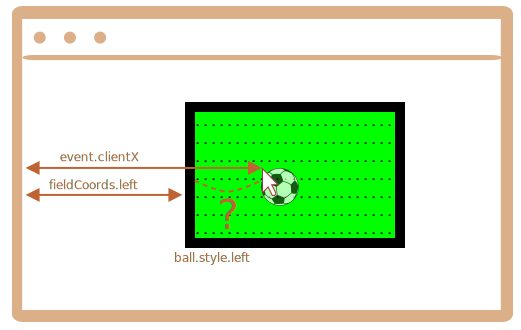

Primero necesitamos elegir un método para posicionar el balón.

No podemos usar `position:fixed` para ello, porque al desplazar la página se movería el balón del campo.

Así que deberíamos usar `position:absolute` y, para que el posicionamiento sea realmente sólido, hacer que `field` sea posicione a sí mismo.

Entonces el balón se posicionará en relación al campo:

```css
#field {
  width: 200px;
  height: 150px;
  position: relative;
}

#ball {
  position: absolute;
  left: 0; /* relativo al predecesor más cercano (field) */
  top: 0;
  transition: 1s all; /* Animación CSS para que left/top hagan al balón volar  */
}
```

Lo siguiente es asignar el `ball.style.left/top` correcto. Ahora contienen coordenadas relativas al campo.

Aquí está la imagen:



Tenemos `event.clientX/clientY`, las cuales son las coordenadas del click relativas a la ventana.

Para obtener la coordenada `left` del click relativa al campo necesitamos restar el limite izquierdo del campo y el ancho del borde:

```js
let left = event.clientX - fieldCoords.left - field.clientLeft;
```

Normalmente `ball.style.left` significa el "borde izquierdo del elemento" (el balón). Por lo que si asignamos ese `left`, entonces el borde del balón, no el centro, es el que se encontraría debajo del cursor del mouse.

Necesitamos mover la mitad del ancho del balón a la izquierda y la mitad del alto hacia arriba para que quede en el centro.

Por lo que el `left` final debería ser:

```js
let left = event.clientX - fieldCoords.left - field.clientLeft - ball.offsetWidth/2;
```

La coordenada vertical es calculada usando la misma lógica.

Por favor, nota que el ancho/alto del balón se debe conocer al momento que accedemos a `ball.offsetWidth`. Se debe especificar en HTML o CSS.
