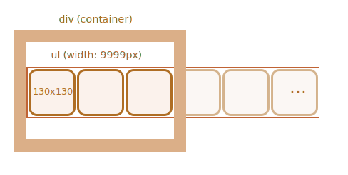

La cinta de imágenes se puede representar como una lista `ul/li` de imágenes ``.

Normalmente dicha cinta es ancha pero colocamos un tamaño fijo `
` alrededor para "cortarla", de modo que solo una parte de la cinta sea visible:

Para que la lista se muestre horizontalmente debemos aplicar las propiedades CSS correctas para `<li>`, como `display: inline-block`.

Para `` también deberíamos ajustar `display`, ya que es `inline` por default. Hay espacio adicional reservado debajo de los "letter tails", por lo que podemos usar `display:block` para eliminarlo.

Para hacer el desplazamiento, podemos cambiar `<ul>`. Hay muchas formas de hacerlo, por ejemplo, cambiando `margin-left` o (para mejor rendimiento) usando  `transform: translateX()`:

El `
` exterior tiene un ancho fijo, por lo que se cortan las imágenes "extra".

Todo el carrusel es un "componente gráfico" autónomo en la página, por lo que será mejor que lo envuelva en un solo elemento `
` y le apliquemos estilo.
