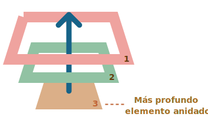

# Propagación y captura

Vamos a empezar con un ejemplo.

Este manejador está asignado a `<div>`, pero también se ejecuta si haces clic a cualquier elemento anidado como `<em>` ó `<code>`:

```html autorun height=60
<div onclick="alert('¡El manejador!')">
  <em>Si haces clic en<code>EM</code>, el manejador en <code>DIV</code> es ejecutado.</em>
</div>
```

¿No es un poco extraño? ¿Por qué el manejador en `<div>` es ejecutado, si el clic fue hecho en `<em>`?

# Propagación

El principio de propagación es simple.

**Cuando un evento ocurre en un elemento, este primero ejecuta los manejadores que tiene asignados, luego los manejadores de su padre, y así hasta otros ancestros.**

Digamos que tenemos 3 elementos anidados `FORM > DIV > P` con un manejador en cada uno de ellos:

```html run autorun
<style>
  body * {
    margin: 10px;
    border: 1px solid blue;
  }
</style>

<form onclick="alert('form')">FORM
  <div onclick="alert('div')">DIV
    <p onclick="alert('p')">P</p>
  </div>
</form>
```

Un clic en el elemento del interior `<p>` primero ejecuta `onclick`:
1. En ese `<p>`.
2. Luego en el `<div>` de arriba.
3. Luego en el `<form>` de más arriba.
4. Y así sucesivamente hasta el objeto `document`.



Así si hacemos clic en `<p>`, entonces veremos 3 alertas: `p` -> `div` -> `form`.

Este proceso se conoce como "propagación" porque los eventos "se propagan" desde el elemento más al interior, a través de los padres, como una burbuja en el agua.

```warn header="*Casi* todos los elementos se propagan."
La palabra clave en esta frase es "casi".


Por ejemplo, un evento `focus` no se propaga. Hay otros ejemplos también, los veremos. Pero aún así, esta es la excepción a la regla, la mayoría de eventos sí se propagan.
```

## event.target

Un manejador en un elemento padre siempre puede obtener los detalles sobre dónde realmente ocurrió el evento.

**El elemento anidado más profundo que causó el evento es llamado elemento *objetivo*, accesible como `event.target`**

Nota la diferencia de `this` (=`event.currentTarget`):

- `event.target` -- es el elemento "objetivo" que inició el evento, no cambia a través de todo el proceso de propagación.
- `this` -- es el elemento "actual", el que tiene un manejador ejecutándose en el momento.

Por ejemplo, si tenemos un solo manejador `form.onclick`, este puede `atrapar` todos los clicks dentro del formulario. No importa dónde el clic se hizo, se propaga hasta el `<form>` y ejecuta el manejador.

En el manejador `form.onclick`:

- `this` (=`event.currentTarget`) es el elemento `<form>`, porque el manejador se ejecutó en él.
- `event.target` es el elemento actual dentro de el formulario al que se le hizo clic.

Mira esto:

[codetabs height=220 src="bubble-target"]

Es posible que `event.target` sea igual a `this`: ocurre cuando el clic se hace directamente en el elemento `<form>`.

## Detener la propagación

Una propagación de evento empieza desde el elemento objetivo hacia arriba. Normalmente este continúa hasta `<html>` y luego hacia el objeto `document`, algunos eventos incluso alcanzan `window`, llamando a todos los manejadores en el camino.

Pero cualquier manejador podría decidir que el evento se ha procesado por completo y detener su propagación.

El método para esto es `event.stopPropagation()`.

Por ejemplo, aquí `body.onclick` no funciona si haces clic en `<button>`:

```html run autorun height=60
<body onclick="alert(`No se propagó hasta aquí`)">
  <button onclick="event.stopPropagation()">Haz clic</button>
</body>
```

```smart header="event.stopImmediatePropagation()"
Si un elemento tiene múltiples manejadores para un solo evento, aunque uno de ellos detenga la propagación, los demás aún se ejecutarán.

En otras palabras, `event.stopPropagation()` detiene la propagación hacia arriba, pero todos los manejadores en el elemento actual se ejecutarán.

Para detener la propagación y prevenir que los manejadores del elemento actual se ejecuten, hay un método `event.stopImmediatePropagation()`. Después de él, ningún otro manejador será ejecutado.
```

```warn header="¡No detengas la propagación si no es necesario!"
La propagación es conveniente. No la detengas sin una necesidad real, obvia y arquitectónicamente bien pensada.

A veces `event.stopPropagation()` crea trampas ocultas que luego se convierten en problemas.

Por ejemplo:

1. Creamos un menú anidado. Cada submenú maneja los clics en sus elementos y ejecuta `stopPropagation` para que el menu de arriba no se desencadene.
2.  Luego decidimos atrapar los clic en toda la ventana, para seguir el rastro del comportamiento del usuario (donde hacen clic). Algunos sistemas de análisis hacen eso. Usualmente el código usa `document.addEventListener('click'…)` para atrapar todos los clics.
3. Nuestro análisis no funcionará sobre el área dónde los clics son detenidos por `stopPropagation`. Tristemente, tenemos una "zona muerta".

Usualmente no hay una necesidad real para prevenir la propagación, pero una tarea que aparentemente lo requiera puede ser resuelta por otros medios. Uno de ellos es usar eventos personalizados, cubriremos eso más tarde. También podemos escribir nuestros datos en el objeto `event` en un manejador y leerlo en otro, para así poder pasar información sobre el proceso de abajo a los manejadores en los padres.
```

## Captura

Hay otra fase en el procesamiento de eventos llamada "captura". Es raro usarla en código real, pero a veces puede ser útil.

El estándar de [eventos del DOM](http://www.w3.org/TR/DOM-Level-3-Events/) describe 3 fases de la propagación de eventos:

1. Fase de captura -- el evento desciende al elemento.
2. Fase de objetivo -- el evento alcanza al elemento.
3. Fase de propagación -- el evento se propaga hacia arriba del elemento.

Aquí está la imagen de un clic en `<td>` dentro de una tabla, tomada desde la especificación:


Se explica así: por un clic en `<td>` el evento va primero a través de la cadena de ancestros hacia el elemento (fase de captura), luego alcanza el objetivo y se desencadena ahí (fase de objetivo), y por último va hacia arriba (fase de propagación), ejecutando los manejadores en su camino.

**Antes solo hablamos de la propagación porque la fase de captura es raramente usada. Normalmente es invisible a nosotros.**

Los manejadores agregados usando la propiedad `on<event>` ó usando atributos HTML ó `addEventListener(event, handler)` con dos argumentos no ejecutarán la fase de captura, únicamente ejecutarán la 2da y 3ra fase.

Para atrapar un evento en la fase de captura, necesitamos preparar la opción `capture` como `true` en el manejador:

```js
elem.addEventListener(..., {capture: true})
// o, solo "true" es una forma más corta de {capture: true}
elem.addEventListener(..., true)
```

Hay dos posibles valores para la opción `capture`:

- Si es `false` (por defecto), entonces el manejador es preparado para la fase de propagación.
- Si es `true`, entonces el manejador es preparado para la fase de captura.


Es de notar que mientras formalmente hay 3 fases, la 2da fase ("la fase de objetivo": el evento alcanzó el elemento) no es manejada de forma separada; los manejadores en ambas fases, la de captura y propagación, se disparan en esa fase.

Veamos ambas fases, captura y propagación, en acción:

```html run autorun height=140 edit
<style>
  body * {
    margin: 10px;
    border: 1px solid blue;
  }
</style>

<form>FORM
  <div>DIV
    <p>P</p>
  </div>
</form>

<script>
  for(let elem of document.querySelectorAll('*')) {
    elem.addEventListener("click", e => alert(`Captura: ${elem.tagName}`), true);
    elem.addEventListener("click", e => alert(`Propagación: ${elem.tagName}`));
  }
</script>
```

El código prepara manejadores de clic en *cada* elemento en el documento para ver cuáles están funcionando.

Si haces clic en `<p>`, verás que la secuencia es:

1. `HTML` -> `BODY` -> `FORM` -> `DIV` (fase de captura, el primer detector):
2. `P` (fase de objetivo, se dispara dos veces, tan pronto como preparemos los dos detectores: de captura y propagación)
3. `DIV` -> `FORM` -> `BODY` -> `HTML` (fase de propagación, el segundo detector).

Hay un propiedad `event.eventPhase` que nos dice el número de fase en la qué el evento fue capturado. Pero es raramente usada, ya que usualmente lo sabemos en el manejador.

```smart header="Para quitar el manejador, `removeEventListener` necesita la misma fase"
Si nosotros `addEventListener(..., true)`, entonces deberíamos mencionar la misma fase en `removeEventListener(..., true)` para remover el manejador correctamente.
```

````smart header="Detectores de eventos en el mismo elemento y en la misma fase se ejecutan en el orden de asignación"
Si tenemos múltiples manejadores de eventos en la misma fase, asignados al mismo elemento con `addEventListener`, se ejecutarán en el orden que fueron creados:

```js
elem.addEventListener("click", e => alert(1)); // garantizado que se ejecutará primero
elem.addEventListener("click", e => alert(2));
```
````

## Resumen

Cuando ocurre un evento, el elemento más anidado dónde ocurrió se reconoce como el "elemento objetivo" (`event.target`).

- Luego el evento se mueve hacia abajo desde el documento raíz hacia `event.target`, llamando a los manejadores en el camino asignados con `addEventListener(..., true)` (`true` es una abreviación para `{capture: true}`).
- Luego los manejadores son llamados en el elemento objetivo mismo.
- Luego el evento se propaga desde `event.target` hacia la raíz, llamando a los manejadores que se asignaron usando `on<event>`, atributos HTML y `addEventListener` sin el 3er argumento o con el 3er argumento `false/{capture:false}`.

Cada manejador puede acceder a las propiedades del objeto `event`:

- `event.target` -- el elemento más profundo que originó el evento.
- `event.currentTarget` (=`this`) -- el elemento actual que maneja el evento (el que tiene al manejador en él)
- `event.eventPhase` -- la fase actual (captura=1, objetivo=2, propagación=3).

Cualquier manejador de evento puede detener el evento al llamar `event.stopPropagation()`, pero no es recomendado porque no podemos realmente asegurar que no lo necesitaremos más adelante, quizá para completar diferentes cosas.

La fase de captura raramente es usada, usualmente manejamos los evento en propagación. Y hay una lógica atrás de eso.

En el mundo real, cuando un accidente ocurre, las autoridades locales reaccionan primero. Ellos conocen mejor el área dónde ocurrió. Luego, si es necesario, autoridades de alto nivel.

Lo mismo para los manejadores de eventos. El código que se prepara en el manejador de un elemento en particular conoce el máximo de detalles sobre el elemento y qué hace. Un manejador en un `<td>` particular puede ser adecuado para ese exacto `<td>`, conocer todo sobre él, entonces debe tener su oportunidad primero. Luego su padre inmediato también conoce sobre el contexto, pero un poco menos, y así sucesivamente hasta el elemento de arriba que maneja conceptos generales y se ejecuta al final.

La propagación y captura ponen los cimientos para "delegación de eventos": un extremadamente poderoso patrón de manejo de eventos que se estudia en el siguiente capítulo.
