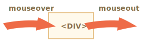

# Moviendo el mouse: mouseover/out, mouseenter/leave

Entremos en detalle sobre los eventos que suceden cuando el mouse se mueve entre elementos.

## Eventos mouseover/mouseout, relatedTarget

El evento `mouseover`  se produce cuando el cursor del mouse aparece sobre un elemento y `mouseout` cuando se va.



Estos eventos son especiales porque tienen la propiedad `relatedTarget`. Esta propiedad complementa a `target`. Cuando el puntero del mouse deja un elemento por otro, uno de ellos se convierte en `target` y el otro en  `relatedTarget`.

Para `mouseover`:

- `event.target` -- Es el elemento al que se acerca el mouse.
- `event.relatedTarget` -- Es el elemento de donde proviene el mouse (`relatedTarget` -> `target`).

Para `mouseout` sucede al contrario:

- `event.target` -- Es el elemento que el mouse dejó.
- `event.relatedTarget` -- es el nuevo elemento bajo el cursor por cuál el cursor dejó al anterior (`target` -> `relatedTarget`).

```online
En el siguiente ejemplo, cada cara y sus características son elementos separados. Puedes ver en el área de texto los eventos que ocurren cuando mueves el mouse.

Cada evento tiene la información sobre ambas propiedades: `target` y `relatedTarget`:

[codetabs src="mouseoverout" height=280]
```

```warn header="`relatedTarget` puede ser `null`"
La propiedad `relatedTarget` puede tener un valor `null`.

Eso es normal y solo significa que el mouse no vino de otro elemento, sino de la ventana o que salió de la ventana.

Debemos tener en cuenta esa posibilidad cuando usemos `event.relatedTarget` en nuestro código. Si accedemos a `event.relatedTarget.tagName` entonces habrá un error.
```

## Saltando elementos

El evento `mousemove`  se activa cuando el mouse se mueve pero eso no significa que cada píxel nos lleve a un evento.

El navegador verifica la posición del mouse de vez en cuando y si nota cambios entonces activan los eventos.

Eso significa que si el visitante mueve el mouse muy rápido, entonces algunos elementos del DOM podrían estar siendo ignorados:


Si el mouse se mueve muy rápido de los elementos `#FROM` a `#TO`, como se muestra arriba, entonces los elementos intermedios `<div>` (o algunos de ellos) podrían ser ignorados. El evento `mouseout` se podría activar en `#FROM` e inmediatamente `mouseover` en `#TO`.

Eso es bueno para el rendimiento porque puede haber muchos elementos intermedios. Realmente no queremos procesar todo lo que sucede dentro y fuera de cada uno.

Por otro lado, debemos tener en cuenta que el puntero del mouse no "visita" todos los elementos en el camino. Los puede "saltar".

En particular, es posible que el puntero salte dentro de la mitad de la página desde la ventana. En ese caso `relatedTarget` es `null`, porque vino de "la nada":


```online
Puedes verlo "en vivo" en un testeador a continuación.

Este HTML tiene dos elementos: el `<div id="child">` está adentro del `<div id="parent">`. Si mueves el mouse rápidamente sobre ellos entonces probablemente solo el `div` hijo active los eventos, o probablemente el padre, o probablemente no ocurran eventos en lo absoluto.

También prueba a mover el cursor hacia el `div` hijo y luego muévelo rápidamente hacia abajo a través del padre. Si el movimiento es lo suficientemente rápido entonces el padre será ignorado. El mouse cruzará el elemento padre sin notarlo.

[codetabs height=360 src="mouseoverout-fast"]
```

```smart header="Si `mouseover` se activa, deberá haber `mouseout`"
En caso de movimientos rápidos, los elementos intermedios podrían ser ignorados, pero una cosa segura sabemos: si el cursor ingresa "oficialmente" dentro de un elemento(evento `mouseover` generado), una vez que lo deje obtendremos `mouseout`.
```

## Mouseout, cuando se deja un elemento por uno anidado.

Una característica importante de `mouseout` -- se activa cuando el cursor se mueve de un elemento hacia su descendiente (elemento anidado o interno). Por ejemplo de `#parent` a `#child` en este HTML:

```html
<div id="parent">
  <div id="child">...</div>
</div>
```

Si estamos sobre `#parent` y luego movemos el cursor hacia dentro de `#child`, ¡vamos a obtener `mouseout` en `#parent`!


Eso puede parecer extraño, pero puede explicarse fácilmente.

**De acuerdo con la lógica del navegador, el cursor podría estar sobre un elemento *individual* en cualquier momento -- el anidado y el más alto según el z-index.**

Entonces si se dirige hacia otro elemento (incluso uno anidado), está dejando al anterior.

Por favor, note otro importante detalle sobre el procesamiento de eventos.

El evento `mouseover` se aparece en un un elemento anidado (brota o nace, por decirlo así). Entonces si `#parent` tiene el controlador `mouseover`, se activa:


```online
Puedes verlo muy bien a continuación: `<div id="child">` está dentro de`<div id="parent">`. Hay controladores `mouseover/out` en el elemento `#parent` que arrojan los detalles de los eventos.

Si mueves el mouse de `#parent` a `#child`, verás dos eventos sobre `#parent`:
1. `mouseout [target: parent]` (dejó al padre), luego
2. `mouseover [target: child]` (vino hacia el hijo, y este evento brotó).

[codetabs height=360 src="mouseoverout-child"]
```

Como se muestra, cuando el cursor se mueve del elemento `#parent` a `#child`, los dos controladores se activan en el elemento padre: `mouseout` y `mouseover`:

```js
parent.onmouseout = function(event) {
  /* event.target: elemento padre  */
};
parent.onmouseover = function(event) {
  /* event.target: elemento hijo (brota) */
};
```

**Si no examinamos `event.target` dentro de los controladores podría parecer que el cursor dejo el elemento `#parent` y volvió a él inmediatamente.**

Pero ese no es el caso. El cursor aún está sobre el elemento padre, simplemente se adentró más en el elemento hijo.

Si hay algunas acciones al abandonar el elemento padre,por ejemplo: una animación se ejecuta con `parent.onmouseout`, usualmente no la queremos cuando el cursor se adentre más sobre `#parent`.

Para evitar esto lo que podemos hacer es checar `relatedTarget` en el controlador y si el mouse aún permanece dentro del elemento entonces ignorar dicho evento.

Alternativamente podemos usar otros eventos: `mouseenter` y `mouseleave`, los cuales cubriremos a continuación, ya que con ellos no hay tales problemas.

## Eventos mouseenter y mouseleave

Los eventos `mouseenter/mouseleave` son como `mouseover/mouseout`. Se activan cuando el cursor del mouse entra/sale del elemento.

Pero hay dos diferencias importantes:

1. Las transiciones hacia/desde los descendientes no se cuentan.
2. Los eventos `mouseenter/mouseleave` no brotan.

Son eventos extremadamente simples.

Cuando el cursor entra en un elemento `mouseenter` se activa. La ubicación exacta del cursor dentro del elemento o sus descendientes no importa.

Cuando el cursor deja el elemento `mouseleave` se activa.

```online
Este ejemplo es similar al anterior, pero ahora el elemento tiene `mouseenter/mouseleave` en lugar de `mouseover/mouseout`.

Como puedes ver, los únicos eventos generados son los relacionados con mover el puntero dentro y fuera del elemento superior. No pasa nada cuando el puntero va hacia el descendiente y regresa. Las transiciones entre descendientes se ignoran:

[codetabs height=340 src="mouseleave"]
```

## Delegación de eventos

Los eventos `mouseenter/leave` son muy simples de usar. Pero no brotan por sí solos. Por lo tanto no podemos usar la delegación de eventos con ellos.

Imagina que queremos manejar entrada/salida para celdas de tabla y hay cientos de celdas.

La solución natural sería: ajustar el controlador en `<table>` y manejar los eventos desde ahí. Pero `mouseenter/leave` no aparece. Entonces si cada evento sucede en `<td>`, solamente un controlador `<td>` es capaz de detectarlo.

Los controladores `mouseenter/leave` en `<table>` solamente se activan cuando el cursor entra/deja la tabla completa. Es imposible obtener alguna información sobre las transiciones dentro de ella.

Pues usemos `mouseover/mouseout`.

Comencemos con controladores simples que resaltan el elemento debajo del mouse:

```js
// Resaltemos un elemento debajo del cursor
table.onmouseover = function(event) {
  let target = event.target;
  target.style.background = 'pink';
};

table.onmouseout = function(event) {
  let target = event.target;
  target.style.background = '';
};
```

```online
Aquí se muestran en acción. A medida que el mouse recorre los elementos de esta tabla, se resalta la actual:

[codetabs height=480 src="mouseenter-mouseleave-delegation"]
```

En nuestro caso nos gustaría manejar las transiciones entre las celdas de la tabla `<td>`: entradas y salidas de una celda a otra. Otras transiciones, como dentro de una celda o fuera de cualquiera de ellas no nos interesan. Vamos a filtrarlas.

Esto es lo que podemos hacer:

- Recordar el elemento `<td>` resaltado actualmente en una variable, llamémosla `currentElem`.
- En `mouseover` ignoraremos el evento si permanecemos dentro del `<td>` actual.
- En `mouseout` ignoraremos el evento si no hemos dejado el `<td>` actual.

Aquí hay un ejemplo de código que explica todas las situaciones posibles:

[js src="mouseenter-mouseleave-delegation-2/script.js"]

Una vez más, las características importantes son:
1. Utilizar la delegación de eventos para manejar la entrada/salida de cualquier `<td>` dentro de la tabla. Pues depende de `mouseover/out` en lugar de `mouseenter/leave` que no broten y por lo tanto no permita ninguna delegación.
2. Los eventos adicionales, como moverse entre descendientes de `<td>` son filtrados, así que `onEnter/Leave` solamente se ejecuta si el cursor ingresa a `<td>` o lo deja absolutamente.

```online
Aquí está el ejemplo completo con todos los detalles:

[codetabs height=460 src="mouseenter-mouseleave-delegation-2"]

Intenta mover el cursor dentro y fuera de las celdas de la tabla y dentro de cada una de ellas. Rápido o lento -- no importa --. Solo se ilumina `<td>` como un todo, a diferencia del ejemplo anterior.
```

## Resumen

Hemos cubierto `mouseover`, `mouseout`, `mousemove`, `mouseenter` y`mouseleave`.

Estas cosas son buenas de destacar:

- Un movimiento rápido del mouse puede omitir elementos intermedios.
- Los eventos `mouseover/out` y `mouseenter/leave` tienen una propiedad adicional: `relatedTarget`. Es el elemento de donde venimos o hacia donde vamos, complementario con `target`.

Los eventos `mouseover/out` se activan incluso cuando vamos de un elemento padre a su descendiente. El navegador asume que de el mouse solo puede estar sobre un elemento a la vez -- el más interno.

Los eventos `mouseenter/leave` son diferentes en ese aspecto: solo se activan cuando el mouse viene hacia el elemento o lo deja como un todo. Así que no se aparecen de repente.
