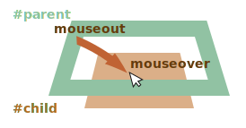

<<<<<<< HEAD
# Moviendo el mouse: mouseover/out, mouseenter/leave

Entremos en detalle sobre los eventos que suceden cuando el mouse se mueve entre elementos.

## Eventos mouseover/mouseout, relatedTarget
=======
# Moving the mouse: mouseover/out, mouseenter/leave

Let's dive into more details about events that happen when the mouse moves between elements.

## Events mouseover/mouseout, relatedTarget
>>>>>>> 0bfebb4b46b4b5f9c221915ab8b1e2de9bdc013d

El evento `mouseover`  se produce cuando el cursor del mouse aparece sobre un elemento y `mouseout` cuando se va.


<<<<<<< HEAD
Estos eventos son especiales porque tienen la propiedad `relatedTarget`. Esta propiedad complementa a `target`. Cuando el puntero del mouse deja un elemento por otro, uno de ellos se convierte en `target` y el otro en  `relatedTarget`.
=======
These events are special, because they have property `relatedTarget`. This property complements `target`. When a mouse leaves one element for another, one of them becomes `target`, and the other one - `relatedTarget`.
>>>>>>> 0bfebb4b46b4b5f9c221915ab8b1e2de9bdc013d

Para `mouseover`:

<<<<<<< HEAD
- `event.target` -- Es el elemento al que se acerca el mouse.
- `event.relatedTarget` -- Es el elemento de donde proviene el mouse (`relatedTarget` -> `target`).
=======
- `event.target` -- is the element where the mouse came over.
- `event.relatedTarget` -- is the element from which the mouse came (`relatedTarget` -> `target`).
>>>>>>> 0bfebb4b46b4b5f9c221915ab8b1e2de9bdc013d

Para `mouseout` sucede al contrario:

<<<<<<< HEAD
- `event.target` -- Es el elemento que el mouse dejó.
- `event.relatedTarget` -- es el nuevo elemento bajo el cursor por cuál el cursor dejó al anterior (`target` -> `relatedTarget`).

```online
En el siguiente ejemplo, cada cara y sus características son elementos separados. Puedes ver en el área de texto los eventos que ocurren cuando mueves el mouse.

Cada evento tiene la información sobre ambas propiedades: `target` y `relatedTarget`:
=======
- `event.target` -- is the element that the mouse left.
- `event.relatedTarget` -- is the new under-the-pointer element, that mouse left for (`target` -> `relatedTarget`).

```online
In the example below each face and its features are separate elements. When you move the mouse, you can see mouse events in the text area.

Each event has the information about both `target` and `relatedTarget`:
>>>>>>> 0bfebb4b46b4b5f9c221915ab8b1e2de9bdc013d

[codetabs src="mouseoverout" height=280]
```

```warn header="`relatedTarget` puede ser `null`"
La propiedad `relatedTarget` puede tener un valor `null`.

Eso es normal y solo significa que el mouse no vino de otro elemento, sino de la ventana o que salió de la ventana.

Debemos tener en cuenta esa posibilidad cuando usemos `event.relatedTarget` en nuestro código. Si accedemos a `event.relatedTarget.tagName` entonces habrá un error.
```

<<<<<<< HEAD
## Saltando elementos
=======
## Skipping elements
>>>>>>> 0bfebb4b46b4b5f9c221915ab8b1e2de9bdc013d

El evento `mousemove`  se activa cuando el mouse se mueve pero eso no significa que cada píxel nos lleve a un evento.

El navegador verifica la posición del mouse de vez en cuando y si nota cambios entonces activan los eventos.

<<<<<<< HEAD
Eso significa que si el visitante mueve el mouse muy rápido, entonces algunos elementos del DOM podrían estar siendo ignorados:


Si el mouse se mueve muy rápido de los elementos `#FROM` a `#TO`, como se muestra arriba, entonces los elementos intermedios `<div>` (o algunos de ellos) podrían ser ignorados. El evento `mouseout` se podría activar en `#FROM` e inmediatamente `mouseover` en `#TO`.

Eso es bueno para el rendimiento porque puede haber muchos elementos intermedios. Realmente no queremos procesar todo lo que sucede dentro y fuera de cada uno.

Por otro lado, debemos tener en cuenta que el puntero del mouse no "visita" todos los elementos en el camino. Los puede "saltar".

En particular, es posible que el puntero salte dentro de la mitad de la página desde la ventana. En ese caso `relatedTarget` es `null`, porque vino de "la nada":
=======
That means that if the visitor is moving the mouse very fast then some DOM-elements may be skipped:


If the mouse moves very fast from `#FROM` to `#TO` elements as painted above, then intermediate `<div>` elements (or some of them) may be skipped. The `mouseout` event may trigger on `#FROM` and then immediately `mouseover` on `#TO`.

That's good for performance, because there may be many intermediate elements. We don't really want to process in and out of each one.

On the other hand, we should keep in mind that the mouse pointer doesn't "visit" all elements along the way. It can "jump".

In particular, it's possible that the pointer jumps right inside the middle of the page from out of the window. In that case `relatedTarget` is `null`, because it came from "nowhere":
>>>>>>> 0bfebb4b46b4b5f9c221915ab8b1e2de9bdc013d


```online
<<<<<<< HEAD
Puedes verlo "en vivo" en un testeador a continuación.

Este HTML tiene dos elementos: el `<div id="child">` está adentro del `<div id="parent">`. Si mueves el mouse rápidamente sobre ellos entonces probablemente solo el `div` hijo active los eventos, o probablemente el padre, o probablemente no ocurran eventos en lo absoluto.

También prueba a mover el cursor hacia el `div` hijo y luego muévelo rápidamente hacia abajo a través del padre. Si el movimiento es lo suficientemente rápido entonces el padre será ignorado. El mouse cruzará el elemento padre sin notarlo.
=======
You can check it out "live" on a teststand below.

Its HTML has two nested elements: the `<div id="child">` is inside the `<div id="parent">`. If you move the mouse fast over them, then maybe only the child div triggers events, or maybe the parent one, or maybe there will be no events at all.

Also move the pointer into the child `div`, and then move it out quickly down through the parent one. If the movement is fast enough, then the parent element is ignored. The mouse will cross the parent element without noticing it.
>>>>>>> 0bfebb4b46b4b5f9c221915ab8b1e2de9bdc013d

[codetabs height=360 src="mouseoverout-fast"]
```

<<<<<<< HEAD
```smart header="Si `mouseover` se activa, deberá haber `mouseout`"
En caso de movimientos rápidos, los elementos intermedios podrían ser ignorados, pero una cosa segura sabemos: si el cursor ingresa "oficialmente" dentro de un elemento(evento `mouseover` generado), una vez que lo deje obtendremos `mouseout`.
```

## Mouseout, cuando se deja un elemento por uno anidado.

Una característica importante de `mouseout` -- se activa cuando el cursor se mueve de un elemento hacia su descendiente (elemento anidado o interno). Por ejemplo de `#parent` a `#child` en este HTML:

```html
<div id="parent">
  <div id="child">...</div>
</div>
```

Si estamos sobre `#parent` y luego movemos el cursor hacia dentro de `#child`, ¡vamos a obtener `mouseout` en`#parent`!



Eso puede parecer extraño, pero puede explicarse fácilmente.

**De acuerdo con la lógica del navegador, el cursor podría estar sobre un elemento *individual* en cualquier momento -- el anidado y el más alto segun el z-index.**

Entonces si se dirige hacia otro elemento (incluso uno anidado), está dejando al anterior.

Por favor, note otro importante detalle sobre el procesamiento de eventos.

El evento `mouseover` se aparece en un un elemento anidado (brota o nace, por decirlo así). Entonces si `#parent` tiene el cotrolador `mouseover`, se activa:


```online
Puedes verlo muy bien a continuación: `<div id="child">` está dentro de`<div id="parent">`. Hay controladores `mouseover/out` en el elemento `#parent` que arrojan los detalles de los eventos.

Si mueves el mouse de `#parent` a `#child`, verás dos eventos sobre `#parent`:
1. `mouseout [target: parent]` (dejó al padre), luego
2. `mouseover [target: child]` (vino hacia el hijo, y este evento brotó).
=======
```smart header="If `mouseover` triggered, there must be `mouseout`"
In case of fast mouse movements, intermediate elements may be ignored, but one thing we know for sure: if the pointer "officially" entered an element (`mouseover` event generated), then upon leaving it we always get `mouseout`.
```

## Mouseout when leaving for a child

An important feature of `mouseout` -- it triggers, when the pointer moves from an element to its descendant, e.g. from `#parent` to `#child` in this HTML:

```html
<div id="parent">
  <div id="child">...</div>
</div>
```

If we're on `#parent` and then move the pointer deeper into `#child`, but we get `mouseout` on `#parent`!


That may seem strange, but can be easily explained.

**According to the browser logic, the mouse cursor may be only over a *single* element at any time -- the most nested one and top by z-index.**

So if it goes to another element (even a descendant), then it leaves the previous one.

Please note another important detail of event processing.

The `mouseover` event on a descendant bubbles up. So, if `#parent` has `mouseover` handler, it triggers:


```online
You can see that very well in the example below: `<div id="child">` is inside the `<div id="parent">`. There are `mouseover/out` handlers on `#parent` element that output event details.

If you move the mouse from `#parent` to `#child`, you see two events on `#parent`:
1. `mouseout [target: parent]` (left the parent), then
2. `mouseover [target: child]` (came to the child, bubbled).
>>>>>>> 0bfebb4b46b4b5f9c221915ab8b1e2de9bdc013d

[codetabs height=360 src="mouseoverout-child"]
```

<<<<<<< HEAD
Como se muestra, cuando el cursor se mueve del elemento `#parent` a `#child`, los dos controladores se activan en el elemento padre: `mouseout` y `mouseover`:

```js
parent.onmouseout = function(event) {
  /* event.target: elemento padre  */
};
parent.onmouseover = function(event) {
  /* event.target: elemento hijo (brota) */
};
```

**Si no examinamos `event.target` dentro de los controladores podría parecer que el cursor dejo el elemento `#parent` y volvió a él inmediatamente.**

Pero ese no es el caso. El cusor aún está sobre el elemento padre, simplemente se adentró más en el elemento hijo.

Si hay algunas acciones al abandonar el elemento padre,por ejemplo: una animación se ejecuta con `parent.onmouseout`, usualmente no la queremos cuando el cursor se adentre más sobre `#parent`.
=======
As shown, when the pointer moves from `#parent` element to `#child`, two handlers trigger on the parent element: `mouseout` and `mouseover`:

```js
parent.onmouseout = function(event) {
  /* event.target: parent element */
};
parent.onmouseover = function(event) {
  /* event.target: child element (bubbled) */
};
```

**If we don't examine `event.target` inside the handlers, then it may seem that the mouse pointer left `#parent` element, and then immediately came back over it.**

But that's not the case! The pointer is still over the parent, it just moved deeper into the child element.

If there are some actions upon leaving the parent element, e.g. an animation runs in `parent.onmouseout`, we usually don't want it when the pointer just goes deeper into `#parent`.

To avoid it, we can check `relatedTarget` in the handler and, if the mouse is still inside the element, then ignore such event.

Alternatively we can use other events: `mouseenter` and `mouseleave`, that we'll be covering now, as they don't have such problems.
>>>>>>> 0bfebb4b46b4b5f9c221915ab8b1e2de9bdc013d

Para evitar esto lo que podemos hacer es checar `relatedTarget` en el controlador y si el mouse aún permanece dentro del elemento entonces ignorar dicho evento.

<<<<<<< HEAD
Alternativamente podemos usar otros eventos: `mouseenter` y `mouseleave`, los cuales cubriremos a continuación, ya que con ellos no hay tales problemas.

## Eventos mouseenter y mouseleave

Los eventos `mouseenter/mouseleave` son como `mouseover/mouseout`. Se activan cuando el cursor del mouse entra/sale del elemento.

Pero hay dos diferencias importantes:

1. Las transiciones hacia/desde los descendientes no se cuentan.
2. Los eventos `mouseenter/mouseleave` no brotan.

Son eventos extremadamente simples.

Cuando el cursor entra en un elemento `mouseenter` se activa. La ubicación exacta del cursor dentro del elemento o sus descendientes no importa.

Cuando el cursor deja el elemento `mouseleave` se activa.

```online
Este ejemplo es similar al anterior, pero ahora el elemento tiene `mouseenter/mouseleave` en lugar de `mouseover/mouseout`.

Como puedes ver, los únicos eventos generados son los relacionados con mover el puntero dentro y fuera del elemento superior. No pasa nada cuando el puntero va hacia el descendiente y regresa. Las transiciones entre descendientes se ignoran:
=======
Events `mouseenter/mouseleave` are like `mouseover/mouseout`. They trigger when the mouse pointer enters/leaves the element.

But there are two important differences:

1. Transitions inside the element, to/from descendants, are not counted.
2. Events `mouseenter/mouseleave` do not bubble.

These events are extremely simple.

When the pointer enters an element -- `mouseenter` triggers. The exact location of the pointer inside the element or its descendants doesn't matter.

When the pointer leaves an element -- `mouseleave` triggers.

```online
This example is similar to the one above, but now the top element has `mouseenter/mouseleave` instead of `mouseover/mouseout`.

As you can see, the only generated events are the ones related to moving the pointer in and out of the top element. Nothing happens when the pointer goes to the child and back. Transitions between descendants are ignored
>>>>>>> 0bfebb4b46b4b5f9c221915ab8b1e2de9bdc013d

[codetabs height=340 src="mouseleave"]
```

## Delegación de eventos

Los eventos `mouseenter/leave` son muy simples de usar. Pero no brotan por sí solos. Por lo tanto no podemos usar la delegación de eventos con ellos.

Imagina que queremos manejar entrada/salida para celdas de tabla y hay cientos de celdas.

<<<<<<< HEAD
La solución natural sería: ajustar el controlador en `<table>` y manejar los eventos desde ahí. Pero `mouseenter/leave` no aparece. Entonces si cada evento sucede en `<td>`, solamente un controlador `<td>` es capaz de detectarlo.

Los controladores `mouseenter/leave` en `<table>` solamente se activan cuando el cursor entra/deja la tabla completa. Es imposible obtener alguna información sobre las transiciones dentro de ella.

Pues usemos `mouseover/mouseout`.

Comencemos con controladores simples que resaltan el elemento debajo del mouse:

```js
// Resaltemos un elemento debajo del cursor
=======
The natural solution would be -- to set the handler on `<table>` and process events there. But `mouseenter/leave` don't bubble. So if such event happens on `<td>`, then only a handler on that `<td>` is able to catch it.

Handlers for `mouseenter/leave` on `<table>` only trigger when the pointer enters/leaves the table as a whole. It's impossible to get any information about transitions inside it.

So, let's use `mouseover/mouseout`.

Let's start with simple handlers that highlight the element under mouse:

```js
// let's highlight an element under the pointer
>>>>>>> 0bfebb4b46b4b5f9c221915ab8b1e2de9bdc013d
table.onmouseover = function(event) {
  let target = event.target;
  target.style.background = 'pink';
};

table.onmouseout = function(event) {
  let target = event.target;
  target.style.background = '';
};
```

```online
<<<<<<< HEAD
Aquí se muestran en acción. A medida que el mouse recorre los elementos de esta tabla, se resalta la actual:
=======
Here they are in action. As the mouse travels across the elements of this table, the current one is highlighted:
>>>>>>> 0bfebb4b46b4b5f9c221915ab8b1e2de9bdc013d

[codetabs height=480 src="mouseenter-mouseleave-delegation"]
```

<<<<<<< HEAD
En nuestro caso nos gustaría manejar las transiciones entre las celdas de la tabla `<td>`: entradas y salidas de una celda a otra. Otras transiciones, como dentro de una celda o fuera de cualquiera de ellas no nos interesan. Vamos a filtrarlas.

Esto es lo que podemos hacer:

- Recordar el elemento `<td>` resaltado actualmente en una variable, llamémosla `currentElem`.
- En `mouseover` ignoraremos el evento si permanecemos dentro del `<td>` actual.
- En `mouseout` ignoraremos el evento si no hemos dejado el `<td>` actual.

Aquí hay un ejemplo de código que explica todas las situaciones posibles:

[js src="mouseenter-mouseleave-delegation-2/script.js"]

Una vez más, las características importantes son:
1. Utilizar la delegación de eventos para manejar la entrada/salida de cualquier `<td>` dentro de la tabla. Pues depende de `mouseover/out` en lugar de `mouseenter/leave` que no broten y por lo tanto no permita ninguna delgación.
2. Los eventos adicionales, como moverse entre descendientes de `<td>` son filtrados, así que `onEnter/Leave` solamente se ejecuta si el cursor ingresa a `<td>` o lo deja absolutamente.
=======
In our case we'd like to handle transitions between table cells `<td>`: entering a cell and leaving it. Other transitions, such as inside the cell or outside of any cells, don't interest us. Let's filter them out.

Here's what we can do:

- Remember the currently highlighted `<td>` in a variable, let's call it `currentElem`.
- On `mouseover` -- ignore the event if we're still inside the current `<td>`.
- On `mouseout` -- ignore if we didn't leave the current `<td>`.

Here's an example of code that accounts for all possible situations:

[js src="mouseenter-mouseleave-delegation-2/script.js"]

Once again, the important features are:
1. It uses event delegation to handle entering/leaving of any `<td>` inside the table. So it relies on `mouseover/out` instead of `mouseenter/leave` that don't bubble and hence allow no delegation.
2. Extra events, such as moving between descendants of `<td>` are filtered out, so that `onEnter/Leave` runs only if the pointer leaves or enters `<td>` as a whole.
>>>>>>> 0bfebb4b46b4b5f9c221915ab8b1e2de9bdc013d

```online
Aquí está el ejemplo completo con todos los detalles:

[codetabs height=460 src="mouseenter-mouseleave-delegation-2"]

<<<<<<< HEAD
Intenta mover el cursor dentro y fuera de las celdas de la tabla y dentro de cada una de ellas. Rápido o lento -- no importa --. Solo se ilumina `<td>` como un todo, a diferiencia del ejemplo anterior.
```

## Resumen

Hemos cubierto `mouseover`, `mouseout`, `mousemove`, `mouseenter` y`mouseleave`.

Estas cosas son buenas de destacar:
=======
Try to move the cursor in and out of table cells and inside them. Fast or slow -- doesn't matter. Only `<td>` as a whole is highlighted, unlike the example before.
```

## Summary
>>>>>>> 0bfebb4b46b4b5f9c221915ab8b1e2de9bdc013d

- Un movimiento rápido del mouse puede omitir elementos intermedios.
- Los eventos `mouseover/out` y `mouseenter/leave` tienen una propiedad adicional: `relatedTarget`. Es el elemento de donde venimos o hacia donde vamos, complementario con `target`.

<<<<<<< HEAD
Los eventos `mouseover/out` se activan incluso cuando vamos de un elemento padre a su descendiente. El navegador asume que de el mouse solo puede estar sobre un elemento a la vez -- el más interno.

Los eventos `mouseenter/leave` son diferentes en ese aspecto: solo se activan cuando el mouse viene hacia el elemento o lo deja como un todo. Así que no se aparecen de repente.
=======
These things are good to note:

- A fast mouse move may skip intermediate elements.
- Events `mouseover/out` and `mouseenter/leave` have an additional property: `relatedTarget`. That's the element that we are coming from/to, complementary to `target`.

Events `mouseover/out` trigger even when we go from the parent element to a child element. The browser assumes that the mouse can be only over one element at one time -- the deepest one.

Events `mouseenter/leave` are different in that aspect: they only trigger when the mouse comes in and out the element as a whole. Also they do not bubble.
>>>>>>> 0bfebb4b46b4b5f9c221915ab8b1e2de9bdc013d
