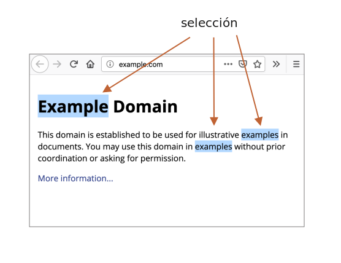
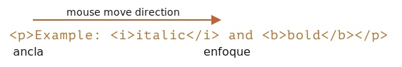
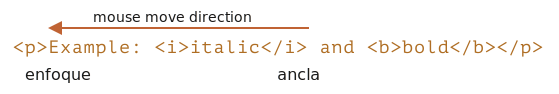

libs:
  - d3
  - domtree

---

# Selection y Range

En este capítulo cubriremos la selección en el documento, así como la selección en campos de formulario, como `<input>`.

JavaScript puede obtener la selección existente, seleccionar/deseleccionar tanto en su totalidad como parcialmente, eliminar la parte seleccionada del documento, envolverla en una etiqueta, etc.

Tu podrías usar ahora mismo las recetas que hay al final, En la sección "Resumen". Pero será mucho más beneficioso para ti si lees todo el capítulo. Los objetos subyacentes `Range` y `Selection` son fáciles de captar y, por lo tanto, no necesitará recetas para que hagan lo que deseas.

## Range

El concepto básico de selección [Range](https://dom.spec.whatwg.org/#ranges), es básicamente un par de "puntos límite": inicio y fin del rango.

Cada punto es representado como un nodo DOM principal con el desplazamiento relativo desde su inicio. Si el nodo principal es un nodo de elemento, entonces el desplazamiento es un número secundario, para un nodo de texto es la posición en el texto. Ejemplos a continuación.

Seleccionemos algo.

Primero, podemos crear un rango (el constructor no tiene parámetros):

```js
let range = new Range();
```

<<<<<<< HEAD
Entonces podemos establecer los límites de selección usando `range.setStart(node, offset)` y `range.setEnd(node, offset)`.

Por ejemplo, considere este fragmento de HTML:
=======
Then we can set the selection boundaries using `range.setStart(node, offset)` and `range.setEnd(node, offset)`.

As you might guess, further we'll use the `Range` objects for selection, but first let's create few such objects.

### Selecting the text partially

The interesting thing is that the first argument `node` in both methods can be either a text node or an element node, and the meaning of the second argument depends on that.

**If `node` is a text node, then `offset` must be the position in its text.**

For example, given the element `<p>Hello</p>`, we can create the range containing the letters "ll" as follows:

```html run
<p id="p">Hello</p>
<script>
  let range = new Range();
  range.setStart(p.firstChild, 2);
  range.setEnd(p.firstChild, 4);
  
  // toString of a range returns its content as text
  console.log(range); // ll
</script>
```

Here we take the first child of `<p>` (that's the text node) and specify the text positions inside it:


### Selecting element nodes

**Alternatively, if `node` is an element node, then `offset` must be the child number.** 

That's handy for making ranges that contain nodes as a whole, not stop somewhere inside their text.

For example, we have a more complex document fragment:
>>>>>>> 7b76185892aa9798c3f058256aed44a9fb413cc3

```html autorun
<p id="p">Example: <i>italic</i> and <b>bold</b></p>
```

<<<<<<< HEAD
Aquí está su estructura DOM, tenga en cuenta que aquí los nodos de texto son importantes para nosotros:
=======
Here's its DOM structure with both element and text nodes:
>>>>>>> 7b76185892aa9798c3f058256aed44a9fb413cc3

<div class="select-p-domtree"></div>

<script>
let selectPDomtree = {
  "name": "P",
  "nodeType": 1,
  "children": [{
    "name": "#text",
    "nodeType": 3,
    "content": "Example: "
  }, {
    "name": "I",
    "nodeType": 1,
    "children": [{
      "name": "#text",
      "nodeType": 3,
      "content": "italic"
    }]
  }, {
    "name": "#text",
    "nodeType": 3,
    "content": " and "
  }, {
    "name": "B",
    "nodeType": 1,
    "children": [{
      "name": "#text",
      "nodeType": 3,
      "content": "bold"
    }]
  }]
}

drawHtmlTree(selectPDomtree, 'div.select-p-domtree', 690, 320);
</script>

<<<<<<< HEAD
Seleccionamos `"Example: <i>italic</i>"`. Son los dos primeros hijos de `<p>` (contando nodos de texto):
=======
Let's make a range for `"Example: <i>italic</i>"`.

As we can see, this phrase consists of exactly two children of `<p>`, with indexes `0` and `1`:
>>>>>>> 7b76185892aa9798c3f058256aed44a9fb413cc3


- The starting point has `<p>` as the parent `node`, and `0` as the offset.

    So we can set it as `range.setStart(p, 0)`.
- The ending point also has `<p>` as the parent `node`, but `2` as the offset (it specifies the range up to, but not including `offset`).

    So we can set it as `range.setEnd(p, 2)`.

Here's the demo. If you run it, you can see that the text gets selected:

```html run
<p id="p">Example: <i>italic</i> and <b>bold</b></p>

<script>
*!*
  let range = new Range();

  range.setStart(p, 0);
  range.setEnd(p, 2);
*/!*

 // toString de un rango devuelve su contenido como texto (sin etiquetas)
  alert(range); // Ejemplo: italic

<<<<<<< HEAD
  // aplicar este rango para la selección de documentos (explicado más adelante)
=======
  // apply this range for document selection (explained later below)
>>>>>>> 7b76185892aa9798c3f058256aed44a9fb413cc3
  document.getSelection().addRange(range);
</script>
```

<<<<<<< HEAD
- `range.setStart(p, 0)` -- establece el comienzo en el hijo 0 de `<p>` (ese es el nodo de texto `"Example: "`).
- `range.setEnd(p, 2)` -- abarca el rango hasta (pero sin incluir) el segundo hijo de `<p>` (ese es el nodo de texto `" and "`, pero como el final no está incluido, el último nodo seleccionado es `<i>`).

Aquí hay un banco de pruebas más flexible en el que probar más variantes:
=======
Here's a more flexible test stand where you can set range start/end numbers and explore other variants:
>>>>>>> 7b76185892aa9798c3f058256aed44a9fb413cc3

```html run autorun
<p id="p">Example: <i>italic</i> and <b>bold</b></p>

From <input id="start" type="number" value=1> – To <input id="end" type="number" value=4>
<button id="button">Click to select</button>
<script>
  button.onclick = () => {
  *!*
    let range = new Range();

    range.setStart(p, start.value);
    range.setEnd(p, end.value);
  */!*

<<<<<<< HEAD
    // aplicar la selección, explicado más adelante
=======
    // apply the selection, explained later below
>>>>>>> 7b76185892aa9798c3f058256aed44a9fb413cc3
    document.getSelection().removeAllRanges();
    document.getSelection().addRange(range);
  };
</script>
```

<<<<<<< HEAD
Ej. seleccionando de `1` a `4` da como rango `<i>italic</i> and <b>bold</b>`.


No tenemos que usar el mismo nodo en `setStart` y `setEnd`. Un rango puede abarcar muchos nodos no relacionados. Solo es importante que el final sea posterior al comienzo.

### Seleccionar partes de nodos de texto

Seleccionemos el texto parcialmente, así:


Eso también es posible, solo necesitamos establecer el inicio y el final como un desplazamiento relativo en los nodos de texto.
=======
E.g. selecting in the same `<p>` from offset `1` to `4` gives us the range `<i>italic</i> and <b>bold</b>`:


```smart header="Starting and ending nodes can be different"
We don't have to use the same node in `setStart` and `setEnd`. A range may span across many unrelated nodes. It's only important that the end is after the start in the document.
```

### Selecting a bigger fragment

Let's make a bigger selection in our example, like this:


We already know how to do that. We just need to set the start and the end as a relative offset in text nodes.
>>>>>>> 7b76185892aa9798c3f058256aed44a9fb413cc3

Necesitamos crear un rango, que:
- comienza desde la posición 2 en `<p>` primer hijo (tomando todas menos dos primeras letras de "Ex<b>ample:</b>")
- termina en la posición 3 de `<b>` primer hijo (tomando las primeras tres letras de "<b>bol</b>d", pero no más):

```html run
<p id="p">Example: <i>italic</i> and <b>bold</b></p>

<script>
  let range = new Range();

  range.setStart(p.firstChild, 2);
  range.setEnd(p.querySelector('b').firstChild, 3);

  alert(range); // amplio: italic and bol

  // use este rango para la selección (explicado más adelante)
  window.getSelection().addRange(range);
</script>
```

<<<<<<< HEAD
El objeto de rango tiene las siguientes propiedades:
=======
As you can see, it's fairly easy to make a range of whatever we want.

If we'd like to take nodes as a whole, we can pass elements in `setStart/setEnd`. Otherwise, we can work on the text level. 

## Range properties

The range object that we created in the example above has following properties:
>>>>>>> 7b76185892aa9798c3f058256aed44a9fb413cc3


- `startContainer`, `startOffset` -- nodo y desplazamiento del inicio,
  - en el ejemplo anterior: primer nodo de texto dentro de `<p>` y `2`.
- `endContainer`, `endOffset` -- nodo y desplazamiento del final,
  - en el ejemplo anterior: primer nodo de texto dentro de `<b>` y `3`.
- `collapsed` -- booleano, `true` si el rango comienza y termina en el mismo punto (por lo que no hay contenido dentro del rango),
  - en el ejemplo anterior: `false`
- `commonAncestorContainer` -- el ancestro común más cercano de todos los nodos dentro del rango,
  - en el ejemplo anterior: `<p>`

<<<<<<< HEAD
## Métodos de Range
=======

## Range selection methods
>>>>>>> 7b76185892aa9798c3f058256aed44a9fb413cc3

Hay muchos métodos convenientes para manipular rangos.

<<<<<<< HEAD
Establecer inicio de rango:
=======
We've already seen `setStart` and `setEnd`, here are other similar methods.

Set range start:
>>>>>>> 7b76185892aa9798c3f058256aed44a9fb413cc3

- `setStart(node, offset)` establecer inicio en: posición `offset` en `node`
- `setStartBefore(node)` establecer inicio en: justo antes `node`
- `setStartAfter(node)` establecer inicio en: justo después `node`

Establecer fin de rango (métodos similares):

- `setEnd(node, offset)` establecer final en: posición `offset` en `node`
- `setEndBefore(node)` establecer final en: justo antes `node`
- `setEndAfter(node)` establecer final en: justo después `node`

<<<<<<< HEAD
**Como quedó demostrado, `node` puede ser un nodo de texto o de elemento: para nodos de texto `offset` omite esa cantidad de caracteres, mientras que para los nodos de elementos esa cantidad de nodos secundarios.**

Otros:
- `selectNode(node)` establecer rango para seleccionar el `node`
- `selectNodeContents(node)` establecer rango para seleccionar todo el contenido de `node` 
- `collapse(toStart)` si `toStart=true` establece final=comienzo, de otra manera comienzo=final, colapsando así el rango
- `cloneRange()` crea un nuevo rango con el mismo inicio/final

Para manipular el contenido dentro del rango:
=======
Technically, `setStart/setEnd` can do anything, but more methods provide more convenience.

In all these methods, `node` can be both a text or element node: for text nodes `offset` skips that many of characters, while for element nodes that many child nodes.

Even more methods to create ranges:
- `selectNode(node)` set range to select the whole `node`
- `selectNodeContents(node)` set range to select the whole `node` contents
- `collapse(toStart)` if `toStart=true` set end=start, otherwise set start=end, thus collapsing the range
- `cloneRange()` creates a new range with the same start/end

## Range editing methods

Once the range is created, we can manipulate its content using these methods:
>>>>>>> 7b76185892aa9798c3f058256aed44a9fb413cc3

- `deleteContents()` -- eliminar el contenido de rango del documento
- `extractContents()` -- eliminar el contenido de rango del documento y lo retorna como [DocumentFragment](info:modifying-document#document-fragment)
- `cloneContents()` -- clonar el contenido del rango y lo retorna como [DocumentFragment](info:modifying-document#document-fragment)
- `insertNode(node)` -- inserta `node` en el documento al comienzo del rango
- `surroundContents(node)` --envuelve `node` alrededor del contenido del rango. Para que esto funcione, el rango debe contener etiquetas de apertura y cierre para todos los elementos dentro de él: no hay rangos parciales como `<i>abc`.

Con estos métodos podemos hacer básicamente cualquier cosa con los nodos seleccionados.

Aquí está el banco de pruebas para verlos en acción:

```html run autorun height=260
Haga clic en los botones para ejecutar métodos en la selección, "resetExample" para restablecerla.

<p id="p">Example: <i>italic</i> and <b>bold</b></p>

<p id="result"></p>
<script>
  let range = new Range();

  // Cada método demostrado se representa aquí:
  let methods = {
    deleteContents() {
      range.deleteContents()
    },
    extractContents() {
      let content = range.extractContents();
      result.innerHTML = "";
      result.append("extracted: ", content);
    },
    cloneContents() {
      let content = range.cloneContents();
      result.innerHTML = "";
      result.append("cloned: ", content);
    },
    insertNode() {
      let newNode = document.createElement('u');
      newNode.innerHTML = "NEW NODE";
      range.insertNode(newNode);
    },
    surroundContents() {
      let newNode = document.createElement('u');
      try {
        range.surroundContents(newNode);
      } catch(e) { console.log(e) }
    },
    resetExample() {
      p.innerHTML = `Example: <i>italic</i> and <b>bold</b>`;
      result.innerHTML = "";

      range.setStart(p.firstChild, 2);
      range.setEnd(p.querySelector('b').firstChild, 3);

      window.getSelection().removeAllRanges();  
      window.getSelection().addRange(range);  
    }
  };

  for(let method in methods) {
    document.write(`<div><button onclick="methods.${method}()">${method}</button></div>`);
  }

  methods.resetExample();
</script>
```

También existen métodos para comparar rangos, pero rara vez se utilizan. Cuando los necesite, consulte el [spec](https://dom.spec.whatwg.org/#interface-range) o [MDN manual](https://developer.mozilla.org/es/docs/Web/API/Range).


## Selection

<<<<<<< HEAD
`Range` es un objeto genérico para gestionar rangos de selección. Podemos crear tales objetos, pasarlos alrededor -- no seleccionan visualmente nada por sí mismos.

La selección de documentos está representada por el objeto `Selection`, que se puede obtener como `window.getSelection()` o `document.getSelection()`.
=======
`Range` is a generic object for managing selection ranges. Although, creating a `Range` doesn't mean that we see a selection on screen.

We may create `Range` objects, pass them around -- they do not visually select anything on their own.
>>>>>>> 7b76185892aa9798c3f058256aed44a9fb413cc3

Una selección puede incluir cero o más rangos. Al menos, el [Selection API specification](https://www.w3.org/TR/selection-api/) lo dice. Sin embargo, en la práctica, solo Firefox permite seleccionar múltiples rangos en el documento usando `key:Ctrl+click` (`key:Cmd+click` para Mac).

Aquí hay una captura de pantalla de una selección con 3 rangos, realizada en Firefox:



Otros navegadores admiten un rango máximo de 1. Como veremos, algunos de los métodos de `Selection` implica que puede haber muchos rangos, pero nuevamente, en todos los navegadores excepto Firefox, hay un máximo de 1.

<<<<<<< HEAD
## Propiedades de Selection 

Similar a Range, una selección tiene un inicio, llamado "ancla(anchor)", y un final, llamado "foco(focus)".
=======
Here's a small demo that shows the current selection (select something and click) as text:

<button onclick="alert(document.getSelection())">alert(document.getSelection())</button>

## Selection properties

As said, a selection may in theory contain multiple ranges. We can get these range objects using the method:

- `getRangeAt(i)` -- get i-th range, starting from `0`. In all browsers except Firefox, only `0` is used.

Also, there exist properties that often provide better convenience.

Similar to a range, a selection object has a start, called "anchor", and the end, called "focus".
>>>>>>> 7b76185892aa9798c3f058256aed44a9fb413cc3

Las principales propiedades de selection son:

- `anchorNode` -- el nodo donde comienza la selección,
- `anchorOffset` -- el desplazamiento en `anchorNode` donde comienza la selección,
- `focusNode` -- el nodo donde termina la selección,
- `focusOffset` -- el desplazamiento en `focusNode` donde termina la selección,
- `isCollapsed` -- `true` si la selección no selecciona nada (rango vacío), o no existe.
- `rangeCount` -- recuento de rangos en la selección, máximo "1" en todos los navegadores excepto Firefox.

<<<<<<< HEAD
````smart header="El final de la selección puede estar en el documento antes del inicio"
Hay muchas formas de seleccionar el contenido, dependiendo del agente de usuario: mouse, teclas de acceso rápido, toques en un móvil, etc.

Algunos de ellos, como un mouse, permiten que se pueda crear la misma selección en dos direcciones: "de izquierda a derecha" y "de derecha a izquierda".

Si el inicio (ancla) de la selección va en el documento antes del final (foco), se dice que esta selección tiene una dirección "hacia adelante".
=======
```smart header="Selection end/start vs Range"

There's an important differences of a selection anchor/focus compared with a `Range` start/end.

As we know, `Range` objects always have their start before the end. 

For selections, that's not always the case.

Selecting something with a mouse can be done in both directions: either "left-to-right" or "right-to-left".

In other words, when the mouse button is pressed, and then it moves forward in the document, then its end (focus) will be after its start (anchor).
>>>>>>> 7b76185892aa9798c3f058256aed44a9fb413cc3

Ej. si el usuario comienza a seleccionar con el mouse y pasa de "Example" a "italic":



<<<<<<< HEAD
De lo contrario, si van desde el final de "italic" to "Example", la selección se dirige "hacia atrás", su foco estará antes del ancla:



Eso es diferente de los objetos `Range` que siempre se dirigen hacia adelante: el inicio del rango no puede ser posterior a su final.
````
=======
...But the same selection could be done backwards: starting from  "italic" to "Example" (backward direction), then its end (focus) will be before the start (anchor):


```
>>>>>>> 7b76185892aa9798c3f058256aed44a9fb413cc3

## Eventos Selection

Hay eventos para realizar un seguimiento de la selección:

<<<<<<< HEAD
- `elem.onselectstart` -- cuando una selección comienza en `elem`, ej. el usuario comienza a mover el mouse con el botón presionado.
    - Evitar la acción predeterminada hace que la selección no se inicie.
- `document.onselectionchange` -- siempre que cambie una selección.
    - Tenga en cuenta: este controlador solo se puede configurar en `document`.
=======
- `elem.onselectstart` -- when a selection *starts* on speficially elemen `elem` (or inside it). For instance, when the user presses the mouse button on it and starts to move the pointer.
    - Preventing the default action cancels the selection start. So starting a selection from this element becomes impossible, but the element is still selectable. The visitor just needs to start the selection from elsewhere.
- `document.onselectionchange` -- whenever a selection changes or starts.
    - Please note: this handler can be set only on `document`, it tracks all selections in it.
>>>>>>> 7b76185892aa9798c3f058256aed44a9fb413cc3

### Demostración de seguimiento de selección

<<<<<<< HEAD
Aquí hay una pequeña demostración que muestra los límites de selección de forma dinámica a medida que cambia:
=======
Here's a small demo. It tracks the current selection on the `document` and shows its boundaries:
>>>>>>> 7b76185892aa9798c3f058256aed44a9fb413cc3

```html run height=80
<p id="p">Select me: <i>italic</i> and <b>bold</b></p>

From <input id="from" disabled> – To <input id="to" disabled>
<script>
  document.onselectionchange = function() {
    let selection = document.getSelection();

    let {anchorNode, anchorOffset, focusNode, focusOffset} = selection;

    // anchorNode and focusNode are text nodes usually
    from.value = `${anchorNode?.data}, offset ${anchorOffset}`;
    to.value = `${focusNode?.data}, offset ${focusOffset}`;
  };
</script>
```

<<<<<<< HEAD
### Demostración de obtención de selección

Para obtener toda la selección:
- Como texto: solo llama `document.getSelection().toString()`.
- Como nodos DOM: obtenga los rangos subyacentes y llame a su método `cloneContents()` (solo el primer rango si no admitimos la selección múltiple de Firefox).

Y aquí está la demostración de cómo obtener la selección como texto y como nodos DOM:
=======
### Selection copying demo

There are two approaches to copying the selected content:

1. We can use `document.getSelection().toString()` to get it as text.
2. Otherwise, to copy the full DOM, e.g. if we need to keep formatting, we can get the underlying ranges with `getRangesAt(...)`. A `Range` object, in turn, has `cloneContents()` method that clones its content and returns as `DocumentFragment` object, that we can insert elsewhere.

Here's the demo of copying the selected content both as text and as DOM nodes:
>>>>>>> 7b76185892aa9798c3f058256aed44a9fb413cc3

```html run height=100
<p id="p">Select me: <i>italic</i> and <b>bold</b></p>

Cloned: <span id="cloned"></span>
<br>
As text: <span id="astext"></span>

<script>
  document.onselectionchange = function() {
    let selection = document.getSelection();

    cloned.innerHTML = astext.innerHTML = "";

    // Clonar nodos DOM de rangos (admitimos selección múltiple aquí)
    for (let i = 0; i < selection.rangeCount; i++) {
      cloned.append(selection.getRangeAt(i).cloneContents());
    }

    // Obtener como texto
    astext.innerHTML += selection;
  };
</script>
```

## Métodos Selection 

<<<<<<< HEAD
Métodos de selección para agregar/eliminar rangos:

- `getRangeAt(i)` -- obtener el rango i-ésimo, comenzando desde "0". En todos los navegadores, excepto Firefox, solo se utiliza `0`.
- `addRange(rango)` -- agrega un `rango` a la selección. Todos los navegadores excepto Firefox ignoran la llamada, si la selección ya tiene un rango asociado.
- `removeRange(rango)` --elimina `rango` de la selección.
- `removeAllRanges()` --elimina todos los rangos.
- `empty()` -- alias para `removeAllRanges`.

Además, existen métodos convenientes para manipular el rango de selección directamente, sin `Range`:
=======
We can work with the selection by addding/removing ranges:

- `getRangeAt(i)` -- get i-th range, starting from `0`. In all browsers except Firefox, only `0` is used.
- `addRange(range)` -- add `range` to selection. All browsers except Firefox ignore the call, if the selection already has an associated range.
- `removeRange(range)` -- remove `range` from the selection.
- `removeAllRanges()` -- remove all ranges.
- `empty()` -- alias to `removeAllRanges`.

There are also convenience methods to manipulate the selection range directly, without intermediate `Range` calls:
>>>>>>> 7b76185892aa9798c3f058256aed44a9fb413cc3

- `collapse(node, offset)` -- Reemplazar el rango seleccionado con uno nuevo que comienza y termina en el `node` dado, en posición `offset`.
- `setPosition(node, offset)` -- alias para `collapse`.
- `collapseToStart()` - colapsar (reemplazar con un rango vacío) al inicio de la selección,
- `collapseToEnd()` - colapso hasta el final de la selección,
- `extend(node, offset)` - mover el foco de la selección al `node` dado, posición `offset`,
- `setBaseAndExtent(anchorNode, anchorOffset, focusNode, focusOffset)` - reemplazar el rango de selección con el inicio dado `anchorNode/anchorOffset` y final `focusNode/focusOffset`. Se selecciona todo el contenido entre ellos.
- `selectAllChildren(node)` -- seleccionar todos los hijos del `node`.
- `deleteFromDocument()` -- eliminar el contenido seleccionado del documento.
- `containsNode(node, allowPartialContainment = false)` -- comprueba si la selección contiene `node` (parcialmente si el segundo argumento es `true`)

<<<<<<< HEAD
Entonces, para muchas tareas podemos llamar a los métodos de `Selection`, y no es necesario acceder al objeto `Range` subyacente.
=======
For most tasks these methods are just fine, there's no need to access the underlying `Range` object.
>>>>>>> 7b76185892aa9798c3f058256aed44a9fb413cc3

Por ejemplo, seleccionando todo el contenido del párrafo `<p>`:

```html run
<p id="p">Select me: <i>italic</i> and <b>bold</b></p>

<script>
  // seleccione desde el 0 hijo de <p> hasta el último hijo
  document.getSelection().setBaseAndExtent(p, 0, p, p.childNodes.length);
</script>
```

Lo mismo usando rangos:

```html run
<p id="p">Select me: <i>italic</i> and <b>bold</b></p>

<script>
  let range = new Range();
  range.selectNodeContents(p); // o selectNode(p) para seleccionar el tag <p> también

  document.getSelection().removeAllRanges(); // borrar la selección existente si la hubiera
  document.getSelection().addRange(range);
</script>
```

<<<<<<< HEAD
```smart header="Para seleccionar, primero elimine la selección existente"
Si la selección ya existe, vacíelo primero con `removeAllRanges()`. Y luego agregue rangos. De lo contrario, todos los navegadores excepto Firefox ignoran los nuevos rangos.

La excepción son algunos métodos de selección, que reemplazan la selección existente, como `setBaseAndExtent`.
=======
```smart header="To select something, remove the existing selection first"
If a document selection already exists, empty it first with `removeAllRanges()`. And then add ranges. Otherwise, all browsers except Firefox ignore new ranges.

The exception is some selection methods, that replace the existing selection, such as `setBaseAndExtent`.
>>>>>>> 7b76185892aa9798c3f058256aed44a9fb413cc3
```

## Selección en controles de formulario

Elementos de formulario, como `input` y `textarea` proporciona [API especial para la selección](https://html.spec.whatwg.org/#textFieldSelection), sin objetos `Selection` o `Range`. Como un valor de entrada es un texto puro, no HTML, no hay necesidad de tales objetos, todo es mucho más simple.

Propiedades:
- `input.selectionStart` -- posición de inicio de selección (escribible),
- `input.selectionEnd` -- posición del final de la selección (escribible),
- `input.selectionDirection` -- dirección de selección, una de: "adelante" "hacia atrás" o "ninguno" (si, por ejemplo, se selecciona con un doble clic del mouse),

Eventos:
- `input.onselect` -- se activa cuando se selecciona algo.

Métodos:

- `input.select()` -- selecciona todo en el control de texto (puede ser `textarea` en vez de `input`),
- `input.setSelectionRange(start, end, [direction])` -- cambiar la selección para abarcar desde la posición `start` hasta `end`, en la dirección indicada (opcional).
- `input.setRangeText(replacement, [start], [end], [selectionMode])` -- reemplace un rango de texto con el nuevo texto.

    Los argumentos opcionales `start` y `end`, si se proporcionan, establecen el inicio y el final del rango; de lo contrario, se utiliza la selección del usuario.

    El último argumento, `selectionMode`, determina cómo se establecerá la selección después de que se haya reemplazado el texto. Los posibles valores son:

    - `"select"` -- se seleccionará el texto recién insertado.
    - `"start"` -- el rango de selección se colapsa justo antes del texto insertado (el cursor estará inmediatamente antes).
    - `"end"` -- el rango de selección se colapsa justo después del texto insertado (el cursor estará justo después).
    - `"preserve"` -- intenta preservar la selección. Este es el predeterminado.

Ahora veamos estos métodos en acción.

### Ejemplo: Seguimiento de selección

Por ejemplo, este código usa el evento `onselect` para rastrear la selección:

```html run autorun
<textarea id="area" style="width:80%;height:60px">
Selecting in this text updates values below.
</textarea>
<br>
From <input id="from" disabled> – To <input id="to" disabled>

<script>
  area.onselect = function() {
    from.value = area.selectionStart;
    to.value = area.selectionEnd;
  };
</script>
```

Tenga en cuenta:
- `onselect` se activa cuando se selecciona algo, pero no cuando se elimina la selección.
- El evento `document.onselectionchange` no debería activarse para las selecciones dentro de un control de formulario, según el [spec](https://w3c.github.io/selection-api/#dfn-selectionchange), ya que no está relacionado con la selección y los rangos del "documento". Algunos navegadores lo generan, pero no debemos confiar en él.


### Ejemplo: cursor en movimiento

Podemos cambiar `selectionStart` y `selectionEnd`, que establece la selección.

Un caso límite importante es cuando `selectionStart` y `selectionEnd` son iguales entre sí. Entonces es exactamente la posición del cursor. O, para reformular, cuando no se selecciona nada, la selección se contrae en la posición del cursor.

Entonces, al establecer `selectionStart` y `selectionEnd` en el mismo valor, movemos el cursor.

Por ejemplo:

```html run autorun
<textarea id="area" style="width:80%;height:60px">
Focus on me, the cursor will be at position 10.
</textarea>

<script>
  area.onfocus = () => {
    // zero delay setTimeout to run after browser "focus" action finishes
    setTimeout(() => {
      // we can set any selection
      // if start=end, the cursor is exactly at that place
      area.selectionStart = area.selectionEnd = 10;
    });
  };
</script>
```

### Ejemplo: modificar la selección

Para modificar el contenido de la selección, podemos utilizar el método `input.setRangeText()` Por supuesto, podemos leer `selectionStart/End` y, con el conocimiento de la selección, cambiar la subcadena correspondiente de `value`, pero `setRangeText` es más poderoso y a menudo más conveniente.

Ese es un método algo complejo. En su forma más simple de un argumento, reemplaza el rango seleccionado por el usuario y elimina la selección.

Por ejemplo, aquí la selección de usuario estará envuelta por `*...*`:

```html run autorun
<input id="input" style="width:200px" value="Select here and click the button">
<button id="button">Wrap selection in stars *...*</button>

<script>
button.onclick = () => {
  if (input.selectionStart == input.selectionEnd) {
    return; // nada fue seleccionado
  }

  let selected = input.value.slice(input.selectionStart, input.selectionEnd);
  input.setRangeText(`*${selected}*`);
};
</script>
```

Con más argumentos, podemos establecer un rango `start` y `end`.

En este ejemplo, encontramos `THIS` en el texto de entrada, lo reemplazamos y mantenemos el reemplazo seleccionado:

```html run autorun
<input id="input" style="width:200px" value="Replace THIS in text">
<button id="button">Replace THIS</button>

<script>
button.onclick = () => {
  let pos = input.value.indexOf("THIS");
  if (pos >= 0) {
    input.setRangeText("*THIS*", pos, pos + 4, "select");
    input.focus(); // focus to make selection visible
  }
};
</script>
```

### Ejemplo: insertar en el cursor

Si no se selecciona nada, o usamos el mismo `comienzo` y `final` en `setRangeText`, entonces el nuevo texto se acaba de insertar, no se elimina nada.

También podemos insertar algo "en el cursor" usando `setRangeText`.

Aquí hay un botón que se inserta `"HELLO"` en la posición del cursor y lo coloca inmediatamente después. Si la selección no está vacía, entonces se reemplaza (podemos detectarla comparando `selectionStart!=selectionEnd` y hacer otra cosa en su lugar):

```html run autorun
<input id="input" style="width:200px" value="Text Text Text Text Text">
<button id="button">Insert "HELLO" at cursor</button>

<script>
  button.onclick = () => {
    input.setRangeText("HELLO", input.selectionStart, input.selectionEnd, "end");
    input.focus();
  };    
</script>
```


## Haciendo no seleccionable

Para hacer algo no seleccionable, hay tres formas:

1. Usar propiedad CSS `user-select: none`.

    ```html run
    <style>
    #elem {
      user-select: none;
    }
    </style>
    <div>Selectable <div id="elem">Unselectable</div> Selectable</div>
    ```

    Esto no permite que la selección comience en `elem`. Pero el usuario puede iniciar la selección en otro lugar e incluir `elem` en ella.

   Entonces, `elem` se convertirá en parte de `document.getSelection )`, por lo que la selección realmente ocurre, pero su contenido generalmente se ignora al copiar y pegar.


2. Evita la acción predeterminada en los eventos `onselectstart` o `mousedown`.

    ```html run
    <div>Selectable <div id="elem">Unselectable</div> Selectable</div>

    <script>
      elem.onselectstart = () => false;
    </script>
    ```

   Esto evita que la selección se inicie en `elem`, pero el visitante puede iniciarla en otro elemento y luego extenderla a `elem`.

Eso es conveniente cuando hay otro controlador de eventos en la misma acción que activa la selección (por ejemplo, `mousedown`). Así que deshabilitamos la selección para evitar conflictos, permitiendo que se copien los contenidos de `elem`.

3. También podemos borrar la selección post-factum después de que suceda con `document.getSelection().Empty ()`. Eso se usa con poca frecuencia, ya que provoca un parpadeo no deseado cuando la selección aparece o desaparece.

## Referencias

- [DOM spec: Range](https://dom.spec.whatwg.org/#ranges)
- [Selection API](https://www.w3.org/TR/selection-api/#dom-globaleventhandlers-onselectstart)
- [HTML spec: APIs for the text control selections](https://html.spec.whatwg.org/multipage/form-control-infrastructure.html#textFieldSelection)


## Resumen

Cubrimos dos API diferentes para las selecciones:

1. Para el documento: objetos `Selection` y `Range`.
2. Para `input`, `textarea`: métodos y propiedades adicionales.

La segunda API es muy simple, ya que funciona con texto.

Las recetas más utilizadas probablemente sean:

1. Obteniendo la selección:
    ```js 
    let selection = document.getSelection();

    let cloned = /* elemento para clonar los nodos seleccionados para */;

    // luego aplica los métodos Range a selection.getRangeAt (0)
    // o, como aquí, a todos los rangos para admitir selección múltiple
    for (let i = 0; i < selection.rangeCount; i++) {
      cloned.append(selection.getRangeAt(i).cloneContents());
    }
    ```
2. Configuración de la selección:
    ```js 
    let selection = document.getSelection();

    // directamente:
    selection.setBaseAndExtent(...from...to...);

    // o podemos crear un rango y:
    selection.removeAllRanges();
    selection.addRange(range);
    ```

Y finalmente, sobre el cursor. La posición del cursor en elementos editables, como `<textarea>` está siempre al principio o al final de la selección. Podemos usarlo para obtener la posición del cursor o para mover el cursor configurando `elem.selectionStart` y `elem.selectionEnd`.
