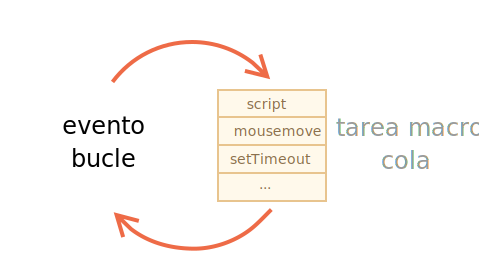
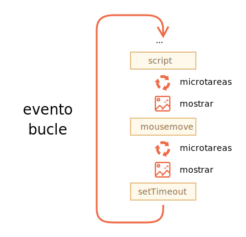

# Loop de eventos: microtareas y macrotareas

El flujo de ejecución de JavaScript en el navegador, así como en Node.js, está basado en un *event loop* (loop de eventos).

Entender como este loop de eventos funciona es importante para optimizaciones y en algunos casos para utilizar la arquitectura correcta.

En este capítulo primero vamos a ver detalles teóricos acerca de cómo funcionan las cosas y luego veremos aplicaciones prácticas de ese conocimiento.

## Loop de eventos

El concepto de *loop de eventos* es muy simple. Existe un ciclo infinito en el que el motor de JavaScript espera por una tarea, luego ejecuta la tarea requerida y finalmente vuelve a dormir esperando por una nueva tarea.

EL algoritmo general del motor:

1. Mientras haya tareas:
    - ejecutarlas comenzando por la más antigua.
2. Dormir hasta que aparezca una tarea, luego volver a 1.

Eso es una formalización de lo que vemos cuando navegamos por una página. El motor JavaScript no hace nada la mayoría del tiempo y solo corre cuando un script/controlador/evento se activa.

Ejemplos de tareas:

- Cuando un script externo `<script src="...">` se carga, la tarea es ejecutarlo.
- Cuando un usuario mueve el mouse, la tarea es enviar el evento `mousemove` y ejecutar el controlador.
- Cuando llega el momento de un `setTimeout` programado, la tarea es ejecutar su callback.
- ... y así sucesivamente.

Las tareas son programadas --&gt; el motor las ejecuta --&gt; <span class="x x-first x-last">espera</span> por más tareas (mientras duerme y prácticamente no consume CPU).

Puede ocurrir que una tarea llegue mientras el motor está ocupado, entonces es puesta en cola.

Las tareas forman una cola, también llamada "Cola de macrotarea" (Término de v8):



Por ejemplo, mientras el motor está ocupado ejecutando un `script`, un usuario podría mover su mouse causando `mousemove` o también podría ser `setTimeout`, etc. Todas estas tareas forman una cola como se observa en la imagen arriba.

Las tareas de la cola son ejecutadas según la base "El que primero llega primero se atiende". Cuando el motor del navegador termina con el `script`, se encarga del evento `mousemove`, continúa con `setTimeout`, etc.

Hasta ahora bastante simple, ¿no?

Dos detalles más:
1. El renderizado nunca ocurre mientras el motor ejecuta una tarea. No importa si la tarea ocupa mucho tiempo. Solo se realizan cambios a DOM una vez que la tarea finaliza.
2. Si una tarea consume demasiado tiempo, el navegador no puede hacer otras tareas, procesos o eventos por lo que después de un tiempo muestra una alerta "La página no responde" sugiriendo detener la tarea con la página completa. Esto ocurre cuando hay muchos cálculos complejos o un error en la programación que lleva a un bucle infinito.

Esa fue la teoría. Ahora veamos como podemos aplicar ese conocimiento.

## Caso de uso 1: dividiendo tareas que demandan alto consumo de CPU

Digamos que tenemos una tarea con un alto consumo de CPU.

Por ejemplo, el resaltado de sintaxis (usado para colorear ejemplos de código en esta página) demanda un alto consumo de CPU. Para resaltar el código, realiza el análisis, crea muchos elementos coloreados, los agrega al documento... para una gran cantidad de texto esto lleva mucho tiempo.

Mientras el motor está ocupado con el resaltado de sintaxis, no puede hacer otras cosas relacionadas a DOM, procesar eventos de usuario, etc. Podría incluso provocar que el navegador se "congele" por un momento, lo que es inaceptable.

Podemos evitar problemas dividiendo la tarea en piezas más pequeñas. Resaltar primero 100 líneas, después programar `setTimeout` (con cero delay) para las próximas 100 líneas y así sucesivamente.

Para demostrar este enfoque y en pos de una mayor simplicidad, en lugar de resaltado de texto tomemos una función que cuenta desde `1` hasta `1000000000`.

Si ejecutas el código siguiente, el navegador se va a "congelar" por un instante. Para JS desde el lado del servidor esto es claramente notable y si lo ejecutas en el navegador intenta hacer click en otros botones de la página. Verás que ningún otro evento es procesado hasta que termine el conteo.

```js run
let i = 0;

let start = Date.now();

function count() {

  // realiza una tarea pesada
  for (let j = 0; j < 1e9; j++) {
    i++;
  }

  alert("Done in " + (Date.now() - start) + 'ms');
}

count();
```

Puede que incluso se muestre una advertencia: "Un script en esta página está provocando que el navegador se ejecute con lentitud".

Dividamos la tarea usando llamadas anidadas a `setTimeout`:

```js run
let i = 0;

let start = Date.now();

function count() {

  // realiza una parte de la tarea pesada(*)
  do {
    i++;
  } while (i % 1e6 != 0);

  if (i == 1e9) {
    alert("Done in " + (Date.now() - start) + 'ms');
  } else {
    setTimeout(count); // programa una nueva llamada (**)
  }

}

count();
```

Ahora la interfaz del navegador es completamente funcional durante el conteo.

Una solo ejecución de `count` realiza parte del trabajo `(*)` y luego se reprograma a sí misma `(**)` si lo necesita:

1. La primer ejecución cuenta: `i=1...1000000`.
2. La segunda cuenta: `i=1000001..2000000`.
3. ...y así sucesivamente.

Ahora, si una tarea secundaria (por ejemplo el evento `onclick`) aparece mientras el motor está ocupado ejecutando la parte 1, entonces es puesta en lista y ejecutada cuando la parte 1 termina, antes de la siguiente parte. Retornos periódicos al ciclo de eventos entre ejecuciones de `count` brinda suficiente "aire" al motor de JavaScript para hacer algo más, para reaccionar a otras acciones del usuario.

Lo notable es que ambas variantes, con y sin división de la tarea haciendo uso de `setTimeout`, son comparables en velocidad. No hay mucha diferencia en el tiempo de conteo general.

Para acercar aún más los tiempos, hagamos una mejora.

Movamos la programación de `setTimeout` al inicio de `count()`:

```js run
let i = 0;

let start = Date.now();

function count() {

  // movemos la programación al principio
  if (i < 1e9 - 1e6) {
    setTimeout(count); // programamos la nueva llamada
  }

  do {
    i++;
  } while (i % 1e6 != 0);

  if (i == 1e9) {
    alert("Done in " + (Date.now() - start) + 'ms');
  }

}

count();
```

Ahora cuando iniciamos `count()` y vemos que necesitaremos más `count()`, lo programamos inmediatamente, antes de hacer el trabajo.

Si lo ejecutas, es fácil notar que lleva bastante menos tiempo.

¿Por qué pasa esto?  

Es simple: como recordarás existe un retraso mínimo en el navegador de 4ms para varias llamadas anidadas a `setTimeout`. Si configuramos `0`, es `4ms` (o un poco más). Por lo que mientras antes lo programemos más rápido se ejecutará.

Finalmente hemos dividido una tarea con un alto consumo de CPU en partes y ahora no bloquea la interfaz de usuario. Y el tiempo general de ejecución no es mucho mayor.

## Caso de uso 2: indicación de progreso

Otro beneficio de dividir tareas pesadas para scripts de navegadores es que podemos indicar el progreso.

Usualmente el navegador renderiza al terminar la ejecución del código que actualmente se está ejecutando. No importa si la tarea lleva demasiado tiempo. 

Por un lado eso es genial porque nuestra función puede crear muchos elementos, agregarlos de a uno al documento y cambiar sus estilos... el visitante no verá ningún estado intermedio, sin finalizar. Lo cuál es importante, ¿no?

Acá hay una demostración, los cambios a `i` no se mostrarán hasta que la función finalice, por lo que veremos solo el último valor:


```html run
<div id="progress"></div>

<script>

  function count() {
    for (let i = 0; i < 1e6; i++) {
      i++;
      progress.innerHTML = i;
    }
  }

  count();
</script>
```

... Pero puede que queramos mostrar algo durante la tarea, por ejemplo una barra de progreso.

Si dividimos la tarea más pesada en partes más pequeñas usando `setTimeout`, entonces los cambios son aplicados entre ellos.

Esto se ve mejor:

```html run
<div id="progress"></div>

<script>
  let i = 0;

  function count() {

    // realiza una parte del trabajo pesado (*)
    do {
      i++;
      progress.innerHTML = i;
    } while (i % 1e3 != 0);

    if (i < 1e7) {
      setTimeout(count);
    }

  }

  count();
</script>
```

Ahora el `<div>` muestra el incremento en el valor `i`, una especie de barra de progreso.


## Caso de uso 3: hacer algo después del evento

En un controlador de evento nosotros podemos decidir posponer alguna acción hasta que el evento aparezca y sea controlado en todos los niveles. Podemos hacer esto envolviendo el código en un `setTimeout` con retraso cero.

En el capítulo <info:dispatch-events> vimos un ejemplo: el evento personalizado `menu-open` es distribuido en `setTimeout`, de modo que ocurre después de que el evento "click" se maneja por completo.

```js
menu.onclick = function() {
  // ...

  // crea un evento personalizado con los datos del elemento de menú en el que se hizo clic
  let customEvent = new CustomEvent("menu-open", {
    bubbles: true
  });

  // envia el evento personalizado de forma asincrónica
  setTimeout(() => menu.dispatchEvent(customEvent));
};
```

## Macrotareas y Microtareas

Junto con las *macrotareas* descritas en este capítulo, existen *microtareas* mencionadas en el capítulo <info:microtask-queue>.

Las microtareas provienen únicamente de nuestro código. Por lo general, se crean mediante promesas: una ejecución del controlador `.then / catch / finally` se convierte en una microtarea. Las microtareas también se utilizan "bajo la cubierta" de "await", ya que es otra forma de manejo de promesas.

Existe también una función especial `queueMicrotask(func)` que pone a `func` en la cola de microtareas.

**Inmediatamente después de cada *macrotarea*, el motor ejecuta todas las tareas desde la cola de *microtareas*, antes de ejecutar cualquier otra macrotarea o renderización o cualquier otra cosa.**

Por ejemplo:

```js run
setTimeout(() => alert("timeout"));

Promise.resolve()
  .then(() => alert("promise"));

alert("code");
```

¿Cuál será el orden en este caso?

1. `code` se muestra primero porque es una llamada sincrónica regular.
2. `promise` aparece segundo, porque `.then` pasa a través de la cola de microtareas y se ejecuta después del código actual.
3. `timeout` aparece última, porque es una macrotarea.

La imagen del loop de eventos completa se ve así (el orden es de arriba a abajo, es decir: primero el script, luego las microtareas, el renderizado, etc.):



Todas las microtareas se completan antes de que se lleve a cabo cualquier otro manejo o renderizado o cualquier otra macrotarea.

Eso es importante, ya que garantiza que el entorno de la aplicación es básicamente el mismo (sin cambios de coordenadas del mouse, sin nuevos datos de red, etc.) entre las microtareas.

Si quisiéramos ejecutar una función de forma asíncrónica (después del código actual), pero antes de que se procesen los cambios o se manejen nuevos eventos, podemos programarla con `queueMicrotask`.

Aquí hay un ejemplo con la "barra de progreso de conteo", similar al que se mostró anteriormente, pero se usa `queueMicrotask` en lugar de` setTimeout`. Puedes ver que se renderiza al final. Al igual que el código sincrónico:

```html run
<div id="progress"></div>

<script>
  let i = 0;

  function count() {

    // realiza una parte del trabajo pesado (*)
    do {
      i++;
      progress.innerHTML = i;
    } while (i % 1e3 != 0);

    if (i < 1e6) {
  *!*
      queueMicrotask(count);
  */!*
    }

  }

  count();
</script>
```

## Resumen

El algoritmo más detallado del loop de eventos (aunque aún simplificado en comparación con la [especificación](https://html.spec.whatwg.org/multipage/webappapis.html#event-loop-processing-model)):

1. Retirar de la cola y ejecutar la tarea más antigua de la cola *macrotareas* (por ejemplo, "script").
2. Ejecutar todas las *microtareas*:
     - Mientras la cola de microtareas no esté vacía:
         - Retirar de la cola y ejecutar la microtarea más antigua.
3. Renderizar los cambios si los hubiera.
4. Si la cola de macrotareas está vacía, esperar hasta que aparezca una macrotarea.
5. Ejecutar el paso 1.

Para programar una nueva *macrotarea*:
- Usar `setTimeout(f)` con un retraso de cero.

Eso puede usarse para dividir una gran tarea de cálculo en partes, para que el navegador pueda reaccionar a los eventos del usuario y mostrar el progreso entre ellos.

Además, se utiliza en los controladores de eventos para programar una acción después de que el evento se haya manejado por completo.

Para programar una nueva *microtarea*
- Usar `queueMicrotask(f)`.
- También se usan promesas para que los controladores pasen por la cola de microtareas.

No hay gestión de eventos de red o de UI entre las microtareas: se ejecutan inmediatamente una tras otra.

Por lo tanto, es posible que desee `queueMicrotask` para ejecutar una función de forma asincrónica, pero dentro del estado del entorno.

```smart header="Web Workers"
Para cálculos largos y pesados que no deberían bloquear el ciclo de eventos, podemos usar [Web Workers](https://html.spec.whatwg.org/multipage/workers.html).

Esa es una forma de ejecutar código en otro hilo paralelo.

Los Web Workers pueden intercambiar mensajes con el proceso principal, pero tienen sus propias variables y su propio ciclo de eventos.

Los Web Workers no tienen acceso a DOM, por lo que son útiles principalmente para cálculos, para utilizar varios núcleos de CPU simultáneamente.
```
