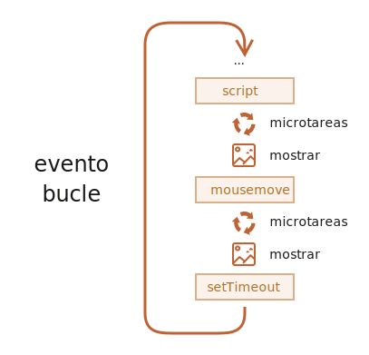

<<<<<<< HEAD
# Loop de eventos: microtareas y macrotareas

El flujo de ejecución de JavaScript en el navegador, así como en Node.js, está basado en un *event loop* (loop de eventos).

Entender como este loop de eventos funciona es importante para optimizaciones y en algunos casos para utilizar la arquitectura correcta.

En este capítulo primero vamos a ver detalles teóricos acerca de cómo funcionan las cosas y luego veremos aplicaciones prácticas de ese conocimiento.

## Loop de eventos

El concepto de *loop de eventos* es muy simple. Existe un ciclo infinito en el que el motor de JavaScript espera por una tarea, luego ejecuta la tarea requerida y finalmente vuelve a dormir esperando por una nueva tarea.

EL algoritmo general del motor:

1. Mientras haya tareas:
    - ejecutarlas comenzando por la más antigua.
2. Dormir hasta que aparezca una tarea, luego volver a 1.

Eso es una formalización de lo que vemos cuando navegamos por una página. El motor JavaScript no hace nada la mayoría del tiempo y solo corre cuando un script/controlador/evento se activa.

Ejemplos de tareas:

- Cuando un script externo `<script src="...">` se carga, la tarea es ejecutarlo.
- Cuando un usuario mueve el mouse, la tarea es enviar el evento `mousemove` y ejecutar el controlador.
- Cuando llega el momento de un `setTimeout` programado, la tarea es ejecutar su callback.
- ... y así sucesivamente.

Las tareas son programadas --&gt; el motor las ejecuta --&gt; <span class="x x-first x-last">espera</span> por más tareas (mientras duerme y prácticamente no consume CPU).

Puede ocurrir que una tarea llegue mientras el motor está ocupado, entonces es puesta en cola.

Las tareas forman una cola, también llamada "Cola de macrotarea" (Término de v8):


Por ejemplo, mientras el motor está ocupado ejecutando un `script`, un usuario podría mover su mouse causando `mousemove` o también podría ser `setTimeout`, etc. Todas estas tareas forman una cola como se observa en la imagen arriba.

Las tareas de la cola son ejecutadas según la base "El que primero llega primero se atiende". Cuando el motor del navegador termina con el `script`, se encarga del evento `mousemove`, continúa con `setTimeout`, etc.

Hasta ahora bastante simple, ¿no?

Dos detalles más:
1. El renderizado nunca ocurre mientras el motor ejecuta una tarea. No importa si la tarea ocupa mucho tiempo. Solo se realizan cambios a DOM una vez que la tarea finaliza.
2. Si una tarea consume demasiado tiempo, el navegador no puede hacer otras tareas, procesos o eventos por lo que después de un tiempo muestra una alerta "La página no responde" sugiriendo detener la tarea con la página completa. Esto ocurre cuando hay muchos cálculos complejos o un error en la programación que lleva a un bucle infinito.

Esa fue la teoría. Ahora veamos como podemos aplicar ese conocimiento.

## Caso de uso 1: dividiendo tareas que demandan alto consumo de CPU

Digamos que tenemos una tarea con un alto consumo de CPU.

Por ejemplo, el resaltado de sintaxis (usado para colorear ejemplos de código en esta página) demanda un alto consumo de CPU. Para resaltar el código, realiza el análisis, crea muchos elementos coloreados, los agrega al documento... para una gran cantidad de texto esto lleva mucho tiempo.

Mientras el motor está ocupado con el resaltado de sintaxis, no puede hacer otras cosas relacionadas a DOM, procesar eventos de usuario, etc. Podría incluso provocar que el navegador se "congele" por un momento, lo que es inaceptable.

Podemos evitar problemas dividiendo la tarea en piezas más pequeñas. Resaltar primero 100 líneas, después programar `setTimeout` (con cero delay) para las próximas 100 líneas y así sucesivamente.

Para demostrar este enfoque y en pos de una mayor simplicidad, en lugar de resaltado de texto tomemos una función que cuenta desde `1` hasta `1000000000`.

Si ejecutas el código siguiente, el navegador se va a "congelar" por un instante. Para JS desde el lado del servidor esto es claramente notable y si lo ejecutas en el navegador intenta hacer click en otros botones de la página. Verás que ningún otro evento es procesado hasta que termine el conteo.
=======
# Event loop: microtasks and macrotasks

Browser JavaScript execution flow, as well as in Node.js, is based on an *event loop*.

Understanding how event loop works is important for optimizations, and sometimes for the right architecture.

In this chapter we first cover theoretical details about how things work, and then see practical applications of that knowledge.

## Event Loop

The concept of *event loop* is very simple. There's an endless loop, when JavaScript engine waits for tasks, executes them and then sleeps waiting for more tasks.

The general algorithm of the engine:

1. While there are tasks:
    - execute them, starting with the oldest task.
2. Sleep until a task appears, then go to 1.

That's a formalization for what we see when browsing a page. JavaScript engine does nothing most of the time, only runs if a script/handler/event activates.

Examples of tasks:

- When an external script `<script src="...">` loads, the task is to execute it.
- When a user moves their mouse, the task is to dispatch `mousemove` event and execute handlers.
- When the time is due for a scheduled `setTimeout`, the task is to run its callback.
- ...and so on.

Tasks are set -- the engine handles them -- then waits for more tasks (while sleeping and consuming close to zero CPU).

It may happen that a task comes while the engine is busy, then it's enqueued.

The tasks form a queue, so-called "macrotask queue" (v8 term):


For instance, while the engine is busy executing a `script`, a user may move their mouse causing `mousemove`, and `setTimeout` may be due and so on, these tasks form a queue, as illustrated on the picture above.

Tasks from the queue are processed on "first come – first served" basis. When the engine browser is done with the `script`, it handles `mousemove` event, then `setTimeout` handler, and so on.

So far, quite simple, right?

Two more details:
1. Rendering never happens while the engine executes a task. Doesn't matter if the task takes a long time. Changes to DOM are painted only after the task is complete.
2. If a task takes too long, the browser can't do other tasks, process user events, so after a time it raises an alert like "Page Unresponsive" suggesting to kill the task with the whole page. That happens when there are a lot of complex calculations or a programming error leading to infinite loop.

That was a theory. Now let's see how we can apply that knowledge.

## Use-case 1: splitting CPU-hungry tasks

Let's say we have a CPU-hungry task.

For example, syntax-highlighting (used to colorize code examples on this page) is quite CPU-heavy. To highlight the code, it performs the analysis, creates many colored elements, adds them to the document -- for a large amount of text that takes a lot of time.

While the engine is busy with syntax highlighting, it can't do other DOM-related stuff, process user events, etc. It may even cause the browser to "hiccup" or even "hang" for a bit, which is unacceptable.

We can avoid problems by splitting the big task into pieces. Highlight first 100 lines, then schedule `setTimeout` (with zero-delay) for the next 100 lines, and so on.

To demonstrate this approach, for the sake of simplicity, instead of text-highlighting, let's take a function that counts from `1` to `1000000000`.

If you run the code below, the engine will "hang" for some time. For server-side JS that's clearly noticeable, and if you are running it in-browser, then try to click other buttons on the page -- you'll see that no other events get handled until the counting finishes.
>>>>>>> 0bfebb4b46b4b5f9c221915ab8b1e2de9bdc013d

```js run
let i = 0;

let start = Date.now();

function count() {

<<<<<<< HEAD
  // realiza una tarea pesada
=======
  // do a heavy job
>>>>>>> 0bfebb4b46b4b5f9c221915ab8b1e2de9bdc013d
  for (let j = 0; j < 1e9; j++) {
    i++;
  }

  alert("Done in " + (Date.now() - start) + 'ms');
}

count();
```

<<<<<<< HEAD
Puede que incluso se muestre una advertencia: "Un script en esta página está provocando que el navegador se ejecute con lentitud".

Dividamos la tarea usando llamadas anidadas a `setTimeout`:
=======
The browser may even show a "the script takes too long" warning.

Let's split the job using nested `setTimeout` calls:
>>>>>>> 0bfebb4b46b4b5f9c221915ab8b1e2de9bdc013d

```js run
let i = 0;

let start = Date.now();

function count() {

<<<<<<< HEAD
  // realiza una parte de la tarea pesada(*)
=======
  // do a piece of the heavy job (*)
>>>>>>> 0bfebb4b46b4b5f9c221915ab8b1e2de9bdc013d
  do {
    i++;
  } while (i % 1e6 != 0);

  if (i == 1e9) {
    alert("Done in " + (Date.now() - start) + 'ms');
  } else {
<<<<<<< HEAD
    setTimeout(count); // programa una nueva llamada (**)
=======
    setTimeout(count); // schedule the new call (**)
>>>>>>> 0bfebb4b46b4b5f9c221915ab8b1e2de9bdc013d
  }

}

count();
```

<<<<<<< HEAD
Ahora la interfaz del navegador es completamente funcional durante el conteo.

Una solo ejecución de `count` realiza parte del trabajo `(*)` y luego se reprograma a sí misma `(**)` si lo necesita:

1. La primer ejecución cuenta: `i=1...1000000`.
2. La segunda cuenta: `i=1000001..2000000`.
3. ...y así sucesivamente.

Ahora, si una tarea secundaria (por ejemplo el evento `onclick`) aparece mientras el motor está ocupado ejecutando la parte 1, entonces es puesta en lista y ejecutada cuando la parte 1 termina, antes de la siguiente parte. Retornos periódicos al ciclo de eventos entre ejecuciones de `count` brinda suficiente "aire" al motor de JavaScript para hacer algo más, para reaccionar a otras acciones del usuario.

Lo notable es que ambas variantes, con y sin división de la tarea haciendo uso de `setTimeout`, son comparables en velocidad. No hay mucha diferencia en el tiempo de conteo general.

Para acercar aún más los tiempos, hagamos una mejora.

Movamos la programación de `setTimeout` al inicio de `count()`:
=======
Now the browser interface is fully functional during the "counting" process.

A single run of `count` does a part of the job `(*)`, and then re-schedules itself `(**)` if needed:

1. First run counts: `i=1...1000000`.
2. Second run counts: `i=1000001..2000000`.
3. ...and so on.

Now, if a new side task (e.g. `onclick` event) appears while the engine is busy executing part 1, it gets queued and then executes when part 1 finished, before the next part. Periodic returns to the event loop between `count` executions provide just enough "air" for the JavaScript engine to do something else, to react to other user actions.

The notable thing is that both variants -- with and without splitting the job by `setTimeout` -- are comparable in speed. There's not much difference in the overall counting time.

To make them closer, let's make an improvement.

We'll move the scheduling to the beginning of the `count()`:
>>>>>>> 0bfebb4b46b4b5f9c221915ab8b1e2de9bdc013d

```js run
let i = 0;

let start = Date.now();

function count() {

<<<<<<< HEAD
  // movemos la programación al principio
  if (i < 1e9 - 1e6) {
    setTimeout(count); // programamos la nueva llamada
=======
  // move the scheduling to the beginning
  if (i < 1e9 - 1e6) {
    setTimeout(count); // schedule the new call
>>>>>>> 0bfebb4b46b4b5f9c221915ab8b1e2de9bdc013d
  }

  do {
    i++;
  } while (i % 1e6 != 0);

  if (i == 1e9) {
    alert("Done in " + (Date.now() - start) + 'ms');
  }

}

count();
```

<<<<<<< HEAD
Ahora cuando iniciamos `count()` y vemos que necesitaremos más `count()`, lo programamos inmediatamente, antes de hacer el trabajo.

Si lo ejecutas, es fácil notar que lleva bastante menos tiempo.

¿Por qué pasa esto?  

Es simple: como recordarás existe un retraso mínimo en el navegador de 4ms para varias llamadas anidadas a `setTimeout`. Si configuramos `0`, es `4ms` (o un poco más). Por lo que mientras antes lo programemos más rápido se ejecutará.

Finalmente hemos dividido una tarea con un alto consumo de CPU en partes y ahora no bloquea la interfaz de usuario. Y el tiempo general de ejecución no es mucho mayor.

## Caso de uso 2: indicación de progreso

Otro beneficio de dividir tareas pesadas para scripts de navegadores es que podemos indicar el progreso.

Usualmente el navegador renderiza al terminar la ejecución del código que actualmente se está ejecutando. No importa si la tarea lleva demasiado tiempo. Los cambios a DOM serán aplicados solo cuando la tarea termine.

Por un lado eso es genial porque nuestra función puede crear muchos elementos, agregarlos de a uno al documento y cambiar sus estilos... el visitante no verá ningún estado intermedio, sin finalizar. Lo cuál es importante, ¿no?

Acá hay una demostración, los cambios a `i` no se mostrarán hasta que la función finalice, por lo que veremos solo el úlimo valor:
=======
Now when we start to `count()` and see that we'll need to `count()` more, we schedule that immediately, before doing the job.

If you run it, it's easy to notice that it takes significantly less time.

Why?  

That's simple: as you remember, there's the in-browser minimal delay of 4ms for many nested `setTimeout` calls. Even if we set `0`, it's `4ms` (or a bit more). So the earlier we schedule it - the faster it runs.

Finally, we've split a CPU-hungry task into parts - now it doesn't block the user interface. And its overall execution time isn't much longer.

## Use case 2: progress indication

Another benefit of splitting heavy tasks for browser scripts is that we can show progress indication.

Usually the browser renders after the currently running code is complete. Doesn't matter if the task takes a long time. Changes to DOM are painted only after the task is finished.

On one hand, that's great, because our function may create many elements, add them one-by-one to the document and change their styles -- the visitor won't see any "intermediate", unfinished state. An important thing, right?

Here's the demo, the changes to `i` won't show up until the function finishes, so we'll see only the last value:
>>>>>>> 0bfebb4b46b4b5f9c221915ab8b1e2de9bdc013d


```html run
<div id="progress"></div>

<script>

  function count() {
    for (let i = 0; i < 1e6; i++) {
      i++;
      progress.innerHTML = i;
    }
  }

  count();
</script>
```

<<<<<<< HEAD
... Pero puede que queramos mostrar algo durante la tarea, por ejemplo una barra de progreso.

Si dividimos la tarea más pesada en partes más pequeñas usando `setTimeout`, entonces los cambios son aplicados entre ellos.

Esto se ve mejor:
=======
...But we also may want to show something during the task, e.g. a progress bar.

If we split the heavy task into pieces using `setTimeout`, then changes are painted out in-between them.

This looks prettier:
>>>>>>> 0bfebb4b46b4b5f9c221915ab8b1e2de9bdc013d

```html run
<div id="progress"></div>

<script>
  let i = 0;

  function count() {

<<<<<<< HEAD
    // realiza una parte del trabajo pesado (*)
=======
    // do a piece of the heavy job (*)
>>>>>>> 0bfebb4b46b4b5f9c221915ab8b1e2de9bdc013d
    do {
      i++;
      progress.innerHTML = i;
    } while (i % 1e3 != 0);

    if (i < 1e7) {
      setTimeout(count);
    }

  }

  count();
</script>
```

<<<<<<< HEAD
Ahora el `<div>` muestra el incremento en el valor `i`, una especie de barra de progreso.


## Caso de uso 3: hacer algo después del evento

En un controlador de evento nosotros podemos decidir posponer alguna acción hasta que el evento aparezca y sea controlado en todos los niveles. Podemos hacer esto envolviendo el código en un `setTimeout` con retraso cero.

En el capítulo <info:dispatch-events> vimos un ejemplo: el evento personalizado `menu-open` es distribuído en `setTimeout`, de modo que ocurre después de que el evento "click" se maneja por completo.
=======
Now the `<div>` shows increasing values of `i`, a kind of a progress bar.


## Use case 3: doing something after the event

In an event handler we may decide to postpone some actions until the event bubbled up and was handled on all levels. We can do that by wrapping the code in zero delay `setTimeout`.

In the chapter <info:dispatch-events> we saw an example: custom event `menu-open` is dispatched in `setTimeout`, so that it happens after the "click" event is fully handled.
>>>>>>> 0bfebb4b46b4b5f9c221915ab8b1e2de9bdc013d

```js
menu.onclick = function() {
  // ...

<<<<<<< HEAD
  // crea un evento personalizado con los datos del elemento de menú en el que se hizo clic
=======
  // create a custom event with the clicked menu item data
>>>>>>> 0bfebb4b46b4b5f9c221915ab8b1e2de9bdc013d
  let customEvent = new CustomEvent("menu-open", {
    bubbles: true
  });

<<<<<<< HEAD
  // envia el evento personalizado de forma asincrónica
=======
  // dispatch the custom event asynchronously
>>>>>>> 0bfebb4b46b4b5f9c221915ab8b1e2de9bdc013d
  setTimeout(() => menu.dispatchEvent(customEvent));
};
```

<<<<<<< HEAD
## Macrotareas y Microtareas

Junto con las *macrotareas* descritas en este capítulo, existen *microtareas* mencionadas en el capítulo <info:microtask-queue>.

Las microtareas provienen únicamente de nuestro código. Por lo general, se crean mediante promesas: una ejecución del controlador `.then / catch / finally` se convierte en una microtarea. Las microtareas también se utilizan "bajo la cubierta" de "await", ya que es otra forma de manejo de promesas.

Existe también una función especial `queueMicrotask(func)` que pone a `func` en la cola de microtareas.

**Inmediatamente después de cada *macrotarea*, el motor ejecuta todas las tareas desde la cola de *microtareas*, antes de ejecutar cualquier otra macrotarea o renderización o cualquier otra cosa.**

Por ejemplo:
=======
## Macrotasks and Microtasks

Along with *macrotasks*, described in this chapter, there exist *microtasks*, mentioned in the chapter <info:microtask-queue>.

Microtasks come solely from our code. They are usually created by promises: an execution of `.then/catch/finally` handler becomes a microtask. Microtasks are used "under the cover" of `await` as well, as it's another form of promise handling.

There's also a special function `queueMicrotask(func)` that queues `func` for execution in the microtask queue.

**Immediately after every *macrotask*, the engine executes all tasks from *microtask* queue, prior to running any other macrotasks or rendering or anything else.**

For instance, take a look:
>>>>>>> 0bfebb4b46b4b5f9c221915ab8b1e2de9bdc013d

```js run
setTimeout(() => alert("timeout"));

Promise.resolve()
  .then(() => alert("promise"));

alert("code");
```

<<<<<<< HEAD
¿Cúal será el orden en este caso?

1. `code` se muestra primero porque es una llamada sincrónica regular.
2. `promise` aparece segundo, porque `.then` pasa a través de la cola de microtareas y se ejecuta después del código actual.
3. `timeout` aparece última, porque es una macrotarea.

La imagen del loop de eventos completa se ve así (el orden es de arriba a abajo, es decir: primero el script, luego las microtareas, el renderizado, etc.):



Todas las microtareas se completan antes de que se lleve a cabo cualquier otro manejo o renderizado o cualquier otra macrotarea.

Eso es importante, ya que garantiza que el entorno de la aplicación es básicamente el mismo (sin cambios de coordenadas del mouse, sin nuevos datos de red, etc.) entre las microtareas.

Si quisiéramos ejecutar una función de forma asíncrónica (después del código actual), pero antes de que se procesen los cambios o se manejen nuevos eventos, podemos programarla con `queueMicrotask`.

Aquí hay un ejemplo con la "barra de progreso de conteo", similar al que se mostró anteriormente, pero se usa `queueMicrotask` en lugar de` setTimeout`. Puedes ver que se renderiza al final. Al igual que el código sincrónico:
=======
What's going to be the order here?

1. `code` shows first, because it's a regular synchronous call.
2. `promise` shows second, because `.then` passes through the microtask queue, and runs after the current code.
3. `timeout` shows last, because it's a macrotask.

The richer event loop picture looks like this (order is from top to bottom, that is: the script first, then microtasks, rendering and so on):


All microtasks are completed before any other event handling or rendering or any other macrotask takes place.

That's important, as it guarantees that the application environment is basically the same (no mouse coordinate changes, no new network data, etc) between microtasks.

If we'd like to execute a function asynchronously (after the current code), but before changes are rendered or new events handled, we can schedule it with `queueMicrotask`.

Here's an example with "counting progress bar", similar to the one shown previously, but `queueMicrotask` is used instead of `setTimeout`. You can see that it renders at the very end. Just like the synchronous code:
>>>>>>> 0bfebb4b46b4b5f9c221915ab8b1e2de9bdc013d

```html run
<div id="progress"></div>

<script>
  let i = 0;

  function count() {

<<<<<<< HEAD
    // realiza una parte del trabajo pesado (*)
=======
    // do a piece of the heavy job (*)
>>>>>>> 0bfebb4b46b4b5f9c221915ab8b1e2de9bdc013d
    do {
      i++;
      progress.innerHTML = i;
    } while (i % 1e3 != 0);

    if (i < 1e6) {
  *!*
      queueMicrotask(count);
  */!*
    }

  }

  count();
</script>
```

<<<<<<< HEAD
## Resumen

El algoritmo más detallado del loop de eventos (aunque aún simplificado en comparación con la [especificación](https://html.spec.whatwg.org/multipage/webappapis.html#event-loop-processing-model)):

1. Retirar de la cola y ejecutar la tarea más antigua de la cola *macrotareas* (por ejemplo, "script").
2. Ejecutar todas las *microtareas*:
     - Mientras la cola de microtareas no esté vacía:
         - Retirar de la cola y ejecutar la microtarea más antigua.
3. Renderizar los cambios si los hubiera.
4. Si la cola de macrotareas está vacía, esperar hasta que aparezca una macrotarea.
5. Ejecutar el paso 1.

Para programar una nueva *macrotarea*:
- Usar `setTimeout(f)` con un retraso de cero.

Eso puede usarse para dividir una gran tarea de cálculo en partes, para que el navegador pueda reaccionar a los eventos del usuario y mostrar el progreso entre ellos.

Además, se utiliza en los controladores de eventos para programar una acción después de que el evento se haya manejado por completo.

Para programar una nueva *microtarea*
- Usar `queueMicrotask(f)`.
- También se usan promesas para que los controladores pasen por la cola de microtareas.

No hay gestión de eventos de red o de UI entre las microtareas: se ejecutan inmediatamente una tras otra.

Por lo tanto, es posible que desee `queueMicrotask` para ejecutar una función de forma asincrónica, pero dentro del estado del entorno.

```smart header="Web Workers"
Para cálculos largos y pesados que no deberían bloquear el ciclo de eventos, podemos usar [Web Workers](https://html.spec.whatwg.org/multipage/workers.html).

Esa es una forma de ejecutar código en otro hilo paralelo.

Los Web Workers pueden intercambiar mensajes con el proceso principal, pero tienen sus propias variables y su propio ciclo de eventos.

Los Web Workers no tienen acceso a DOM, por lo que son útiles principalmente para cálculos, para utilizar varios núcleos de CPU simultáneamente.
=======
## Summary

The more detailed algorithm of the event loop (though still simplified compare to the [specification](https://html.spec.whatwg.org/multipage/webappapis.html#event-loop-processing-model)):

1. Dequeue and run the oldest task from the *macrotask* queue (e.g. "script").
2. Execute all *microtasks*:
    - While the microtask queue is not empty:
        - Dequeue and run the oldest microtask.
3. Render changes if any.
4. If the macrotask queue is empty, wait till a macrotask appears.
5. Go to step 1.

To schedule a new *macrotask*:
- Use zero delayed `setTimeout(f)`.

That may be used to split a big calculation-heavy task into pieces, for the browser to be able to react on user events and show progress between them.

Also, used in event handlers to schedule an action after the event is fully handled (bubbling done).

To schedule a new *microtask*
- Use `queueMicrotask(f)`.
- Also promise handlers go through the microtask queue.

There's no UI or network event handling between microtasks: they run immediately one after another.

So one may want to `queueMicrotask` to execute a function asynchronously, but within the environment state.

```smart header="Web Workers"
For long heavy calculations that shouldn't block the event loop, we can use [Web Workers](https://html.spec.whatwg.org/multipage/workers.html).

That's a way to run code in another, parallel thread.

Web Workers can exchange messages with the main process, but they have their own variables, and their own event loop.

Web Workers do not have access to DOM, so they are useful, mainly, for calculations, to use multiple CPU cores simultaneously.
>>>>>>> 0bfebb4b46b4b5f9c221915ab8b1e2de9bdc013d
```
