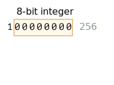
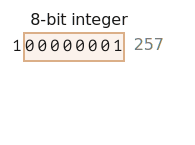

# ArrayBuffer, arrays binarios

En el desarrollo web nos encontramos con datos binarios sobre todo al tratar con archivos (crear, cargar, descargar). Otro caso de uso típico es el procesamiento de imágenes.

Todo esto es posible en JavaScript y las operaciones binarias son de alto rendimiento.

Aunque hay un poco de confusión porque hay muchas clases. Por nombrar algunas:
- `ArrayBuffer`, `Uint8Array`, `DataView`, `Blob`, `File`, etc.

Los datos binarios en JavaScript se implementan de una manera no estándar en comparación con otros lenguajes. Pero cuando ordenamos las cosas, todo se vuelve bastante sencillo.

**El objeto binario básico es `ArrayBuffer` -- una referencia a un área de memoria contigua de longitud fija.**

Lo creamos así:
```js run
let buffer = new ArrayBuffer(16); // crea un buffer de longitud 16
alert(buffer.byteLength); // 16
```

Esto asigna un área de memoria contigua de 16 bytes y la rellena previamente con ceros.

```warn header="`ArrayBuffer` no es un array de algo"
Eliminemos una posible fuente de confusión. `ArrayBuffer` no tiene nada en común con `Array`:
- Tiene una longitud fija, no podemos aumentarla ni disminuirla.
- Ocupa exactamente ese espacio en la memoria.
- Para acceder a bytes individuales, se necesita otro objeto "vista", no `buffer[índice]`.
```

`ArrayBuffer` es un área de memoria. ¿Qué se almacena en ella? No tiene ninguna pista. Sólo una secuencia cruda de bytes.

**Para manipular un `ArrayBuffer`, necesitamos utilizar un objeto "vista".**

Un objeto vista no almacena nada por sí mismo. Son "gafas" que le dan una interpretación a los bytes almacenados en el `ArrayBuffer`.

Por ejemplo:

- **`Uint8Array`** : trata cada byte del `ArrayBuffer` como un número separado, con valores posibles de 0 a 255 (un byte es de 8 bits, por lo que sólo puede contener esa cantidad). Este valor se denomina "entero sin signo de 8 bits".
- **`Uint16Array`** : trata cada 2 bytes como un entero, con valores posibles de 0 a 65535. Es lo que se llama un "entero sin signo de 16 bits".
- **`Uint32Array`** : trata cada 4 bytes como un entero, con valores posibles de 0 a 4294967295. Eso se llama "entero sin signo de 32 bits".
- **`Float64Array`** : trata cada 8 bytes como un número de punto flotante con valores posibles desde <code>5.0x10<sup>-324</sup></code> hasta <code>1.8x10<sup>308</sup></code>.

Así, los datos binarios de un `ArrayBuffer` de 16 bytes pueden interpretarse como 16 "números diminutos", u 8 números más grandes (2 bytes cada uno), o 4 aún más grandes (4 bytes cada uno), o 2 valores de punto flotante con alta precisión (8 bytes cada uno).


`ArrayBuffer` es el objeto central, la raíz de todo, los datos binarios en bruto.

Pero si vamos a escribir en él, o iterar sobre él (básicamente, para casi cualquier operación), debemos utilizar una vista. Por ejemplo:

```js run
let buffer = new ArrayBuffer(16); // crea un buffer de longitud 16

*!*
let view = new Uint32Array(buffer); // trata el buffer como una secuencia de enteros de 32 bits

alert(Uint32Array.BYTES_PER_ELEMENT); // 4 bytes por entero
*/!*

alert(view.length); // 4, almacena esa cantidad de enteros
alert(view.byteLength); // 16, el tamaño en bytes

// escribamos un valor
view[0] = 123456;

// iteración sobre los valores
for(let num of view) {
  alert(num); // 123456, luego 0, 0, 0 (4 valores en total)
}

```

## TypedArray

El término común para todas estas vistas (`Uint8Array`, `Uint32Array`, etc) es [TypedArray](https://tc39.github.io/ecma262/#sec-typedarray-objects). Comparten el mismo conjunto de métodos y propiedades.

Por favor ten en cuenta que no hay ningún constructor llamado `TypedArray`, es sólo un término "paraguas" común para representar una de las vistas sobre `ArrayBuffer`: `Int8Array`, `Uint8Array` y así sucesivamente, la lista completa seguirá pronto.

Cuando veas algo como `new TypedArray`, significa cualquiera de `new Int8Array`, `new Uint8Array`, etc.

Las matrices tipificadas se comportan como las matrices normales: tienen índices y son iterables.

Un constructor de array tipado (ya sea `Int8Array` o `Float64Array`) se comporta de forma diferente dependiendo del tipo de argumento.

Hay 5 variantes de argumentos:

```js
new TypedArray(buffer, [byteOffset], [length]);
new TypedArray(object);
new TypedArray(typedArray);
new TypedArray(length);
new TypedArray();
```

1. Si se suministra un argumento `ArrayBuffer`, la vista se crea sobre él. Ya usamos esa sintaxis.

    Opcionalmente podemos proporcionar `byteOffset` para empezar (0 por defecto) y la longitud o `length` (hasta el final del buffer por defecto), entonces la vista cubrirá sólo una parte del `buffer`.

2. Si se da un `Array`, o cualquier objeto tipo array, se crea un array tipado de la misma longitud y se copia el contenido.

    Podemos usarlo para pre-llenar el array con los datos:
    ```js run
    *!*
    let arr = new Uint8Array([0, 1, 2, 3]);
    */!*
    alert( arr.length ); // 4, creó una matriz binaria de la misma longitud
    alert( arr[1] ); // 1, rellenado con 4 bytes (enteros de 8 bits sin signo) con valores dados
    ```  
3. Si se suministra otro `TypedArray` hace lo mismo: crea un array tipado de la misma longitud y copia los valores. Los valores se convierten al nuevo tipo en el proceso, si es necesario.
    ```js run
    let arr16 = new Uint16Array([1, 1000]);
    *!*
    let arr8 = new Uint8Array(arr16);
    */!*
    alert( arr8[0] ); // 1
    alert( arr8[1] ); // 232, trató de copiar 1000, pero no puede encajar 1000 en 8 bits (explicaciones a continuación)
    ```

4. Para un argumento numérico `length` : crea el array tipado para contener ese número de elementos. Su longitud en bytes será `length` multiplicada por el número de bytes de un solo elemento `TypedArray.BYTES_PER_ELEMENT`:
    ```js run
    let arr = new Uint16Array(4); // crea un array tipado para 4 enteros
    alert( Uint16Array.BYTES_PER_ELEMENT ); // 2 bytes por entero
    alert( arr.byteLength ); // 8 (tamaño en bytes)
    ```

5. Sin argumentos crea un array tipado de longitud cero.

Podemos crear un `TypedArray` directamente sin mencionar `ArrayBuffer`. Pero una vista no puede existir sin un `ArrayBuffer` subyacente, por lo que se crea automáticamente en todos estos casos excepto en el primero (cuando se proporciona).

Para acceder al `ArrayBuffer` subyacente,  en `TypedArray` existen las propiedades:
- `buffer` : hace referencia al `ArrayBuffer`.
- `byteLength` : la longitud del `ArrayBuffer`.

De esta forma siempre podemos pasar de una vista a otra:
```js
let arr8 = new Uint8Array([0, 1, 2, 3]);

// otra vista sobre los mismos datos
let arr16 = new Uint16Array(arr8.buffer);
```


Esta es la lista de arrays tipados:

- `Uint8Array`, `Uint16Array`, `Uint32Array` : para números enteros de 8, 16 y 32 bits.
  - `Uint8ClampedArray` : para números enteros de 8 bits, los "sujeta" en la asignación (ver más abajo).
- `Int8Array`, `Int16Array`, `Int32Array` : para números enteros con signo (pueden ser negativos).
- `Float32Array`, `Float64Array` : para números de punto flotante con signo de 32 y 64 bits.

```warn header="No existe `int8` o tipos de valor único similares"
Ten en cuenta que a pesar de los nombres como `Int8Array`, no hay ningún tipo de valor único como `int` o `int8` en JavaScript.

Esto es lógico ya que `Int8Array` no es un array de estos valores individuales sino una vista sobre `ArrayBuffer`.
```

### Comportamiento fuera de los límites

¿Qué pasa si intentamos escribir un valor fuera de límites en un array tipado? No habrá ningún error. Pero los bits extra se cortan.

Por ejemplo, intentemos poner 256 en `Uint8Array`. En forma binaria 256 es `100000000` (9 bits), pero `Uint8Array` sólo proporciona 8 bits por valor, lo que hace que el rango disponible sea de 0 a 255.

Para los números más grandes, sólo se almacenan los 8 bits más a la derecha (menos significativos), y el resto se corta:



Así que obtendremos un cero.

Para el 257 la forma binaria es `100000001` (9 bits), los 8 más a la derecha se almacenan, por lo que tendremos `1` en el array:



Es decir, se guarda el número módulo 2<sup>8</sup>.

Esta es la demo:

```js run
let uint8array = new Uint8Array(16);

let num = 256;
alert(num.toString(2)); // 100000000 (representación binaria)

uint8array[0] = 256;
uint8array[1] = 257;

alert(uint8array[0]); // 0
alert(uint8array[1]); // 1
```

`Uint8ClampedArray` es especial en este aspecto y su comportamiento es diferente. Guarda 255 para cualquier número que sea mayor que 255, y 0 para cualquier número negativo. Este comportamiento es útil para el procesamiento de imágenes.

## Métodos TypedArray

`TypedArray` tiene los métodos regulares de `Array`, con notables excepciones.

Podemos iterar, `map`, `slice`, `find`, `reduce` etc.

Sin embargo, hay algunas cosas que no podemos hacer:

- No hay `splice` : no podemos "borrar" un valor, porque los arrays tipados son vistas en un buffer y estos son áreas fijas y contiguas de memoria. Todo lo que podemos hacer es asignar un cero.
- No hay método `concat`.

Hay dos métodos adicionales:

- `arr.set(fromArr, [offset])` copia todos los elementos de `fromArr` al `arr`, empezando en la posición `offset` (0 por defecto).
- `arr.subarray([begin, end])` crea una nueva vista del mismo tipo desde `begin` hasta `end` (excluyéndolo). Es similar al método `slice` (que también está soportado) pero no copia nada, sólo crea una nueva vista para operar sobre el trozo de datos dado.

Estos métodos nos permiten copiar arrays tipados, mezclarlos, crear nuevos arrays a partir de los existentes, etc.


## DataView

[DataView](https://developer.mozilla.org/en-US/docs/Web/JavaScript/Reference/Global_Objects/DataView) es una vista especial superflexible "no tipada" sobre `ArrayBuffer`. Permite acceder a los datos en cualquier desplazamiento en cualquier formato.

- En el caso de los arrays tipados, el constructor dicta cuál es el formato. Se supone que todo el array es uniforme. El número i es `arr[i]`.
- Con `DataView` accedemos a los datos con métodos como `.getUint8(i)` o `.getUint16(i)`. Elegimos el formato en el momento de la llamada al método en lugar de en el momento de la construcción.

La sintaxis:

```js
new DataView(buffer, [byteOffset], [byteLength])
```

- **`buffer`** : el `ArrayBuffer` subyacente. A diferencia de los arrays tipados, `DataView` no crea un buffer por sí mismo. Necesitamos tenerlo preparado.
- **`byteOffset`** : la posición inicial en bytes de la vista (por defecto 0).
- **`byteLength`** : la longitud en bytes de la vista (por defecto hasta el final del `buffer`).

Por ejemplo, aquí extraemos números en diferentes formatos del mismo buffer:

```js run
// arreglo binario de 4 bytes, todos tienen el valor máximo 255
let buffer = new Uint8Array([255, 255, 255, 255]).buffer;

let dataView = new DataView(buffer);

// get 8-bit number at offset 0
alert( dataView.getUint8(0) ); // 255

// ahora obtenemos un número de 16 bits en el offset 0, que consta de 2 bytes, que juntos se interpretan como 65535
alert( dataView.getUint16(0) ); // 65535 (mayor entero sin signo de 16 bits)

// obtener un número de 32 bits en el offset 0
alert( dataView.getUint32(0) ); // 4294967295 (mayor entero de 32 bits sin signo)

dataView.setUint32(0, 0); // poner a cero el número de 4 bytes, poniendo así todos los bytes a 0
```

`DataView` es genial cuando almacenamos datos de formato mixto en el mismo buffer. Por ejemplo, cuando almacenamos una secuencia de pares (entero de 16 bits, flotante de 32 bits), `DataView` permite acceder a ellos fácilmente.

## Resumen

`ArrayBuffer` es el objeto central, una referencia al área de memoria contigua de longitud fija.

Para hacer casi cualquier operación sobre `ArrayBuffer`, necesitamos una vista.

- Puede ser un `TypedArray`:
    - `Uint8Array`, `Uint16Array`, `Uint32Array` : para enteros sin signo de 8, 16 y 32 bits.
    - `Uint8ClampedArray` : para enteros de 8 bits, los "sujeta" en la asignación.
    - `Int8Array`, `Int16Array`, `Int32Array` : para números enteros con signo (pueden ser negativos).
    - `Float32Array`, `Float64Array` : para números de punto flotante con signo de 32 y 64 bits.
- O una `DataView` : la vista que utiliza métodos para especificar un formato, por ejemplo `getUint8(offset)`.

En la mayoría de los casos creamos y operamos directamente sobre arrays tipados, dejando el `ArrayBuffer` a cubierto, como "denominador común". Podemos acceder a él como `.buffer` y hacer otra vista si es necesario.

También hay dos términos adicionales, que se utilizan en las descripciones de los métodos que operan con datos binarios:
- `ArrayBufferView` es un término paraguas para todos estos tipos de vistas.
- El término `BufferSource` es un término general para `ArrayBuffer` o `ArrayBufferView`.

Veremos estos términos en los próximos capítulos. El término `BufferSource` es uno de los más comunes, ya que significa "cualquier tipo de datos binarios" : un `ArrayBuffer` o una vista sobre él.

Aquí tienes la hoja de ruta:


