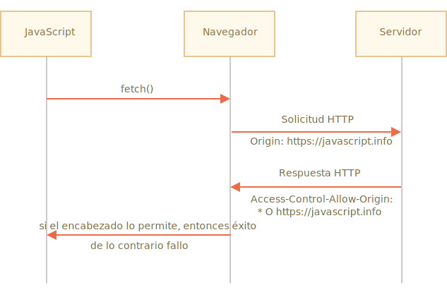

# Fetch: Cross-Origin Requests

Si enviamos una petición `fetch` hacia otro sitio seguramente fallará.

Por ejemplo, probemos realizar una petición a `http://example.com`:

```js run async
try {
  await fetch('http://example.com');
} catch(err) {
  alert(err); // Failed to fetch
}
```

El método fetch falla, tal como lo esperábamos.

El concepto clave aquí es *el origen* (*origin*), triple combinación de dominio/puerto/protocolo.

Las solicitudes de origen cruzado `Cross-origin requests` (aquellas que son enviadas hacia otro dominio --incluso subdominio--, protocolo o puerto), requieren de unas cabeceras especiales desde el sitio remoto.

Esta política es denominada "CORS", por sus siglas en inglés Cross-Origin Resource Sharing.

## ¿Por que CORS es necesario?, Una breve historia

CORS existe para proteger Internet de los hackers malvados.

En verdad... Déjame contarte un breve resumen de esta historia.

**Durante muchos años un script de un sitio no podía acceder al contenido de otro sitio.**

Esta simple, pero poderosa regla, fue parte fundacional de la seguridad de Internet. Por ejemplo, un script malicioso desde el sitio `hacker.com` no podía acceder a la casilla de correo en el sitio `gmail.com`. La gente se podía sentir segura.

Así mismo en ese momento, JavaScript no tenía ningún método especial para realizar solicitudes de red. Simplemente era un lenguaje juguete para decorar páginas web.

Pero los desarrolladores web demandaron más poder. Una variedad de trucos fueron inventados para poder pasar por alto las limitaciones, y realizar solicitudes a otros sitios.

### Utilizando formularios

Una forma de comunicarse con otros servidores es y era utilizando un `<form>`. Las personas lo utilizaban para enviar el resultado hacia un `<iframe>`, y de este modo mantenerse en el mismo sitio, de este modo:

```html
<!-- objetivo del form -->
*!*
<iframe name="iframe"></iframe>
*/!*

<!-- Un formulario puede ser generado de forma dinámica y ser enviado por JavaScript -->
*!*
<form target="iframe" method="POST" action="http://another.com/…">
*/!*
  ...
</form>
```

Entonces, de este modo era posible realizar solicitudes GET/POST hacia otro sitio, incluso sin métodos de red, ya que los formularios pueden enviar mensajes a cualquier sitio. Pero ya que no es posible acceder al contenido de un `<iframe>` de otro sitio, esto evita que sea posible leer la respuesta.

Para ser precisos, en realidad había trucos para eso, requerían scripts especiales tanto en el iframe como en la página. Entonces la comunicación con el iframe era técnicamente posible. Pero ya no hay necesidad de entrar en detalles, dejemos a los dinosaurios descansar en paz.

### Utilizando scripts

Otro truco es en el modo de utilizar la etiqueta `script`. Un script puede tener cualquier origen `src`, con cualquier dominio, tal como `<script src="http://another.com/…">`. De este modo es posible ejecutar un script de cualquier sitio web.

Si un sitio, por ejemplo, `another.com` requiere exponer datos con este tipo de acceso, se utilizaba el protocolo llamado en ese entonces "JSONP (JSON con padding)" .

Veamos como se utilizaba.

Digamos que, en nuestro sitio es necesario obtener datos de `http://another.com`, como podría ser el pronóstico del tiempo:

1. Primero, adelantándonos, creamos una función global para aceptar los datos, por ejemplo: `gotWeather`.

    ```js
    // 1. Se declara la función para procesar los datos del tiempo
    function gotWeather({ temperature, humidity }) {
      alert(`temperature: ${temperature}, humidity: ${humidity}`);
    }
    ```
2. Entonces creamos una etiqueta `<script>` donde `src="http://another.com/weather.json?callback=gotWeather"`, utilizando el nombre de nuestra función como un parámetro `callback`, dentro de la URL.

    ```js
    let script = document.createElement('script');
    script.src = `http://another.com/weather.json?callback=gotWeather`;
    document.body.append(script);
    ```
3. El servidor remoto `another.com` de forma dinámica genera un script que invoca el método `gotWeather(...)` con los datos que nosotros necesitamos recibir.
    ```js
    // The expected answer from the server looks like this:
    gotWeather({
      temperature: 25,
      humidity: 78
    });
    ```
4. Entonces el script remoto carga y es ejecutado, la función `gotWeather` se invoca, y ya que es nuestra función, obtenemos los datos.

Esto funciona, y no viola la seguridad, ya que ambos sitios acuerdan en intercambiar los datos de este modo. Y cuando ambos lados concuerdan, definitivamente no se trata de un hackeo. Aún hay servicios que proveen este tipo de acceso, lo que puede ser útil ya que funciona en navegadores obsoletos.

Tiempo después aparecieron métodos de red en los navegadores para JavaScript.

Al comienzo, las solicitudes de origen cruzado fueron prohibidas, pero luego de prolongadas discusiones se permitieron, requiriendo consentimiento explicito por parte del servidor, esto expresado en cabezales especiales.

## Solicitudes seguras

Existen dos tipos de solicitudes de origen cruzado:

1. Solicitudes seguras.
2. Todas las demás.

Las solicitudes seguras son más fáciles de hacer, comencemos con ellas.

Una solicitud es segura si cumple dos condiciones:

1. [método seguro](https://fetch.spec.whatwg.org/#cors-safelisted-method): GET, POST o HEAD
2. [Cabeceras seguras](https://fetch.spec.whatwg.org/#cors-safelisted-request-header) -- Las únicas cabeceras permitidas son:
    - `Accept`,
    - `Accept-Language`,
    - `Content-Language`,
    - `Content-Type` con el valor `application/x-www-form-urlencoded`, `multipart/form-data` o `text/plain`.

Cualquier otra solicitud es considerada "insegura". Por lo tanto, una solicitud con el método `PUT` o con una cabecera HTTP `API-Key` no cumple con las limitaciones.

**La diferencia esencial es que una solicitud segura puede ser realizada mediante un `<form>` o un `<script>`, sin la necesidad de utilizar un método especial.**

Por lo tanto, incluso un servidor obsoleto debería ser capaz de aceptar una solicitud segura.

Contrario a esto, las solicitudes con cabeceras no estándar o métodos como el `DELETE` no pueden ser creados de este modo. Durante mucho tiempo no fue posible para JavaScript realizar este tipo de solicitudes. Por lo que un viejo servidor podía asumir que ese tipo de solicitudes provenía desde una fuente privilegiada, "ya que una página web es incapaz de enviarlas".

Cuando intentamos realizar una solicitud insegura, el navegador envía una solicitud especial de "pre-vuelo" consultando al servidor: ¿está de acuerdo en aceptar tal solicitud de origen cruzado o no?

Y, salvo que el servidor lo confirme de forma explícita, cualquier solicitud insegura no es enviada.

Vayamos ahora a los detalles.

## CORS para solicitudes seguras

Si una solicitud es de origen cruzado, el navegador siempre le agregará una cabecera `Origin`.

Por ejemplo, si realizamos una solicitud de `https://anywhere.com/request` a `https://javascript.info/page`, las cabeceras podrían ser algo así:

```http
GET /request
Host: anywhere.com
*!*
Origin: https://javascript.info
*/!*
...
```

Tal como se puede ver, la cabecera `Origin` contiene exactamente el origen (protocolo/dominio/puerto), sin el path.

El servidor puede inspeccionar el origen `Origin` y, si esta de acuerdo en aceptar ese tipo de solicitudes, agrega una cabecera especial `Access-Control-Allow-Origin` a la respuesta. Esta cabecera debe contener el origen permitido (en nuestro caso `https://javascript.info`), o un asterisco `*`. En ese caso la respuesta es satisfactoria, de otro modo falla.

El navegador cumple el papel de mediador de confianza:
1. Ante una solicitud de origen cruzado, se asegura de que se envíe el origen correcto.
2. Chequea que la respuesta contenga la cabecera `Access-Control-Allow-Origin`, de ser así JavaScript tiene permitido acceder a la respuesta, de no ser así la solicitud falla con un error.



Aquí tenemos un ejemplo de una respuesta permisiva desde el servidor:
```http
200 OK
Content-Type:text/html; charset=UTF-8
*!*
Access-Control-Allow-Origin: https://javascript.info
*/!*
```

## Cabeceras de respuesta

Para las respuestas de origen cruzado, por defecto JavaScript sólo puede acceder a las cabeceras llamadas "seguras":

- `Cache-Control`
- `Content-Language`
- `Content-Type`
- `Expires`
- `Last-Modified`
- `Pragma`

El acceso a otro tipo de cabeceras de la respuesta generará un error.

```smart
Como se puede ver, ¡no está la cabecera `Content-Length` en la lista!

Esta cabecera contiene el tamaño total de la respuesta. Por lo que si queremos mostrar el progreso de la descarga, en ese caso necesitaremos un permiso adicional para acceder a ese campo de la cabecera.
```

Para permitirle a JavaScript acceso a otros tipos de cabeceras, el servidor debe incluir la cabecera `Access-Control-Expose-Headers`. Este campo contiene una lista separada por comas de las cabeceras inseguras que podrán ser accesibles.

Por ejemplo:

```http
200 OK
Content-Type:text/html; charset=UTF-8
Content-Length: 12345
API-Key: 2c9de507f2c54aa1
Access-Control-Allow-Origin: https://javascript.info
*!*
Access-Control-Expose-Headers: Content-Length,API-Key
*/!*
```

Con este valor de `Access-Control-Expose-Headers`, el script tendrá permitido acceder a los valores de las cabeceras `Content-Length` y `API-Key` de la respuesta.

## Solicitudes "inseguras"

Podemos utilizar cualquier método HTTP: no únicamente `GET/POST`, sino también `PATCH`, `DELETE` y otros.

Hace algún tiempo nadie podía siquiera imaginar que un sitio web pudiera realizar ese tipo de solicitudes. Por lo que aún existen servicios web que cuando reciben un método no estándar los consideran como una señal de que: "Del otro lado no hay un navegador". Ellos pueden tener en cuenta esto cuando revisan los derechos de acceso.

Por lo tanto, para evitar malentendidos, cualquier solicitud "insegura" (Estas que no podían ser realizadas en los viejos tiempos), no será realizada por el navegador en forma directa. Antes, enviará una solicitud preliminar llamada solicitud de "pre-vuelo", solicitando que se le concedan los permisos.

Una solicitud de "pre-vuelo" utiliza el método `OPTIONS`, sin contenido en el cuerpo y con tres cabeceras:

- `Access-Control-Request-Method`, cabecera que contiene el método de la solicitud "insegura".
- `Access-Control-Request-Headers` provee una lista separada por comas de las cabeceras inseguras de la solicitud.
- `Origin` cabecera que informa de dónde viene la solicitud. (como `https://javascript.info`)

Si el servidor está de acuerdo con lo solicitado, entonces responderá con el código de estado 200 y un cuerpo vacío:

- `Access-Control-Allow-Origin` debe ser `*` o el origen de la solicitud, tal como `https://javascript.info`, para permitir el acceso.
- `Access-Control-Allow-Methods` contiene el método permitido.
- `Access-Control-Allow-Headers` contiene un listado de las cabeceras permitidas.
- Además, la cabecera `Access-Control-Max-Age` puede especificar el número máximo de segundos que puede recordar los permisos. Por lo que el navegador no necesita volver a requerirlos en las próximas solicitudes.


Vamos a ver cómo funciona paso a paso, mediante un ejemplo para una solicitud de origen cruzado `PATCH` (este método suele utilizarse para actualizar datos):

```js
let response = await fetch('https://site.com/service.json', {
  method: 'PATCH',
  headers: {
    'Content-Type': 'application/json',
    'API-Key': 'secret'
  }
});
```

Hay tres motivos por los cuales esta solicitud no es segura (una es suficiente):
- Método `PATCH`
- `Content-Type` no es del tipo: `application/x-www-form-urlencoded`, `multipart/form-data`, `text/plain`.
- Cabecera `API-Key` "insegura".

### Paso 1 (solicitud de pre-vuelo)

Antes de enviar una solicitud de este tipo, el navegador envía una solicitud de pre-vuelo que se ve de este modo:

```http
OPTIONS /service.json
Host: site.com
Origin: https://javascript.info
Access-Control-Request-Method: PATCH
Access-Control-Request-Headers: Content-Type,API-Key
```

- Método: `OPTIONS`.
- El path -- exactamente el mismo que el de la solicitud principal: `/service.json`.
- Cabeceras especiales de origen cruzado (Cross-origin):
    - `Origin` -- el origen de la fuente.
    - `Access-Control-Request-Method` -- método solicitado.
    - `Access-Control-Request-Headers` -- listado separado por comas de las cabeceras "inseguras".

### Paso 2 (solicitud de pre-vuelo)

El servidor debe responder con el código de estado 200 y las cabeceras:
- `Access-Control-Allow-Origin: https://javascript.info`
- `Access-Control-Allow-Methods: PATCH`
- `Access-Control-Allow-Headers: Content-Type,API-Key`.

Esto permitirá la comunicación futura, de otro modo se disparará un error.

Si el servidor espera otro método y cabeceras en el futuro, tiene sentido permitirlos por adelantado agregándolos a la lista.

Por ejemplo, esta respuesta habilita además los métodos `PUT`, `DELETE` y otras cabeceras:

```http
200 OK
Access-Control-Allow-Origin: https://javascript.info
Access-Control-Allow-Methods: PUT,PATCH,DELETE
Access-Control-Allow-Headers: API-Key,Content-Type,If-Modified-Since,Cache-Control
Access-Control-Max-Age: 86400
```

Ahora el navegador puede ver que `PATCH` se encuentra dentro de la cabecera `Access-Control-Allow-Methods` y `Content-Type,API-Key` dentro de la lista `Access-Control-Allow-Headers`, por lo que permitirá enviar la solicitud principal.

Si se encuentra con una cabecera `Access-Control-Max-Age` con determinada cantidad de segundos, entonces los permisos son almacenados en el caché por ese determinado tiempo. La solicitud anterior será cacheada por 86400 segundos (un día). Durante ese marco de tiempo, las solicitudes siguientes no requerirán la solicitud de pre-vuelo. Asumiendo que están dentro de lo permitido en la respuesta cacheada, serán enviadas de forma directa.

### Paso 3 (solicitud real)

Una vez el pre-vuelo se realiza de forma satisfactoria, el navegador realiza la solicitud principal. El algoritmo aquí es el mismo que el utilizado para una solicitud segura.

La solicitud principal tiene la cabecera `Origin` (ya que se trata de una solicitud de origen cruzado):

```http
PATCH /service.json
Host: site.com
Content-Type: application/json
API-Key: secret
Origin: https://javascript.info
```

### Paso 4 (respuesta real)

El server no debe olvidar agregar la cabecera `Access-Control-Allow-Origin` a la respuesta principal. Un pre-vuelo exitoso no lo libera de esto:

```http
Access-Control-Allow-Origin: https://javascript.info
```

Entonces JavaScript es capaz de leer la respuesta principal del servidor.

```smart
La solicitud de pre-vuelo ocurre "detrás de escena", es invisible a JavaScript.

JavaScript únicamente obtiene la respuesta a la solicitud principal o un error en caso de que el servidor no otorgue la autorización.
```

## Credenciales

Una solicitud de origen cruzado realizada por código JavaScript, por defecto no provee ningún tipo de credenciales (cookies o autenticación HTTP).

Esto es poco común para solicitudes HTTP. Usualmente una solicitud a un sitio `http://site.com` es acompañada por todas las cookies de ese dominio. Pero una solicitud de origen cruzado realizada por métodos de JavaScript son una excepción.

Por ejemplo, `fetch('http://another.com')` no enviará ninguna cookie, ni siquiera (!) esas que pertenecen al dominio `another.com`.

¿Por qué?

El motivo de esto es que una solicitud con credenciales es mucho más poderosa que sin ellas. Si se permitiera, esto garantizaría a JavaScript el completo poder de actuar en representación del usuario y de acceder a información sensible utilizando sus credenciales.

¿En verdad el servidor confía lo suficiente en el script? En ese caso el servidor debera enviar explicitamente que permite solicitudes con credenciales mediante otra cabecera especial.

Para permitir el envío de credenciales en `fetch`, necesitamos agregar la opción `credentials: "include"`, de este modo:

```js
fetch('http://another.com', {
  credentials: "include"
});
```

Ahora `fetch` envía cookies originadas desde `another.com` con las solicitudes a ese sitio.

Si el servidor está de acuerdo en aceptar solicitudes *con credenciales*, debe agregar la cabecera `Access-Control-Allow-Credentials: true` a la respuesta, además de `Access-Control-Allow-Origin`.

Por ejemplo:

```http
200 OK
Access-Control-Allow-Origin: https://javascript.info
Access-Control-Allow-Credentials: true
```

Cabe destacar que: `Access-Control-Allow-Origin` no se puede utilizar con un asterisco `*` para solicitudes con credenciales. Tal como se muestra a arriba debe proveer el origen exacto. Esto es una medida adicional de seguridad, para asegurar de que el servidor conozca exactamente en quién confiar para que le envíe este tipo de solicitudes.

## Resumen

Desde el punto de vista del navegador, existen dos tipos de solicitudes de origen cruzado: solicitudes "seguras" y todas las demás.

[Solicitudes seguras](http://www.w3.org/TR/cors/#terminology) deben cumplir las siguientes condiciones:
- Método: GET, POST o HEAD.
- Cabeceras -- solo podemos establecer:
    - `Accept`
    - `Accept-Language`
    - `Content-Language`
    - `Content-Type` con el valor `application/x-www-form-urlencoded`, `multipart/form-data` o `text/plain`.

La diferencia esencial es que las solicitudes seguras eran posibles desde los viejos tiempos utilizando las etiquetas `<form>` o `<script>`, mientras que las solicitudes "inseguras" fueron imposibles para el navegador durante mucho tiempo.

Por lo tanto, en la práctica, la diferencia se encuentra en que las solicitudes seguras son realizadas de forma directa, utilizando la cabecera `Origin`, mientras que para las otras el navegador realiza una solicitud extra de "pre-vuelo" para requerir la autorización.

**Para una solicitud segura:**

- → El navegador envía una cabecera `Origin` con el origen.
- ← Para solicitudes sin credenciales (no enviadas por defecto), el servidor debe establecer:
    - `Access-Control-Allow-Origin` como `*` o el mismo valor que en `Origin`.
- ← Para solicitudes con credenciales, el servidor deberá establecer:
    - `Access-Control-Allow-Origin` con el mismo valor que en `Origin`.
    - `Access-Control-Allow-Credentials` en `true`

Adicionalmente, para garantizar a JavaScript acceso a cualquier cabecera de la respuesta, con excepción de `Cache-Control`, `Content-Language`, `Content-Type`, `Expires`, `Last-Modified` o `Pragma`, el servidor debe agregarlas como permitidas en la lista de la cabecera `Access-Control-Expose-Headers`.

**Para solicitudes inseguras, se utiliza una solicitud preliminar "pre-vuelo"  antes de la solicitud principal:**

- → El navegador envía una solicitud del tipo `OPTIONS` a la misma URL, con las cabeceras:
    - `Access-Control-Request-Method` con el método requerido.
    - `Access-Control-Request-Headers` listado de las cabeceras inseguras.
- ← El servidor debe responder con el código de estado 200 y las cabeceras:
    - `Access-Control-Allow-Methods` con la lista de todos los métodos permitidos,
    - `Access-Control-Allow-Headers` con una lista de cabeceras permitidas,
    - `Access-Control-Max-Age` con los segundos en los que se podrá almacenar la autorización en caché.
- Tras lo cual la solicitud es enviada, y se aplica el esquema previo "seguro".
