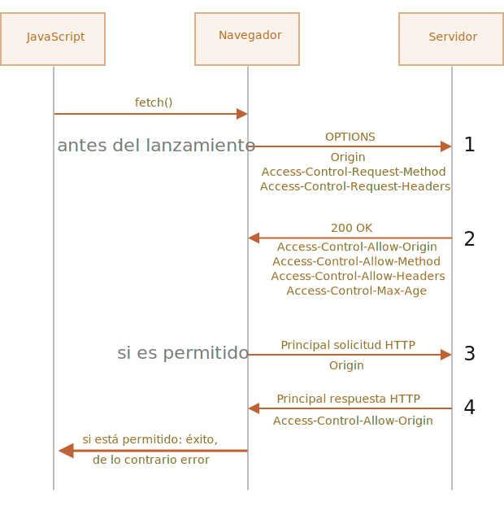

# Fetch: Cross-Origin Requests

Si enviamos una petición `fetch` hacia otro sitio seguramente fallará.

Pro ejemplo, probemos realizar una petición a `http://example.com`:

```js run async
try {
  await fetch('http://example.com');
} catch(err) {
  alert(err); // Failed to fetch
}
```

El método fetch falla, tal como lo esperabamos.

El concepto clave aquí es *el origen* (*origin*), triple combinación de dominio/puerto/protocolo.

Las solicitudes de origen cruzado `Cross-origin requests`, tales que son enviadas hacia otro dominio (incluso subdominio), protocolo o puerto, requieren de unas cabeceras especiales desde el sitio remoto.

Esta política es denominada "CORS", por sus siglas en inglés Cross-Origin Resource Sharing.

## ¿Por que CORS es necesario?, Una breve historia

CORS exíste para protejer Internet de los malvados hackers.

En verdad... Déjame contarte un breve resumen de esta historia.

**Durante muchos años un script de un sitio no podía acceder al contenido de otro sitio.**

Esta simple, pero poderosa regla, fue parte fundacional de la seguridad de Internet. Ej: Un script malisioso desde el sitio `hacker.com` no podía acceder a la casilla de correo en el sitio `gmail.com`. La gente se podía sentir segura.

Así mismo en ese momento, JavaScript no tenía ningún método especial para realizar solicitudes de red. Simplemente era un lenguaje juguete para decorar páginas web.

Pero los desarrolladores web demandaron más poder. Una variedad de trucos fueron inventados para poder pasar por alto las limitaciones, y realizar solicitudes a otros sitios.

### Utilizando formularios

Una forma de comunicarse con otros servidores es y era utilizando un `<form>`. Las personas lo utilizaban para enviar el resultado hacia un `<iframe>`, y de este modo mantenerse en el mismo sitio, de este modo:

```html
<!-- objetivo del form -->
*!*
<iframe name="iframe"></iframe>
*/!*

<!-- Un formulario puede ser generado de forma dinámica y ser enviado por JavaScript -->
*!*
<form target="iframe" method="POST" action="http://another.com/…">
*/!*
  ...
</form>
```

Entonces, de este modo era posible realizar solicitudes GET/POST hacia otro sitio, inclúso sin métodos de red, ya que los formularios pueden enviar mensajes a cualquier sitio. Pero ya que no es posible acceder al contenido de un `<iframe>` de otro sitio, esto evita que sea posible leer la respuesta.

Para ser precisos, en realidad había trucos para eso, requerían scripts especiales tanto en el iframe como en la página. Entonces la comunicación con el iframe era técnicamente posible. Pero ya no hay necesidad de entrar en detalles, dejemos a los dinosaurios descanzar en paz.

### Utilizando scripts

Otro truco es en el modo de utilizar la etiqueta `script`. Un script puede tener cualquier origen `src`, con cualquier dominio, tal como `<script src="http://another.com/…">`. De este modo es posible ejecutar un script de cualquier sitio web.

Si un sitio, por ejemplo, `another.com` requiere exponer datos con este tipo de acceso, el protocolo entonces llamado "JSONP (JSON con padding)" era utilizado.

Veamos como se utilizaba.

Digamos que, en nuestro sitio es necesario obtener datos de `http://another.com`, como podría ser el pronóstico del tiempo:

1. Primero, adelantándonos, creamos una función global para aceptar los datos, por ejemplo: `gotWeather`.

    ```js
    // 1. Se declara la función para procesar los datos del tiempo
    function gotWeather({ temperature, humidity }) {
      alert(`temperature: ${temperature}, humidity: ${humidity}`);
    }
    ```
2. Entonces creamos una etiqueta `<script>` donde `src="http://another.com/weather.json?callback=gotWeather"`, utilizando el nombre de nuestra función como un parámetro `callback`, dentro de la URL.

    ```js
    let script = document.createElement('script');
    script.src = `http://another.com/weather.json?callback=gotWeather`;
    document.body.append(script);
    ```
3. El servidor remoto `another.com` de forma dinámica genera un script que invoca el método `gotWeather(...)` con los datos que nosotros necesitamos recibir.
    ```js
    // The expected answer from the server looks like this:
    gotWeather({
      temperature: 25,
      humidity: 78
    });
    ```
4. Entonces el script remoto carga y es ejecutado, la función `gotWeather` se invoca, y ya que es nuestra función, obtenemos los datos.

Esto funciona, y no viola la seguridad, ya que ambos sitios acuerdan en intercambiar los datos de este modo. Y cuando ambos lados concuerdan, definitivamente no se trata de un hackeo. Aún hay servicios que proveen este tipo de acceso, lo que puede ser útil ya que funciona en navegadores obsoletos.

Tiempo después aparecieron métodos de red en los navegadores para JavaScript.

Al comienzo, las solicitudes de origen cruzado fueron prohibidas, pero luego de prolongadas discusiones se permitieron, requiriendo concentimiento explicito por parte del servidor, esto expresado en cabezales especiales.

## Solicitudes simples

Existen dos tipos de solicitudes de origen cruzado:

1. Solicitudes simples.
2. Todas las demás.

Las solicitudes simples son, bueno... simples de hacer, por lo tanto comencemos con ellas.

Una [solicitud simple](http://www.w3.org/TR/cors/#terminology) es una solicitud que cumple dos condiciones:

1. [método simple](http://www.w3.org/TR/cors/#simple-method): GET, POST o HEAD
2. [Cabeceras simples](http://www.w3.org/TR/cors/#simple-header) -- Las únicas cabeceras permitidas son:
    - `Accept`,
    - `Accept-Language`,
    - `Content-Language`,
    - `Content-Type` con el valor `application/x-www-form-urlencoded`, `multipart/form-data` o `text/plain`.

Cualquier otra solicitud es considerada "no simple". Por lo tanto, una solicitud con el método `PUT` o con una cabecera HTTP `API-Key` no cumple con las limitaciones.

**La diferencia esencial es que una "solicitud simple" puede ser realizada mediante un `<form>` o un `<script>`, sin la necesidad de utilizar un método especial.**

Por lo tanto, incluso un servidor obsoleto debería ser capaz de aceptar una solicitud simple.

Contrario a esto, las solicitudes con cabeceras no estándar o métodos como el `DELETE` no pueden ser creados de este modo. Durante mucho tiempo no fue posible para JavaScript realizar este tipo de solicitudes. Por lo que un viejo servidor podía asumir que ese tipo de solicitudes provenía desde una fuente privilegiada, "ya que una página web es incapáz de enviarlas".

Cuando intentamos realizar una solicitud "no simple", el navegador envía una solicitud especial de "pre-vuelo" consultandole al servidor si está de acuerdo en aceptar ese tipo de solicitud de origen cruzado, o no.

Y, sólo en caso de que el servidor confirme de forma explícita, la solicitud "no simple" es enviada.

Vayamos ahora a los detalles.

## CORS para solicitudes simples

Si una solicitud es de origen cruzado, el navegador siempre le agregará una cabecera `Origin`.

Por ejemplo, si realizamos una solicitud de `https://anywhere.com/request` a `https://javascript.info/page`, las cabeceras podrían ser algo así:

```http
GET /request
Host: anywhere.com
*!*
Origin: https://javascript.info
*/!*
...
```

Tal como se puede ver, la cabecera `Origin` contiene exactamente el origen (protocolo/dominio/puerto), sin el path.

The server can inspect the `Origin` and, if it agrees to accept such a request, adds a special header `Access-Control-Allow-Origin` to the response. That header should contain the allowed origin (in our case `https://javascript.info`), or a star `*`. Then the response is successful, otherwise an error.

The browser plays the role of a trusted mediator here:
1. It ensures that the correct `Origin` is sent with a cross-origin request.
2. It checks for permitting `Access-Control-Allow-Origin` in the response, if it exists, then JavaScript is allowed to access the response, otherwise it fails with an error.


Here's an example of a permissive server response:
```http
200 OK
Content-Type:text/html; charset=UTF-8
*!*
Access-Control-Allow-Origin: https://javascript.info
*/!*
```

## Response headers

For cross-origin request, by default JavaScript may only access so-called "simple" response headers:

- `Cache-Control`
- `Content-Language`
- `Content-Type`
- `Expires`
- `Last-Modified`
- `Pragma`

Accessing any other response header causes an error.

```smart
There's no `Content-Length` header in the list!

This header contains the full response length. So, if we're downloading something and would like to track the percentage of progress, then an additional permission is required to access that header (see below).
```

To grant JavaScript access to any other response header, the server must send  `Access-Control-Expose-Headers` header. It contains a comma-separated list of non-simple header names that should be made accessible.

For example:

```http
200 OK
Content-Type:text/html; charset=UTF-8
Content-Length: 12345
API-Key: 2c9de507f2c54aa1
Access-Control-Allow-Origin: https://javascript.info
*!*
Access-Control-Expose-Headers: Content-Length,API-Key
*/!*
```

With such `Access-Control-Expose-Headers` header, the script is allowed to read `Content-Length` and `API-Key` headers of the response.

## "Non-simple" requests

We can use any HTTP-method: not just `GET/POST`, but also `PATCH`, `DELETE` and others.

Some time ago no one could even imagine that a webpage could make such requests. So there may still exist webservices that treat a non-standard method as a signal: "That's not a browser". They can take it into account when checking access rights.

So, to avoid misunderstandings, any "non-simple" request -- that couldn't be done in the old times, the browser does not make such requests right away. Before it sends a preliminary, so-called "preflight" request, asking for permission.

A preflight request uses method `OPTIONS`, no body and two headers:

- `Access-Control-Request-Method` header has the method of the non-simple request.
- `Access-Control-Request-Headers` header provides a comma-separated list of its non-simple HTTP-headers.

If the server agrees to serve the requests, then it should respond with empty body, status 200 and headers:

- `Access-Control-Allow-Origin` must be either `*` or the requesting origin, such as `https://javascript.info`, to allow it.
- `Access-Control-Allow-Methods` must have the allowed method.
- `Access-Control-Allow-Headers` must have a list of allowed headers.
- Additionally, the header `Access-Control-Max-Age` may specify a number of seconds to cache the permissions. So the browser won't have to send a preflight for subsequent requests that satisfy given permissions.



Let's see how it works step-by-step on example, for a cross-origin `PATCH` request (this method is often used to update data):

```js
let response = await fetch('https://site.com/service.json', {
  method: 'PATCH',
  headers: {
    'Content-Type': 'application/json',
    'API-Key': 'secret'
  }
});
```

There are three reasons why the request is not simple (one is enough):
- Method `PATCH`
- `Content-Type` is not one of: `application/x-www-form-urlencoded`, `multipart/form-data`, `text/plain`.
- "Non-simple" `API-Key` header.

### Step 1 (preflight request)

Prior to sending such request, the browser, on its own, sends a preflight request that looks like this:

```http
OPTIONS /service.json
Host: site.com
Origin: https://javascript.info
Access-Control-Request-Method: PATCH
Access-Control-Request-Headers: Content-Type,API-Key
```

- Method: `OPTIONS`.
- The path -- exactly the same as the main request: `/service.json`.
- Cross-origin special headers:
    - `Origin` -- the source origin.
    - `Access-Control-Request-Method` -- requested method.
    - `Access-Control-Request-Headers` -- a comma-separated list of "non-simple" headers.

### Step 2 (preflight response)

The server should respond with status 200 and headers:
- `Access-Control-Allow-Origin: https://javascript.info`
- `Access-Control-Allow-Methods: PATCH`
- `Access-Control-Allow-Headers: Content-Type,API-Key`.

That allows future communication, otherwise an error is triggered.

If the server expects other methods and headers in the future, it makes sense to allow them in advance by adding to the list.

For example, this response also allows `PUT`, `DELETE` and additional headers:

```http
200 OK
Access-Control-Allow-Origin: https://javascript.info
Access-Control-Allow-Methods: PUT,PATCH,DELETE
Access-Control-Allow-Headers: API-Key,Content-Type,If-Modified-Since,Cache-Control
Access-Control-Max-Age: 86400
```

Now the browser can see that `PATCH` is in `Access-Control-Allow-Methods` and `Content-Type,API-Key` are in the list `Access-Control-Allow-Headers`, so it sends out the main request.

If there's header `Access-Control-Max-Age` with a number of seconds, then the preflight permissions are cached for the given time. The response above will be cached for 86400 seconds (one day). Within this timeframe, subsequent requests will not cause a preflight. Assuming that they fit the cached allowances, they will be sent directly.

### Step 3 (actual request)

When the preflight is successful, the browser now makes the main request. The algorithm here is the same as for simple requests.

The main request has `Origin` header (because it's cross-origin):

```http
PATCH /service.json
Host: site.com
Content-Type: application/json
API-Key: secret
Origin: https://javascript.info
```

### Step 4 (actual response)

The server should not forget to add `Access-Control-Allow-Origin` to the main response. A successful preflight does not relieve from that:

```http
Access-Control-Allow-Origin: https://javascript.info
```

Then JavaScript is able to read the main server response.

```smart
Preflight request occurs "behind the scenes", it's invisible to JavaScript.

JavaScript only gets the response to the main request or an error if there's no server permission.
```

## Credentials

A cross-origin request initiated by JavaScript code by default does not bring any credentials (cookies or HTTP authentication).

That's uncommon for HTTP-requests. Usually, a request to `http://site.com` is accompanied by all cookies from that domain. But cross-origin requests made by JavaScript methods are an exception.

For example, `fetch('http://another.com')` does not send any cookies, even those  (!) that belong to `another.com` domain.

Why?

That's because a request with credentials is much more powerful than without them. If allowed, it grants JavaScript the full power to act on behalf of the user and access sensitive information using their credentials.

Does the server really trust the script that much? Then it must explicitly allow requests with credentials with an additional header.

To send credentials in `fetch`, we need to add the option `credentials: "include"`, like this:

```js
fetch('http://another.com', {
  credentials: "include"
});
```

Now `fetch` sends cookies originating from `another.com` with request to that site.

If the server agrees to accept the request *with credentials*, it should add a header `Access-Control-Allow-Credentials: true` to the response, in addition to `Access-Control-Allow-Origin`.

For example:

```http
200 OK
Access-Control-Allow-Origin: https://javascript.info
Access-Control-Allow-Credentials: true
```

Please note: `Access-Control-Allow-Origin` is prohibited from using a star `*` for requests with credentials. Like shown above, it must provide the exact origin there. That's an additional safety measure, to ensure that the server really knows who it trusts to make such requests.

## Summary

From the browser point of view, there are two kinds of cross-origin requests: "simple" and all the others.

[Simple requests](http://www.w3.org/TR/cors/#terminology) must satisfy the following conditions:
- Method: GET, POST or HEAD.
- Headers -- we can set only:
    - `Accept`
    - `Accept-Language`
    - `Content-Language`
    - `Content-Type` to the value `application/x-www-form-urlencoded`, `multipart/form-data` or `text/plain`.

The essential difference is that simple requests were doable since ancient times using `<form>` or `<script>` tags, while non-simple were impossible for browsers for a long time.

So, the practical difference is that simple requests are sent right away, with `Origin` header, while for the other ones the browser makes a preliminary "preflight" request, asking for permission.

**For simple requests:**

- → The browser sends `Origin` header with the origin.
- ← For requests without credentials (not sent default), the server should set:
    - `Access-Control-Allow-Origin` to `*` or same value as `Origin`
- ← For requests with credentials, the server should set:
    - `Access-Control-Allow-Origin` to same value as `Origin`
    - `Access-Control-Allow-Credentials` to `true`

Additionally, to grant JavaScript access to any response headers except `Cache-Control`,  `Content-Language`, `Content-Type`, `Expires`, `Last-Modified` or `Pragma`, the server should list the allowed ones in `Access-Control-Expose-Headers` header.

**For non-simple requests, a preliminary "preflight" request is issued before the requested one:**

- → The browser sends `OPTIONS` request to the same URL, with headers:
    - `Access-Control-Request-Method` has requested method.
    - `Access-Control-Request-Headers` lists non-simple requested headers.
- ← The server should respond with status 200 and headers:
    - `Access-Control-Allow-Methods` with a list of allowed methods,
    - `Access-Control-Allow-Headers` with a list of allowed headers,
    - `Access-Control-Max-Age` with a number of seconds to cache permissions.
- Then the actual request is sent, the previous "simple" scheme is applied.
