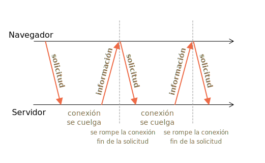

<<<<<<< HEAD
# Sondeo largo

Sondeo largo es la forma más sencilla de tener una conexión persistente con el servidor, que no utiliza ningún protocolo específico como WebSocket o Eventos enviados por el servidor.

Al ser muy fácil de implementar, también es suficientemente bueno en muchos casos.

## Sondeo regular

La forma más sencilla de obtener nueva información del servidor es un sondeo periódico. Es decir, solicitudes regulares al servidor: "Hola, estoy aquí, ¿tienes información para mí?". Por ejemplo, una vez cada 10 segundos.

En respuesta, el servidor primero se da cuenta de que el cliente está en línea, y segundo, envía un paquete de mensajes que recibió hasta ese momento.

Eso funciona, pero hay desventajas:
1. Los mensajes se transmiten con un retraso de hasta 10 segundos (entre solicitudes).
2. Incluso si no hay mensajes, el servidor se bombardea con solicitudes cada 10 segundos, aunque el usuario haya cambiado a otro lugar o esté dormido. Eso es bastante difícil de manejar, hablando en términos de rendimiento.

Entonces, si hablamos de un servicio muy pequeño, el enfoque puede ser viable, pero en general, necesita una mejora.

## Sondeo largo

El llamado "sondeo largo" es una forma mucho mejor de sondear el servidor.

También es muy fácil de implementar y envía mensajes sin demoras.

El flujo:

1. Se envía una solicitud al servidor.
2. El servidor no cierra la conexión hasta que tiene un mensaje para enviar.
3. Cuando aparece un mensaje, el servidor responde a la solicitud con él.
4. El navegador realiza una nueva solicitud de inmediato.

La situación en la que el navegador envió una solicitud y tiene una conexión pendiente con el servidor, es estándar para este método. Solo cuando se entrega un mensaje, se restablece la conexión.



Si se pierde la conexión, por ejemplo, debido a un error de red, el navegador envía inmediatamente una nueva solicitud.

Un esquema de la función de suscripción del lado del cliente que realiza solicitudes largas:
=======
# Long polling

Long polling is the simplest way of having persistent connection with server, that doesn't use any specific protocol like WebSocket or Server Side Events.

Being very easy to implement, it's also good enough in a lot of cases.

## Regular Polling

The simplest way to get new information from the server is periodic polling. That is, regular requests to the server: "Hello, I'm here, do you have any information for me?". For example, once every 10 seconds.

In response, the server first takes a notice to itself that the client is online, and second - sends a packet of messages it got till that moment.

That works, but there are downsides:
1. Messages are passed with a delay up to 10 seconds (between requests).
2. Even if there are no messages, the server is bombed with requests every 10 seconds, even if the user switched somewhere else or is asleep. That's quite a load to handle, speaking performance-wise.

So, if we're talking about a very small service, the approach may be viable, but generally, it needs an improvement.

## Long polling

So-called "long polling" is a much better way to poll the server.

It's also very easy to implement, and delivers messages without delays.

The flow:

1. A request is sent to the server.
2. The server doesn't close the connection until it has a message to send.
3. When a message appears - the server responds to the request with it.
4. The browser makes a new request immediately.

The situation when the browser sent a request and has a pending connection with the server, is standard for this method. Only when a message is delivered, the connection is reestablished.


If the connection is lost, because of, say, a network error, the browser immediately sends a new request.

A sketch of client-side `subscribe` function that makes long requests:
>>>>>>> f830bc5d9454d85829e011d914f215eb5896579a

```js
async function subscribe() {
  let response = await fetch("/subscribe");

  if (response.status == 502) {
<<<<<<< HEAD
    // El estado 502 es un error de "tiempo de espera agotado" en la conexión,
    // puede suceder cuando la conexión estuvo pendiente durante demasiado tiempo,
    // y el servidor remoto o un proxy la cerró
    // vamos a reconectarnos
    await subscribe();
  } else if (response.status != 200) {
    // Un error : vamos a mostrarlo
    showMessage(response.statusText);
    // Vuelve a conectar en un segundo
    await new Promise(resolve => setTimeout(resolve, 1000));
    await subscribe();
  } else {
    // Recibe y muestra el mensaje
    let message = await response.text();
    showMessage(message);
    // Llama a subscribe () nuevamente para obtener el siguiente mensaje
=======
    // Status 502 is a connection timeout error,
    // may happen when the connection was pending for too long,
    // and the remote server or a proxy closed it
    // let's reconnect
    await subscribe();
  } else if (response.status != 200) {
    // An error - let's show it
    showMessage(response.statusText);
    // Reconnect in one second
    await new Promise(resolve => setTimeout(resolve, 1000));
    await subscribe();
  } else {
    // Get and show the message
    let message = await response.text();
    showMessage(message);
    // Call subscribe() again to get the next message
>>>>>>> f830bc5d9454d85829e011d914f215eb5896579a
    await subscribe();
  }
}

subscribe();
```

<<<<<<< HEAD
Como puedes ver, la función `subscribe` realiza una búsqueda, luego espera la respuesta, la maneja y se llama a sí misma nuevamente.

```warn header="El servidor debería estar bien aún con muchas conexiones pendientes"
La arquitectura del servidor debe poder funcionar con muchas conexiones pendientes.

Algunas arquitecturas de servidor ejecutan un proceso por conexión. Habrá tantos procesos como conexiones y cada proceso requiere mucha memoria. Demasiadas conexiones la consumirán toda.

Este suele ser el caso de los backends escritos en lenguajes PHP, Ruby, pero técnicamente no es un problema del lenguaje sino de implementación. La mayoría de los lenguajes modernos permiten implementar un backend adecuado, pero algunos lo hacen más fácil que otros.

Los backends escritos con Node.js generalmente no tienen estos problemas.
```

## Demostración: un chat

Aquí hay un chat de demostración, también puedes descargarlo y ejecutarlo localmente (si estás familiarizado con Node.js y puedes instalar módulos):

[codetabs src="longpoll" height=500]

El código del navegador está en `browser.js`.

## Área de uso

El sondeo largo funciona muy bien en situaciones en las que es raro recibir mensajes.

Si los mensajes llegan con mucha frecuencia, entonces el gráfico de mensajes solicitados vs recibidos, pintado arriba, se vuelve en forma de sierra.

Cada mensaje es una solicitud separada, provista de encabezados, sobrecarga de autenticación, etc.

Entonces, en este caso, se prefiere otro método, como [Websocket](info:websocket) o [Eventos enviados por el servidor](info:server-sent-events).
=======
As you can see, `subscribe` function makes a fetch, then waits for the response, handles it and calls itself again.

```warn header="Server should be ok with many pending connections"
The server architecture must be able to work with many pending connections.

Certain server architectures run one process per connect. So there will be as many processes as connections, and each process takes a lot of memory. Too many connections just will consume it all.

That's often the case for backends written in PHP, Ruby languages, but technically isn't a language issue, but rather implementation one. Most modern language allow to implement a proper backend, but some of them make it easier than others..

Backends written using Node.js usually don't have such problems.
```

## Demo: a chat

Here's a demo chat, you can also download it and run locally (if you're familiar with Node.js and can install modules):

[codetabs src="longpoll" height=500]

Browser code is in `browser.js`.

## Area of usage

Long polling works great in situations when messages are rare.

If messages come very often, then the chart of requesting-receiving messages, painted above, becomes saw-like.

Every message is a separate request, supplied with headers, authentication overhead, and so on.

So, in this case, another method is preferred, such as [Websocket](info:websocket) or [Server Sent Events](info:server-sent-events).
>>>>>>> f830bc5d9454d85829e011d914f215eb5896579a
