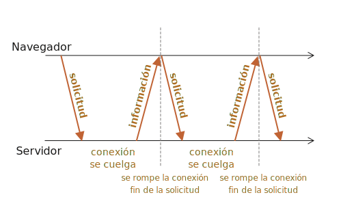

# Sondeo largo

El "sondeo largo" es la forma más sencilla de tener una conexión persistente con el servidor. No utiliza ningún protocolo específico como "WebSocket" o "SSE".

Es muy fácil de implementar, y es suficientemente bueno en muchos casos.

## Sondeo regular

La forma más sencilla de obtener información nueva desde el servidor es un sondeo periódico. Es decir, solicitudes regulares al servidor: "Hola, estoy aquí, ¿tienes información para mí?". Por ejemplo, una vez cada 10 segundos.

En respuesta, el servidor primero se da cuenta de que el cliente está en línea, y segundo, envía un paquete con los mensajes que recibió hasta ese momento.

Esto funciona, pero tiene sus desventajas:
1. Los mensajes desde el servidor se transmiten con un retraso de hasta 10 segundos (el tiempo entre solicitudes de nuestro ejemplo).
2. El servidor es bombardeado con solicitudes cada 10 segundos aunque no haya mensajes, incluso si el usuario cambió a otro lugar o está dormido. En términos de rendimiento, esto es bastante difícil de manejar.

Entonces: si hablamos de un servicio muy pequeño, este enfoque es viable. Pero en general, se necesita algo mejor.

## Sondeo largo

El llamado "sondeo largo" es una forma mucho mejor de sondear el servidor.

También es muy fácil de implementar, y envía los mensajes sin demoras.

El flujo es:

1. El navegador envía una solicitud al servidor.
2. El servidor mantiene la conexión abierta mientras no tenga mensajes para enviar.
3. Cuando aparece un mensaje, el servidor responde a la solicitud con dicho mensaje y cierra la conexión.
4. El navegador recibe el mensaje y de inmediato realiza una nueva solicitud.

<<<<<<< HEAD
Esta situación, en la que el navegador envió una solicitud y se mantiene abierta una conexión con el servidor, es estándar para este método. En cuanto se entrega un mensaje, la conexión se cierra y restablece.
=======
This situation, where the browser has sent a request and keeps a pending connection with the server, is standard for this method. Only when a message is delivered, the connection is closed and reestablished.
>>>>>>> 9e3fa1351f80cfd6353a778a55b2c86bca9e895f



Si se pierde la conexión (debido a un error de red, por ejemplo), el navegador envía inmediatamente una nueva solicitud.

Este es el esquema, del lado del cliente, de una función de suscripción que realiza solicitudes largas:

```js
async function subscribe() {
  let response = await fetch("/subscribe");

  if (response.status == 502) {
    // El estado 502 es un error de "tiempo de espera agotado" en la conexión,
    // puede suceder cuando la conexión estuvo pendiente durante demasiado tiempo,
    // y el servidor remoto o un proxy la cerró
    // vamos a reconectarnos
    subscribe();
  } else if (response.status != 200) {
    // Un error : vamos a mostrarlo
    showMessage(response.statusText);
    // Vuelve a conectar en un segundo
    await new Promise(resolve => setTimeout(resolve, 1000));
    subscribe();
  } else {
    // Recibe y muestra el mensaje
    let message = await response.text();
    showMessage(message);
    // Llama a subscribe () nuevamente para obtener el siguiente mensaje
    subscribe();
  }
}

subscribe();
```

Como puedes ver, la función `subscribe` realiza una búsqueda, espera la respuesta, la maneja, y se llama a sí misma nuevamente.

```warn header="El servidor debe ser capaz de mantener muchas conexiones pendientes"
La arquitectura del servidor debe poder funcionar bien con muchas conexiones pendientes.

Algunas arquitecturas de servidor ejecutan un proceso por conexión, resultando en que habrá tantos procesos como conexiones, y cada proceso requiere bastante memoria. Demasiadas conexiones la consumirán toda.

Este suele ser el caso de los backends escritos en lenguajes como PHP y Ruby.

Los servidores escritos con Node.js generalmente no tienen este problema.

Dicho esto, no es un problema del lenguaje sino de la implementación. La mayoría de los lenguajes modernos, incluyendo PHP y Ruby, permiten la implementación de un backend adecuado. Por favor, asegúrate de que la arquitectura del servidor funcione bien con múltiples conexiones simultáneas.
```

## Demostración: un chat

Este es un chat de demostración, que también puedes descargar y ejecutar localmente (si estás familiarizado con Node.js y puedes instalar módulos):

[codetabs src="longpoll" height=500]

El código del navegador está en `browser.js`.

## Área de uso

El sondeo largo funciona muy bien en situaciones en las que los mensajes son escasos.

Pero si los mensajes llegan con mucha frecuencia, entonces el gráfico de arriba, mensajes solicitados/recibidos, se vuelve en forma de "diente de sierra".

Cada mensaje es una solicitud separada: provista de encabezados, sobrecarga de autenticación, etc.

En este caso se prefieren otros métodos, como [Websocket](info:websocket), o [SSE](info:server-sent-events) (Eventos enviados por el servidor).
