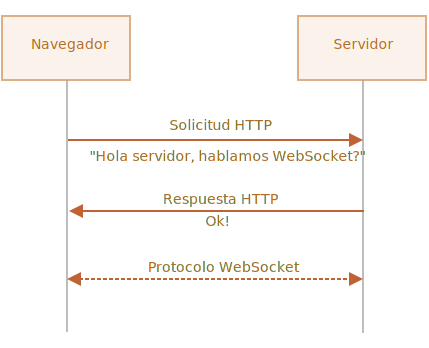

# WebSocket

El protocolo `WebSocket`, descrito en la especificación [RFC 6455](https://datatracker.ietf.org/doc/html/rfc6455), brinda una forma de intercambiar datos entre el navegador y el servidor por medio de una conexión persistente. Los datos pueden ser pasados en ambas direcciones como paquetes "packets", sin cortar la conexión y sin pedidos adicionales de HTTP "HTTP-requests".

WebSocket es especialmente bueno para servicios que requieren intercambio de información continua, por ejemplo juegos en línea, sistemas de negocios en tiempo real, entre otros.

## Un ejemplo simple

Para abrir una conexión websocket, necesitamos crearla `new WebSocket` usando el protocolo especial `ws` en la url:

```js
let socket = new WebSocket("*!*ws*/!*://javascript.info");
```

También hay una versión encriptada `wss://`. Equivale al HTTPS para los websockets.

```smart header="Siempre dé preferencia a `wss://`"
El protocolo `wss://` no solamente está encriptado, también es más confiable.

Esto es porque los datos en `ws://` no están encriptados y son visibles para cualquier intermediario. Entonces los servidores proxy viejos que no conocen el WebSocket podrían interpretar los datos como cabeceras "extrañas" y abortar la conexión.

En cambio `wss://` es WebSocket sobre TLS (al igual que HTTPS es HTTP sobre TLS), la seguridad de la capa de transporte encripta los datos del que envía y los desencripta para el que recibe. Los paquetes de datos pasan encriptados a través de los proxy. Estos servidores no pueden ver lo que hay dentro y los dejan pasar.
```

Una vez que el socket es creado, debemos escuchar los eventos que ocurren en él. Hay en total 4 eventos:
- **`open`** -- conexión establecida,
- **`message`** -- datos recibidos,
- **`error`** -- error en websocket,
- **`close`** -- conexión cerrada.

...Y si queremos enviar algo, `socket.send(data)` lo hará.

Aquí un ejemplo:

```js run
let socket = new WebSocket("wss://javascript.info/article/websocket/demo/hello");

socket.onopen = function(e) {
  alert("[open] Conexión establecida");
  alert("Enviando al servidor");
  socket.send("Mi nombre es John");
};

socket.onmessage = function(event) {
  alert(`[message] Datos recibidos del servidor: ${event.data}`);
};

socket.onclose = function(event) {
  if (event.wasClean) {  
    alert(`[close] Conexión cerrada limpiamente, código=${event.code} motivo=${event.reason}`);
  } else {
    // ej. El proceso del servidor se detuvo o la red está caída
    // event.code es usualmente 1006 en este caso
    alert('[close] La conexión se cayó');
  }
};

socket.onerror = function(error) {
  alert(`[error] ${error.message}`);
};
```

Para propósitos de demostración, hay un pequeño servidor [server.js](demo/server.js), escrito en Node.js, ejecutándose para el ejemplo de arriba. Este responde con "Hello from server, John", espera 5 segundos, y cierra la conexión.

Entonces verás los eventos `open` -> `message` -> `close`.

Eso es realmente todo, ya podemos conversar con WebSocket. Bastante simple, ¿no es cierto?

Ahora hablemos más en profundidad.

## Abriendo un websocket

Cuando se crea `new WebSocket(url)`, comienza la conexión de inmediato.

Durante la conexión, el navegador (usando cabeceras "header") le pregunta al servidor: "¿Soportas Websockets?" y si si el servidor responde "Sí", la comunicación continúa en el protocolo WebSocket, que no es HTTP en absoluto.



Aquí hay un ejemplo de cabeceras de navegador para una petición hecha por `new WebSocket("wss://javascript.info/chat")`.

```
GET /chat
Host: javascript.info
Origin: https://javascript.info
Connection: Upgrade
Upgrade: websocket
Sec-WebSocket-Key: Iv8io/9s+lYFgZWcXczP8Q==
Sec-WebSocket-Version: 13
```

- `Origin` -- La página de origen del cliente, ej. `https://javascript.info`. Los objetos WebSocket son cross-origin por naturaleza. No existen las cabeceras especiales ni otras limitaciones. De cualquier manera los servidores viejos son incapaces de manejar WebSocket, asi que no hay problemas de compatibilidad. Pero la cabecera `Origin` es importante, pues habilita al servidor decidir si permite o no la comunicación WebSocket con el sitio web.
- `Connection: Upgrade` -- señaliza que el cliente quiere cambiar el protocolo.
- `Upgrade: websocket` -- el protocolo requerido es "websocket".
- `Sec-WebSocket-Key` -- una clave de seguridad aleatoria generada por el navegador.
- `Sec-WebSocket-Version` -- Versión del protocolo WebSocket, 13 es la actual.

```smart header="El intercambio WebSocket no puede ser emulado"
No podemos usar `XMLHttpRequest` o `fetch` para hacer este tipo de peticiones HTTP, porque JavaScript no tiene permitido establecer esas cabeceras.
```

Si el servidor concede el cambio a WebSocket, envía como respuesta el código 101:

```
101 Switching Protocols
Upgrade: websocket
Connection: Upgrade
Sec-WebSocket-Accept: hsBlbuDTkk24srzEOTBUlZAlC2g=
```

Aquí `Sec-WebSocket-Accept` es `Sec-WebSocket-Key`, recodificado usando un algoritmo especial. El navegador lo usa para asegurarse de que la respuesta se corresponde a la petición.

A continuación los datos son transferidos usando el protocolo WebSocket. Pronto veremos su estructura ("frames", marcos o cuadros en español). Y no es HTTP en absoluto.

### Extensiones y subprotocolos

Puede tener las cabeceras adicionales `Sec-WebSocket-Extensions` y `Sec-WebSocket-Protocol` que describen extensiones y  subprotocolos.

Por ejemplo:

- `Sec-WebSocket-Extensions: deflate-frame` significa que el navegador soporta compresión de datos. una extensión es algo relacionado a la transferencia de datos, funcionalidad que extiende el protocolo WebSocket. La cabecera `Sec-WebSocket-Extensions` es enviada automáticamente por el navegador, con la lista de todas las extensiones que soporta.

- `Sec-WebSocket-Protocol: soap, wamp` significa que queremos transferir no cualquier dato, sino datos en protocolos [SOAP](https://es.wikipedia.org/wiki/Simple_Object_Access_Protocol) o WAMP ("The WebSocket Application Messaging Protocol"). Los subprotocolos de WebSocket están registrados en el [catálogo IANA](http://www.iana.org/assignments/websocket/websocket.xml). Entonces, esta cabecera describe los formatos de datos que vamos a usar.

    Esta cabecera opcional se establece usando el segundo parámetro de `new WebSocket`, que es el array de subprotocolos. Por ejemplo si queremos usar SOAP o WAMP:

    ```js
    let socket = new WebSocket("wss://javascript.info/chat", ["soap", "wamp"]);
    ```

El servidor debería responder con una lista de protocolos o extensiones que acepta usar.

Por ejemplo, la petición:

```
GET /chat
Host: javascript.info
Upgrade: websocket
Connection: Upgrade
Origin: https://javascript.info
Sec-WebSocket-Key: Iv8io/9s+lYFgZWcXczP8Q==
Sec-WebSocket-Version: 13
*!*
Sec-WebSocket-Extensions: deflate-frame
Sec-WebSocket-Protocol: soap, wamp
*/!*
```

Respuesta:

```
101 Switching Protocols
Upgrade: websocket
Connection: Upgrade
Sec-WebSocket-Accept: hsBlbuDTkk24srzEOTBUlZAlC2g=
*!*
Sec-WebSocket-Extensions: deflate-frame
Sec-WebSocket-Protocol: soap
*/!*
```

Aquí el servidor responde que soporta la extensión "deflate-frame", y únicamente SOAP de los subprotocolos solicitados.

## Transferencia de datos

La comunicación WebSocket consiste de "frames" (cuadros) de fragmentos de datos, que pueden ser enviados de ambos lados y pueden ser de varias clases:

- "text frames" -- contiene datos de texto que las partes se mandan entre sí.
- "binary data frames" -- contiene datos binarios que las partes se mandan entre sí.
- "ping/pong frames" son usados para testear la conexión; enviados desde el servidor, el navegador responde automáticamente.
- También existe "connection close frame" y otros pocos frames de servicio.

En el navegador, trabajamos directamente solamente con frames de texto y binarios.

**El método WebSocket `.send()` puede enviar tanto datos de texto como binarios.**

Una llamada `socket.send(body)` permite en `body` datos en formato string o binarios, incluyendo `Blob`, `ArrayBuffer`, etc. No se requiere configuración: simplemente se envían en cualquier formato.

**Cuando recibimos datos, el texto siempre viene como string. Y para datos binarios, podemos elegir entre los formatos `Blob` y `ArrayBuffer`.**

Esto se establece en la propiedad `socket.binaryType`, que es `"blob"` por defecto y entonces los datos binarios vienen como objetos `Blob`.

[Blob](info:blob) es un objeto binario de alto nivel que se integra directamente con `<a>`, `` y otras etiquetas, así que es una opción predeterminada saludable. Pero para procesamiento binario, para acceder a bytes individuales, podemos cambiarlo a `"arraybuffer"`:

```js
socket.binaryType = "arraybuffer";
socket.onmessage = (event) => {
  // event.data puede ser string (si es texto) o arraybuffer (si es binario)
};
```

## Limitaciones de velocidad

Supongamos que nuestra app está generando un montón de datos para enviar. Pero el usuario tiene una conexión de red lenta, posiblemente internet móvil fuera de la ciudad.

Podemos llamar `socket.send(data)` una y otra vez. Pero los datos serán acumulados en memoria (en un "buffer") y enviados solamente tan rápido como la velocidad de la red lo permita.

La propiedad `socket.bufferedAmount` registra cuántos bytes quedan almacenados ("buffered") hasta el momento esperando a ser enviados a la red.

Podemos examinarla  para ver si el "socket" está disponible para transmitir.

```js
// examina el socket cada 100ms y envía más datos   
// solamente si todos los datos existentes ya fueron enviados
setInterval(() => {
  if (socket.bufferedAmount == 0) {
    socket.send(moreData());
  }
}, 100);
```


## Cierre de conexión

Normalmente, cuando una parte quiere cerrar la conexión (servidor o navegador, ambos tienen el mismo derecho), envía un "frame de cierre de conexión" con un código numérico y un texto con el motivo.

El método para eso es:
```js
socket.close([code], [reason]);
```

- `code` es un código especial de cierre de WebSocket (opcional)
- `reason` es un string que describe el motivo de cierre (opcional)

Entonces el manejador del evento `close` de la otra parte obtiene el código y el motivo, por ejemplo:

```js
// la parte que hace el cierre:
socket.close(1000, "Work complete");

// la otra parte:
socket.onclose = event => {
  // event.code === 1000
  // event.reason === "Work complete"
  // event.wasClean === true (clean close)
};
```

Los códigos más comunes:

- `1000` -- cierre normal. Es el predeterminado (usado si no se proporciona `code`),
- `1006` -- no hay forma de establecerlo manualmente, indica que la conexión se perdió (no hay frame de cierre).

Hay otros códigos como:

- `1001` -- una parte se va, por ejemplo el server se está apagando, o el navegador deja la página,
- `1009` -- el mensaje es demasiado grande para procesar,
- `1011` -- error inesperado en el servidor,
- ...y así.

La lista completa puede encontrarse en [RFC6455, §7.4.1](https://tools.ietf.org/html/rfc6455#section-7.4.1).

Los códigos de WebSocket son como los de HTTP, pero diferentes. En particular, los menores a `1000` son reservados, habrá un error si tratamos de establecerlos.

```js
// en caso de conexión que se rompe 
socket.onclose = event => {
  // event.code === 1006
  // event.reason === ""
  // event.wasClean === false (no hay un frame de cierre)
};
```


## Estado de la conexión

Para obtener el estado (state) de la conexión, tenemos la propiedad `socket.readyState` con valores:

- **`0`** -- "CONNECTING": la conexión aún no fue establecida,
- **`1`** -- "OPEN": comunicando,
- **`2`** -- "CLOSING": la conexión se está cerrando,
- **`3`** -- "CLOSED": la conexión está cerrada.


## Ejemplo Chat

Revisemos un ejemplo de chat usando la API WebSocket del navegador y el módulo WebSocket de Node.js <https://github.com/websockets/ws>. Prestaremos atención al lado del cliente, pero el servidor es igual de simple.

HTML: necesitamos un `<form>` para enviar mensajes y un `<div>` para los mensajes entrantes:

```html
<!-- message form -->
<form name="publish">
  <input type="text" name="message">
  <input type="submit" value="Send">
</form>

<!-- div with messages -->
<div id="messages"></div>
```

De JavaScript queremos tres cosas:
1. Abrir la conexión.
2. Ante el "submit" del form, enviar `socket.send(message)` el mensaje.
3. Al llegar un mensaje, agregarlo a `div#messages`.

Aquí el código:

```js
let socket = new WebSocket("wss://javascript.info/article/websocket/chat/ws");

// enviar el mensaje del form
document.forms.publish.onsubmit = function() {
  let outgoingMessage = this.message.value;

  socket.send(outgoingMessage);
  return false;
};

// mensaje recibido - muestra el mensaje en div#messages
socket.onmessage = function(event) {
  let message = event.data;

  let messageElem = document.createElement('div');
  messageElem.textContent = message;
  document.getElementById('messages').prepend(messageElem);
}
```

El código de servidor está algo fuera de nuestro objetivo. Aquí usaremos Node.js, pero no necesitas hacerlo. Otras plataformas también tienen sus formas de trabajar con WebSocket.

El algoritmo de lado de servidor será:

1. Crear `clients = new Set()` -- un conjunto de sockets.
2. Para cada websocket aceptado, sumarlo al conjunto `clients.add(socket)` y establecer un "event listener" `message` para obtener sus mensajes.
3. Cuando un mensaje es recibido: iterar sobre los clientes y enviarlo a todos ellos.
4. Cuando una conexión se cierra: `clients.delete(socket)`.

```js
const ws = new require('ws');
const wss = new ws.Server({noServer: true});

const clients = new Set();

http.createServer((req, res) => {
  // aquí solo manejamos conexiones websocket
  // en proyectos reales tendremos también algún código para manejar peticiones no websocket
  wss.handleUpgrade(req, req.socket, Buffer.alloc(0), onSocketConnect);
});

function onSocketConnect(ws) {
  clients.add(ws);

  ws.on('message', function(message) {
    message = message.slice(0, 50); // la longitud máxima del mensaje será 50

    for(let client of clients) {
      client.send(message);
    }
  });

  ws.on('close', function() {
    clients.delete(ws);
  });
}
```


Aquí está el ejemplo funcionando:

[iframe src="chat" height="100" zip]

Puedes descargarlo (botón arriba/derecha en el iframe) y ejecutarlo localmente. No olvides instalar [Node.js](https://nodejs.org/en/) y `npm install ws` antes de hacerlo.

## Resumen

WebSocket es la forma moderna de tener conexiones persistentes entre navegador y servidor .

- Los WebSockets no tienen limitaciones "cross-origin".
- Están muy bien soportados en los navegadores.
- Pueden enviar y recibir datos string y binarios.

La API es simple.

Métodos:
- `socket.send(data)`,
- `socket.close([code], [reason])`.

Eventos:
- `open`,
- `message`,
- `error`,
- `close`.

El WebSocket por sí mismo no incluye reconexión, autenticación ni otros mecanismos de alto nivel. Hay librerías cliente/servidor para eso, y también es posible implementar esas capacidades manualmente.

A veces, para integrar WebSocket a un proyecto existente, se ejecuta un servidor WebSocket en paralelo con el servidor HTTP principal compartiendo la misma base de datos. Las peticiones a WebSocket usan `wss://ws.site.com`, un subdominio que se dirige al servidor de WebSocket mientras que `https://site.com` va al servidor HTTP principal.

Seguro, otras formas de integración también son posibles.
